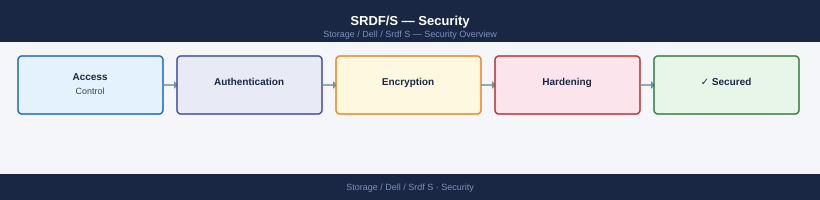

---
tags:
  - dell
  - security
---
# SRDF/S — Security

SRDF/S security controls — link encryption options, Unisphere access management, and audit logging for synchronous replication.

*Applies to: SRDF/S*

<a class="kb-card" href="authentication/">
  <strong>Authentication</strong>
  Solutions Enabler RBAC, API accounts, and certificate management.
</a>

<a class="kb-card" href="access-control/">
  <strong>Access Control</strong>
  Role assignments, failover guards, and audit logging.
</a>

<a class="kb-card" href="encryption/">
  <strong>Encryption</strong>
  FCIP encryption, AES-256 configuration, and FC fabric zoning.
</a>

<a class="kb-card" href="hardening/">
  <strong>Hardening</strong>
  API security, TLS configuration, and operational hardening checklist.
</a>

