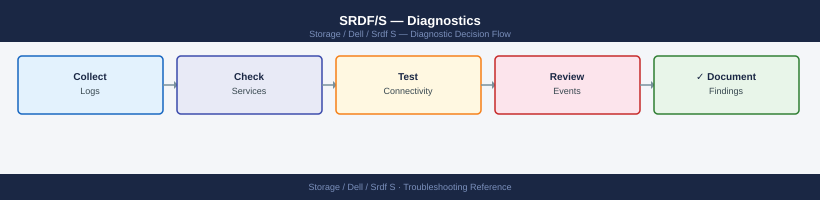
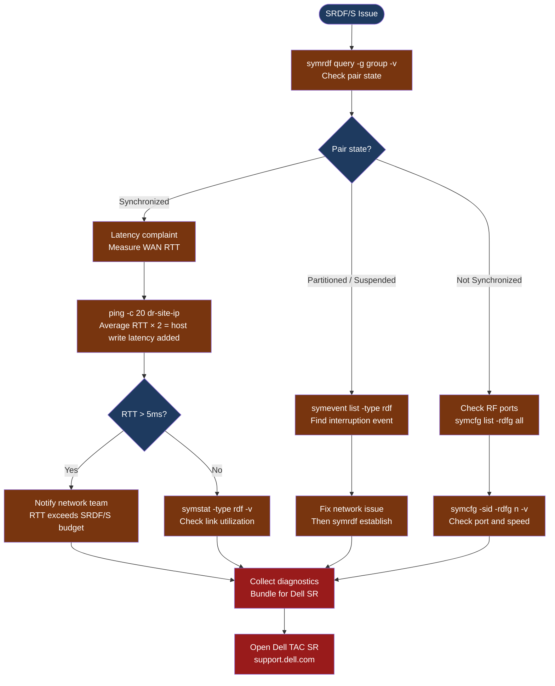

---
tags:
  - dell
  - troubleshooting
search:
  boost: 1.5
---
# SRDF/S — Diagnostics

<div class="kb-summary">
SRDF/S diagnostic commands: check pair state and link health with symrdf, measure WAN round-trip time, collect RF port statistics, read SRDF event logs, and bundle diagnostics for Dell TAC cases. SRDF/S adds WAN RTT to every host write — latency and link health are the primary diagnostic focus.

*Applies to: Dell PowerMax / SRDF/S (Synchronous)*
</div>





```d2
direction: down

symptom: Identify Symptom {shape: diamond}
step_1_check_srdf_pair_state: "Step 1 — Check SRDF pair state" {shape: rectangle}
step_2_measure_wan_roundtrip_time: "Step 2 — Measure WAN round-trip time" {shape: rectangle}
step_3_check_srdf_event_log: "Step 3 — Check SRDF event log" {shape: rectangle}
step_4_check_rf_director_ports_and_l: "Step 4 — Check RF director ports and link statistics" {shape: rectangle}
step_5_collect_diagnostic_bundle_for: "Step 5 — Collect diagnostic bundle for Dell SR" {shape: rectangle}
verify_resolution: "Verify resolution" {shape: rectangle}
resolution: Resolve or Escalate {shape: oval}

symptom -> step_1_check_srdf_pair_state: investigate
symptom -> step_2_measure_wan_roundtrip_time: investigate
symptom -> step_3_check_srdf_event_log: investigate
symptom -> step_4_check_rf_director_ports_and_l: investigate
symptom -> step_5_collect_diagnostic_bundle_for: investigate
symptom -> verify_resolution: investigate
step_1_check_srdf_pair_state -> resolution
step_2_measure_wan_roundtrip_time -> resolution
step_3_check_srdf_event_log -> resolution
step_4_check_rf_director_ports_and_l -> resolution
step_5_collect_diagnostic_bundle_for -> resolution
verify_resolution -> resolution
```

## Before you begin

- **Access:** Solutions Enabler with gatekeeper LUNs to both PowerMax arrays; Unisphere for PowerMax admin access; network team contact for WAN link investigation
- **Gather first:** the RDFG number, current pair state from `symrdf query`, and whether hosts are experiencing write latency or I/O suspension
- **RTT baseline:** establish the normal WAN RTT before an incident so you have a baseline for comparison — document it in your CMDB
- **Do not force failover** without confirming the link interruption is unresolvable — SRDF/S failover means R1 hosts will lose access to their volumes; it is a disruptive operation
- **Logging:** collect `symrdf query` output immediately when an issue is reported — pair state can change and logs lose context if collected too late

---

## Step 1 — Check SRDF pair state

```bash
# List all SRDF groups on this array
symrdf -sid <SID> list -rdfg all
# Output: RDFG number, mode (S = Sync), pair count, state, link state

# Detailed pair state for a specific RDFG
symrdf query -sid <SID> -rdfg <rdfg-number>
# Key output columns:
#   R1_ST:      R1 state — should be "Ready"
#   R2_ST:      R2 state — should be "Write Disabled"
#   R2_PAIR_ST: pair state — should be "Synchronized" or "Consistent"
#   LINK_ST:    RF link state — should be "Ready"
#   MODE:       should be "S" (Sync)

# Verbose output including per-device detail
symrdf query -g <group-name> -detail
# Shows each device in the group with its individual pair state

# States and what they mean:
#   Synchronized: healthy — R1 and R2 are in lock-step
#   Consistent:   normal transient — write in transit from R1 to R2
#   Partitioned:  link interrupted — R2 frozen; data may diverge if sustained
#   Suspended:    manually paused; R2 frozen at point of suspension
#   Failed Over:  DR failover is active; R2 is now R/W
```

**Decision flow:**
- `Synchronized / Consistent` but hosts see high latency → measure RTT (Step 2)
- `Partitioned` → network link between sites was interrupted; fix network first, then `symrdf establish` to re-sync
- `Suspended` → check who suspended and why; resume only after confirming data is consistent
- `Not Synchronized` → RF port or link issue; proceed to Step 4

---

## Step 2 — Measure WAN round-trip time

SRDF/S holds every host write until R2 confirms receipt. The WAN RTT is directly added to host write latency.

```bash
# Measure RTT between production and DR sites
# Run from a host on the production network that can reach the DR network
ping -c 100 <dr-site-ip>
# Key statistics:
#   avg RTT:     the baseline latency addition to all host writes
#   max RTT:     worst-case latency spike
#   packet loss: any loss causes SRDF/S to retry; > 0% = link quality issue

# For more detailed latency analysis (on Linux)
mtr --report --report-cycles 100 <dr-site-ip>
# Shows per-hop latency; identifies where latency is being added in the path

# For Windows from the DR site
pathping <production-site-ip> /n 100
```

**SRDF/S latency impact:**
- Maximum recommended RTT is typically **5 ms** for SRDF/S (check Dell sizing guide for your use case)
- A 5 ms RTT adds 5 ms to every synchronous host write on R1 volumes
- RTT > 5 ms: engage the network team to investigate WAN link quality, QoS, or congestion

---

## Step 3 — Check SRDF event log

```bash
# Show SRDF-specific events from the array event log
symevent list -sid <SID> -type rdf -last 100
# Shows: event time, severity, message (e.g., "SRDF link became not ready", "pair partitioned")

# Export to CSV for the Dell SR
symevent list -sid <SID> -type rdf -last 200 -output csv > /tmp/rdf_events_$(date +%F).csv

# Filter to error-level events only
symevent list -sid <SID> -type rdf -severity error -last 100

# Check Unisphere alert log
# Unisphere for PowerMax → Monitor → Alerts
# Filter to: Category = SRDF; Severity = Warning, Error, Critical
```

---

## Step 4 — Check RF director ports and link statistics

```bash
# List all SRDF director ports on the array
symcfg -sid <SID> list -rdf -v
# Shows: director number, port number, link status, bandwidth

# Detailed RDFG configuration
symcfg -sid <SID> list -rdfg <rdfg-number> -v
# Shows:
#   Director: RA director handling this RDFG
#   Cycle time: for SRDF/A; not applicable for SRDF/S
#   Link speed: should match the provisioned link capacity
#   Mode: S (Sync) for SRDF/S

# Collect link performance statistics (samples over 60 seconds)
symstat -sid <SID> -type rdf -delta_t 60
# Key metrics:
#   Write Response Time (ms): should equal WAN RTT; spikes = WAN congestion
#   Link Utilization (%): > 80% = bandwidth saturation; consider link upgrade
#   Throughput (MB/s): compare to link capacity; high = high write workload
```

---

## Step 5 — Collect diagnostic bundle for Dell SR

```bash
# Complete SRDF/S diagnostic snapshot
{
  echo "=== symrdf list (all RDFGs) ==="
  symrdf -sid <SID> list -rdfg all
  echo "=== symrdf query (pair state) ==="
  symrdf query -sid <SID> -rdfg <rdfg-number>
  echo "=== symcfg rdf (RF port state) ==="
  symcfg -sid <SID> list -rdf -v
  echo "=== symcfg RDFG detail ==="
  symcfg -sid <SID> list -rdfg <rdfg-number> -v
  echo "=== symevent rdf (last 200 events) ==="
  symevent list -sid <SID> -type rdf -last 200
  echo "=== symstat rdf performance ==="
  symstat -sid <SID> -type rdf -delta_t 60
} > /tmp/srdf-s-diag-$(date +%F-%H%M).txt

# Collect Unisphere logs via GUI
# Unisphere for PowerMax → System → Export Logs
# Select: time range covering the incident window
```

---

## See also

- [SRDF/S — Common Issues](../common-issues/)
- [SRDF/S — Escalation](../escalation/)
- [SRDF/S — Health Checks](../operations/health-checks/)

## Verify resolution

- `symrdf query -sid <SID> -rdfg <rdfg-number>` shows `R2_PAIR_ST=Synchronized`, `LINK_ST=Ready`
- WAN RTT is within acceptable bounds (typically ≤ 5 ms); host write latency has returned to baseline
- `symevent list -type rdf` shows no new error events in the last 15 minutes
- `symstat -type rdf` shows Write Response Time back to expected value
- Monitor host application performance for 30 minutes after the fix to confirm write latency is stable
