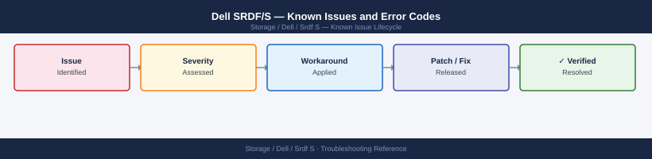

---
tags:
  - troubleshooting
  - srdf
  - dell
  - known-issues
---
# Dell SRDF/S — Known Issues and Error Codes

<div class="kb-summary">
Catalog of known SRDF/S (Synchronous) bugs, error codes, and workarounds. SRDF/S is zero-RPO synchronous replication — issues typically manifest as production I/O latency when the WAN link degrades.

*Applies to: PowerMax SRDF/S*
</div>



```d2
direction: down

symptom: Identify Symptom {shape: diamond}
link_and_latency: "Link and Latency" {shape: rectangle}
failover: "Failover" {shape: rectangle}
resolution: Resolve or Escalate {shape: oval}

symptom -> link_and_latency: investigate
symptom -> failover: investigate
link_and_latency -> resolution
failover -> resolution
```

## Before you begin

- SRDF/S requires consistent ≤5ms RTT between sites — latency above this directly increases production host I/O response time.
- `symrdf -g <dev-group> query` for pair state; `symrdf -g <dev-group> verify` for integrity check.
- A WAN outage will cause SRDF/S to pause (R-state `Suspended`) — production continues on R1 in Read/Write mode.

## Link and Latency

| Error / Symptom | Affected Versions | Cause | Workaround / Fix | Fixed In |
|---|---|---|---|---|
| Production I/O latency elevated during peak load | PowerMax | WAN latency spike above 5ms RTT causes SRDF/S write to delay production commit | Check WAN RTT: `symrdf -g <dg> query` for estimated link latency; contact WAN provider | N/A |
| SRDF/S pair `Suspended` | PowerMax | WAN link lost; PowerMax suspended replication to protect production | Restore WAN link; resume: `symrdf -g <dg> resume` | N/A |

## Failover

| Error / Symptom | Affected Versions | Cause | Workaround / Fix | Fixed In |
|---|---|---|---|---|
| Planned failover fails: `R1 devices still accessible` | PowerMax | Source site not fenced; both sites trying to own devices | Confirm source site is fenced from SAN fabric before issuing failover | N/A |
| Post-failover applications report read errors | PowerMax | Residual writes in flight at failover moment | Investigate with application team; SRDF/S guarantees consistency — I/O errors are application layer | N/A |

## See also

- [Dell SRDF-S — Common Issues](../common-issues/)
- [Dell PowerMax — Known Issues](../../powermax/troubleshooting/known-issues.md)
- [Dell SRDF-A — Known Issues](../../srdf-a/troubleshooting/known-issues.md)
