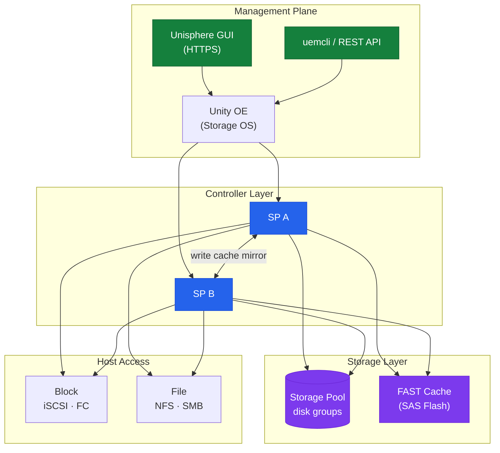
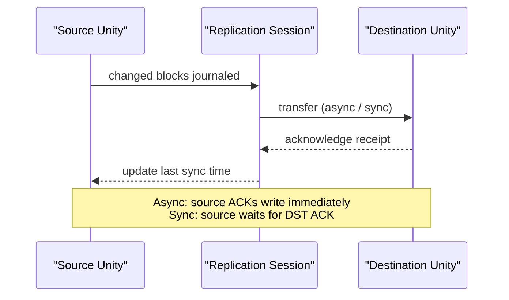

# Unity — Components

## Core Components

| Component | Description |
|---|---|
| Storage Processor A / B (SP) | Dual Intel Xeon-based controllers; each SP runs Unity OE independently; hosts are connected to both SPs |
| Drive Enclosures | SAS (10K/15K), NL-SAS, and NVMe drive enclosures; mixed tiers supported in the same system |
| DRAM Cache | Per-SP write cache (mirrored between SPs); protects in-flight write data from SP failure |
| FAST Cache | Optional SSD read/write cache tier using dedicated SAS Flash drives; extends effective random I/O performance |
| Unity OE | The Unity Operating Environment — the storage OS running on each SP |
| Unisphere for Unity | Web-based management GUI served from each SP; accessible via `https://<sp-mgmt-ip>` |
| REST API | Unisphere REST API at `https://<sp-ip>/api/types/` for programmatic management |

## Component Relationships



## Connectivity

| Protocol | Interface | Use Case |
|---|---|---|
| Fibre Channel | 8Gb, 16Gb, or 32Gb FC ports (model-dependent) | Block storage for VMware, databases, physical servers |
| iSCSI | 10GbE or 25GbE (TOE or software iSCSI) | Block storage for environments without FC fabric |
| NFS | Ethernet (10/25GbE) via NAS server | File storage for Linux and VMware NFS datastores |
| SMB (CIFS) | Ethernet (10/25GbE) via NAS server | File storage for Windows shares |
| Management | 1GbE or 10GbE management port on each SP | Unisphere GUI and uemcli access |

Host connectivity for block storage requires FC zoning (FC) or IQN registration (iSCSI) per host in Unisphere before LUNs are visible. For NFS and SMB, hosts connect to the NAS server's IP address associated with the relevant access zone.

## Storage Pools

Storage pool management, capacity monitoring, and disk group configuration on Dell Unity.

### Pool Overview

```bash
# List all pools
uemcli -d <ip> -u admin /stor/config/pool show
uemcli -d <ip> -u admin /stor/config/pool show -detail

# View a specific pool
uemcli -d <ip> -u admin /stor/config/pool -id <pool_id> show -detail
```

### Create a Pool

```bash
# Create a pool using an existing disk group (RAID5)
uemcli -d <ip> -u admin /stor/config/pool create \
    -name <pool_name> \
    -diskGroup <dg_id> \
    -raidType RAID5 \
    -stripeWidth 5

# Create with description
uemcli -d <ip> -u admin /stor/config/pool create \
    -name Production_Pool \
    -diskGroup dg_1 \
    -raidType RAID5 \
    -descr "Primary production pool - SAS SSD"
```

### Expand a Pool

```bash
# Add another disk group to an existing pool
uemcli -d <ip> -u admin /stor/config/pool -id <pool_id> set \
    -addDiskGroup <dg_id>

# Verify pool size after expansion
uemcli -d <ip> -u admin /stor/config/pool -id <pool_id> show -detail | \
    grep -E "Size|Used|Free"
```

### Modify and Delete

```bash
# Rename a pool
uemcli -d <ip> -u admin /stor/config/pool -id <pool_id> set -name <new_name>

# Delete a pool (must be empty — no LUNs or file systems)
uemcli -d <ip> -u admin /stor/config/pool -id <pool_id> delete
```

### Disk Groups

```bash
# List disk groups
uemcli -d <ip> -u admin /stor/config/dg show
uemcli -d <ip> -u admin /stor/config/dg show -detail

# Create a disk group
uemcli -d <ip> -u admin /stor/config/dg create \
    -diskType SAS \
    -diskCount 5 \
    -raidType RAID5

# View disks in a disk group
uemcli -d <ip> -u admin /stor/config/disk show | grep <dg_id>
```

### Capacity Monitoring

```bash
# Pool utilisation — flag if above 80%
uemcli -d <ip> -u admin /stor/config/pool show -detail | \
    grep -E "Name|Size|Used|Free|Health"

# Individual disk usage within pool
uemcli -d <ip> -u admin /stor/config/disk show -detail | \
    grep -E "Name|Pool|Health|State"
```

### Auto-Tiering (FAST VP)

If FAST VP (Fully Automated Storage Tiering) is licensed:

```bash
# View tiering policy on a LUN
uemcli -d <ip> -u admin /stor/config/lun show -detail | grep -i tier

# Set tiering policy on a LUN
uemcli -d <ip> -u admin /stor/config/lun -id <lun_id> set \
    -tieringPolicy autotier   # Options: autotier, highestAvailable, lowestAvailable, noData

# FAST VP relocation status
uemcli -d <ip> -u admin /storage/fastp/session show
```

### Pool Health Summary

| Metric | Healthy | Action Required |
|---|---|---|
| Pool health | OK | Any other value = investigate |
| Free space | > 20% | < 20% = alert; < 10% = emergency |
| Disk group health | OK | Degraded = drive failure, replace urgently |
| RAID rebuild | Not running | Rebuild running = do not make changes |

## Replication

Replication session management, monitoring, and failover on Dell Unity.

### Replication Flow



### Replication Sessions Overview

```bash
# List all replication sessions
uemcli -d <ip> -u admin /prot/rep/session show
uemcli -d <ip> -u admin /prot/rep/session show -detail

# View a specific session
uemcli -d <ip> -u admin /prot/rep/session -id <session_id> show -detail
```

### Replication Session States

| State | Meaning |
|---|---|
| Active | Replication is running normally |
| Idle | No active replication; awaiting next sync |
| Syncing | Data transfer in progress |
| Paused | Manually suspended |
| Failed | Error condition — check events |
| Failed Over | DR site is now active |

### Pause and Resume

```bash
# Pause replication (stops sync; source continues to accept writes)
uemcli -d <ip> -u admin /prot/rep/session -id <session_id> pause

# Resume replication (re-syncs changes accumulated during pause)
uemcli -d <ip> -u admin /prot/rep/session -id <session_id> resume
```

### Manual Sync

```bash
# Trigger an immediate synchronisation
uemcli -d <ip> -u admin /prot/rep/session -id <session_id> sync
```

### Planned Failover

```bash
# Failover with sync — syncs data then activates DR copy
uemcli -d <ip> -u admin /prot/rep/session -id <session_id> failover -keepSync

# Failover without final sync (emergency — data may lag)
uemcli -d <ip> -u admin /prot/rep/session -id <session_id> failover
```

### Failback

```bash
# After DR period, failback to original source
# Step 1 — reverse the replication (DR becomes source, primary becomes destination)
uemcli -d <ip> -u admin /prot/rep/session -id <session_id> reverse

# Step 2 — sync data back
uemcli -d <ip> -u admin /prot/rep/session -id <session_id> sync

# Step 3 — fail back to original
uemcli -d <ip> -u admin /prot/rep/session -id <session_id> failback
```

### Replication Connections

```bash
# List replication connections (Unity ↔ Unity or Unity ↔ PowerStore)
uemcli -d <ip> -u admin /prot/rep/connect show

# Create a replication connection
uemcli -d <ip> -u admin /prot/rep/connect create \
    -destAddress <destination_sp_ip> \
    -destUsername admin \
    -destPassword <password>
```

### Create a Replication Session

```bash
# Replicate a LUN to a remote Unity
uemcli -d <ip> -u admin /prot/rep/session create \
    -srcRes <lun_id> \
    -dstSys <connection_id> \
    -dstResName <remote_lun_name> \
    -rpo 3600   # RPO in seconds (3600 = 1 hour)
```

### Health Check

```bash
# Check all sessions for non-healthy states
uemcli -d <ip> -u admin /prot/rep/session show | grep -v "Active\|Idle\|Session"

# Check replication events/errors
uemcli -d <ip> -u admin /prac/alert show | grep -i repl
```
