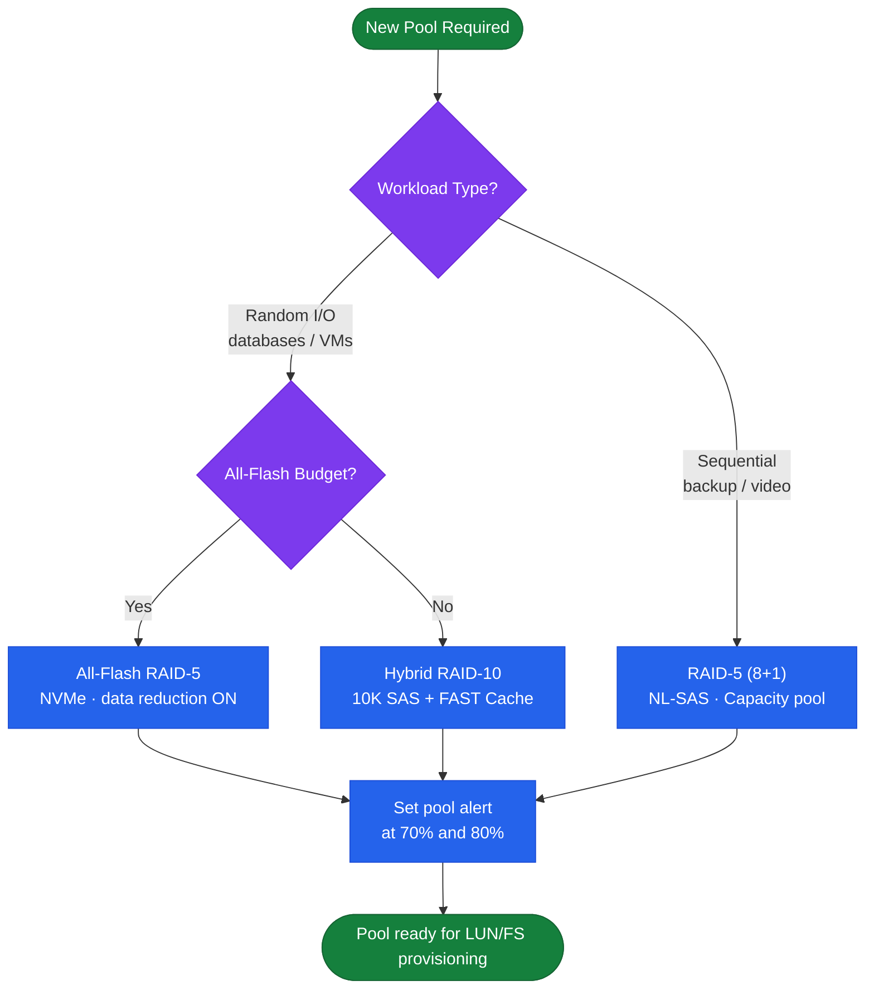

---
tags:
  - architecture
  - dell
---
# Unity — Standards


<div class="kb-summary">
Standards reference covering Pool Design Decision Tree, Sizing Guidelines, Naming Conventions, Build Baseline, Configuration Checklist.

*Applies to: Unity XT*
</div>
```text
┌──────────────────────────── Dell Unity XT — Architecture Design Standards ────────────────────────────┐
│                                                                                                       │
│   ┌───────────────────────────────────────────────────────────────────────────────────────────────┐   │
│   │      Unity XT design standards: network isolation, redundancy, sizing, naming conventions     │   │
│   │          Network: dedicated storage VLAN; jumbo frames for iSCSI; dual-fabric for FC          │   │
│   │          Redundancy: dual controllers, multipath I/O, and no single points of failure         │   │
│   │       Monitoring: set capacity and latency alerts; baseline performance after deployment      │   │
│   └───────────────────────────────────────────────────────────────────────────────────────────────┘   │
│                                                                                                       │
│    Requirements → architecture design → redundancy review → size → deploy                             │
│                                                                                                       │
│                  ▼                                ▼                                ▼                  │
│                                                                                                       │
│   ┌─────────────────────────────┐  ┌─────────────────────────────┐  ┌─────────────────────────────┐   │
│   │            Layer            │  │          Component          │  │            Notes            │   │
│   │             Ctrl            │  │         SP-A + SP-B         │  │        Cache mirrored       │   │
│   │             Pool            │  │       Dynamic FAST VP       │  │         Auto-tiering        │   │
│   │          NAS server         │  │        File protocols       │  │          Per-tenant         │   │
│   │           Snapshot          │  │        Writable snaps       │  │        Thin PiT copy        │   │
│   │         Replication         │  │         Async/Metro         │  │       Native or RP4VM       │   │
│   └─────────────────────────────┘  └─────────────────────────────┘  └─────────────────────────────┘   │
│                                                                                                       │
│                          ▼                                                 ▼                          │
│                                                                                                       │
│   ┌───────────────────────────────────────────────────────────────────────────────────────────────┐   │
│   │    Component     │     Purpose      │      Protocol     │       Auth       │      Notes       │   │
│   │    Unisphere     │  GUI / REST API  │       HTTPS       │    LDAP/local    │    SP-hosted     │   │
│   │      UEMCLI      │  CLI management  │    SSH / HTTPS    │   Local admin    │  All operations  │   │
│   │    NAS server    │  File services   │      NFS/SMB      │  Kerberos/NTLM   │ Virtual file se  │   │
│   │   RecoverPoint   │ Continuous prote │   Encrypted TCP   │   Certificate    │   Journal CDP    │   │
│   └───────────────────────────────────────────────────────────────────────────────────────────────┘   │
│                                                                                                       │
│    Physical: Unity XT 380F/480F/680F/880F · dual SPs · DPE/DAE expansion · 10/25 GbE                  │
│                                                                                                       │
│    Key terms:                                                                                         │
│                                                                                                       │
│    Unity XT           = Dell unified mid-range array; block LUNs, file NAS, and VMware vVols          │
│    Unisphere          = HTML5 GUI and REST API for Unity XT management; SP-hosted management portal   │
│    UEMCLI             = CLI for Unity XT; uemcli -d <ip> -u admin -p <pw> /show commands              │
│    Storage pool       = collection of drives forming a usable pool; FAST VP tiers data automatically  │
│    FAST VP            = Fully Automated Storage Tiering VP; moves hot and cold data between tiers     │
│    NAS server         = virtual file server on Unity; each has its own IP, DNS, and CIFS/NFS shares   │
│    Data Mover         = older EMC term for NAS server; used in VNX and early Unity documentation      │
│    SP-A / SP-B        = storage processors; active-active HA pair with mirrored cache                 │
│    Snapshot           = space-efficient PiT copy of LUN or FS; writable snapshots supported           │
│    RecoverPoint       = RP4VM; journal-based continuous data protection for Unity volumes             │
│    Metro              = synchronous replication between two Unity XT sites; active-active zero RPO    │
│    vVols              = Virtual Volumes; VASA provider exposes per-VM storage objects to vCenter      │
│                                                                                                       │
└───────────────────────────────────────────────────────────────────────────────────────────────────────┘
```


## Pool Design Decision Tree



## Sizing Guidelines

| Parameter | Guidance |
|---|---|
| Pool RAID level | RAID-5 (4+1 or 8+1) for capacity-optimised workloads; RAID-10 for latency-sensitive workloads |
| FAST Cache | Enable for random I/O workloads; minimum 2 SAS Flash drives per SP (RAID-1 pair); do not enable for sequential workloads |
| Cache-to-capacity ratio | 1:10 SSD cache to SAS capacity is a general starting point for mixed workloads |
| Thin provisioning | Thin LUNs recommended; monitor pool subscribed capacity — Unity does not auto-extend pools |
| Data reduction | Enable compression and deduplication on all-flash pools; flash tier must be at least 10% of total pool capacity |
| Pool capacity alert | Set alerts at 70% and 80% used — Unity invalidates snapshots below 5% free, which can cause data loss |

## Naming Conventions

Consistent naming across Unity objects simplifies identification, scripting, and troubleshooting. Apply the following scheme across all Unity deployments.

| Object | Format | Example |
|---|---|---|
| LUN | `<env>-<app>-lun<nn>` | `prod-oracle-lun01`, `dev-mssql-lun02` |
| Storage Pool | `pool-<tier>` | `pool-performance`, `pool-capacity`, `pool-flash` |
| NAS Server | `nas-<env>-<nn>` | `nas-prod-01`, `nas-dev-01` |
| Filesystem | `fs-<app>-<env>` | `fs-oracle-prod`, `fs-home-dev` |
| Snapshot | `<resource>.<YYYYMMDD>` | `prod-oracle-lun01.20260506`, `fs-oracle-prod.20260506` |
| Snapshot Schedule | `sched-<resource>-<frequency>` | `sched-prod-lun01-daily`, `sched-fs-oracle-weekly` |
| Replication Session | `rep-<source-array>-<dest-array>-<resource>` | `rep-unity01-unity02-prod-oracle-lun01` |
| Host | `<hostname>` (match CMDB/DNS name exactly) | `db-prod-01`, `esxi-prod-04` |
| NFS Export | `<filesystem>-<access-type>` | `fs-oracle-prod-ro`, `fs-home-dev-rw` |
| SMB Share | `<app>-<env>` | `oracle-prod`, `home-dev` |

## Build Baseline

Every Unity deployment should be built to the following baseline before handover to operations:

**Pool Configuration**

- Production performance pools: RAID-10 using 10K SAS or NVMe drives.
- Production capacity pools: RAID-5 (4+1) using NL-SAS drives.
- All-flash pools: RAID-5 or RAID-6 with data reduction (compression + deduplication) enabled.
- FAST Cache enabled for pools with mixed or random I/O profiles; disabled for backup or sequential workloads.
- Pool capacity alerts set at 70% and 80% subscribed in Unisphere.

**System Configuration**

- NTP configured with at least two NTP sources — verify with `uemcli /net/ntp show`.
- DNS configured for management and NAS server interfaces.
- Syslog forwarding enabled to the central syslog server — `uemcli /sys/syslog create`.
- SNMP configured for monitoring integration if required by site standards.
- Email notifications enabled for all CRITICAL and ERROR alerts.
- LDAP or Active Directory authentication configured for Unisphere admin access.
- SupportAssist (SRS/ESRS) enabled and verified calling home to Dell.

**Security Baseline**

- Default admin password changed on first login.
- TLS 1.0 and 1.1 disabled; TLS 1.2 or higher enforced.
- Unused protocols (FTP, Telnet on management) disabled.
- D@RE (Data at Rest Encryption) enabled if the hardware supports it.

## Configuration Checklist

Complete this checklist before signing off a new Unity deployment or a post-upgrade validation:

- [ ] Both SP A and SP B online and healthy (`uemcli /env/sp show`)
- [ ] All drive enclosures discovered and drives in Normal state
- [ ] Storage pools created with correct RAID level and capacity alerts configured
- [ ] FAST Cache configured and enabled on applicable pools
- [ ] Data reduction enabled on flash pools
- [ ] NTP synced and confirmed on both SPs
- [ ] DNS resolves management IPs and NAS server IPs
- [ ] Syslog forwarding verified (test message received at syslog server)
- [ ] Email notification tested (test alert delivered to recipients)
- [ ] LDAP/AD authentication configured and a test admin login succeeds
- [ ] SupportAssist connectivity confirmed (Settings > Support > SupportAssist)
- [ ] FC zoning or iSCSI IQN registration completed for all production hosts
- [ ] Replication sessions created and in Active state for all protected resources
- [ ] Snapshot schedules created and first scheduled snapshot confirmed
- [ ] Unisphere health check passing (`uemcli /sys/general healthcheck`)
