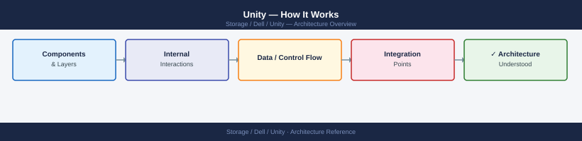
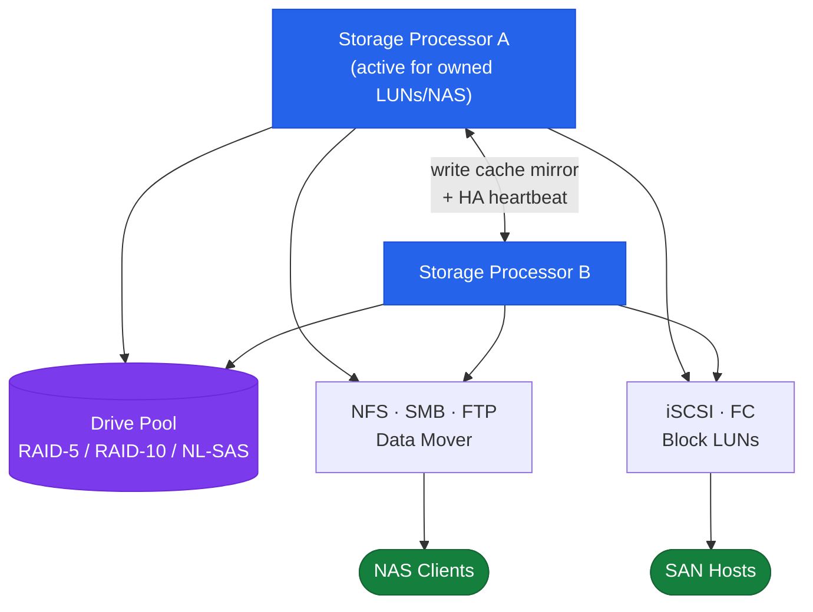
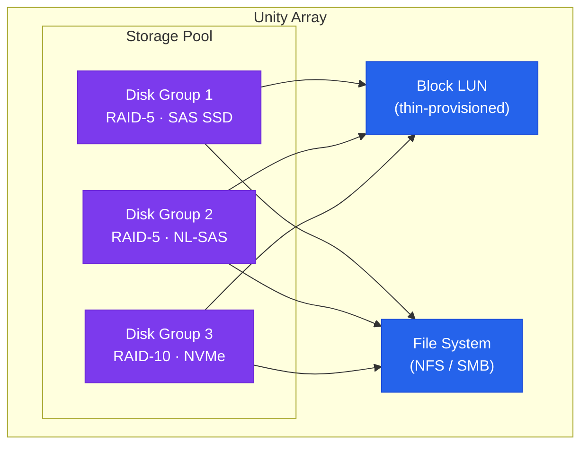

---
tags:
  - architecture
  - dell
---
# Unity — How It Works


<div class="kb-summary">
How It Works reference covering Overview, Architecture, HA and Write Cache Mirroring, Hardware Models, Storage Pool Architecture and 3 more sections.

*Applies to: Unity XT*
</div>



## Overview

Dell Unity XT is a mid-range unified storage platform delivering block (FC, iSCSI) and file (NFS, SMB) from a single system. It uses a dual storage processor (SP A / SP B) active-active architecture with write-cache mirroring. Administration is via Unisphere for Unity (GUI) or `uemcli` (CLI).

## Architecture



## HA and Write Cache Mirroring

Unity XT uses an active-active dual-SP model:

- LUN and NAS server ownership is distributed across SP A and SP B
- Each resource is owned by exactly one SP at a time; resources can be rebalanced or fail over automatically
- Write cache is **continuously mirrored** between SPs over a dedicated internal interconnect — no acknowledged write is lost on SP failure
- Battery-backed units (BBUs) on each SP protect write cache during power loss
- On SP failure, the surviving SP takes ownership of all resources within ~30 seconds; host multipath drivers (PowerPath, MPIO) redirect automatically

## Hardware Models

| Model | Max Raw Capacity | Notes |
|---|---|---|
| Unity XT 380 | ~2 PB | Entry mid-range; hybrid or all-flash |
| Unity XT 480 | ~4 PB | Mid-range; higher SP performance |
| Unity XT 680 | ~8 PB | High-end mid-range |
| Unity XT 880 | ~12 PB | Maximum scale for mid-range |
| Unity All-Flash (F-series) | Varies | No spinning disk; optimised for low latency |
| UnityVSA | Software-defined | ESXi-hosted; dev/test and small environments only |

## Storage Pool Architecture



| Drive Type | Tier | Use |
|---|---|---|
| NVMe SSD | Tier 0 | Ultra-low latency; FAST VP performance tier |
| SAS SSD | Tier 1 | High IOPS; performance tier in hybrid pools |
| NL-SAS | Tier 3 | High capacity; archive and backup targets |

## Data Services

| Service | Description |
|---|---|
| Inline deduplication + compression | All-flash pools only; reduces effective capacity consumption |
| FAST VP | Automated sub-LUN tiering between drive tiers in a pool |
| FAST Cache | Dedicated SAS Flash drives as read/write cache for hybrid pools |
| Snapshots | Space-efficient redirect-on-write at LUN and filesystem level |
| Thin provisioning | Pool space consumed only as data is written |
| Consistency groups | Group LUNs for crash-consistent snapshots |
| Replication | Async or sync to a remote Unity or PowerStore |

## Networking

| Network | Protocol | Interface |
|---|---|---|
| Host block (FC) | Fibre Channel | 8/16/32 Gb FC HBAs |
| Host block (iSCSI) | iSCSI | 10/25 GbE Ethernet |
| Host file (NAS) | NFS / SMB | 10/25 GbE Ethernet |
| Management | HTTPS / SSH | Dedicated 1 GbE port per SP |

## Key CLI Commands

```bash
uemcli /env/health show -filter "health.value ne OK"  # health check
uemcli /stor/pool show -detail                         # pool capacity + FAST Cache
uemcli /sys/alert show                                 # active alerts
uemcli /rep/session show                               # replication session state
uemcli /sys/sw show                                    # installed OE version
uemcli /stor/snap show                                 # snapshot inventory
```

---

## See also

- [Unity — Design Standards](design-standards/)
- [Unity — Integrations](integrations/)
- [Unity — Deploy](../deploy/)
