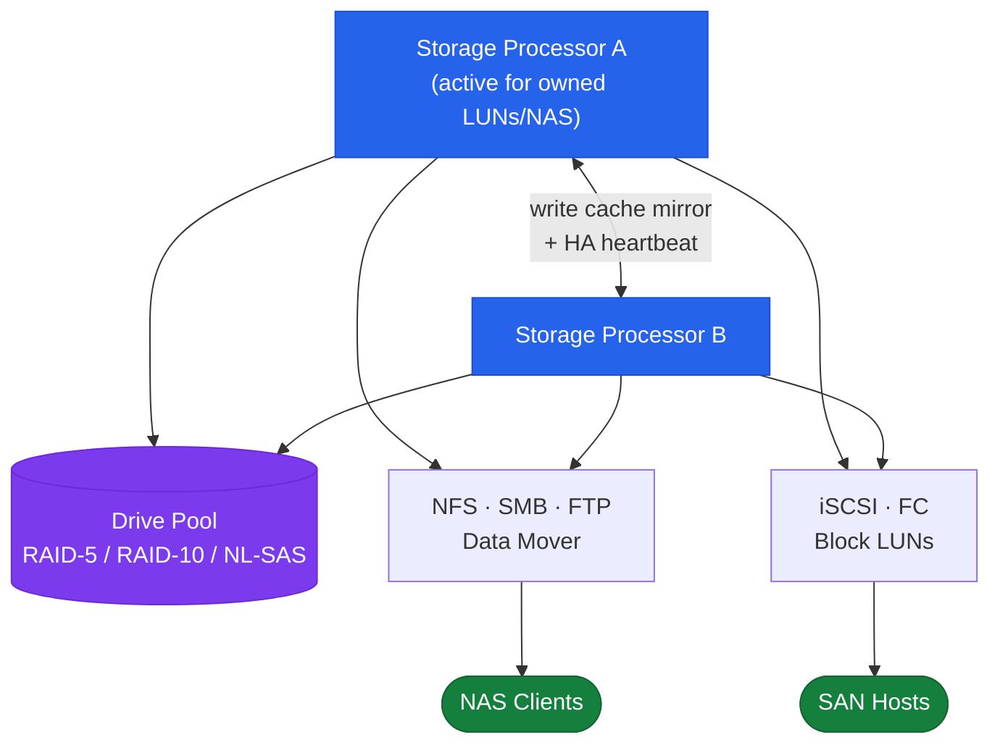

---
tags:
  - architecture
  - dell
---
# Unity — Architecture

<div class="kb-summary">
Dell Unity XT is a mid-range unified storage platform delivering block (FC, iSCSI) and file (NFS, SMB) from a dual storage processor (SP A / SP B) active-active architecture. Write cache is continuously mirrored between SPs with BBU protection.

*Applies to: Unity XT*
</div>

```text
┌───────────────────────── Dell Unity — Mid-Range Unified Storage Architecture ─────────────────────────┐
│                                                                                                       │
│  Mid-range unified array: block (FC, iSCSI) and file (NFS, SMB) from same pool;                       │
│  managed via Unisphere XT; successor platform is PowerStore (migration path exists).                  │
│                                                                                                       │
│   ┌──────────────────────────────────────────────┐  ┌─────────────────────────────────────────────┐   │
│   │                   Platform                   │  │                  Protocols                  │   │
│   │          Unity XT: all-flash model           │  │             FC: block SAN (LUNs)            │   │
│   │          Unity hybrid: SSD+HDD tier          │  │          iSCSI: block over Ethernet         │   │
│   │         Dual SP (service processor)          │  │         NFS: Linux/Unix file access         │   │
│   │          Active-passive SP failover          │  │           SMB/CIFS: Windows shares          │   │
│   │          FCoE: optional FC over Eth          │  │            FCoE: block over 10GbE           │   │
│   └──────────────────────────────────────────────┘  └─────────────────────────────────────────────┘   │
│                                                                                                       │
│  Block and file data can share the same storage pool; FAST VP auto-tiers both.                        │
│                                                                                                       │
│                          ▼                                                 ▼                          │
│                                                                                                       │
│   ┌──────────────────────────────────────────────┐  ┌─────────────────────────────────────────────┐   │
│   │                Data Services                 │  │                  Management                 │   │
│   │          Thin provisioning: default          │  │             Unisphere XT: web UI            │   │
│   │           Snapshots: point-in-time           │  │            UEMCLI: REST-based CLI           │   │
│   │         Async replication: remote DR         │  │                REST API: JSON               │   │
│   │           Sync replication: metro            │  │         vSphere plugin: VASA/vCenter        │   │
│   │            FAST VP: auto-tiering             │  │         NAS server: file tenant unit        │   │
│   └──────────────────────────────────────────────┘  └─────────────────────────────────────────────┘   │
│                                                                                                       │
│  Physical Infrastructure (the hardware everything above runs on):                                     │
│  Unity chassis with two service processors (SP A, SP B); DAE disk shelves for                         │
│  expansion; FC or Ethernet switches for host connectivity.                                            │
│                                                                                                       │
│  Key terms:                                                                                           │
│                                                                                                       │
│  Unity          = Dell mid-range unified storage; block + file from shared pools                      │
│  Unity XT       = all-flash variant; AFA with NVMe-ready design                                       │
│  SP             = Service Processor; the compute controller inside Unity chassis                      │
│  Unisphere XT   = Unity web management console; REST-based; no thick client                           │
│  UEMCLI         = Unity CLI; runs over REST API; scripting-friendly                                   │
│  FAST VP        = Fully Automated Storage Tiering for Virtual Pools; auto-tier                        │
│  NAS server     = virtual file server; multiple per Unity; own IP and auth                            │
│  VASA           = VMware storage APIs; Unity registers as a VASA provider                             │
│  Sync replication= Metro synchronous: write confirmed on both arrays before ack                       │
│  DAE            = Disk Array Enclosure; expansion shelf for Unity chassis                             │
│  FCoE           = Fibre Channel over Ethernet; consolidates SAN+LAN on 10GbE                          │
│  PowerStore     = Unity successor; migration tool available (Import+Migrate)                          │
│                                                                                                       │
└───────────────────────────────────────────────────────────────────────────────────────────────────────┘
```




<div class="kb-grid kb-grid-3">
  <a class="kb-card" href="how-it-works/">
    <div class="kb-card-icon">⚙️</div>
    <div class="kb-card-title">How It Works</div>
    <div class="kb-card-desc">Dual SP active-active HA, write cache mirroring, FAST VP tiering, FAST Cache, snapshots, and uemcli reference.</div>
  </a>
  <a class="kb-card" href="integrations/">
    <div class="kb-card-icon">🔗</div>
    <div class="kb-card-title">Integrations</div>
    <div class="kb-card-desc">VMware vSphere datastores, vVols/VASA, replication to PowerStore, and MPIO/PowerPath host connectivity.</div>
  </a>
  <a class="kb-card" href="design-standards/">
    <div class="kb-card-icon">📐</div>
    <div class="kb-card-title">Design Standards</div>
    <div class="kb-card-desc">Pool design (RAID selection, drive tiers), FAST VP policy standards, SP resource distribution, and snapshot retention design.</div>
  </a>
</div>

## Hardware Models

| Model | Max Raw Capacity | Notes |
|---|---|---|
| Unity XT 380 | ~2 PB | Entry mid-range; hybrid or all-flash |
| Unity XT 480 | ~4 PB | Mid-range; higher SP performance |
| Unity XT 680 | ~8 PB | High-end mid-range |
| Unity XT 880 | ~12 PB | Maximum scale for mid-range |
| Unity All-Flash (F-series) | Varies | No spinning disk; optimised for low latency |
| UnityVSA | Software-defined | ESXi-hosted; dev/test and small environments only |

## Topology


