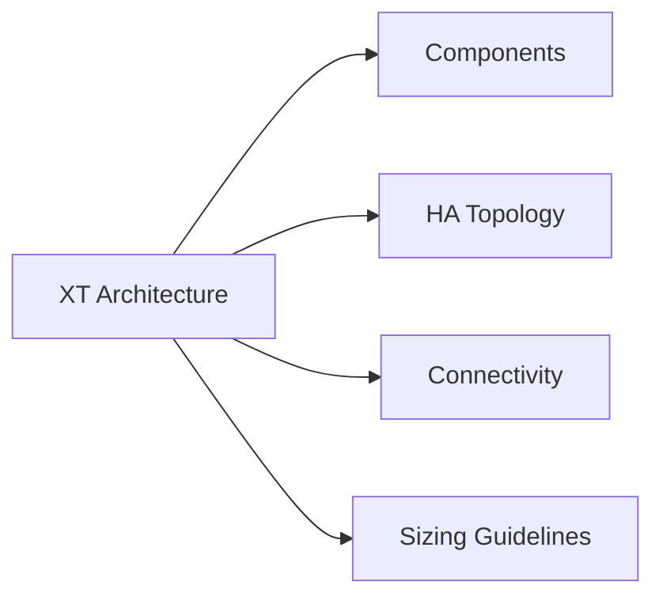

# Dell Unity XT Architecture

## Overview

Dell Unity XT is a mid-range unified storage platform delivering block (Fibre Channel, iSCSI) and file (NFS, SMB) storage from a single system. It uses a dual storage processor architecture with automatic failover between SP A and SP B. Unity XT is available as purpose-built hardware (Unity XT 380, 480, 680, 880) and as a software-defined appliance (UnityVSA). Administration is via the Unisphere for Unity web GUI or the `uemcli` command-line interface.

## Components

| Component | Description |
|---|---|
| Storage Processor A / B (SP) | Dual Intel Xeon-based controllers; each SP runs Unity OE independently; hosts are connected to both SPs |
| Drive Enclosures | SAS (10K/15K), NL-SAS, and NVMe drive enclosures; mixed tiers supported in the same system |
| DRAM Cache | Per-SP write cache (mirrored between SPs); protects in-flight write data from SP failure |
| FAST Cache | Optional SSD read/write cache tier using dedicated SAS Flash drives; extends effective random I/O performance |
| Unity OE | The Unity Operating Environment — the storage OS running on each SP |
| Unisphere for Unity | Web-based management GUI served from each SP; accessible via `https://<sp-mgmt-ip>` |
| REST API | Unisphere REST API at `https://<sp-ip>/api/types/` for programmatic management |

## HA Topology

Unity XT uses an active-passive dual-SP model where LUN and filesystem ownership is distributed across both SPs, but each resource is owned by only one SP at a time.

- Both SPs are powered on and connected to the same storage enclosures and host FC/iSCSI fabric.
- Each SP independently serves I/O for the LUNs and NAS servers assigned to it.
- If an SP fails, the peer SP automatically takes ownership of all resources within approximately 30 seconds — no data loss occurs because write cache is mirrored between SPs.
- During SP failover, host multipath drivers (PowerPath, MPIO, DM-MPIO) redirect I/O to the surviving SP's ports.
- Optional replication: asynchronous or synchronous replication to a secondary Unity or PowerStore array for DR.

## Connectivity

| Protocol | Interface | Use Case |
|---|---|---|
| Fibre Channel | 8Gb, 16Gb, or 32Gb FC ports (model-dependent) | Block storage for VMware, databases, physical servers |
| iSCSI | 10GbE or 25GbE (TOE or software iSCSI) | Block storage for environments without FC fabric |
| NFS | Ethernet (10/25GbE) via NAS server | File storage for Linux and VMware NFS datastores |
| SMB (CIFS) | Ethernet (10/25GbE) via NAS server | File storage for Windows shares |
| Management | 1GbE or 10GbE management port on each SP | Unisphere GUI and uemcli access |

Host connectivity for block storage requires FC zoning (FC) or IQN registration (iSCSI) per host in Unisphere before LUNs are visible. For NFS and SMB, hosts connect to the NAS server's IP address associated with the relevant access zone.

## Sizing Guidelines

| Parameter | Guidance |
|---|---|
| Pool RAID level | RAID-5 (4+1 or 8+1) for capacity-optimised workloads; RAID-10 for latency-sensitive workloads |
| FAST Cache | Enable for random I/O workloads; minimum 2 SAS Flash drives per SP (RAID-1 pair); do not enable for sequential workloads |
| Cache-to-capacity ratio | 1:10 SSD cache to SAS capacity is a general starting point for mixed workloads |
| Thin provisioning | Thin LUNs recommended; monitor pool subscribed capacity — Unity does not auto-extend pools |
| Data reduction | Enable compression and deduplication on all-flash pools; flash tier must be at least 10% of total pool capacity |
| Pool capacity alert | Set alerts at 70% and 80% used — Unity invalidates snapshots below 5% free, which can cause data loss |
