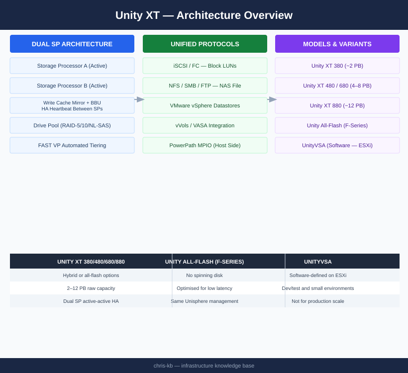

# Unity — Architecture

<div class="kb-summary">
Dell Unity XT is a mid-range unified storage platform delivering block (FC, iSCSI) and file (NFS, SMB) from a dual storage processor (SP A / SP B) active-active architecture. Write cache is continuously mirrored between SPs with BBU protection.
</div>
```text
┌──────────────────────────────────── Dell Unity XT — Architecture ─────────────────────────────────────┐
│                                                                                                       │
│   ┌───────────────────────────────────────────────────────────────────────────────────────────────┐   │
│   │ Unity XT architecture overview: unified mid-range storage — block, file, and VMware vVols int │   │
│   │                          Protocols: FC · iSCSI · NFS · SMB · REST API                         │   │
│   │                Key components: Unisphere, Storage Pools, NAS Servers, Snapshots               │   │
│   │          Design principles: HA, scalability, non-disruptive operations, and security          │   │
│   └───────────────────────────────────────────────────────────────────────────────────────────────┘   │
│                                                                                                       │
│    Design → deploy → configure → validate → monitor → optimise                                        │
│                                                                                                       │
│                  ▼                                ▼                                ▼                  │
│                                                                                                       │
│   ┌─────────────────────────────┐  ┌─────────────────────────────┐  ┌─────────────────────────────┐   │
│   │            Layer            │  │          Component          │  │            Notes            │   │
│   │             Ctrl            │  │         SP-A + SP-B         │  │        Cache mirrored       │   │
│   │             Pool            │  │       Dynamic FAST VP       │  │         Auto-tiering        │   │
│   │          NAS server         │  │        File protocols       │  │          Per-tenant         │   │
│   │           Snapshot          │  │        Writable snaps       │  │        Thin PiT copy        │   │
│   │         Replication         │  │         Async/Metro         │  │       Native or RP4VM       │   │
│   └─────────────────────────────┘  └─────────────────────────────┘  └─────────────────────────────┘   │
│                                                                                                       │
│                          ▼                                                 ▼                          │
│                                                                                                       │
│   ┌───────────────────────────────────────────────────────────────────────────────────────────────┐   │
│   │    Component     │     Purpose      │      Protocol     │       Auth       │      Notes       │   │
│   │    Unisphere     │  GUI / REST API  │       HTTPS       │    LDAP/local    │    SP-hosted     │   │
│   │      UEMCLI      │  CLI management  │    SSH / HTTPS    │   Local admin    │  All operations  │   │
│   │    NAS server    │  File services   │      NFS/SMB      │  Kerberos/NTLM   │ Virtual file se  │   │
│   │   RecoverPoint   │ Continuous prote │   Encrypted TCP   │   Certificate    │   Journal CDP    │   │
│   └───────────────────────────────────────────────────────────────────────────────────────────────┘   │
│                                                                                                       │
│    Physical: Unity XT 380F/480F/680F/880F · dual SPs · DPE/DAE expansion · 10/25 GbE                  │
│                                                                                                       │
│    Key terms:                                                                                         │
│                                                                                                       │
│    Unity XT           = Dell unified mid-range array; block LUNs, file NAS, and VMware vVols          │
│    Unisphere          = HTML5 GUI and REST API for Unity XT management; SP-hosted management portal   │
│    UEMCLI             = CLI for Unity XT; uemcli -d <ip> -u admin -p <pw> /show commands              │
│    Storage pool       = collection of drives forming a usable pool; FAST VP tiers data automatically  │
│    FAST VP            = Fully Automated Storage Tiering VP; moves hot and cold data between tiers     │
│    NAS server         = virtual file server on Unity; each has its own IP, DNS, and CIFS/NFS shares   │
│    Data Mover         = older EMC term for NAS server; used in VNX and early Unity documentation      │
│    SP-A / SP-B        = storage processors; active-active HA pair with mirrored cache                 │
│    Snapshot           = space-efficient PiT copy of LUN or FS; writable snapshots supported           │
│    RecoverPoint       = RP4VM; journal-based continuous data protection for Unity volumes             │
│    Metro              = synchronous replication between two Unity XT sites; active-active zero RPO    │
│    vVols              = Virtual Volumes; VASA provider exposes per-VM storage objects to vCenter      │
│                                                                                                       │
└───────────────────────────────────────────────────────────────────────────────────────────────────────┘
```




<div class="kb-grid kb-grid-3">
  <a class="kb-card" href="how-it-works/">
    <div class="kb-card-icon">⚙️</div>
    <div class="kb-card-title">How It Works</div>
    <div class="kb-card-desc">Dual SP active-active HA, write cache mirroring, FAST VP tiering, FAST Cache, snapshots, and uemcli reference.</div>
  </a>
  <a class="kb-card" href="integrations/">
    <div class="kb-card-icon">🔗</div>
    <div class="kb-card-title">Integrations</div>
    <div class="kb-card-desc">VMware vSphere datastores, vVols/VASA, replication to PowerStore, and MPIO/PowerPath host connectivity.</div>
  </a>
  <a class="kb-card" href="design-standards/">
    <div class="kb-card-icon">📐</div>
    <div class="kb-card-title">Design Standards</div>
    <div class="kb-card-desc">Pool design (RAID selection, drive tiers), FAST VP policy standards, SP resource distribution, and snapshot retention design.</div>
  </a>
</div>

## Hardware Models

| Model | Max Raw Capacity | Notes |
|---|---|---|
| Unity XT 380 | ~2 PB | Entry mid-range; hybrid or all-flash |
| Unity XT 480 | ~4 PB | Mid-range; higher SP performance |
| Unity XT 680 | ~8 PB | High-end mid-range |
| Unity XT 880 | ~12 PB | Maximum scale for mid-range |
| Unity All-Flash (F-series) | Varies | No spinning disk; optimised for low latency |
| UnityVSA | Software-defined | ESXi-hosted; dev/test and small environments only |

## Topology


