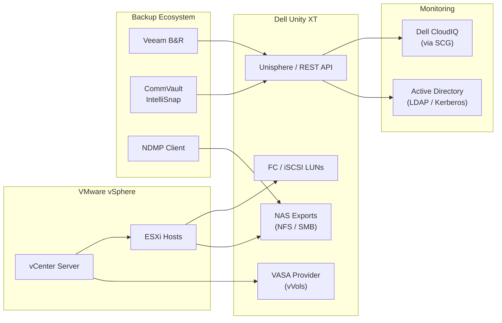

---
tags:
  - architecture
  - dell
---
# Unity — Integrations


<div class="kb-summary">
Integrations reference covering Integration Map, VMware Integration, Backup Integration, CloudIQ Monitoring, Active Directory and 1 more sections.

*Applies to: Unity XT*
</div>
```text
┌──────────────────────────────────── Dell Unity XT — Integrations ─────────────────────────────────────┐
│                                                                                                       │
│   ┌───────────────────────────────────────────────────────────────────────────────────────────────┐   │
│   │     Unity XT integrations: VMware vSphere, Kubernetes CSI, backup software, and monitoring    │   │
│   │                          Protocols: FC · iSCSI · NFS · SMB · REST API                         │   │
│   │      API: Unisphere / UEMCLI REST API enables automation and third-party tool integration     │   │
│   │             Plug-ins available for vCenter, OpenShift, Splunk, and SIEM platforms             │   │
│   └───────────────────────────────────────────────────────────────────────────────────────────────┘   │
│                                                                                                       │
│    Unity XT → REST API / plug-ins → VMware / K8s / backup / monitoring                                │
│                                                                                                       │
│                  ▼                                ▼                                ▼                  │
│                                                                                                       │
│   ┌─────────────────────────────┐  ┌─────────────────────────────┐  ┌─────────────────────────────┐   │
│   │            Layer            │  │          Component          │  │            Notes            │   │
│   │             Ctrl            │  │         SP-A + SP-B         │  │        Cache mirrored       │   │
│   │             Pool            │  │       Dynamic FAST VP       │  │         Auto-tiering        │   │
│   │          NAS server         │  │        File protocols       │  │          Per-tenant         │   │
│   │           Snapshot          │  │        Writable snaps       │  │        Thin PiT copy        │   │
│   │         Replication         │  │         Async/Metro         │  │       Native or RP4VM       │   │
│   └─────────────────────────────┘  └─────────────────────────────┘  └─────────────────────────────┘   │
│                                                                                                       │
│                          ▼                                                 ▼                          │
│                                                                                                       │
│   ┌───────────────────────────────────────────────────────────────────────────────────────────────┐   │
│   │    Component     │     Purpose      │      Protocol     │       Auth       │      Notes       │   │
│   │    Unisphere     │  GUI / REST API  │       HTTPS       │    LDAP/local    │    SP-hosted     │   │
│   │      UEMCLI      │  CLI management  │    SSH / HTTPS    │   Local admin    │  All operations  │   │
│   │    NAS server    │  File services   │      NFS/SMB      │  Kerberos/NTLM   │ Virtual file se  │   │
│   │   RecoverPoint   │ Continuous prote │   Encrypted TCP   │   Certificate    │   Journal CDP    │   │
│   └───────────────────────────────────────────────────────────────────────────────────────────────┘   │
│                                                                                                       │
│    Physical: Unity XT 380F/480F/680F/880F · dual SPs · DPE/DAE expansion · 10/25 GbE                  │
│                                                                                                       │
│    Key terms:                                                                                         │
│                                                                                                       │
│    Unity XT           = Dell unified mid-range array; block LUNs, file NAS, and VMware vVols          │
│    Unisphere          = HTML5 GUI and REST API for Unity XT management; SP-hosted management portal   │
│    UEMCLI             = CLI for Unity XT; uemcli -d <ip> -u admin -p <pw> /show commands              │
│    Storage pool       = collection of drives forming a usable pool; FAST VP tiers data automatically  │
│    FAST VP            = Fully Automated Storage Tiering VP; moves hot and cold data between tiers     │
│    NAS server         = virtual file server on Unity; each has its own IP, DNS, and CIFS/NFS shares   │
│    Data Mover         = older EMC term for NAS server; used in VNX and early Unity documentation      │
│    SP-A / SP-B        = storage processors; active-active HA pair with mirrored cache                 │
│    Snapshot           = space-efficient PiT copy of LUN or FS; writable snapshots supported           │
│    RecoverPoint       = RP4VM; journal-based continuous data protection for Unity volumes             │
│    Metro              = synchronous replication between two Unity XT sites; active-active zero RPO    │
│    vVols              = Virtual Volumes; VASA provider exposes per-VM storage objects to vCenter      │
│                                                                                                       │
└───────────────────────────────────────────────────────────────────────────────────────────────────────┘
```


## Integration Map



## VMware Integration

Unity XT integrates with VMware vSphere via multiple paths:

**VASA Provider (vVols)**

Unity includes an embedded VASA provider that enables VMware Virtual Volumes (vVols). Register the VASA provider in vCenter under **Storage > Storage Providers**. Use the Unity management IP and credentials. With vVols, each VMDK gets its own Unity LUN, enabling per-VM snapshot and replication policies.

**NFS and VMFS Datastores**

- NFS datastores: create a Unity filesystem and NFS export, then add the NFS datastore in vCenter. Use NFS v3 or v4.1.
- VMFS datastores: provision a Unity LUN over FC or iSCSI and add it as a VMFS datastore in vCenter.
- Enable VAAI (VMware APIs for Array Integration) — Unity supports VAAI for hardware offload of VMFS clone, zero, and lock operations.

**Unity Plugin for vCenter**

Install the Dell Unity vCenter plugin to provision Unity storage directly from the vCenter UI without switching to Unisphere.

## Backup Integration

| Backup Tool | Integration Method | Notes |
|---|---|---|
| Veeam Backup & Replication | Unity storage snapshot integration (Veeam Storage Snapshots) | Veeam triggers Unity snapshots at backup time; requires Veeam Enterprise or higher |
| CommVault | Unity snapshot API integration via IntelliSnap | Configure Unity array in CommVault as an IntelliSnap-capable array |
| Veritas NetBackup | NetBackup Snapshot Manager with Unity snapshot support | Configure Unity as a snapshot array in NetBackup Snapshot Manager |
| Generic NDMP | Unity NAS servers support NDMP for file-level backup | Use any NDMP-compatible backup tool; configure NDMP on the NAS server via `uemcli /net/nas/ndmp` |

## CloudIQ Monitoring

Unity XT registers with Dell CloudIQ automatically when a Secure Connect Gateway (SCG) is deployed and connected. CloudIQ provides health scores, capacity forecasting, and proactive alerts for Unity.

Configuration steps:

1. Deploy the SCG virtual appliance and configure it with your Dell account.
2. In the SCG web UI, add the Unity array using its management IP and credentials.
3. The Unity array appears in CloudIQ within 15–30 minutes after SCG registration.
4. SupportAssist must be enabled on Unity (Unisphere > **Settings > SupportAssist**) for CloudIQ telemetry collection.

## Active Directory

Unity supports LDAP/AD integration for two distinct purposes:

| Integration | Purpose | Configuration |
|---|---|---|
| Unisphere AD authentication | Admin users log in to Unisphere with AD credentials | Unisphere: **Settings > Access > Directory Services** |
| NAS server AD domain join | CIFS/SMB shares use AD for share permissions and Kerberos auth | `uemcli /net/nas/ad join` per NAS server |

For CIFS/SMB, each NAS server must be independently joined to the AD domain with a machine account in the appropriate OU. Ensure the NAS server's DNS is configured to resolve the domain controllers.

## REST API

Unisphere for Unity exposes a REST API for all management operations. Use it for automation and integration with ITSM and monitoring tools.

```bash
# Base URL
https://<sp-ip>/api/types/

# Authenticate (session-based — returns a cookie for subsequent requests)
curl -c cookie.txt -b cookie.txt -k -u admin:<password> \
  -X GET "https://<sp-ip>/api/instances/system/0"

# List all storage pools
curl -c cookie.txt -b cookie.txt -k \
  -X GET "https://<sp-ip>/api/types/pool/instances?fields=name,sizeTotal,sizeUsed,health"

# List all LUNs
curl -c cookie.txt -b cookie.txt -k \
  -X GET "https://<sp-ip>/api/types/lun/instances?fields=name,sizeTotal,pool,health"
```

The API supports basic auth and session (cookie) auth. Use session auth for scripts that make multiple API calls to avoid authenticating on each request. The full API reference is available in Unisphere under **Help > REST API Reference**.
