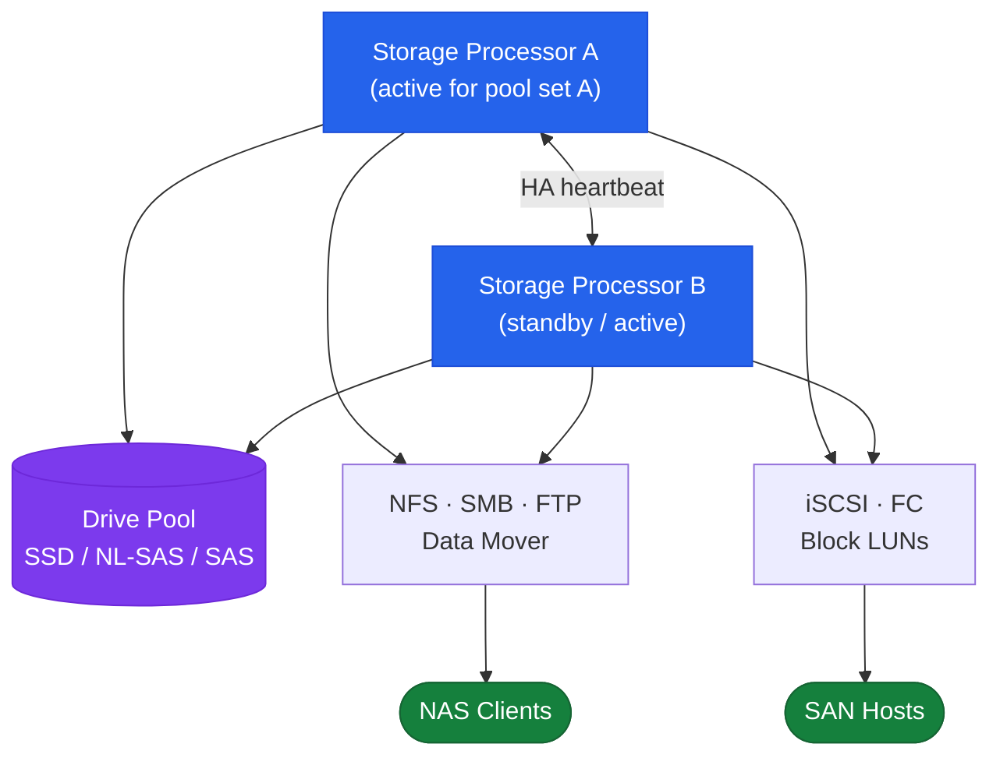
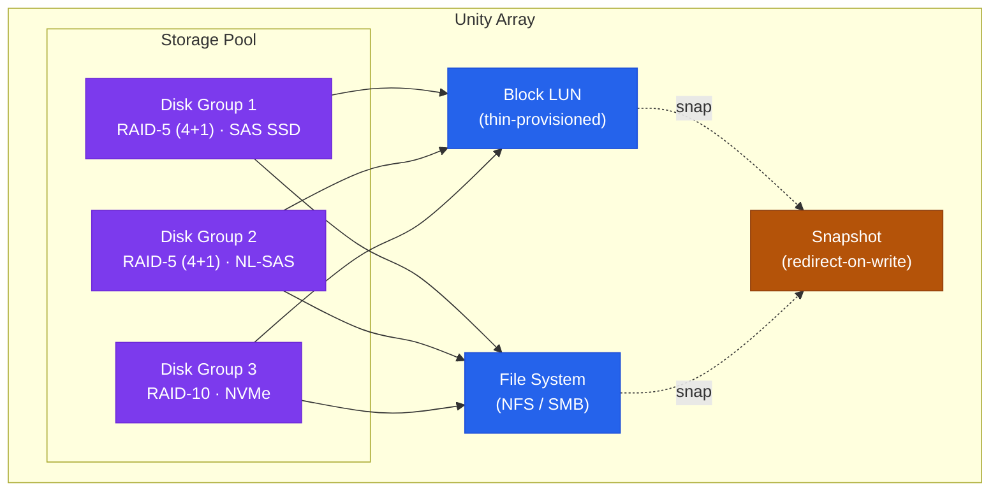

# Unity — Architecture Overview

## Overview

Dell Unity XT is a mid-range unified storage platform delivering block (Fibre Channel, iSCSI) and file (NFS, SMB) storage from a single system. It uses a dual storage processor (SP A / SP B) architecture with automatic I/O failover between processors. Unity XT is available as purpose-built hardware in the 380, 480, 680, and 880 models and as a software-defined virtual appliance (UnityVSA). Administration is via the Unisphere for Unity web GUI or the `uemcli` command-line interface.

## Dual Storage Processor Architecture



Both storage processors are active simultaneously. LUN and NAS server ownership is distributed across SP A and SP B, but each resource is owned by exactly one SP at a time. Resources can be manually rebalanced or fail over automatically to the peer SP.

## Hardware Models

| Model | Max Raw Capacity | Max SSD | Drive Slots | Notes |
|---|---|---|---|---|
| Unity XT 380 | ~2 PB | NVMe | 25-drive DPE + DAEs | Entry mid-range; hybrid or all-flash configurations |
| Unity XT 480 | ~4 PB | NVMe | 25-drive DPE + DAEs | Mid-range; higher SP performance than 380 |
| Unity XT 680 | ~8 PB | NVMe | 25-drive DPE + DAEs | High-end mid-range; suitable for large database environments |
| Unity XT 880 | ~12 PB | NVMe | 25-drive DPE + DAEs | Top-of-range; maximum scale for mid-range |
| Unity 300F / 380F / 480F / 680F / 880F | All-flash variants | NVMe/SAS Flash | Varies | No spinning disk; optimised for low-latency workloads |
| UnityVSA | Software-defined | N/A | Virtual disks | ESXi-hosted; for dev/test and small environments |

## HA Topology

Unity XT uses an active-active dual-SP model where LUN and filesystem ownership is distributed across both SPs. Each resource is owned by only one SP at a time.

- Both SPs are powered on and connected to the same storage enclosures and host FC/iSCSI fabric.
- Each SP independently serves I/O for the LUNs and NAS servers assigned to it.
- If an SP fails, the peer SP automatically takes ownership of all resources within approximately 30 seconds. No data loss occurs because write cache is mirrored between SPs over the SP interconnect link.
- During SP failover, host multipath drivers (PowerPath, MPIO, DM-MPIO) redirect I/O to the surviving SP's ports automatically.
- The system remains fully operational from a host perspective; the surviving SP handles all I/O until the faulted SP is repaired and returned to service.

## SP Interconnect and Write Cache Mirroring

Each SP contains DRAM write cache that absorbs host writes before they are committed to persistent drives. To protect against SP failure, write cache is continuously mirrored between SP A and SP B over a dedicated internal interconnect (not visible to hosts). If one SP fails:

- The surviving SP has a complete copy of all in-flight write data from both SPs.
- No acknowledged writes are lost — the system honours its write completion guarantee to hosts.
- Once the faulted SP is replaced or rebooted, the surviving SP resynchronises cache state.

Battery-backed units (BBUs) on each SP protect write cache during power loss; they hold the cache long enough for destage to drives to complete.

## Networking Architecture

Unity uses separate networks for host data, management, and (optionally) replication:

| Network | Protocol | Purpose | Typical Interface |
|---|---|---|---|
| Host block (FC) | Fibre Channel | FC LUN access | 8/16/32 Gb FC HBAs |
| Host block (iSCSI) | iSCSI | iSCSI LUN access | 10/25 GbE Ethernet |
| Host file (NAS) | NFS / SMB | NAS file access | 10/25 GbE Ethernet (NAS file interface IPs) |
| Management | HTTPS / SSH | Unisphere GUI, uemcli | 1 GbE management port per SP |
| Replication | TCP | Inter-array replication | Data or dedicated replication interface |

Management traffic uses a dedicated 1 GbE port on each SP. SP A and SP B each have their own management IP. A management virtual IP (shared between SPs) can be configured to follow the active management SP automatically.

## Port Layout (Typical XT 480)

Each SP A and SP B provides:

| Port Type | Count (per SP) | Speed | Use |
|---|---|---|---|
| FC host ports | 4 | 16 Gb | Block storage hosts via FC fabric |
| 10/25 GbE host ports | 4 | 10/25 GbE | iSCSI hosts and NAS clients |
| Management port | 1 | 1 GbE | Unisphere GUI and uemcli |
| SP interconnect | Internal | Internal | Write cache mirroring and HA heartbeat |

Exact port counts vary by model and I/O module configuration. Refer to the Dell Unity XT Technical Specifications for the specific model.

## Storage Pools and Drive Architecture

Storage pools are the fundamental unit of capacity allocation. A pool contains one or more disk groups (RAID sets); LUNs and file systems are allocated from pool capacity.

```
  Unity Array
  └── Storage Pool (e.g., pool-performance)
       ├── Disk Group 1 — RAID-5 (4+1), SAS SSD drives
       ├── Disk Group 2 — RAID-5 (4+1), SAS SSD drives
       └── Disk Group 3 — RAID-10, NVMe drives
            └── LUN or File System allocations
```



| Drive Type | Tier | Typical Use |
|---|---|---|
| NVMe SSD | Tier 0 | Ultra-low latency; FAST VP performance tier |
| SAS SSD | Tier 1 | High IOPS; performance tier in hybrid pools |
| 10K/15K SAS | Tier 2 | Mid-range IOPS; general purpose workloads |
| 7.2K NL-SAS | Tier 3 | High capacity, lower IOPS; archive and backup targets |

Pools can contain a single drive tier (all-flash) or multiple tiers (hybrid). When multiple tiers are present and FAST VP (Fully Automated Storage Tiering) is licensed, the array automatically moves frequently accessed data to the faster tier and cold data to the slower tier.

## FAST Cache

FAST Cache is an optional SSD-based read/write cache layer that sits above the pool drives and below the DRAM write cache. It extends effective random I/O performance for hybrid pools without requiring a full all-flash configuration.

| Attribute | Detail |
|---|---|
| Drive type | SAS Flash (dedicated FAST Cache drives, not pool drives) |
| Minimum | 2 drives per SP (RAID-1 pair) |
| Maximum | Model-dependent; up to several TB of cache |
| Best for | Random I/O workloads — databases, VM datastores |
| Avoid for | Sequential workloads — backup streams, large video files |

FAST Cache is enabled at the pool level. Check status:

```bash
uemcli -d <ip> -u admin /stor/config/pool show -detail | grep -i "fast cache"
```

## Data Services

| Service | Description |
|---|---|
| Inline deduplication | Eliminates duplicate data blocks within a pool; all-flash pools only |
| Inline compression | Compresses data blocks before writing to disk; all-flash pools only |
| FAST VP | Automated sub-LUN tiering between drive tiers within a pool |
| FAST Cache | SSD read/write cache acceleration for hybrid pools |
| Native snapshots | Space-efficient, redirect-on-write snapshots at LUN and filesystem level |
| Thin provisioning | LUNs and filesystems allocated from pool only as data is written |
| Consistency groups | Group multiple LUNs for crash-consistent snapshot operations |
| Replication | Asynchronous or synchronous replication to a remote Unity or PowerStore |

## Management Interfaces

| Interface | Access Method | URL / Command |
|---|---|---|
| Unisphere GUI | Web browser (HTTPS) | `https://<sp-mgmt-ip>` |
| UEMCLI | Command-line (SSH or local) | `uemcli -d <ip> -u admin` |
| REST API | HTTP/HTTPS client | `https://<sp-ip>/api/types/` |
| vCenter Plugin | vSphere Web Client | Dell Unity Plugin installed in vCenter |

## UnityVSA (Virtual Appliance)

UnityVSA runs the Unity Operating Environment (OE) as a virtual machine on VMware ESXi. It provides the same Unisphere management interface and REST API as physical Unity XT hardware, making it suitable for:

- Development and test environments where Unity behaviour needs to be validated.
- Small branch offices or remote sites with limited data footprint.
- Learning and lab environments.

UnityVSA does not support physical drive trays, FAST Cache, or the same I/O performance profile as Unity XT hardware. It is not recommended for production workloads requiring high IOPS or guaranteed latency.

## Software Versioning

Unity OE (Operating Environment) is the storage operating system. Releases follow a major.minor.patch scheme. Non-disruptive upgrades (NDU) allow OE upgrades with host I/O continuing while each SP is upgraded sequentially.

```bash
# Check current OE version
uemcli -d <ip> -u admin /sys/sw show

# Detailed version information
uemcli -d <ip> -u admin /sys/sw/version show
```
