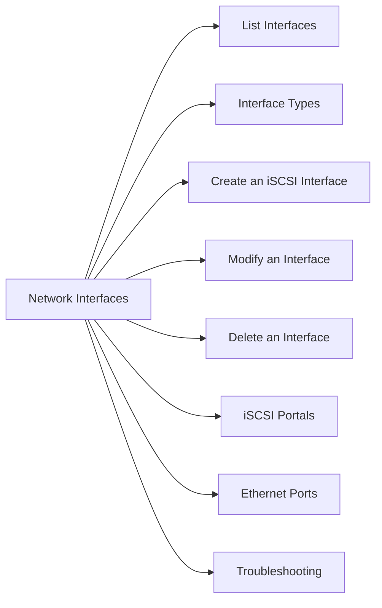

# Network Interfaces

> Part of the Dell Unity CLI Reference (Unisphere CLI).



## List Interfaces

```bash
# All network interfaces (iSCSI, management, NAS)
uemcli -d <ip> -u admin /net/if show

# Detailed view — includes IP, subnet, SP association, port
uemcli -d <ip> -u admin /net/if show -detail
```

## Interface Types

| Type | Use |
|---|---|
| Management | Admin access to Unisphere UI and CLI |
| iSCSI | Block storage access over Ethernet |
| File | NAS NFS/SMB traffic |
| Replication | Inter-array replication traffic |

## Create an iSCSI Interface

```bash
# Create iSCSI interface on SPA, Ethernet port 0
uemcli -d <ip> -u admin /net/if create \
    -type iSCSI \
    -ipv4 <iscsi_ip> \
    -netmask <subnet_mask> \
    -gateway <gateway_ip> \
    -sp spa \
    -port <eth_port_id>

# Verify
uemcli -d <ip> -u admin /net/if show -detail | grep -A10 <iscsi_ip>
```

## Modify an Interface

```bash
# Change IP address
uemcli -d <ip> -u admin /net/if -id <if_id> set -ipv4 <new_ip> -netmask <mask> -gateway <gw>
```

## Delete an Interface

```bash
uemcli -d <ip> -u admin /net/if -id <if_id> delete
```

## iSCSI Portals

```bash
# List iSCSI nodes/portals
uemcli -d <ip> -u admin /net/iscsi/node show

# iSCSI node detail (IQN, IP, port)
uemcli -d <ip> -u admin /net/iscsi/node show -detail
```

## Ethernet Ports

```bash
# List physical Ethernet ports
uemcli -d <ip> -u admin /net/port/eth show
uemcli -d <ip> -u admin /net/port/eth show -detail

# FC ports
uemcli -d <ip> -u admin /net/port/fc show
uemcli -d <ip> -u admin /net/port/fc show -detail
```

## Troubleshooting

| Issue | Check | Command |
|---|---|---|
| iSCSI initiator can't connect | Interface IP reachable? | `uemcli ... /net/if show -detail` |
| Wrong SP for interface | SP association | `uemcli ... /net/if show -detail | grep SP` |
| Interface down | Physical port state | `uemcli ... /net/port/eth show -detail` |
