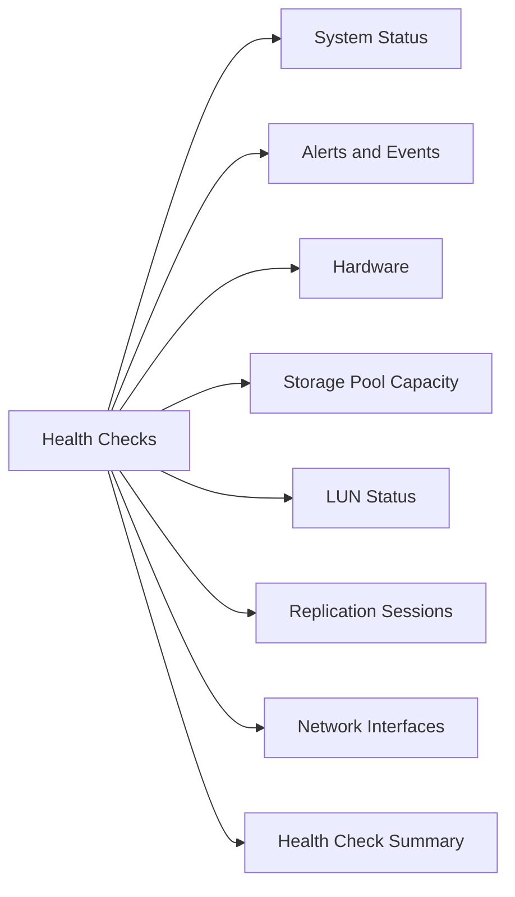

# Dell Unity Health Checks

Daily and pre/post-change health checks for Dell Unity storage systems.



## System Status

```bash
# System general info and health
uemcli -d <ip> -u admin /sys/general show -detail

# Software version
uemcli -d <ip> -u admin /sys/sw/version show

# Storage processor status
uemcli -d <ip> -u admin /sys/sp show
uemcli -d <ip> -u admin /sys/sp show -detail | grep -E "Health|State|Model"
```

## Alerts and Events

```bash
# Active alerts — any critical alerts require immediate attention
uemcli -d <ip> -u admin /prac/alert show
uemcli -d <ip> -u admin /prac/alert show | grep -i "Critical\|Error"

# Event log
uemcli -d <ip> -u admin /event/syslog show
```

## Hardware

```bash
# Disk health
uemcli -d <ip> -u admin /stor/config/disk show
uemcli -d <ip> -u admin /stor/config/disk show | grep -v "Normal"   # Flag non-normal disks

# Disk groups
uemcli -d <ip> -u admin /stor/config/dg show -detail | grep -E "Health|RAID|Disks"

# Storage processors
uemcli -d <ip> -u admin /sys/sp show -detail | grep -E "Health|Power|Temp"
```

## Storage Pool Capacity

```bash
# Pool list with capacity and health
uemcli -d <ip> -u admin /stor/config/pool show -detail

# Flag pools above 80% used
uemcli -d <ip> -u admin /stor/config/pool show | awk '
    /Free/ { getline; if ($3 + 0 < 20) print "WARNING: Pool near full:", $0 }'
```

## LUN Status

```bash
# All LUNs and health
uemcli -d <ip> -u admin /stor/config/lun show -detail | grep -E "Name|Health|Size"

# LUNs with non-OK health
uemcli -d <ip> -u admin /stor/config/lun show | grep -v "OK\|Name"
```

## Replication Sessions

```bash
# All replication sessions
uemcli -d <ip> -u admin /prot/rep/session show

# Sessions not in OK state
uemcli -d <ip> -u admin /prot/rep/session show | grep -v "OK\|Session ID"
```

## Network Interfaces

```bash
# Network interface status
uemcli -d <ip> -u admin /net/if show | grep -E "ID|Health|IP"
```

## Health Check Summary

| Check | Command | Healthy |
|---|---|---|
| System health | `/sys/general show` | Health = OK |
| No critical alerts | `/prac/alert show` | 0 critical alerts |
| All disks normal | `/stor/config/disk show` | All = Normal |
| Pools < 80% used | `/stor/config/pool show` | Free > 20% |
| All LUNs OK | `/stor/config/lun show` | All health = OK |
| Replication sessions OK | `/prot/rep/session show` | All OK / Synced |
| Both SPs online | `/sys/sp show` | Both = OK |
