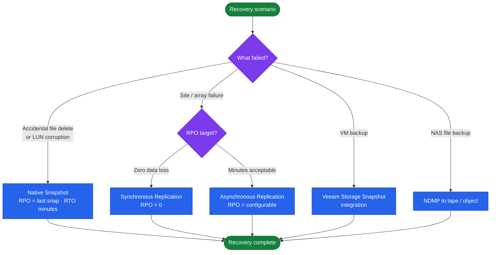
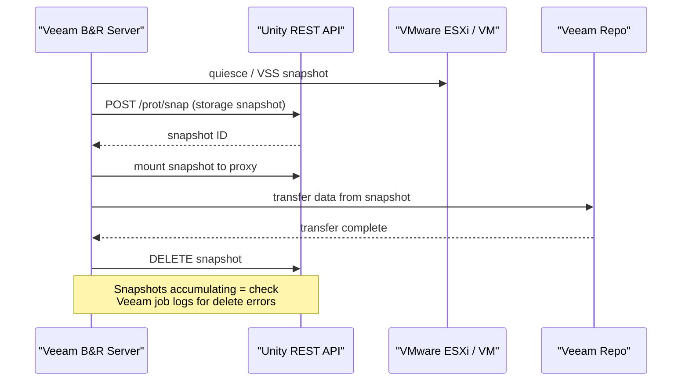
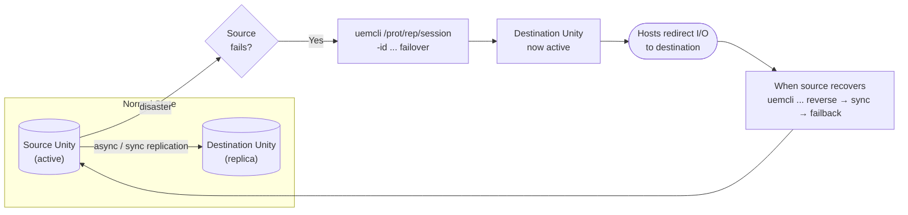

# Unity — Backup & Restore

## Overview

Dell Unity provides multiple data protection mechanisms that can be used independently or in combination. Match the protection method to the recovery objective:

| Method | RPO | RTO | Use Case |
|---|---|---|---|
| Native snapshots | Near-zero (last snapshot) | Minutes (attach and read) | Operational recovery — file deletion, LUN corruption |
| Replication (async) | Minutes to hours (configurable) | 30–60 minutes (failover) | Disaster recovery to secondary site |
| Replication (sync) | Zero (synchronous) | Minutes | DR for zero data loss requirements |
| Veeam Storage Snapshots | Last Veeam job run | Hours (restore from Veeam) | VM-level backup with Unity snapshot integration |
| NDMP backup | Last backup job | Hours (restore from tape/object) | NAS file system backup to external media |
| Clone (thin clone) | Point-in-time | Seconds (clone attach) | Dev/test environment refresh from production |

## Protection Method Selection



## Native Snapshots

Unity snapshots are space-efficient redirect-on-write copies stored within the same storage pool as the source resource. They consume space only for changed blocks after the snapshot is taken.

### Snapshot Basics

```bash
# List all snapshots (all resources)
uemcli -d <ip> -u admin /prot/snap show

# List snapshots for a specific LUN
uemcli -d <ip> -u admin /prot/snap show -res <lun_id>

# List snapshots for a specific file system
uemcli -d <ip> -u admin /prot/snap show -res <fs_id>

# Detailed snapshot view — creation time, expiry, size, state
uemcli -d <ip> -u admin /prot/snap show -detail
```

### Creating Snapshots

```bash
# Create a LUN snapshot
uemcli -d <ip> -u admin /prot/snap create \
    -name prod-oracle-lun01.20260507 \
    -res <lun_id>

# Create a file system snapshot
uemcli -d <ip> -u admin /prot/snap create \
    -name fs-oracle-prod.20260507 \
    -res <fs_id>

# Create a snapshot with an expiry time (auto-delete after 7 days)
uemcli -d <ip> -u admin /prot/snap create \
    -name prod-oracle-lun01.20260507 \
    -res <lun_id> \
    -retentionDuration 7d

# Create a consistency group snapshot (multiple LUNs, crash-consistent)
uemcli -d <ip> -u admin /prot/snap create \
    -name cg-oracle-prod.20260507 \
    -res <consistency_group_id>
```

### Restoring from Snapshot

**LUN restore — full restore to point-in-time state:**

```bash
# Quiesce host I/O to the LUN before restoring
# (application-level quiesce or I/O pause on the host side)

# Restore a LUN from a snapshot (in-place — overwrites current LUN data)
uemcli -d <ip> -u admin /prot/snap -id <snap_id> restore

# Restore with backup of current state (creates a snap of current state before restoring)
uemcli -d <ip> -u admin /prot/snap -id <snap_id> restore -backupSnap
```

**LUN restore — attach snapshot for partial recovery:**

```bash
# Attach a snapshot as a separate LUN (read-only by default)
uemcli -d <ip> -u admin /prot/snap -id <snap_id> attach \
    -host <host_id> \
    -accessType readOnly

# After recovering files, detach the snapshot
uemcli -d <ip> -u admin /prot/snap -id <snap_id> detach
```

**File system snapshot — recover individual files:**

```bash
# Access snapshot content via the .ckpt directory on the NAS server
# On a Linux NFS client, the snapshot appears under:
ls /mnt/nfs-mount/.ckpt/<snapshot_name>/

# For SMB clients, access via Previous Versions (right-click > Restore previous versions)
# or browse to \\<nas-ip>\<share>\.snapshot\<snapshot_name>\
```

**File system restore — full restore:**

```bash
# Full file system restore from snapshot
uemcli -d <ip> -u admin /prot/snap -id <snap_id> restore
```

### Deleting Snapshots

```bash
# Delete a specific snapshot
uemcli -d <ip> -u admin /prot/snap -id <snap_id> delete

# List all expired snapshots (past retention date)
uemcli -d <ip> -u admin /prot/snap show | grep -i expired

# Bulk delete — delete all snapshots for a resource (use with caution)
for snap_id in $(uemcli -d <ip> -u admin /prot/snap show -res <lun_id> | awk '/^ID/ {print $3}'); do
    uemcli -d <ip> -u admin /prot/snap -id "$snap_id" delete
done
```

## Snapshot Schedules

Automate snapshot creation with schedules. Unity supports daily, weekly, and interval-based schedules with configurable retention.

```bash
# List existing snapshot schedules
uemcli -d <ip> -u admin /prot/snapSchedule show
uemcli -d <ip> -u admin /prot/snapSchedule show -detail

# Create a daily schedule — runs at 02:00, keeps 7 copies
uemcli -d <ip> -u admin /prot/snapSchedule create \
    -name sched-daily-0200 \
    -type daily \
    -hour 2 \
    -minute 0 \
    -keepFor 7d

# Create an hourly schedule — keeps 24 copies (rolling 24 hours)
uemcli -d <ip> -u admin /prot/snapSchedule create \
    -name sched-hourly \
    -type hourlyClock \
    -interval 1 \
    -keepFor 24h

# Create a weekly schedule — runs every Sunday at 00:00, keeps 4 copies
uemcli -d <ip> -u admin /prot/snapSchedule create \
    -name sched-weekly-sunday \
    -type weekly \
    -daysOfWeek Sunday \
    -hour 0 \
    -minute 0 \
    -keepFor 28d

# Assign a schedule to a LUN
uemcli -d <ip> -u admin /stor/config/lun -id <lun_id> set \
    -snapSchedule <schedule_id>

# Assign a schedule to a file system
uemcli -d <ip> -u admin /stor/config/fs -id <fs_id> set \
    -snapSchedule <schedule_id>

# Remove a schedule assignment from a LUN
uemcli -d <ip> -u admin /stor/config/lun -id <lun_id> set \
    -snapSchedule ""

# Delete a schedule (only if no resources are currently assigned to it)
uemcli -d <ip> -u admin /prot/snapSchedule -id <schedule_id> delete
```

### Recommended Snapshot Schedule

| Protection Tier | Schedule | Retention | Use Case |
|---|---|---|---|
| Hourly | Every 1 hour | 24 copies (24 hours) | Active databases, high-churn workloads |
| Daily | 02:00 daily | 7 copies (1 week) | All production LUNs and file systems |
| Weekly | 00:00 Sunday | 4 copies (4 weeks) | Monthly point-in-time access for compliance |
| Monthly | 00:00 1st of month | 12 copies (1 year) | Long-term retention for regulated data |

Stack schedules on critical resources — assign both an hourly and a daily schedule to the same LUN or file system.

## Veeam Backup & Replication Integration

Veeam integrates with Unity via the Dell Unity Storage Plugin for Veeam. When configured, Veeam triggers Unity snapshots as part of its backup job, enabling:



- Crash-consistent Unity-level snapshots for VMs on Unity-backed datastores.
- Near-instant VM restore from Unity snapshots without reading backup media.
- SureBackup verification using snapshot-mounted VMs.

### Requirements

- Veeam Backup & Replication Enterprise or Enterprise Plus license.
- Dell Unity Storage Plugin for Veeam (download from Dell support portal).
- Unity credentials with **Storage Administrator** role for Veeam's service account.
- Unity array reachable from the Veeam Backup Server on port 443 (HTTPS/REST API).

### Configuration Steps

1. Install the Dell Unity Storage Plugin on the Veeam Backup Server.
2. In Veeam: **Storage Infrastructure > Add Storage > Dell EMC > Unity**.
3. Enter the Unity management IP, credentials, and click **Connect**.
4. Veeam discovers Unity volumes and can now trigger snapshots during backup jobs.
5. In the Veeam backup job settings: **Storage > Guest processing > Application-aware processing** — enable for VSS-consistent snapshots of VMs.

### Verifying Veeam Snapshot Integration

After the first backup job:

```bash
# Confirm Veeam-triggered snapshots appear in Unity
uemcli -d <ip> -u admin /prot/snap show | grep -i veeam

# Check snapshot consumption — Veeam snapshots should be cleaned up after backup
uemcli -d <ip> -u admin /prot/snap show -detail | grep -E "Name|Size|State"
```

Veeam should delete its Unity snapshots after transferring the data to the backup repository. If Veeam snapshots accumulate, investigate the Veeam job logs for errors during snapshot deletion.

## CommVault IntelliSnap Integration

CommVault integrates with Unity using the IntelliSnap module. Configure Unity as a snap array in CommVault:

1. In CommVault, navigate to **Storage Resources > Arrays > Add Array**.
2. Select **Dell EMC Unity** as the array type.
3. Enter the Unity management IP, credentials, and configure the snap engine.
4. Test the array connection.
5. Assign Unity snap policies to subclient configurations.

CommVault triggers Unity snapshots at backup time, mounts them to a proxy server for data transfer, and then deletes the snap after the backup completes. Retain at least one IntelliSnap per backup cycle in the Unity snap pool as a fast-recovery option.

## NDMP Backup (NAS File Systems)

Unity NAS servers support NDMP (Network Data Management Protocol) for direct backup of NAS file systems to tape or object storage media without routing data through an application server.

```bash
# Enable NDMP on a NAS server
uemcli -d <ip> -u admin /net/nas/ndmp create \
    -server <nas_id> \
    -user ndmp_backup \
    -passwd "NdmpPassword1!" \
    -port 10000

# List NDMP configurations
uemcli -d <ip> -u admin /net/nas/ndmp show

# Disable NDMP on a NAS server
uemcli -d <ip> -u admin /net/nas/ndmp -id <ndmp_id> delete
```

Point the NDMP backup application to the NAS server IP and port 10000. Supported NDMP backup applications include Veritas NetBackup, IBM Tivoli Storage Manager, and Commvault (NDMP mode).

## Replication Failover and Failback Flow



## Replication as DR Protection

Unity asynchronous replication provides RPO-based protection to a secondary Unity or PowerStore array. See the [CLI Reference — Replication](../cli-reference/#replication) section for full replication commands.

```bash
# Show replication sessions with last sync time
uemcli -d <ip> -u admin /prot/rep/session show -detail

# Trigger an immediate sync before maintenance (reduce RPO to near-zero)
uemcli -d <ip> -u admin /prot/rep/session -id <session_id> sync

# Verify sync completed and note the current lag
uemcli -d <ip> -u admin /prot/rep/session -id <session_id> show -detail | \
    grep -E "State|Current Lag|Last Sync"
```

For DR procedures including planned failover, failback, and reverse replication, see the [Procedures](../procedures/) page.

## Restore Validation

After any restore operation, run this validation sequence before declaring recovery complete:

### Post-Snapshot Restore Checklist

- [ ] `uemcli /env/health show -filter "health.value ne OK"` returns no output — no new faults introduced by the restore
- [ ] `uemcli /stor/config/pool show -detail` — pool capacity within acceptable range after restore; snapshot space has not caused pool to exceed 85% used
- [ ] LUN or file system is accessible from the target host (rescan SCSI bus on Linux, refresh disk on Windows)
- [ ] Application can read and write data from the restored volume — run application-level validation (database consistency check, application startup, file access test)
- [ ] Snapshot schedule remains active after restore — confirm the schedule still shows as assigned on the resource
- [ ] Document the restore: time, snapshot used, resource name, engineer, and application owner sign-off

### Backup Testing Schedule

| Activity | Frequency |
|---|---|
| Snapshot restore test (LUN) | Monthly — restore to a test host and validate data integrity |
| Snapshot restore test (NAS) | Monthly — restore a file system to a test NAS server and verify file access |
| Replication failover test | Quarterly — planned failover to DR site, confirm host connectivity, fail back |
| Veeam instant VM recovery test | Quarterly — power on a recovered VM from snapshot, confirm application starts |
| Full DR exercise | Annually — complete production-equivalent failover and failback with application owners |

Document all test outcomes including test date, resource tested, snapshot age, recovery time, and any issues encountered.

## Snapshot Capacity Management

Snapshots consume pool space for changed blocks. Uncontrolled snapshot growth can fill the pool and cause Unity to automatically invalidate older snapshots, which results in data loss.

```bash
# Show total snapshot space consumption per pool
uemcli -d <ip> -u admin /stor/config/pool show -detail | grep -E "Snap|Subscribed"

# Show space used by individual snapshots
uemcli -d <ip> -u admin /prot/snap show -detail | grep -E "Name|Size"

# Find the largest snapshots
uemcli -d <ip> -u admin /prot/snap show -detail | grep -E "Name|Size" | sort -k3 -rh | head -20
```

### Pool Capacity Alerts for Snapshots

| Pool Free Space | Action |
|---|---|
| > 25% | Healthy — snapshots accumulating normally |
| 15–25% | Review and delete expired or unneeded snapshots |
| 10–15% | Delete snapshots aggressively; expand pool or add drives |
| < 10% | Emergency — Unity will begin auto-deleting oldest snapshots; immediate capacity action required |
| < 5% | Unity may invalidate snapshots and replication sessions to protect primary I/O — data loss risk |

Set capacity alerts in Unisphere at 70% and 80% consumed to get early warning before snapshot auto-deletion begins.
