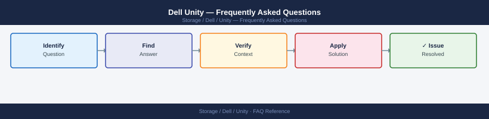

---
tags:
  - dell-unity
  - faq
  - operations
---
# Dell Unity — Frequently Asked Questions

<div class="kb-summary">
Common questions about Dell Unity operations, configuration, and troubleshooting. For step-by-step procedures, see the <a href="index.md">Operations</a> section.
</div>



```d2
direction: right

hub: "Unity XT\nOperations" {shape: hexagon}
general: "General" {shape: rectangle}
configuration: "Configuration" {shape: rectangle}
operations: "Operations" {shape: rectangle}
troubleshooting: "Troubleshooting" {shape: rectangle}
backup_and_recovery: "Backup and Recovery" {shape: rectangle}

hub -> general
hub -> configuration
hub -> operations
hub -> troubleshooting
hub -> backup_and_recovery
```

## General

**Q: What Unity OS version is recommended?**
A: Unity OS 5.4.x is the current recommendation. Check via Unisphere for Unity: System → Software. Apply the latest OE (Operating Environment) patch before any production deployment.

**Q: How do I check the current Dell Unity version?**
A: `Unisphere for Unity → System → Software`

## Configuration

**Q: What is the default snapshot schedule and when should it change?**
A: No default snapshot schedule is configured. Create protection schedules under Protection → Snapshots → Schedule. Minimum recommended: hourly snapshots retained for 24 hours, daily for 7 days, weekly for 4 weeks.

**Q: How do I enable Unity Metro Sync for synchronous replication?**
A: Requires two Unity arrays and a Metro Sync licence. Configure via Unisphere: Protection → Replication → Add Replication Session. Select Synchronous mode. Ensure RTT < 5ms between arrays for acceptable performance.

## Operations

**Q: How do I upgrade Unity OS without downtime?**
A: Unity supports non-disruptive upgrades (NDU). Via Unisphere: System → Software → Upgrade. Storage processors upgrade sequentially; I/O fails over to the peer SP during each SP's upgrade. Typically completes in 30-60 minutes.

**Q: What is the correct procedure to provision a new LUN on Unity?**
A: Unisphere: Storage → Block → LUNs → Create LUN. Set name, pool, size, and host access. For thin provisioning, select 'Thin' and set the size limit. Assign the LUN to a host via the Access tab.

## Troubleshooting

**Q: Unity shows 'Storage Pool nearly full'. What does it mean?**
A: Usable pool capacity is above 85%. Thin-provisioned LUNs may fail writes if the pool reaches 100%. Add drives to the pool (Unisphere: Storage → Pools → Add Capacity) or delete unnecessary data/snapshots.

**Q: Unity I/O latency increased — where do I start?**
A: Check Unisphere Performance tab for per-LUN and per-pool metrics. Review cache utilisation (SSD cache should be >50% hit rate). Check for heavy snapshot operations. Review host queue depth settings.

## Backup and Recovery

**Q: How often should I back up Unity configuration?**
A: Weekly via Unisphere: System → Service → Export Configuration. Back up before any OE upgrade or configuration change. Store off-array.

**Q: Can I restore a single LUN from a Unity snapshot?**
A: Yes — Unisphere: Protection → Snapshots → select snapshot → Restore (restores in-place) or Create LUN from Snapshot (creates a new LUN from the snapshot). Restoring in-place overwrites current data.

## See Also

- [Dell Unity Operations](index.md)
- [Dell Unity Troubleshooting](../../../troubleshooting/index.md)
