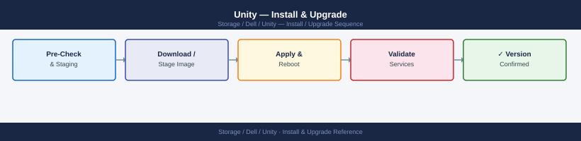

---
tags:
  - dell
  - operations
---
# Unity — Install & Upgrade

Install & Upgrade reference covering Unity OE Version Matrix, Upgrade Paths, Hardware Refresh, EOL Tracking.

*Applies to: Unity XT*

## Before you begin

- **Access:** Storage admin credentials (cluster admin or equivalent)
- **Timing:** safe to run during business hours unless a step is marked ⚠ (causes interruption)
- **Dependencies:** no active upgrades or migrations on the same infrastructure
- **Logging:** capture command output — paste into the change record on completion

---

## Unity OE Version Matrix

Unity OE (Operating Environment) releases follow a major.minor.patch scheme. Dell publishes end-of-support dates for each release; versions past their end-of-support date no longer receive security patches or bug fixes.

| Unity OE Version | Release | End of Primary Support | Notes |
|---|---|---|---|
| 5.4.x | 2024 | TBA | Current recommended release |
| 5.3.x | 2023 | TBA | Supported; upgrade to 5.4.x recommended |
| 5.2.x | 2022 | 2025 | Near end-of-support; plan upgrade |
| 5.1.x | 2021 | 2024 | End of primary support reached |
| 5.0.x | 2020 | 2023 | End of support; no further patches |
| 4.x and below | Pre-2020 | Expired | Must upgrade immediately |

Unity XT hardware is end-of-new-sales. Dell continues to support existing Unity XT systems under ProSupport contracts until the published hardware EOL date. The strategic migration path is to Dell PowerStore.

## Upgrade Paths

Unity OE supports **Non-Disruptive Upgrade (NDU)** — I/O continues from host perspective while each SP is restarted sequentially.

Supported upgrade path: any version within two major versions back can typically upgrade directly. Consult the Dell Unity Compatibility Matrix on the support portal for your specific version pair before beginning.

**Upgrade procedure:**

1. Run `uemcli /env/health show -filter "health.value ne OK"` and resolve all faults. Do not upgrade with a degraded pool or faulted SP.
2. Confirm both SPs are online and healthy: `uemcli /env/sp show`.
3. Confirm all replication sessions are in Active state: `uemcli /rep/session show`.
4. Download the OE upgrade package from [https://www.dell.com/support](https://www.dell.com/support) and verify the SHA256 checksum.
5. Upload the package to the array: **Unisphere > Maintenance > Software Upgrades > Upload Package**, or via `uemcli /sys/sw upload`.
6. Initiate the upgrade from Unisphere or `uemcli /sys/sw upgrade`. The system upgrades SP B first, then SP A. I/O continues via the active SP throughout.
7. Monitor upgrade progress in Unisphere. Each SP restart takes 10–20 minutes. Do not interrupt the process.
8. After completion, verify both SPs return to Normal state, confirm `uemcli /sys/sw show` shows the new version, and re-check all pools and replication sessions.

## Hardware Refresh

Dell Unity XT is end-of-new-sales. Organisations still running Unity XT should plan a migration to Dell PowerStore.

Migration options:

| Migration Method | Description | Best For |
|---|---|---|
| Dell Migration Services | Dell Professional Services migrates data using native replication or VPLEX | Large environments; minimal host downtime |
| Host-based migration | Applications quiesced, data mirrored to PowerStore volumes, host re-zoned | Small environments; full control over cutover |
| VPLEX non-disruptive migration | Unity LUN federated via VPLEX, then migrated behind VPLEX to PowerStore | Zero-downtime for VPLEX-connected environments |

Request a Dell-led migration assessment via your account team to determine the best approach for your workload mix.

## EOL Tracking

Monitor the following sources for Unity EOL announcements:

- Dell Support Portal: [https://www.dell.com/support](https://www.dell.com/support) — search for "Unity XT End of Life" under Product Notifications.
- Dell Technical Advisories: subscribe to email notifications for Unity XT product advisories.
- ProSupport contract renewal: EOL hardware loses ProSupport coverage at the hardware EOL date even if a support contract is active.

Maintain a lifecycle register that records each Unity system's hardware model, current OE version, ProSupport expiry date, and planned refresh date. Review and update the register quarterly.

---

## Verify

- Confirm the operation completed without errors in the log or management UI
- Verify the expected state change is visible (service running, object created, config applied)
- Document the outcome in the change record

---

## See also

- [Unity — Procedures](procedures/)
- [Unity — Health Checks](health-checks/)
- [Unity — Deploy](../deploy/)
