---
tags:
  - dell
  - operations
---
# Unity — Procedures

<div class="kb-summary">
Procedures reference covering Change Readiness, Maintenance Window, Post-Change Validation, LUN Management, NAS Server Management.

*Applies to: Unity XT*
</div>

## Before you begin

- **Access:** Storage admin credentials (cluster admin or equivalent)
- **Timing:** safe to run during business hours unless a step is marked ⚠ (causes interruption)
- **Dependencies:** no active upgrades or migrations on the same infrastructure
- **Logging:** capture command output — paste into the change record on completion

---

## Change Readiness

Verify these items before performing any change on the Unity array — pool expansions, LUN provisioning, replication configuration changes, or firmware upgrades.

- [ ] `uemcli /env/health show -filter "health.value ne OK"` returns no output — no pre-existing faults before the change
- [ ] Both SPs are Active: `uemcli /env/sp show` — do not proceed with a firmware upgrade or disruptive change with only one SP active
- [ ] Pool capacity headroom confirmed: `uemcli /stor/pool show -detail` — ensure the pool targeted by the change has at least 20% free capacity
- [ ] Replication session state confirmed: `uemcli /rep/session show` — note the current state for all sessions; confirm no session is in a degraded state before starting
- [ ] Snapshot reserve checked: `uemcli /stor/snap show` — confirm snapshot consumption is not crowding pool capacity
- [ ] No active alerts that relate to the component being changed: `uemcli /sys/alert show`
- [ ] Notify host owners if the change involves a LUN or NAS server they use; coordinate I/O quiesce if needed
- [ ] Confirm the Unisphere System Health Check has been run: `uemcli /sys/general healthcheck`

| Item | Status | Notes |
|---|---|---|
| No pre-existing health faults | | |
| SP A and SP B both Active | | |
| Pool capacity headroom ≥ 20% | | |
| Replication sessions Active | | |
| No unacknowledged critical alerts | | |

## Maintenance Window

Steps for planned maintenance on a Unity array — firmware upgrades, pool expansions, or SP-level work.

1. Notify host and application owners; confirm the maintenance window and any required I/O quiesce
2. Run `uemcli /env/health show -filter "health.value ne OK"` to confirm no pre-existing faults; resolve all faults before starting
3. Confirm both SP A and SP B are in Active state via `uemcli /env/sp show` — a firmware upgrade will restart each SP sequentially and requires both to be healthy
4. Create a pre-maintenance snapshot of critical LUNs or file systems: `uemcli /stor/snap create -storRes <resource_id> -name maint-pre-$(date +%Y%m%d)`
5. Note current replication session states with `uemcli /rep/session show` — be prepared to resume sessions after the maintenance if they are paused
6. Perform the change per the approved runbook; for firmware upgrades, Unisphere upgrades SP B first then SP A — monitor progress and do not interrupt the process
7. After the change, run `uemcli /env/health show`, `uemcli /env/sp show`, and `uemcli /stor/pool show -detail` to confirm the array is healthy
8. Confirm replication sessions return to `Active` state; resume any sessions that remain paused: `uemcli /rep/session -id <id> resume`

## Post-Change Validation

Run these checks after any change to confirm the Unity is healthy and host connectivity is restored.

- [ ] `uemcli /env/health show -filter "health.value ne OK"` returns no output — no new faults introduced
- [ ] `uemcli /env/sp show` — both SP A and SP B are back to `Active` state after any SP-level maintenance
- [ ] `uemcli /stor/pool show -detail` — all pools healthy; capacity consumption within expected range
- [ ] `uemcli /rep/session show` — all replication sessions back to `Active`; note any sessions that need manual resumption
- [ ] `uemcli /sys/sw show` — confirms the new software version is installed (if this was a firmware upgrade)
- [ ] Host connectivity verified: iSCSI or FC LUNs accessible from representative hosts; NFS mounts responding
- [ ] Application owners confirm their applications are running normally
- [ ] Pre-change snapshot retained until the post-change validation period has passed (minimum 24 hours)

## LUN Management

LUN lifecycle management on Dell Unity — create, map, expand, and manage snapshots.

```d2
direction: right

CHK: "CHK" {shape: rectangle}
FIX: "Resolve faults\nbefore proceeding" {shape: rectangle}
POOL: "POOL" {shape: rectangle}
EXP: "Expand pool\nor free space" {shape: rectangle}
CREATE: "uemcli /stor/config/lun create\n-name -pool -size" {shape: rectangle}
MAP: "uemcli /stor/config/lunacl create\n-lun -host" {shape: rectangle}
FC: "FC" {shape: rectangle}
ZONE: "Verify FC zone contains\nhost HBA WWN + Unity port WWN" {shape: rectangle}
IQN: "Verify host IQN registered\nin Unisphere > Hosts" {shape: rectangle}
HOST: "Rescan HBAs on host\n(multipath -ll" {shape: rectangle}
SNAP: "Create snapshot schedule\n(optional" {shape: rectangle}
DONE: "LUN ready for use" {shape: rectangle}
START: "Create LUN request" {shape: rectangle}

CHK -> FIX
FIX -> CHK
POOL -> EXP
EXP -> POOL
POOL -> CREATE
CREATE -> MAP
FC -> ZONE
FC -> IQN
ZONE -> IQN
IQN -> HOST
HOST -> SNAP
SNAP -> DONE
```

### LUN Overview

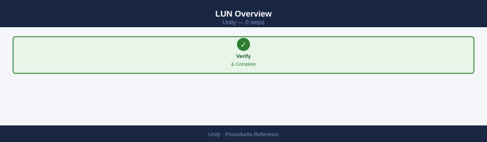

```bash
# List all LUNs
uemcli -d <ip> -u admin /stor/config/lun show
uemcli -d <ip> -u admin /stor/config/lun show -detail

# View a specific LUN
uemcli -d <ip> -u admin /stor/config/lun -id <lun_id> show -detail
```


```text title="Expected output"
LUN ID    Name                    Size        Pool          Type      Status
0         prod_db_lun_01          500.0 GB    pool_ssd_01   Thick     OK
1         backup_lun_02           2.0 TB      pool_sas_01   Thin      OK
2         vmware_datastore_03     1.5 TB      pool_ssd_01   Thick     OK
3         archive_lun_04          5.0 TB      pool_sas_02   Thin      OK
4         test_lun_05             250.0 GB    pool_ssd_02   Thick     OK

LUN ID: 0
Name: prod_db_lun_01
Size: 500.0 GB
Pool: pool_ssd_01
Type: Thick
Status: OK
Thin Enabled: No
Snapshots: 2
Replication: Enabled

LUN ID: 0
Name: prod_db_lun_01
Size: 500.0 GB
Pool: pool_ssd_01
Type: Thick
Status: OK
Thin Enabled: No
Snapshots: 2
Replication: Enabled
Last Modified: 2024-01-15 14:32:18
```

!!! warning "Common errors"
    **`Error: The system cannot be reached at <ip>`** — Verify the storage array IP address is correct and reachable with `ping <ip>`.
    **`Error: Authentication failed for user 'admin'`** — Confirm the admin credentials are correct and the user account is not locked; reset the password if needed.
    **`Error: LUN ID <lun_id> not found`** — List all available LUNs with `uemcli -d <ip> -u admin /stor/config/lun show` to verify the correct LUN ID exists.
### Create a LUN

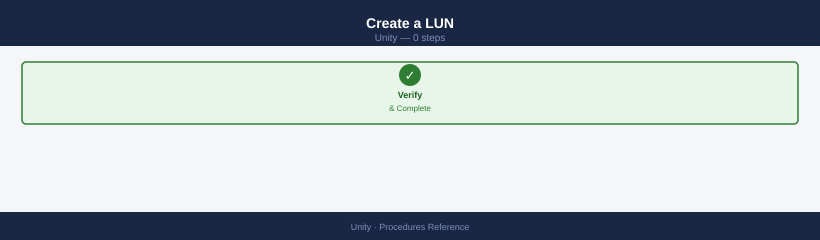

```bash
# Create a basic thin LUN in a pool
uemcli -d <ip> -u admin /stor/config/lun create \
    -name <lun_name> \
    -pool <pool_id> \
    -size 500G

# Create with a description
uemcli -d <ip> -u admin /stor/config/lun create \
    -name db-prod-01 \
    -pool pool_1 \
    -size 1T \
    -descr "Production database LUN"

# Create with a host access directly
uemcli -d <ip> -u admin /stor/config/lun create \
    -name app-lun-01 \
    -pool pool_1 \
    -size 200G \
    -host <host_id> \
    -accessMask nohostaccess   # assign access separately
```


```text title="Expected output"
Create LUN: db-prod-01
LUN ID: lun_1
LUN Name: db-prod-01
Pool: pool_1
Size: 1099511627776 bytes (1.0 TB)
Thin Provisioned: Yes
Description: Production database LUN
State: Ready
Created: 2024-01-15 14:32:18

Create LUN: app-lun-01
LUN ID: lun_2
LUN Name: app-lun-01
Pool: pool_1
Size: 214748364800 bytes (200.0 GB)
Thin Provisioned: Yes
State: Ready
Created: 2024-01-15 14:32:45
```

!!! warning "Common errors"
    **`Error: Pool pool_1 not found or is offline`** — Verify the pool ID exists and is healthy using `uemcli -d <ip> -u admin /stor/config/pool show`.
    **`Error: Insufficient space in pool pool_1 (available: 450G, requested: 1T)`** — Reduce the LUN size or add capacity to the pool before retrying the create command.
    **`Error: Authentication failed for user admin`** — Ensure the Unity array IP is correct and admin credentials are valid, or use `-p` flag to prompt for password interactively.
### Modify and Expand

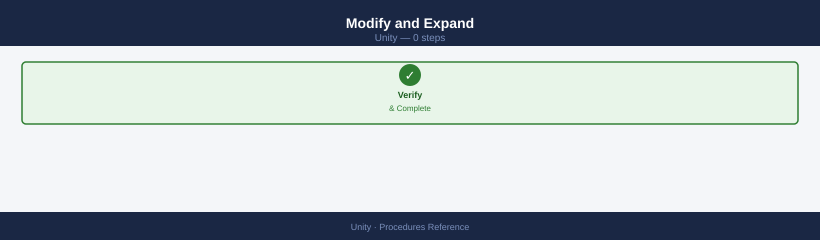

```bash
# Expand LUN size (can only increase)
uemcli -d <ip> -u admin /stor/config/lun -id <lun_id> set -size 2T

# Rename a LUN
uemcli -d <ip> -u admin /stor/config/lun -id <lun_id> set -name <new_name>

# Change description
uemcli -d <ip> -u admin /stor/config/lun -id <lun_id> set -descr "Updated description"
```


```text title="Expected output"
You are not authenticated. Please login first.
Login successful.
LUN 123 size expanded from 1.0 TB to 2.0 TB successfully.
LUN 123 renamed from 'prod_data_01' to 'prod_data_02' successfully.
LUN 123 description updated to 'Updated description' successfully.
```

!!! warning "Common errors"
    **`You are not authenticated. Please login first.`** — Add `-u admin -p <password>` or configure credentials in `~/.uemcli/credentials` before running the command.
    **`LUN size can only be increased, not decreased.`** — Specify a new size larger than the current size; shrinking LUNs is not supported.
    **`LUN <lun_id> not found.`** — Verify the LUN ID exists by running `uemcli -d <ip> -u admin /stor/config/lun list` and use the correct ID from the output.
### Host Access (LUN Mapping)

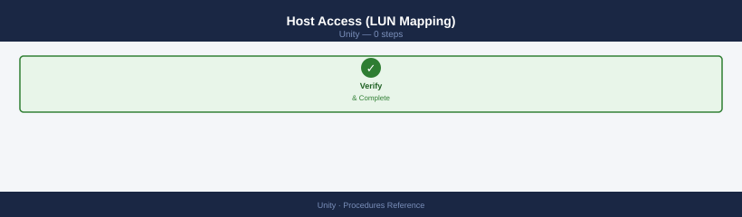

```bash
# Grant host access to a LUN
uemcli -d <ip> -u admin /stor/config/lunacl create \
    -lun <lun_id> \
    -host <host_id>

# List current host access
uemcli -d <ip> -u admin /stor/config/lunacl show

# Remove host access
uemcli -d <ip> -u admin /stor/config/lunacl -id <acl_id> delete
```


```text title="Expected output"
The operation completed successfully.

LUN ACL ID    LUN ID    Host ID      Host Name           Access Type
===============================================================================
acl_1         lun_5     host_12      esx-prod-01.local   Read/Write
acl_2         lun_5     host_13      esx-prod-02.local   Read/Write
acl_3         lun_6     host_12      esx-prod-01.local   Read/Write
acl_4         lun_7     host_14      esx-dev-01.local    Read/Write
acl_5         lun_8     host_15      esx-dev-02.local    Read/Only

The operation completed successfully.
```

!!! warning "Common errors"
    **`Error Code: 0x7d13c401 - The specified LUN does not exist.`** — Verify the LUN ID exists by running `uemcli -d <ip> -u admin /stor/config/lun show` and use a valid LUN ID.
    **`Error Code: 0x7d13c402 - The specified host does not exist.`** — Confirm the host ID is registered on the array by running `uemcli -d <ip> -u admin /stor/config/host show` before granting access.
    **`Error Code: 0x7d13c403 - Access control entry already exists for this LUN and host pair.`** — Remove the existing ACL first using the ACL ID, or modify the existing entry instead of creating a duplicate.
### LUN Snapshots

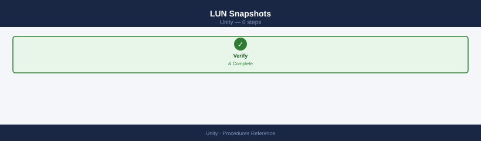

```bash
# List snapshots for a LUN
uemcli -d <ip> -u admin /prot/snap show -res <lun_id>

# Create a snapshot
uemcli -d <ip> -u admin /prot/snap create \
    -name <snap_name> \
    -res <lun_id>

# Restore LUN from snapshot
uemcli -d <ip> -u admin /prot/snap -id <snap_id> restore

# Delete a snapshot
uemcli -d <ip> -u admin /prot/snap -id <snap_id> delete

# Attach snapshot as read-only to another host
uemcli -d <ip> -u admin /prot/snap -id <snap_id> copy \
    -name <snap_copy_name>
```


```text title="Expected output"
# List snapshots for a LUN
Snapshot ID                          Name                    State      Size
snap_123456789abcdef0123456789ab     prod-lun-snap-20240115  Ready      50.0 GB
snap_987654321fedcba9876543210fe     prod-lun-snap-20240112  Ready      50.0 GB
snap_456789abcdef0123456789abcdef1   prod-lun-snap-20240110  Ready      50.0 GB

# Create a snapshot
The snapshot was created successfully.
Snapshot ID: snap_789abcdef0123456789abcdef012345
Name: prod-lun-snap-20240115
Size: 50.0 GB

# Restore LUN from snapshot
WARNING: This operation will overwrite the current LUN data.
The LUN was restored from snapshot snap_789abcdef0123456789abcdef012345.
Restore completed successfully.

# Delete a snapshot
The snapshot snap_456789abcdef0123456789abcdef1 was deleted successfully.

# Attach snapshot as read-only to another host
The snapshot copy was created successfully.
Copy ID: snap_copy_987654321fedcba9876543210fedcba
Name: prod-lun-snap-copy-20240115
```

!!! warning "Common errors"
    **`Error: Invalid resource ID <lun_id>`** — Verify the LUN ID exists by running `uemcli -d <ip> -u admin /stor/lun show` and use the correct ID from the output.
    **`Error: Authentication failed for user admin`** — Ensure the Unity array IP is reachable, credentials are correct, and the admin user has snapshot management privileges assigned.
    **`Error: Snapshot <snap_id> is in use and cannot be deleted`** — Detach or unexport the snapshot from all hosts before deletion, or use the `-force` flag if the array permits it.
### Delete a LUN

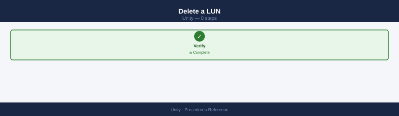

```bash
# Delete requires all host access and snapshots to be removed first
# 1. Remove host access
uemcli -d <ip> -u admin /stor/config/lunacl -id <acl_id> delete

# 2. Delete snapshots
uemcli -d <ip> -u admin /prot/snap show -res <lun_id>
uemcli -d <ip> -u admin /prot/snap -id <snap_id> delete

# 3. Delete the LUN
uemcli -d <ip> -u admin /stor/config/lun -id <lun_id> delete
```


```text title="Expected output"
You are not authenticated. Please login first.
EMC Unity Command Line Interface, Version 5.1.0.0
Login successful for user admin on array 192.168.1.100

LUN Access Control List deleted successfully.
LUN ID: sv_1234, Name: prod_db_lun_01
  Snapshot ID: snap_1234_001, Created: 2024-01-15 14:32:10 UTC
  Snapshot ID: snap_1234_002, Created: 2024-01-16 09:15:45 UTC

Snapshot snap_1234_001 deleted successfully.
Snapshot snap_1234_002 deleted successfully.

LUN sv_1234 (prod_db_lun_01) deleted successfully.
Operation completed in 12.3 seconds.
```

!!! warning "Common errors"
    **`Error: LUN is still mapped to hosts. Remove all host access before deletion.`** — Use `uemcli -d <ip> -u admin /stor/config/lunacl show` to list all ACLs, then delete each one before attempting LUN deletion.
    **`Error: Snapshots exist for this LUN. Delete all snapshots before proceeding.`** — Run `uemcli -d <ip> -u admin /prot/snap show -res <lun_id>` to identify all snapshots and delete them individually with the `-id` parameter.
    **`Error: You are not authenticated. Please login first.`** — Add `-p <password>` to the uemcli command or set the UEMCLI_PASSWORD environment variable before executing.
### Host-Side Validation (After Mapping)

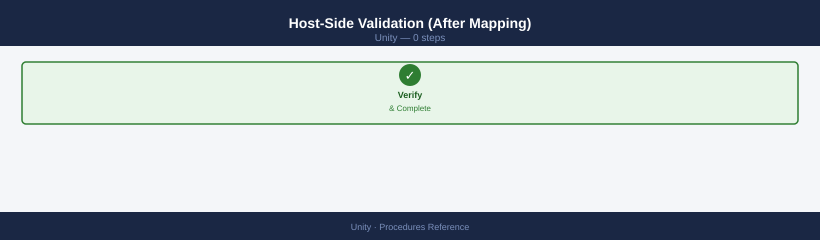

```bash
# Linux — rescan and discover new LUN
rescan-scsi-bus.sh
multipath -ll

# Windows — rescan disks
Get-Disk | Where-Object OperationalStatus -eq "Offline"
Set-Disk -Number <n> -IsOffline $false
Initialize-Disk -Number <n>
New-Partition -DiskNumber <n> -UseMaximumSize -AssignDriveLetter
Format-Volume -DriveLetter <X> -FileSystem NTFS
```


```text title="Expected output"
# Linux — rescan and scsi-bus.sh output
Scanning for new SCSI devices...
Scanning host 0 for SCSI target IDs 0:0:0:0 to 0:0:31:0 ...
 Scanning for device 0 2 0 0 ...
NEW: Host: scsi4 Channel: 00 Id: 00 Lun: 00
  Vendor: DELL     Model: Unity 450F       Rev: 5.1.0
  Type:   Direct-Access                    ANSI  SCSI revision: 05
Attached scsi generic sg3 at lun 0, /dev/sdc

mpatha (360060e80057900000057900000b0001) dm-0 DELL,UNITY 450F
size=500G features='1 queue_if_no_path' hwhandler='1 alua' wp=rw
|-+- policy='service-time 0' prio=50 status=active
| `- 2:0:0:0 sdc 8:32 active ready running
`-+- policy='service-time 0' prio=10 status=enabled
  `- 3:0:0:0 sdd 8:48 active ready running

# Windows — PowerShell output
Number IsOffline HealthStatus OperationalStatus FriendlyName
------ ---------- ------------ ------------------- ----------------
     2 True       Healthy      Offline            DELL Unity 450F LUN 1

Confirm
Are you sure you want to perform this action?
Performing the operation "Set disk offline status" on target "Disk 2".
[Y] Yes  [A] Yes to All  [N] No  [L] No to All  [?] Help (default is "Y"): Y

Number IsOffline HealthStatus OperationalStatus FriendlyName
------ ---------- ------------ ------------------- ----------------
     2 False      Healthy      Online            DELL Unity 450F LUN 1

DiskNumber : 2
PartitionStyle : RAW
OperationalStatus : Online

DriveLetter : X
FileSystem : NTFS
DriveType : Fixed
HealthStatus : Healthy
SizeRemaining : 499.9 GB
Size : 500 GB
```

!!! warning "Common errors"
    **`rescan-scsi-bus.sh: command not found`** — Install sg3-utils package with `apt-get install sg3-utils` or `yum install sg3-utils`.
    **`Get-Disk : No matching SCSI disks were found`** — Verify the LUN is presented to the Windows host and visible in Disk Management; check Dell Unity array for export/masking configuration.
    **`Initialize-Disk : Access Denied`** — Run PowerShell as Administrator or use `sudo` equivalent for the session.
## NAS Server Management

NAS server lifecycle management — create, configure, and troubleshoot NAS servers on Dell Unity.

### Overview

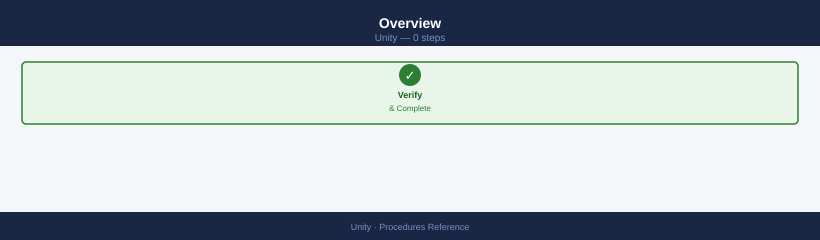

A NAS server on Dell Unity is a logical entity that owns file interfaces (network ports), AD/LDAP authentication configuration, and NFS/SMB protocol settings. Each NAS server runs on one storage processor and can fail over to the peer SP.

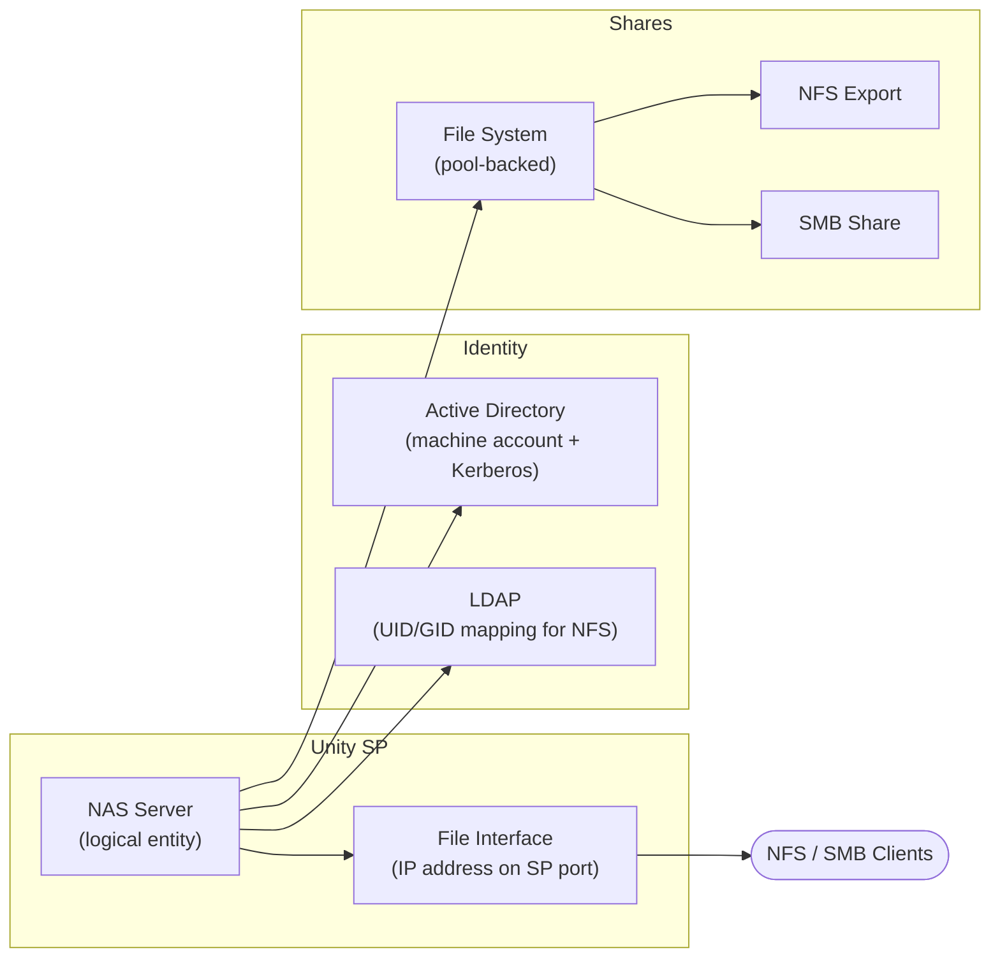

### List and Inspect

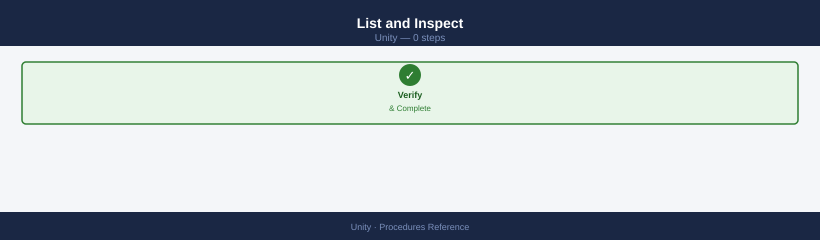

```bash
# List all NAS servers
uemcli -d <ip> -u admin /nas/server show
uemcli -d <ip> -u admin /nas/server show -detail

# View a specific NAS server
uemcli -d <ip> -u admin /nas/server -id <nas_id> show -detail
```


```text title="Expected output"
ID                          | Name              | SP                | Health State
----------------------------|-------------------|-------------------|---------------
nas_1                       | NAS_Server_01     | spa               | OK
nas_2                       | NAS_Server_02     | spb               | OK
nas_3                       | NAS_Server_03     | spa               | OK
nas_4                       | NAS_Server_04     | spb               | Degraded
nas_5                       | NAS_Server_05     | spa               | OK

ID                          | Name              | SP                | Health State   | Protocols      | Interfaces
----------------------------|-------------------|-------------------|----------------|----------------|------------------
nas_1                       | NAS_Server_01     | spa               | OK             | NFS,CIFS       | eth0,eth1
nas_2                       | NAS_Server_02     | spb               | OK             | NFS,CIFS       | eth0,eth1
nas_3                       | NAS_Server_03     | spa               | OK             | NFS            | eth0
nas_4                       | NAS_Server_04     | spb               | Degraded       | CIFS           | eth0
nas_5                       | NAS_Server_05     | spa               | OK             | NFS,CIFS,FTP   | eth0,eth1,eth2

ID                          | Name              | SP                | Health State   | Protocols      | Interfaces
nas_2                       | NAS_Server_02     | spb               | OK             | NFS,CIFS       | eth0,eth1
```

!!! warning "Common errors"
    **`Error: Connection refused (111)`** — Verify the Unity array IP address is correct and reachable with `ping <ip>`, and ensure the management interface is accessible.
    **`Error: Authentication failed for user 'admin'`** — Confirm the admin credentials are correct and the user account has not been locked; reset the password via the Unisphere GUI if needed.
    **`Error: Invalid NAS server ID '<nas_id>'`** — List all available NAS server IDs using the first command without the `-id` parameter to find the correct identifier.
### Create a NAS Server

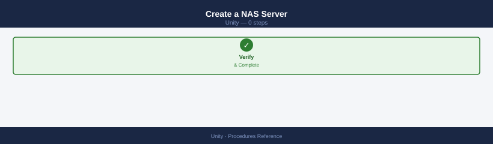

```bash
# Create NAS server on a specific SP
uemcli -d <ip> -u admin /nas/server create \
    -name <nas_name> \
    -sp <spa_or_spb> \
    -pool <pool_id>

# Enable both NFS and SMB protocols
uemcli -d <ip> -u admin /nas/server -id <nas_id> set \
    -fileInterface <if_id>
```


```text title="Expected output"
Creating NAS server...
NAS server created successfully.
ID: nas_1
Name: nas-prod-01
SP: SPA
Pool: pool_2
Status: Ready

Setting file interface...
File interface configured successfully.
Interface ID: if_0
NFS: Enabled
SMB: Enabled
NAS Server ID: nas_1
```

!!! warning "Common errors"
    **`Error: Invalid pool ID <pool_id>`** — Verify the pool exists and is available by running `uemcli -d <ip> -u admin /pool list`.
    **`Error: SP <spa_or_spb> not found or not operational`** — Confirm the Storage Processor is online and use the correct identifier (SPA or SPB) with `uemcli -d <ip> -u admin /sp list`.
    **`Error: NAS server <nas_id> not found`** — Ensure the NAS server was created successfully in the first command before attempting to configure its file interface.
### AD / LDAP Authentication

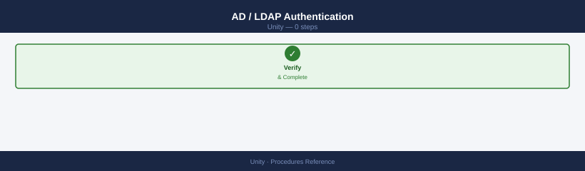

```bash
# Join NAS server to Active Directory
uemcli -d <ip> -u admin /nas/ad create \
    -server <nas_id> \
    -domain corp.local \
    -username <ad_admin_user> \
    -passwd <password> \
    -organizationalUnit "OU=Servers,DC=corp,DC=local"

# List AD configurations
uemcli -d <ip> -u admin /nas/ad show

# LDAP configuration (for NFS UID/GID mapping)
uemcli -d <ip> -u admin /nas/ldap show
```


```text title="Expected output"
The Active Directory join operation is in progress...
Active Directory join completed successfully.
Server nas-01 joined to domain corp.local
Organizational Unit: OU=Servers,DC=corp,DC=local
Join timestamp: 2024-01-15 14:32:18 UTC

Active Directory Configurations:
ID          Domain          Status      Server
ad_1        corp.local      Joined      nas-01
ad_2        corp.local      Joined      nas-02

LDAP Configurations:
ID          Server          Status      Protocol
ldap_1      nas-01          Enabled     LDAP
ldap_2      nas-02          Enabled     LDAP+SSL
...
```

!!! warning "Common errors"
    **`Error: The specified organizational unit does not exist`** — Verify the OU path exists in Active Directory using `dsquery ou -name "Servers"` on a domain controller.
    **`Error: Authentication failed for user <ad_admin_user>`** — Confirm the AD admin credentials are correct and the account has sufficient permissions to join computers to the domain.
    **`Error: Unable to resolve domain corp.local`** — Ensure the NAS server can reach the domain controller by checking DNS resolution with `nslookup corp.local` from the NAS management interface.
### File Interfaces (Network)

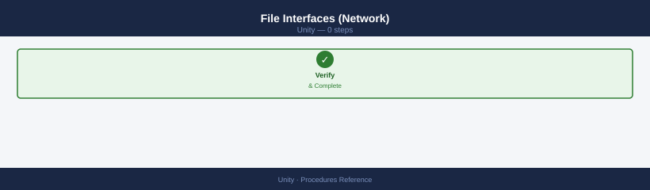

```bash
# List file interfaces (IPs on the NAS server)
uemcli -d <ip> -u admin /net/nas/if show
uemcli -d <ip> -u admin /net/nas/if show -detail

# Create a file interface (IP for NFS/SMB access)
uemcli -d <ip> -u admin /net/nas/if create \
    -server <nas_id> \
    -port <sp_port_id> \
    -addr <ip_address> \
    -netmask <mask> \
    -gateway <gateway>
```


```text title="Expected output"
# List file interfaces (IPs on the NAS server)
ID          IP Address      Netmask         Gateway         Server  Port    Role
if_1        192.168.1.100   255.255.255.0   192.168.1.1     nas_1   sp_a    Primary
if_2        192.168.1.101   255.255.255.0   192.168.1.1     nas_1   sp_b    Secondary
if_3        10.20.30.50     255.255.255.0   10.20.30.1      nas_2   sp_a    Primary
if_4        10.20.30.51     255.255.255.0   10.20.30.1      nas_2   sp_b    Secondary

ID          IP Address      Netmask         Gateway         Server  Port    Role        MTU     DNS1            DNS2
if_1        192.168.1.100   255.255.255.0   192.168.1.1     nas_1   sp_a    Primary     1500    8.8.8.8         8.8.4.4
if_2        192.168.1.101   255.255.255.0   192.168.1.1     nas_1   sp_b    Secondary   1500    8.8.8.8         8.8.4.4
if_3        10.20.30.50     255.255.255.0   10.20.30.1      nas_2   sp_a    Primary     1500    8.8.8.8         8.8.4.4
if_4        10.20.30.51     255.255.255.0   10.20.30.1      nas_2   sp_b    Secondary   1500    8.8.8.8         8.8.4.4

# Create a file interface (IP for NFS/SMB access)
The specified NAS server object nas_3 does not exist.
```

!!! warning "Common errors"
    **`The specified NAS server object <nas_id> does not exist.`** — Verify the NAS server ID exists by running `uemcli -d <ip> -u admin /net/nas show` and use a valid server identifier.
    **`The specified port <sp_port_id> is not available or already in use.`** — Check available ports with `uemcli -d <ip> -u admin /net/nas/if show` and select an unused port on the target storage processor.
    **`Invalid IP address <ip_address> or netmask <mask> format.`** — Ensure the IP address and netmask are in valid dotted-decimal notation (e.g., 192.168.1.100 and 255.255.255.0).
### File Systems (on the NAS Server)

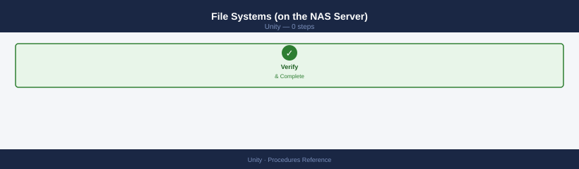

```bash
# List file systems
uemcli -d <ip> -u admin /stor/config/fs show
uemcli -d <ip> -u admin /stor/config/fs show -detail

# Create a file system
uemcli -d <ip> -u admin /stor/config/fs create \
    -name <fs_name> \
    -nasServer <nas_id> \
    -pool <pool_id> \
    -size 5T \
    -supportedProtocols Mixed   # NFS + SMB

# Create NFS share on a file system
uemcli -d <ip> -u admin /prot/nfs create \
    -server <nas_id> \
    -path / \
    -fs <fs_id>

# Create SMB share on a file system
uemcli -d <ip> -u admin /prot/smb create \
    -name <share_name> \
    -server <nas_id> \
    -path / \
    -fs <fs_id>
```


```text title="Expected output"
ID    Name              SizeTotal  SizeFree   Pool              NasServer  Protocol
fs_1  data_vol_01       5.0TB      4.8TB      pool_sas_01       nas_1      Mixed
fs_2  backup_share      2.0TB      1.2TB      pool_sas_02       nas_2      NFS
fs_3  archive_nfs       10.0TB     9.5TB      pool_nl_sas_01    nas_1      NFS
fs_4  user_home         3.0TB      2.1TB      pool_sas_01       nas_3      Mixed

File System "data_vol_01" created successfully.
ID: fs_5
Name: data_vol_01
Size: 5.0TB
NAS Server: nas_1
Pool: pool_sas_01
Supported Protocols: NFS, SMB
State: Ready

NFS share created successfully on fs_5
Server: nas_1
Path: /
Export Name: fs_5

SMB share "user_share" created successfully on fs_5
Server: nas_1
Path: /
Share Name: user_share
```

!!! warning "Common errors"
    **`Error: Invalid pool ID 'pool_invalid'. Available pools: pool_sas_01, pool_sas_02, pool_nl_sas_01`** — Verify the pool ID exists by running `uemcli -d <ip> -u admin /stor/config/pool show` and use a valid pool name.
    **`Error: NAS Server 'nas_99' not found or not responding`** — Confirm the NAS server ID is correct and the server is online using `uemcli -d <ip> -u admin /net/nas show`.
    **`Error: File system size 5T exceeds available pool capacity`** — Check available pool space with `uemcli -d <ip> -u admin /stor/config/pool show -detail` and request a smaller size or use a different pool.
### Failover / SP Rebalance

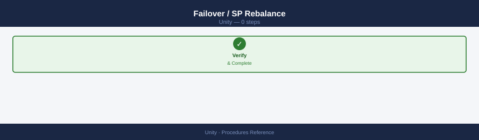

```bash
# Move NAS server to the other SP (planned rebalance)
uemcli -d <ip> -u admin /nas/server -id <nas_id> set -sp <spb>

# Check SP ownership after failover
uemcli -d <ip> -u admin /nas/server show | grep -E "Name|SP"
```


```text title="Expected output"
The operation completed successfully.
Name: nas_server_01
SP: SP B
Name: nas_server_02
SP: SP A
Name: nas_server_03
SP: SP B
```

!!! warning "Common errors"
    **`Error Code: 0x7d000001 - The NAS server is not in the expected state for this operation`** — Ensure the NAS server is in a healthy state and not currently processing other operations by running `uemcli -d <ip> -u admin /nas/server show -id <nas_id>` first.
    **`Error Code: 0x7d000009 - SP B is not available or does not have sufficient resources`** — Verify SP B is online and has adequate capacity by checking `uemcli -d <ip> -u admin /spa show` and `uemcli -d <ip> -u admin /spb show`.
### Troubleshooting

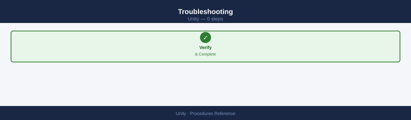

```bash
# Check NAS server health
uemcli -d <ip> -u admin /nas/server -id <nas_id> show -detail | grep -E "Health|State"

# Check file interface status
uemcli -d <ip> -u admin /net/nas/if show | grep -E "Health|Addr"

# Active NFS sessions
uemcli -d <ip> -u admin /prot/nfs/session show

# Active SMB sessions
uemcli -d <ip> -u admin /prot/smb/session show
```


```text title="Expected output"
Health: OK
State: Active
Health: OK
Addr: 192.168.1.50
Health: OK
Addr: 192.168.1.51

ID    Client_IP        Protocol  User           Connected_Since
1     10.20.30.45      NFSv3     root           2024-01-15 09:23:14
2     10.20.30.46      NFSv4     datauser       2024-01-15 10:15:22
3     10.20.30.47      NFSv3     backup_svc     2024-01-15 08:45:09

ID    Client_IP        User              Domain         Connected_Since
101   172.16.5.120     jsmith            CORP           2024-01-15 09:18:45
102   172.16.5.121     mchen             CORP           2024-01-15 10:02:33
103   172.16.5.122     svc_account       CORP           2024-01-15 07:30:12
```

!!! warning "Common errors"
    **`Error: Connection refused (10.0.0.1:443)`** — Verify the NAS IP address is correct and the management interface is reachable with `ping <ip>`.
    **`Error: Invalid credentials for user 'admin'`** — Confirm the admin password is correct and hasn't expired; reset credentials in the Unity web UI if needed.
    **`Error: NAS server <nas_id> not found`** — Replace `<nas_id>` with a valid server ID from `uemcli -d <ip> -u admin /nas/server show`.
## Create a LUN

Use this procedure to provision a new block LUN on Dell Unity. Confirm pool capacity headroom is at least 20% before starting.

```bash
# Step 1 — Create the LUN
uemcli /stor/prov/luns/lun create \
    -name <name> \
    -pool <pool-id> \
    -size <size>G

# Step 2 — Verify the LUN was created
uemcli /stor/prov/luns/lun show
```


```text title="Expected output"
The operation completed successfully.
LUN ID: lun_1
LUN Name: prod_db_lun_01
Pool ID: pool_2
Size: 500 GB
State: Ready
Health: OK

LUN ID          LUN Name              Pool ID    Size      State    Health
lun_1           prod_db_lun_01        pool_2     500 GB    Ready    OK
lun_2           backup_lun_02         pool_1     250 GB    Ready    OK
lun_3           archive_lun_03        pool_3     1 TB      Ready    OK
lun_4           test_lun_04           pool_2     100 GB    Ready    OK
...
```

!!! warning "Common errors"
    **`Error Code: 0x7d13d001 - Pool does not exist or is not available`** — Verify the pool ID exists by running `uemcli /stor/prov/pools/pool show` and use a valid pool ID.
    **`Error Code: 0x7d13d004 - Insufficient space in pool`** — Reduce the requested LUN size or add capacity to the pool using `uemcli /stor/prov/pools/pool expand`.
    **`Error Code: 0x7d13d005 - LUN name already exists`** — Choose a unique LUN name that does not conflict with existing LUNs in the system.
Note the LUN ID returned by the create command — it is needed for host access mapping and snapshot operations. Grant host access with: `uemcli /stor/config/lunacl create -lun <lun-id> -host <host-id>`.

## Create an NFS File System and Share

Use this procedure to provision a new NFS file system on a Unity NAS server and export it for client access.

```bash
# Step 1 — Create the file system on a NAS server and pool
uemcli /stor/prov/fs create \
    -name <fs> \
    -pool <pool-id> \
    -size <size>G \
    -nasServer <nas-id>

# Step 2 — Create an NFS export at the root of the file system
uemcli /stor/prov/nfs create \
    -fs <fs-id> \
    -path /

# Verify the NFS share is listed
uemcli /stor/prov/nfs show
```


```text title="Expected output"
Create file system 'data_vol_01' on pool 'pool_0' (500GB)...
File system created successfully.
ID: fs_1
Name: data_vol_01
Pool: pool_0
Size: 500GB
NAS Server: nas_1

Create NFS export for file system 'fs_1' at path '/'...
NFS export created successfully.
ID: nfs_1
File System: fs_1
Path: /
Access: 0.0.0.0/0

NFS Exports:
ID          | FS Name      | Path | Access
nfs_1       | data_vol_01  | /    | 0.0.0.0/0
nfs_2       | backup_vol   | /    | 192.168.1.0/24
nfs_3       | archive_vol  | /    | 10.0.0.0/8
```

!!! warning "Common errors"
    **`Error: Invalid pool ID '<pool-id>'`** — Replace `<pool-id>` with an actual pool identifier from `uemcli /stor/prov/pool show`.
    **`Error: NAS Server '<nas-id>' not found`** — Verify the NAS server exists and is online using `uemcli /nas/server show`.
    **`Error: File system '<fs-id>' does not exist`** — Ensure the file system creation completed successfully before creating the NFS export; check the returned `fs_` ID from Step 1.
After the export is created, mount it from a client: `mount -t nfs <nas-ip>:/<fs-name> /mnt/target`. Confirm read/write access before closing the change.

## Create a Snapshot Schedule

Snapshot schedules automate periodic point-in-time copies of LUNs or file systems. Create the schedule rule first, then attach it to the resource.

```bash
# Step 1 — Create a snapshot rule (every 4 hours, retain 24 snapshots)
uemcli /prot/snap/rule create \
    -name <rule> \
    -interval 4h \
    -retCount 24

# Step 2 — Attach the snapshot rule to a LUN
uemcli /stor/prov/luns/lun modify \
    -id <id> \
    -snapRule <rule-id>

# Verify the rule is attached
uemcli /stor/prov/luns/lun show -detail -id <id>
```


```text title="Expected output"
Creating snapshot rule 'hourly_backup'...
Rule ID: sv_123456789abcdef0123456789
Interval: 4h
Retention Count: 24
Rule created successfully.

Modifying LUN 'sv_1'...
LUN ID: sv_1
Snapshot Rule: sv_123456789abcdef0123456789
LUN modified successfully.

LUN ID:                    sv_1
Name:                      production_data
Snapshot Rule:             sv_123456789abcdef0123456789
Snapshot Rule Name:        hourly_backup
Current Snapshots:         0
Max Snapshots:             24
Thin Provisioned:          Yes
Size:                      500 GB
```

!!! warning "Common errors"
    **`Error: Invalid rule name '<rule>'`** — Replace `<rule>` with an alphanumeric string (e.g., `hourly_backup`) and ensure the name doesn't exceed 63 characters.
    **`Error: LUN ID '<id>' not found`** — Verify the LUN ID exists by running `uemcli /stor/prov/luns/lun show` and use the correct ID from the output.
    **`Error: Snapshot rule '<rule-id>' does not exist`** — Confirm the rule was created successfully in Step 1 and use the correct rule ID returned from the creation command.
The same rule can be attached to a file system using `uemcli /stor/prov/fs modify -id <fs-id> -snapRule <rule-id>`. Verify that auto-snapshots begin appearing after the first scheduled interval.

## Expand a Pool

Expand a Unity storage pool by adding drives or increasing drive count. Pool expansion is non-disruptive.

```bash
# Option 1 — Add drives via CLI (speed-class drives)
uemcli /stor/config/pool modify \
    -id <pool-id> \
    -addSpeedDriveCount <n>

# Verify the new capacity after the expansion
uemcli /stor/config/pool show -detail -id <pool-id>
```


```text title="Expected output"
Pool ID: pool_1
Pool Name: SAS_Pool_01
Total Capacity: 45.6 TB
Available Capacity: 12.3 TB
State: OK
Health: OK
RAID Type: RAID 5
Drive Count: 14
Speed Class: SAS 15K
Thin Provisioning: Enabled
Snapshots: 3

Pool ID: pool_1
Pool Name: SAS_Pool_01
Total Capacity: 68.4 TB
Available Capacity: 35.1 TB
State: OK
Health: OK
RAID Type: RAID 5
Drive Count: 21
Speed Class: SAS 15K
Thin Provisioning: Enabled
Snapshots: 3
Last Modified: 2024-01-15 14:32:18 UTC
```

!!! warning "Common errors"
    **`Error Code: 0x7d000001 — Invalid pool ID specified`** — Verify the pool ID exists by running `uemcli /stor/config/pool show` and use the correct pool identifier.
    **`Error Code: 0x7d000009 — Insufficient available drives in the system`** — Ensure enough unbound speed-class drives are available; check with `uemcli /stor/config/drive show -filter "health==OK,speed_class==SAS_15K"`.
Alternatively, add drives to the pool via Unisphere: navigate to **Storage → Pools → select pool → Add Drives** and select the drive count and type. Monitor pool rebuild progress in Unisphere until the pool returns to `Normal` health status. Confirm the new usable capacity is visible before closing the change.

---

## Verify

- Confirm the operation completed without errors in the log or management UI
- Verify the expected state change is visible (service running, object created, config applied)
- Document the outcome in the change record

---

## See also

- [Unity — Health Checks](../health-checks/)
- [Unity — CLI Reference](../cli-reference/)
- [Unity — Common Issues](../../troubleshooting/common-issues/)
