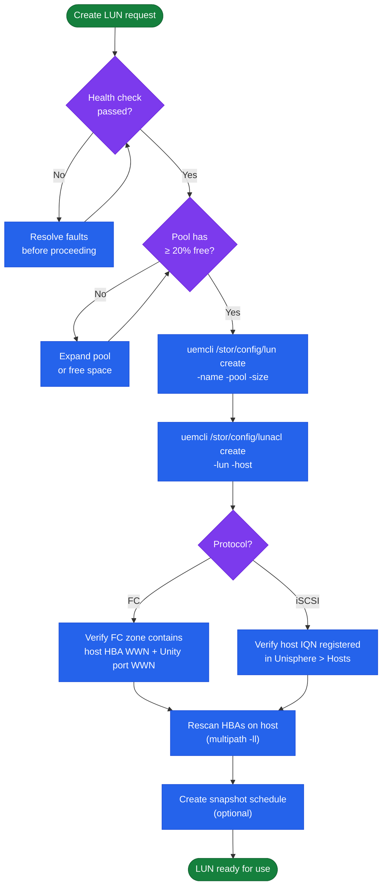
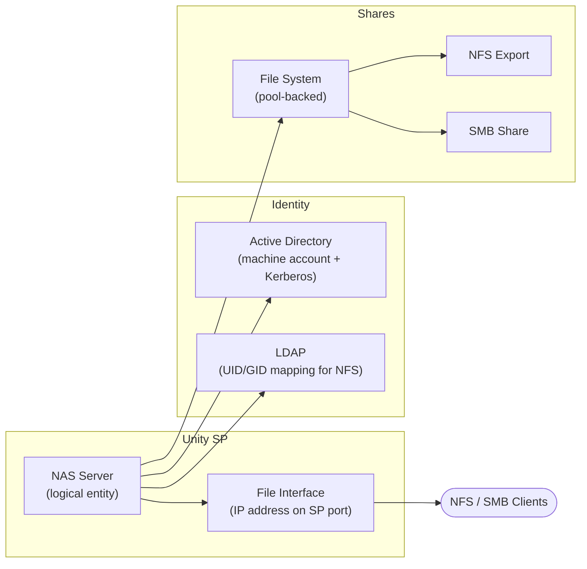

# Unity — Procedures


<div class="kb-summary">
Procedures reference covering Change Readiness, Maintenance Window, Post-Change Validation, LUN Management, NAS Server Management.
</div>
```text
┌─────────────────────────────── Dell Unity XT — Operational Procedures ────────────────────────────────┐
│                                                                                                       │
│   ┌───────────────────────────────────────────────────────────────────────────────────────────────┐   │
│   │            Unity XT operational procedures: standard tasks for day-2 administration           │   │
│   │           Covers: provisioning, expansion, maintenance, DR testing, and decommission          │   │
│   │           Pre/post checks required for all maintenance activities affecting storage           │   │
│   │            All procedures require approved change management tickets in production            │   │
│   └───────────────────────────────────────────────────────────────────────────────────────────────┘   │
│                                                                                                       │
│    Open change → pre-check → execute → verify → post-check → close                                    │
│                                                                                                       │
│                  ▼                                ▼                                ▼                  │
│                                                                                                       │
│   ┌─────────────────────────────┐  ┌─────────────────────────────┐  ┌─────────────────────────────┐   │
│   │            Layer            │  │          Component          │  │            Notes            │   │
│   │             Ctrl            │  │         SP-A + SP-B         │  │        Cache mirrored       │   │
│   │             Pool            │  │       Dynamic FAST VP       │  │         Auto-tiering        │   │
│   │          NAS server         │  │        File protocols       │  │          Per-tenant         │   │
│   │           Snapshot          │  │        Writable snaps       │  │        Thin PiT copy        │   │
│   │         Replication         │  │         Async/Metro         │  │       Native or RP4VM       │   │
│   └─────────────────────────────┘  └─────────────────────────────┘  └─────────────────────────────┘   │
│                                                                                                       │
│                          ▼                                                 ▼                          │
│                                                                                                       │
│   ┌───────────────────────────────────────────────────────────────────────────────────────────────┐   │
│   │    Procedure     │    Pre-check     │       Steps       │      Verify      │    Post-check    │   │
│   │    Provision     │  Capacity free?  │   Create volume   │   Host access    │   Monitor I/O    │   │
│   │      Expand      │   Pool space?    │    Grow volume    │    FS resize     │   Verify size    │   │
│   │     Snapshot     │   Policy set?    │   Take snapshot   │   Snap listed    │   Consistency    │   │
│   │     Failover     │  Repl. in sync?  │    Break repl.    │    App online    │    Verify RTO    │   │
│   └───────────────────────────────────────────────────────────────────────────────────────────────┘   │
│                                                                                                       │
│    Physical: Unity XT 380F/480F/680F/880F · dual SPs · DPE/DAE expansion · 10/25 GbE                  │
│                                                                                                       │
│    Key terms:                                                                                         │
│                                                                                                       │
│    Unity XT           = Dell unified mid-range array; block LUNs, file NAS, and VMware vVols          │
│    Unisphere          = HTML5 GUI and REST API for Unity XT management; SP-hosted management portal   │
│    UEMCLI             = CLI for Unity XT; uemcli -d <ip> -u admin -p <pw> /show commands              │
│    Storage pool       = collection of drives forming a usable pool; FAST VP tiers data automatically  │
│    FAST VP            = Fully Automated Storage Tiering VP; moves hot and cold data between tiers     │
│    NAS server         = virtual file server on Unity; each has its own IP, DNS, and CIFS/NFS shares   │
│    Data Mover         = older EMC term for NAS server; used in VNX and early Unity documentation      │
│    SP-A / SP-B        = storage processors; active-active HA pair with mirrored cache                 │
│    Snapshot           = space-efficient PiT copy of LUN or FS; writable snapshots supported           │
│    RecoverPoint       = RP4VM; journal-based continuous data protection for Unity volumes             │
│    Metro              = synchronous replication between two Unity XT sites; active-active zero RPO    │
│    vVols              = Virtual Volumes; VASA provider exposes per-VM storage objects to vCenter      │
│                                                                                                       │
└───────────────────────────────────────────────────────────────────────────────────────────────────────┘
```


## Change Readiness

Verify these items before performing any change on the Unity array — pool expansions, LUN provisioning, replication configuration changes, or firmware upgrades.

- [ ] `uemcli /env/health show -filter "health.value ne OK"` returns no output — no pre-existing faults before the change
- [ ] Both SPs are Active: `uemcli /env/sp show` — do not proceed with a firmware upgrade or disruptive change with only one SP active
- [ ] Pool capacity headroom confirmed: `uemcli /stor/pool show -detail` — ensure the pool targeted by the change has at least 20% free capacity
- [ ] Replication session state confirmed: `uemcli /rep/session show` — note the current state for all sessions; confirm no session is in a degraded state before starting
- [ ] Snapshot reserve checked: `uemcli /stor/snap show` — confirm snapshot consumption is not crowding pool capacity
- [ ] No active alerts that relate to the component being changed: `uemcli /sys/alert show`
- [ ] Notify host owners if the change involves a LUN or NAS server they use; coordinate I/O quiesce if needed
- [ ] Confirm the Unisphere System Health Check has been run: `uemcli /sys/general healthcheck`

| Item | Status | Notes |
|---|---|---|
| No pre-existing health faults | | |
| SP A and SP B both Active | | |
| Pool capacity headroom ≥ 20% | | |
| Replication sessions Active | | |
| No unacknowledged critical alerts | | |

## Maintenance Window

Steps for planned maintenance on a Unity array — firmware upgrades, pool expansions, or SP-level work.

1. Notify host and application owners; confirm the maintenance window and any required I/O quiesce
2. Run `uemcli /env/health show -filter "health.value ne OK"` to confirm no pre-existing faults; resolve all faults before starting
3. Confirm both SP A and SP B are in Active state via `uemcli /env/sp show` — a firmware upgrade will restart each SP sequentially and requires both to be healthy
4. Create a pre-maintenance snapshot of critical LUNs or file systems: `uemcli /stor/snap create -storRes <resource_id> -name maint-pre-$(date +%Y%m%d)`
5. Note current replication session states with `uemcli /rep/session show` — be prepared to resume sessions after the maintenance if they are paused
6. Perform the change per the approved runbook; for firmware upgrades, Unisphere upgrades SP B first then SP A — monitor progress and do not interrupt the process
7. After the change, run `uemcli /env/health show`, `uemcli /env/sp show`, and `uemcli /stor/pool show -detail` to confirm the array is healthy
8. Confirm replication sessions return to `Active` state; resume any sessions that remain paused: `uemcli /rep/session -id <id> resume`

## Post-Change Validation

Run these checks after any change to confirm the Unity is healthy and host connectivity is restored.

- [ ] `uemcli /env/health show -filter "health.value ne OK"` returns no output — no new faults introduced
- [ ] `uemcli /env/sp show` — both SP A and SP B are back to `Active` state after any SP-level maintenance
- [ ] `uemcli /stor/pool show -detail` — all pools healthy; capacity consumption within expected range
- [ ] `uemcli /rep/session show` — all replication sessions back to `Active`; note any sessions that need manual resumption
- [ ] `uemcli /sys/sw show` — confirms the new software version is installed (if this was a firmware upgrade)
- [ ] Host connectivity verified: iSCSI or FC LUNs accessible from representative hosts; NFS mounts responding
- [ ] Application owners confirm their applications are running normally
- [ ] Pre-change snapshot retained until the post-change validation period has passed (minimum 24 hours)

## LUN Management

LUN lifecycle management on Dell Unity — create, map, expand, and manage snapshots.



### LUN Overview

```bash
# List all LUNs
uemcli -d <ip> -u admin /stor/config/lun show
uemcli -d <ip> -u admin /stor/config/lun show -detail

# View a specific LUN
uemcli -d <ip> -u admin /stor/config/lun -id <lun_id> show -detail
```

### Create a LUN

```bash
# Create a basic thin LUN in a pool
uemcli -d <ip> -u admin /stor/config/lun create \
    -name <lun_name> \
    -pool <pool_id> \
    -size 500G

# Create with a description
uemcli -d <ip> -u admin /stor/config/lun create \
    -name db-prod-01 \
    -pool pool_1 \
    -size 1T \
    -descr "Production database LUN"

# Create with a host access directly
uemcli -d <ip> -u admin /stor/config/lun create \
    -name app-lun-01 \
    -pool pool_1 \
    -size 200G \
    -host <host_id> \
    -accessMask nohostaccess   # assign access separately
```

### Modify and Expand

```bash
# Expand LUN size (can only increase)
uemcli -d <ip> -u admin /stor/config/lun -id <lun_id> set -size 2T

# Rename a LUN
uemcli -d <ip> -u admin /stor/config/lun -id <lun_id> set -name <new_name>

# Change description
uemcli -d <ip> -u admin /stor/config/lun -id <lun_id> set -descr "Updated description"
```

### Host Access (LUN Mapping)

```bash
# Grant host access to a LUN
uemcli -d <ip> -u admin /stor/config/lunacl create \
    -lun <lun_id> \
    -host <host_id>

# List current host access
uemcli -d <ip> -u admin /stor/config/lunacl show

# Remove host access
uemcli -d <ip> -u admin /stor/config/lunacl -id <acl_id> delete
```

### LUN Snapshots

```bash
# List snapshots for a LUN
uemcli -d <ip> -u admin /prot/snap show -res <lun_id>

# Create a snapshot
uemcli -d <ip> -u admin /prot/snap create \
    -name <snap_name> \
    -res <lun_id>

# Restore LUN from snapshot
uemcli -d <ip> -u admin /prot/snap -id <snap_id> restore

# Delete a snapshot
uemcli -d <ip> -u admin /prot/snap -id <snap_id> delete

# Attach snapshot as read-only to another host
uemcli -d <ip> -u admin /prot/snap -id <snap_id> copy \
    -name <snap_copy_name>
```

### Delete a LUN

```bash
# Delete requires all host access and snapshots to be removed first
# 1. Remove host access
uemcli -d <ip> -u admin /stor/config/lunacl -id <acl_id> delete

# 2. Delete snapshots
uemcli -d <ip> -u admin /prot/snap show -res <lun_id>
uemcli -d <ip> -u admin /prot/snap -id <snap_id> delete

# 3. Delete the LUN
uemcli -d <ip> -u admin /stor/config/lun -id <lun_id> delete
```

### Host-Side Validation (After Mapping)

```bash
# Linux — rescan and discover new LUN
rescan-scsi-bus.sh
multipath -ll

# Windows — rescan disks
Get-Disk | Where-Object OperationalStatus -eq "Offline"
Set-Disk -Number <n> -IsOffline $false
Initialize-Disk -Number <n>
New-Partition -DiskNumber <n> -UseMaximumSize -AssignDriveLetter
Format-Volume -DriveLetter <X> -FileSystem NTFS
```

## NAS Server Management

NAS server lifecycle management — create, configure, and troubleshoot NAS servers on Dell Unity.

### Overview

A NAS server on Dell Unity is a logical entity that owns file interfaces (network ports), AD/LDAP authentication configuration, and NFS/SMB protocol settings. Each NAS server runs on one storage processor and can fail over to the peer SP.



### List and Inspect

```bash
# List all NAS servers
uemcli -d <ip> -u admin /nas/server show
uemcli -d <ip> -u admin /nas/server show -detail

# View a specific NAS server
uemcli -d <ip> -u admin /nas/server -id <nas_id> show -detail
```

### Create a NAS Server

```bash
# Create NAS server on a specific SP
uemcli -d <ip> -u admin /nas/server create \
    -name <nas_name> \
    -sp <spa_or_spb> \
    -pool <pool_id>

# Enable both NFS and SMB protocols
uemcli -d <ip> -u admin /nas/server -id <nas_id> set \
    -fileInterface <if_id>
```

### AD / LDAP Authentication

```bash
# Join NAS server to Active Directory
uemcli -d <ip> -u admin /nas/ad create \
    -server <nas_id> \
    -domain corp.local \
    -username <ad_admin_user> \
    -passwd <password> \
    -organizationalUnit "OU=Servers,DC=corp,DC=local"

# List AD configurations
uemcli -d <ip> -u admin /nas/ad show

# LDAP configuration (for NFS UID/GID mapping)
uemcli -d <ip> -u admin /nas/ldap show
```

### File Interfaces (Network)

```bash
# List file interfaces (IPs on the NAS server)
uemcli -d <ip> -u admin /net/nas/if show
uemcli -d <ip> -u admin /net/nas/if show -detail

# Create a file interface (IP for NFS/SMB access)
uemcli -d <ip> -u admin /net/nas/if create \
    -server <nas_id> \
    -port <sp_port_id> \
    -addr <ip_address> \
    -netmask <mask> \
    -gateway <gateway>
```

### File Systems (on the NAS Server)

```bash
# List file systems
uemcli -d <ip> -u admin /stor/config/fs show
uemcli -d <ip> -u admin /stor/config/fs show -detail

# Create a file system
uemcli -d <ip> -u admin /stor/config/fs create \
    -name <fs_name> \
    -nasServer <nas_id> \
    -pool <pool_id> \
    -size 5T \
    -supportedProtocols Mixed   # NFS + SMB

# Create NFS share on a file system
uemcli -d <ip> -u admin /prot/nfs create \
    -server <nas_id> \
    -path / \
    -fs <fs_id>

# Create SMB share on a file system
uemcli -d <ip> -u admin /prot/smb create \
    -name <share_name> \
    -server <nas_id> \
    -path / \
    -fs <fs_id>
```

### Failover / SP Rebalance

```bash
# Move NAS server to the other SP (planned rebalance)
uemcli -d <ip> -u admin /nas/server -id <nas_id> set -sp <spb>

# Check SP ownership after failover
uemcli -d <ip> -u admin /nas/server show | grep -E "Name|SP"
```

### Troubleshooting

```bash
# Check NAS server health
uemcli -d <ip> -u admin /nas/server -id <nas_id> show -detail | grep -E "Health|State"

# Check file interface status
uemcli -d <ip> -u admin /net/nas/if show | grep -E "Health|Addr"

# Active NFS sessions
uemcli -d <ip> -u admin /prot/nfs/session show

# Active SMB sessions
uemcli -d <ip> -u admin /prot/smb/session show
```
