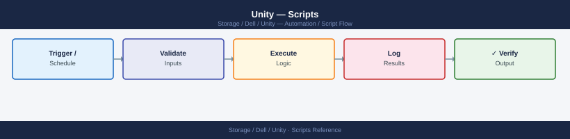

---
tags:
  - dell
  - operations
---
# Unity — Scripts


<div class="kb-summary">
Dell Unity automation scripts: PowerShell Toolkit cmdlets for snapshot management, host registration, LUN provisioning, and health status polling.

*Applies to: Unity XT*
</div>



---
## Before you begin

- **Access:** Storage admin credentials (cluster admin or equivalent)
- **Timing:** safe to run during business hours unless a step is marked ⚠ (causes interruption)
- **Dependencies:** no active upgrades or migrations on the same infrastructure
- **Logging:** capture command output — paste into the change record on completion

---

## System Health Check

Uses `uemcli` to run a comprehensive health check against a Dell Unity array: component health, pool capacity, LUN status, active alerts, and storage processor state. Exits non-zero if any component is in a non-OK health state.

```bash
#!/bin/bash
# unity_health_check.sh — Dell Unity system health check via uemcli
# Usage: UNITY_HOST=unity01.example.com UNITY_USER=admin UNITY_PASS=secret ./unity_health_check.sh

set -euo pipefail

UNITY_HOST="${UNITY_HOST:-}"
UNITY_USER="${UNITY_USER:-admin}"
UNITY_PASS="${UNITY_PASS:-}"

if [[ -z "$UNITY_HOST" || -z "$UNITY_PASS" ]]; then
  echo "ERROR: UNITY_HOST and UNITY_PASS must be set." >&2
  exit 1
fi

UEMCLI="uemcli -d ${UNITY_HOST} -u ${UNITY_USER} -p ${UNITY_PASS}"
ISSUES=0

section() {
  echo ""
  echo "========================================"
  echo "  $1"
  echo "========================================"
}

echo ""
echo "########################################"
echo "  Dell Unity Health Check"
echo "  Host : $UNITY_HOST"
echo "  Date : $(date '+%Y-%m-%d %H:%M:%S')"
echo "########################################"

# --- Component health ---
section "COMPONENT HEALTH (non-OK only)"
HEALTH_OUT=$($UEMCLI /env/health show -filter "health.value ne OK" 2>&1 || true)
if echo "$HEALTH_OUT" | grep -qi "No entries"; then
  echo "  All components healthy."
else
  echo "$HEALTH_OUT"
  # Count degraded components
  DEGRADED=$(echo "$HEALTH_OUT" | grep -c "health.value" || true)
  ISSUES=$((ISSUES + DEGRADED))
fi

# --- Storage pool capacity ---
section "STORAGE POOL CAPACITY"
$UEMCLI /stor/pool show -detail 2>&1 || { echo "  ERROR: could not query pools."; ISSUES=$((ISSUES + 1)); }

# --- LUN overview ---
section "LUN OVERVIEW"
$UEMCLI /store/lun show 2>&1 || { echo "  ERROR: could not query LUNs."; ISSUES=$((ISSUES + 1)); }

# --- Active alerts ---
section "ACTIVE ALERTS"
ALERT_OUT=$($UEMCLI /sys/alert show 2>&1 || true)
echo "$ALERT_OUT"
ALERT_COUNT=$(echo "$ALERT_OUT" | grep -c "^[[:space:]]*[0-9]" || true)
if [[ "$ALERT_COUNT" -gt 0 ]]; then
  ISSUES=$((ISSUES + 1))
fi

# --- Storage processor status ---
section "STORAGE PROCESSOR STATUS"
$UEMCLI /env/sp show 2>&1 || { echo "  ERROR: could not query SPs."; ISSUES=$((ISSUES + 1)); }

echo ""
echo "========================================"
echo "  SUMMARY"
echo "========================================"
if [[ "$ISSUES" -gt 0 ]]; then
  echo "STATUS: DEGRADED — $ISSUES issue category/categories found. Review sections above."
  exit 1
else
  echo "STATUS: OK — All health checks passed."
  exit 0
fi
```

### How to run this script — step by step

**Before you start — what you need**
- A Linux or macOS system with Bash
- Dell `uemcli` (Unity EMC CLI) installed and in your PATH — download it from the Unity management portal under **Settings → Downloads**
- The management IP or hostname of your Dell Unity array
- A Unity admin username and password

**Step 1 — Save the file**

1. Copy the code block above into a text editor
2. Save it as `unity_health_check.sh`
3. Make it executable: `chmod +x unity_health_check.sh`

**Step 2 — Fill in your details**

Set these as environment variables before running:

| What to change | Where to find it |
|---|---|
| `UNITY_HOST` | Management IP or hostname of your Unity array (shown on the LCD panel or in Unisphere) |
| `UNITY_USER` | Unity login username (default is `admin`) |
| `UNITY_PASS` | Unity login password |

**Step 3 — Open a terminal**

On Linux/macOS, open a terminal. On Windows, use Git Bash or WSL.

**Step 4 — Run it**

```bash
cd /path/to/script
UNITY_HOST=192.168.1.10 UNITY_USER=admin UNITY_PASS=secret ./unity_health_check.sh
```

**What you should see**

Five labelled sections in your terminal: component health (lists any non-OK components, or confirms all healthy), pool capacity details, LUN list, active alerts, and storage processor status. The final SUMMARY line shows STATUS: OK or STATUS: DEGRADED with a count of problem categories. The script exits 0 on success or 1 if issues were found.

---

## Storage Processor Monitor

Uses `uemcli` to check the health state of SP A and SP B and to enumerate all network interfaces. Alerts in PASS/WARNING/CRITICAL format if either SP is Faulted or if any interface is down.

```perl
#!/usr/bin/env perl
# unity_sp_monitor.pl — Storage processor health monitor for Dell Unity
# Usage: UNITY_HOST=unity01.example.com UNITY_USER=admin UNITY_PASS=secret ./unity_sp_monitor.pl

use strict;
use warnings;

my $host = $ENV{UNITY_HOST} or die "ERROR: UNITY_HOST not set\n";
my $user = $ENV{UNITY_USER} || 'admin';
my $pass = $ENV{UNITY_PASS} or die "ERROR: UNITY_PASS not set\n";

my $uemcli = "uemcli -d $host -u $user -p $pass";
my $worst  = 0;  # 0=OK 1=WARN 2=CRIT

sub run {
    my ($args) = @_;
    my $out = qx{$uemcli $args 2>&1};
    return $out;
}

# --- SP health check ---
print "\n--- Storage Processor Health ---\n";
my $sp_out = run("/env/sp show");
print $sp_out;

# Parse SP state — look for lines containing "Faulted" or unexpected states
for my $line (split /\n/, $sp_out) {
    if ($line =~ /\bFault(?:ed)?\b/i) {
        print ">>> CRITICAL: SP fault detected: $line\n";
        $worst = 2 if $worst < 2;
    } elsif ($line =~ /\b(Service Mode|Unknown)\b/i) {
        print ">>> WARNING: SP in unusual state: $line\n";
        $worst = 1 if $worst < 1;
    }
}

# --- Network interface check ---
print "\n--- Network Interfaces ---\n";
my $net_out = run("/net/if show");
print $net_out;

my $down_if = 0;
for my $line (split /\n/, $net_out) {
    if ($line =~ /\b(Down|Disabled)\b/i) {
        print ">>> WARNING: Interface in down/disabled state: $line\n";
        $worst = 1 if $worst < 1;
        $down_if++;
    }
}

# --- Summary ---
print "\n" . "=" x 50 . "\n";
if ($worst == 2) {
    print "  STATUS: CRITICAL — One or more SPs are faulted.\n";
} elsif ($worst == 1) {
    print "  STATUS: WARNING — SP or interface issue detected.\n";
} else {
    print "  STATUS: PASS — Both SPs healthy, all interfaces up.\n";
}
print "=" x 50 . "\n";

exit($worst == 2 ? 2 : ($worst == 1 ? 1 : 0));
```

### How to run this script — step by step

**Before you start — what you need**
- A Linux or macOS system with Perl installed (pre-installed on most Linux distros and macOS)
- Dell `uemcli` installed and in your PATH
- The management IP or hostname of your Dell Unity array
- A Unity admin username and password

**Step 1 — Save the file**

1. Copy the code block above into a text editor
2. Save it as `unity_sp_monitor.pl`

**Step 2 — Fill in your details**

Set these environment variables before running:

| What to change | Where to find it |
|---|---|
| `UNITY_HOST` | Management IP or hostname of your Unity array |
| `UNITY_USER` | Unity login username (default `admin`) |
| `UNITY_PASS` | Unity login password |

**Step 3 — Open a terminal**

On Linux/macOS, open a terminal. On Windows, install Git for Windows and use Git Bash, or use WSL.

**Step 4 — Run it**

```bash
cd /path/to/script
UNITY_HOST=192.168.1.10 UNITY_USER=admin UNITY_PASS=secret perl unity_sp_monitor.pl
```

**What you should see**

Two sections: the storage processor health output (SP A and SP B with their current health states) and the network interface list. Any faulted SP will print a CRITICAL line; any down interface will print a WARNING line. The final STATUS line shows PASS, WARNING, or CRITICAL. The script exits with code 0, 1, or 2.

---

## Replication Session Check

Runs `uemcli /rep/session show -detail` and parses each replication session for its state. Prints a formatted table of session name, source, destination, state, and last sync time. Exits non-zero if any session is in an Error state.

```bash
#!/bin/bash
# unity_repl_check.sh — Replication session health check for Dell Unity
# Usage: UNITY_HOST=unity01.example.com UNITY_USER=admin UNITY_PASS=secret ./unity_repl_check.sh

set -euo pipefail

UNITY_HOST="${UNITY_HOST:-}"
UNITY_USER="${UNITY_USER:-admin}"
UNITY_PASS="${UNITY_PASS:-}"

if [[ -z "$UNITY_HOST" || -z "$UNITY_PASS" ]]; then
  echo "ERROR: UNITY_HOST and UNITY_PASS must be set." >&2
  exit 1
fi

UEMCLI="uemcli -d ${UNITY_HOST} -u ${UNITY_USER} -p ${UNITY_PASS}"

echo ""
echo "========================================"
echo "  Unity Replication Session Check"
echo "  Host : $UNITY_HOST"
echo "  $(date '+%Y-%m-%d %H:%M:%S')"
echo "========================================"

# Fetch all replication sessions in detail
SESSIONS=$($UEMCLI /rep/session show -detail 2>&1)

echo ""
echo "--- Raw Session Output ---"
echo "$SESSIONS"
echo ""
echo "--- Session Summary Table ---"
printf "%-25s  %-20s  %-20s  %-10s  %s\n" \
  "SESSION" "SOURCE" "DESTINATION" "STATE" "LAST-SYNC"
printf "%s\n" "----------------------------------------------------------------------"

ERRORS=0
current_name="" current_src="" current_dst="" current_state="" current_sync=""

flush_row() {
  [[ -z "$current_name" ]] && return
  local marker=""
  if [[ "${current_state,,}" == "error" || "${current_state,,}" == "faulted" ]]; then
    marker="  <<< ERROR"
    ERRORS=$((ERRORS + 1))
  fi
  printf "%-25s  %-20s  %-20s  %-10s  %s%s\n" \
    "$current_name" "$current_src" "$current_dst" "$current_state" "$current_sync" "$marker"
}

while IFS= read -r line; do
  # New session block starts with "ID = ..." or "Name = ..."
  if [[ "$line" =~ ^[[:space:]]*ID[[:space:]]*=[[:space:]]*(.*) ]]; then
    flush_row
    current_name="${BASH_REMATCH[1]}"
    current_src="" current_dst="" current_state="" current_sync=""
  elif [[ "$line" =~ [Ss]ource[[:space:]]*Resource.*=[[:space:]]*(.*) ]]; then
    current_src="${BASH_REMATCH[1]}"
  elif [[ "$line" =~ [Dd]estination[[:space:]]*Resource.*=[[:space:]]*(.*) ]]; then
    current_dst="${BASH_REMATCH[1]}"
  elif [[ "$line" =~ [Ss]tate[[:space:]]*=[[:space:]]*(.*) ]]; then
    current_state="${BASH_REMATCH[1]}"
  elif [[ "$line" =~ [Ll]ast[[:space:]][Ss]ync[[:space:]]Time.*=[[:space:]]*(.*) ]]; then
    current_sync="${BASH_REMATCH[1]}"
  fi
done <<< "$SESSIONS"

# Flush last entry
flush_row

echo ""
if [[ "$ERRORS" -gt 0 ]]; then
  echo "STATUS: DEGRADED — $ERRORS replication session(s) in Error state."
  exit 1
else
  echo "STATUS: OK — All replication sessions healthy."
  exit 0
fi
```

### How to run this script — step by step

**Before you start — what you need**
- A Linux or macOS system with Bash
- Dell `uemcli` installed and accessible in your PATH
- The management IP or hostname of your Dell Unity array
- A Unity admin username and password

**Step 1 — Save the file**

1. Copy the code block above into a text editor
2. Save it as `unity_repl_check.sh`
3. Make it executable: `chmod +x unity_repl_check.sh`

**Step 2 — Fill in your details**

| What to change | Where to find it |
|---|---|
| `UNITY_HOST` | Management IP or hostname of your Unity array |
| `UNITY_USER` | Unity login username (default `admin`) |
| `UNITY_PASS` | Unity login password |

**Step 3 — Open a terminal**

On Linux/macOS, open a terminal. On Windows, use Git Bash or WSL.

**Step 4 — Run it**

```bash
cd /path/to/script
UNITY_HOST=192.168.1.10 UNITY_USER=admin UNITY_PASS=secret ./unity_repl_check.sh
```

**What you should see**

First the raw `uemcli` output for all replication sessions, then a formatted summary table with columns SESSION, SOURCE, DESTINATION, STATE, and LAST-SYNC. Any session in an Error state is flagged with `<<< ERROR` at the end of its row. The final STATUS line confirms OK or DEGRADED with a count of error sessions. Exits 0 or 1.

---

## Ansible Unity Health Playbook

Playbook that uses the `shell` module to run `uemcli` health commands against a Unity array. Registers outputs for pool health, LUN status, active alerts, and replication sessions, and uses `fail when` to catch any detected issues.

```yaml
---
# unity_health.yml — Ansible health check playbook for Dell Unity
# Inventory host: unity (the Unity management IP or DNS name)
# Required vars: unity_host, unity_user, unity_pass
# Usage: ansible-playbook -i inventory unity_health.yml

- name: Dell Unity Health Check
  hosts: unity
  gather_facts: false
  vars:
    unity_host: unity01.example.com
    unity_user: admin
    unity_pass: "{{ vault_unity_pass }}"

  tasks:
    - name: Check pool health and capacity
      ansible.builtin.shell: >
        uemcli -d {{ unity_host }} -u {{ unity_user }} -p {{ unity_pass }}
        /stor/pool show -detail
      register: pool_health
      changed_when: false
      no_log: true

    - name: Show pool health
      ansible.builtin.debug:
        msg: "{{ pool_health.stdout_lines }}"

    - name: Check LUN health
      ansible.builtin.shell: >
        uemcli -d {{ unity_host }} -u {{ unity_user }} -p {{ unity_pass }}
        /store/lun show
      register: lun_health
      changed_when: false
      no_log: true

    - name: Show LUN health
      ansible.builtin.debug:
        msg: "{{ lun_health.stdout_lines }}"

    - name: Check active alerts
      ansible.builtin.shell: >
        uemcli -d {{ unity_host }} -u {{ unity_user }} -p {{ unity_pass }}
        /sys/alert show
      register: alert_check
      changed_when: false
      no_log: true

    - name: Show active alerts
      ansible.builtin.debug:
        msg: "{{ alert_check.stdout_lines }}"

    - name: Check replication sessions
      ansible.builtin.shell: >
        uemcli -d {{ unity_host }} -u {{ unity_user }} -p {{ unity_pass }}
        /rep/session show
      register: rep_sessions
      changed_when: false
      no_log: true

    - name: Show replication session status
      ansible.builtin.debug:
        msg: "{{ rep_sessions.stdout_lines }}"

    - name: Fail if non-OK health components found
      ansible.builtin.fail:
        msg: "Non-OK health state detected on Unity {{ unity_host }}. Review output above."
      when: >
        pool_health.stdout is search('health\\.value') or
        lun_health.stdout is search('Faulted')

    - name: Fail if replication session in Error state
      ansible.builtin.fail:
        msg: "Replication session Error state detected on {{ unity_host }}."
      when: "'Error' in rep_sessions.stdout or 'Faulted' in rep_sessions.stdout"

    - name: All checks passed
      ansible.builtin.debug:
        msg: "Dell Unity health check completed successfully for {{ unity_host }}."
```

### How to run this script — step by step

**Before you start — what you need**
- Ansible installed on your control machine (`pip install ansible` or via your package manager)
- Dell `uemcli` installed on the Ansible control machine (the same machine that runs Ansible), since the playbook uses `shell` to invoke it locally against the Unity management IP
- Network access from your control machine to the Unity management IP
- Unity admin credentials

**Step 1 — Save the file**

1. Copy the code block above into a text editor
2. Save it as `unity_health.yml`

**Step 2 — Fill in your details**

Edit the `vars` section:

| What to change | Where to find it |
|---|---|
| `unity_host` | Management IP or hostname of your Unity array |
| `unity_user` | Unity login username |
| `vault_unity_pass` | Replace with your actual password (use Ansible Vault in production) |

Create an inventory file (`inventory`) with:
```text
unity ansible_host=your-unity-management-ip ansible_connection=local
```

**Step 3 — Open a terminal**

On Linux/macOS, open a terminal. On Windows, use WSL or Git Bash.

**Step 4 — Run it**

```bash
cd /path/to/playbook
ansible-playbook -i inventory unity_health.yml
```

**What you should see**

Ansible prints a task log. You will see the pool health, LUN status, active alerts, and replication session details. If non-OK health or error sessions are detected, the play fails with a descriptive message. Otherwise the final task prints a success message.

---

## Windows: Unity Health Check via REST API (PowerShell)

Connect to the Dell Unity REST API from a Windows PC and print a formatted health summary including system info, model, software version, and active alerts — no uemcli install required.

```powershell
# unity_health_check.ps1 — Dell Unity health check via REST API (Windows PowerShell)
# Run: .\unity_health_check.ps1
# Requires: PowerShell 5.1+ (built into Windows 10/11) — no extra install needed

$UnityHost = "192.168.1.10"   # Change to your Unity management IP or hostname
$UnityUser = "admin"           # Change to your Unity username
$UnityPass = "yourpassword"    # Change to your Unity password

# Allow self-signed certificates (Unity uses these by default)
add-type @"
    using System.Net;
    using System.Security.Cryptography.X509Certificates;
    public class TrustAllCertsPolicy : ICertificatePolicy {
        public bool CheckValidationResult(ServicePoint srvPoint, X509Certificate certificate,
            WebRequest request, int certificateProblem) { return true; }
    }
"@
[System.Net.ServicePointManager]::CertificatePolicy = New-Object TrustAllCertsPolicy
[Net.ServicePointManager]::SecurityProtocol = [Net.SecurityProtocolType]::Tls12

$BaseUrl = "https://$UnityHost/api"

# Build Basic auth header for initial authentication
$Pair   = "${UnityUser}:${UnityPass}"
$Bytes  = [System.Text.Encoding]::ASCII.GetBytes($Pair)
$Base64 = [Convert]::ToBase64String($Bytes)

# Step 1 — Authenticate and get CSRF token + session cookie
Write-Host ""
Write-Host "########################################" -ForegroundColor Cyan
Write-Host "  Dell Unity Health Check via REST API"  -ForegroundColor Cyan
Write-Host "  Host : $UnityHost"                     -ForegroundColor Cyan
Write-Host "########################################" -ForegroundColor Cyan
Write-Host ""
Write-Host "[1] Authenticating to Unity REST API ..."

$AuthHeaders = @{
    Authorization = "Basic $Base64"
    "X-EMC-REST-CLIENT" = "true"
}

try {
    # Use a WebSession to capture cookies (including EMC-CSRF-TOKEN)
    $Session = New-Object Microsoft.PowerShell.Commands.WebRequestSession
    $AuthResp = Invoke-RestMethod -Uri "$BaseUrl/types/loginSessionInfo/instances" `
                                  -Method GET `
                                  -Headers $AuthHeaders `
                                  -WebSession $Session `
                                  -ErrorAction Stop
    Write-Host "  Authentication successful." -ForegroundColor Green
} catch {
    Write-Host "  ERROR: Authentication failed: $_" -ForegroundColor Red
    exit 1
}

# Extract CSRF token from response cookies
$CsrfToken = $Session.Cookies.GetCookies("https://$UnityHost") |
    Where-Object { $_.Name -eq "EMC-CSRF-TOKEN" } |
    Select-Object -ExpandProperty Value

$ApiHeaders = @{
    Authorization       = "Basic $Base64"
    "X-EMC-REST-CLIENT" = "true"
    "EMC-CSRF-TOKEN"    = $CsrfToken
}

# Step 2 — Get system info
Write-Host ""
Write-Host "[2] Fetching system information ..."
try {
    $SysResp = Invoke-RestMethod `
        -Uri "$BaseUrl/types/system/instances?fields=name,model,softwareVersion,health" `
        -Method GET -Headers $ApiHeaders -WebSession $Session
    foreach ($sys in $SysResp.entries) {
        $c = $sys.content
        Write-Host ""
        Write-Host "  System Name      : $($c.name)"
        Write-Host "  Model            : $($c.model)"
        Write-Host "  Software Version : $($c.softwareVersion)"
        $healthVal = $c.health.value
        $healthDesc = $c.health.descriptionIds -join ", "
        if ($healthVal -eq 5) {
            Write-Host "  Health           : OK" -ForegroundColor Green
        } elseif ($healthVal -eq 10 -or $healthVal -eq 15) {
            Write-Host "  Health           : DEGRADED/WARNING — $healthDesc" -ForegroundColor Yellow
        } else {
            Write-Host "  Health           : CRITICAL (value=$healthVal) — $healthDesc" -ForegroundColor Red
        }
    }
} catch {
    Write-Host "  ERROR fetching system info: $_" -ForegroundColor Red
}

# Step 3 — Get active alerts (state eq 2 = active)
Write-Host ""
Write-Host "[3] Fetching active alerts ..."
try {
    $AlertResp = Invoke-RestMethod `
        -Uri "$BaseUrl/types/alert/instances?filter=state+eq+2&fields=message,severity,creationTime,component" `
        -Method GET -Headers $ApiHeaders -WebSession $Session
    $Alerts = $AlertResp.entries
    if ($Alerts.Count -eq 0) {
        Write-Host "  No active alerts." -ForegroundColor Green
    } else {
        Write-Host "  Active alerts found: $($Alerts.Count)" -ForegroundColor Yellow
        Write-Host ""
        Write-Host ("  {0,-12}  {1,-30}  {2}" -f "SEVERITY", "COMPONENT", "MESSAGE")
        Write-Host ("  " + "-" * 70)
        foreach ($a in $Alerts) {
            $c = $a.content
            $sev = switch ($c.severity) {
                8  { "CRITICAL" }
                6  { "ERROR"    }
                4  { "WARNING"  }
                2  { "INFO"     }
                default { "UNKNOWN" }
            }
            Write-Host ("  {0,-12}  {1,-30}  {2}" -f $sev, $c.component, $c.message)
        }
    }
} catch {
    Write-Host "  ERROR fetching alerts: $_" -ForegroundColor Red
}

Write-Host ""
Write-Host "========================================"
Write-Host "  Health check complete."
Write-Host "========================================"
```

### How to run this script — step by step

**Before you start — what you need**
- A Windows 10 or Windows 11 PC (PowerShell 5.1 is built in — nothing to install)
- Network access from your PC to the Dell Unity management IP on port 443 (HTTPS)
- A valid Unity username and password (the default `admin` account works)

**Step 1 — Save the file**

1. Open **Notepad** on your Windows PC (search in the Start menu)
2. Copy the entire code block above
3. Click **File → Save As**
4. In "Save as type" drop-down, select **All Files**
5. Name it `unity_health_check.ps1` and click Save (Desktop is a fine location)

**Step 2 — Fill in your details**

Open the saved file in Notepad and change these three lines near the top:

| What to change | Where to find it |
|---|---|
| `$UnityHost` | Management IP or hostname of your Dell Unity array |
| `$UnityUser` | Your Unity login username (default `admin`) |
| `$UnityPass` | Your Unity login password |

**Step 3 — Open a terminal**

Press **Windows key**, type `PowerShell`, right-click, choose **Run as Administrator**.

**Step 4 — Allow scripts to run (one-time, per session)**

In PowerShell, run this once:
```powershell
Set-ExecutionPolicy -Scope Process -ExecutionPolicy Bypass
```

**Step 5 — Run it**

```bash
cd C:\Users\YourName\Desktop
.\unity_health_check.ps1
```

**What you should see**

Three sections: (1) authentication confirmation; (2) system info including name, model, software version, and colour-coded health status (green = OK, yellow = degraded, red = critical); (3) a list of active alerts with severity, component, and message — or a green "No active alerts" confirmation. The script exits after printing the summary.

---

## Windows: Unity Capacity and Storage Pools via Plink (CMD)

Run Unity CLI commands from a Windows Command Prompt using plink.exe (PuTTY) to check capacity and pool details over SSH — without installing uemcli on your Windows PC.

```batch
@echo off
REM unity_capacity_check.bat — Check Dell Unity capacity and storage pools via SSH (plink/PuTTY)
REM Uses plink.exe to run uemcli commands on the Unity management address over SSH.
REM
REM Prerequisites:
REM   1. Download and install PuTTY from https://www.putty.org
REM      plink.exe is included with PuTTY.
REM   2. First-time use: run plink manually once to accept the Unity host key:
REM        plink -ssh admin@192.168.1.10
REM      Type "yes" when prompted to store the host key, then Ctrl+C.
REM   3. For password-less automation, set up SSH key auth or use -pw flag.
REM
REM Note: Dell Unity allows SSH access to its management CLI shell.
REM       The uemcli commands below run inside that shell.

set UNITY_HOST=192.168.1.10
set SSH_USER=admin
REM Set PLINK to the full path if plink.exe is not in your PATH:
set PLINK=plink.exe

echo.
echo ########################################
echo   Dell Unity Capacity and Pool Check
echo   Host : %UNITY_HOST%
echo ########################################
echo.

echo [1] Checking system capacity summary ...
echo.
%PLINK% -ssh -l %SSH_USER% -batch %UNITY_HOST% "uemcli /sys/capacity show"
if %ERRORLEVEL% neq 0 (
    echo.
    echo ERROR: Could not run capacity check.
    echo   - Check that %UNITY_HOST% is reachable (try: ping %UNITY_HOST%^)
    echo   - Check SSH access for user %SSH_USER%
    echo   - Accept the host key first (see Prerequisites above^)
    exit /b 1
)

echo.
echo [2] Checking storage pool details ...
echo.
%PLINK% -ssh -l %SSH_USER% -batch %UNITY_HOST% "uemcli /stor/config/pool show -detail"
if %ERRORLEVEL% neq 0 (
    echo.
    echo ERROR: Could not retrieve pool details.
    exit /b 1
)

echo.
echo Done.
```

### How to run this script — step by step

**Before you start — what you need**
- A Windows 10 or Windows 11 PC
- PuTTY installed — download the installer from https://www.putty.org (free). `plink.exe` is included.
- SSH access to the Dell Unity management address (your Unity array must have SSH enabled — check under **Settings → Security → SSH** in Unisphere)
- A valid Unity SSH username and password

**Step 1 — Save the file**

1. Open **Notepad** on your Windows PC
2. Copy the entire code block above
3. Click **File → Save As**
4. In "Save as type" drop-down, select **All Files**
5. Name it `unity_capacity_check.bat` and click Save (Desktop is fine)

**Step 2 — Fill in your details**

Open the saved file in Notepad and change these lines:

| What to change | Where to find it |
|---|---|
| `UNITY_HOST` | Management IP or hostname of your Dell Unity array |
| `SSH_USER` | SSH username (usually `admin` or `service`) |

**Step 3 — Accept the host key (first time only)**

Open Command Prompt and run:
```text
plink -ssh admin@192.168.1.10
```
When asked "Store key in cache?", type `y` and press Enter, then press Ctrl+C. You only need to do this once per Unity system.

**Step 4 — Open a terminal**

Press **Windows key**, type `cmd`, press Enter to open Command Prompt.

**Step 5 — Run it**

```bash
cd C:\Users\YourName\Desktop
unity_capacity_check.bat
```

**What you should see**

Two sections of output printed in your Command Prompt window: (1) the overall system capacity summary showing total, used, and free space; (2) detailed storage pool information for each pool including name, RAID type, total size, used size, free size, and health state. If the connection fails, a plain-English error message appears with troubleshooting tips.

---

## Daily Check Script (Bash)

Runs all standard Dell Unity daily checks in sequence via uemcli: system general health, capacity summary, critical and error alerts, and storage pool state. Exits non-zero if any critical or error alert is found or if any pool is in a degraded state.

```bash
#!/bin/bash
# unity_daily_check.sh — Dell Unity daily operations check
# Usage: UNITY_HOST=unity01 UNITY_USER=admin UNITY_PASS=secret ./unity_daily_check.sh

set -euo pipefail
UNITY_HOST="${UNITY_HOST:?Set UNITY_HOST}"
UNITY_USER="${UNITY_USER:-admin}"
UNITY_PASS="${UNITY_PASS:?Set UNITY_PASS}"

U="uemcli -d ${UNITY_HOST} -u ${UNITY_USER} -p ${UNITY_PASS}"
PASS=0; FAIL=0; WARN=0
GRN='\033[0;32m'; YEL='\033[0;33m'; RED='\033[0;31m'; NC='\033[0m'

ok()   { echo -e "${GRN}[PASS]${NC} $1"; PASS=$((PASS+1)); }
fail() { echo -e "${RED}[FAIL]${NC} $1"; FAIL=$((FAIL+1)); }
warn() { echo -e "${YEL}[WARN]${NC} $1"; WARN=$((WARN+1)); }

echo "=== Dell Unity Daily Check: $UNITY_HOST — $(date) ==="
echo ""

# General system health
echo "--- System General Info ---"
$U /sys/general show 2>&1 || { fail "Cannot reach array via uemcli"; exit 2; }
ok "Array reachable"
echo ""

# Capacity summary
echo "--- System Capacity ---"
$U /sys/capacity show 2>&1
ok "Capacity data collected"
echo ""

# Critical and Error alerts
echo "--- Critical and Error Alerts ---"
ALERT_OUT=$($U /sys/alert/hist show -severity "Critical,Error" 2>&1 || true)
echo "$ALERT_OUT"
ALERT_CNT=$(echo "$ALERT_OUT" | grep -ciE 'Critical|Error' || true)
if [[ "$ALERT_CNT" -gt 0 ]]; then
  fail "$ALERT_CNT critical/error alert(s) found"
else
  ok "No critical or error alerts"
fi
echo ""

# Storage pools
echo "--- Storage Pools ---"
POOL_OUT=$($U /stor/config/pool show 2>&1)
echo "$POOL_OUT"
if echo "$POOL_OUT" | grep -qiE 'Degraded|Faulted|Failed'; then
  fail "One or more storage pools in degraded/faulted state"
else
  ok "All storage pools healthy"
fi
echo ""

# Storage processor health
echo "--- Storage Processors ---"
SP_OUT=$($U /env/sp show 2>&1)
echo "$SP_OUT"
if echo "$SP_OUT" | grep -qiE 'Faulted|Service Mode'; then
  fail "Storage processor fault detected"
else
  ok "Storage processors healthy"
fi

echo ""
echo "=== Daily check complete: $PASS passed, $WARN warned, $FAIL failed ==="
[[ $FAIL -gt 0 ]] && exit 2 || exit 0
```

---

## Incident Triage Script (Bash)

Captures all relevant Dell Unity diagnostic data via uemcli for incident response. Collects system info, capacity, all alerts, pool state, LUN status, replication sessions, and event history to a timestamped file for sharing with Dell EMC support.

```bash
#!/bin/bash
# unity_triage.sh — Dell Unity incident triage data collector
# Usage: UNITY_HOST=unity01 UNITY_USER=admin UNITY_PASS=secret ./unity_triage.sh
# Output: unity_triage_<host>_<timestamp>.txt

UNITY_HOST="${UNITY_HOST:?Set UNITY_HOST}"
UNITY_USER="${UNITY_USER:-admin}"
UNITY_PASS="${UNITY_PASS:?Set UNITY_PASS}"

U="uemcli -d ${UNITY_HOST} -u ${UNITY_USER} -p ${UNITY_PASS}"
OUTFILE="unity_triage_${UNITY_HOST}_$(date +%Y%m%d_%H%M%S).txt"
exec > >(tee "$OUTFILE") 2>&1

hdr() { echo ""; echo "### $1 ###"; echo "Timestamp: $(date '+%Y-%m-%d %H:%M:%S')"; echo ""; }

echo "Dell Unity Incident Triage — Host: $UNITY_HOST — $(date)"
echo "========================================================="

hdr "System General Info"
$U /sys/general show 2>/dev/null || true

hdr "System Software Version"
$U /sys/soft/pkg show 2>/dev/null || true

hdr "System Capacity"
$U /sys/capacity show 2>/dev/null || true

hdr "All Alerts (History)"
$U /sys/alert/hist show 2>/dev/null || true

hdr "Component Health (non-OK)"
$U /env/health show 2>/dev/null || true

hdr "Storage Processors"
$U /env/sp show 2>/dev/null || true

hdr "Storage Pools"
$U /stor/config/pool show -detail 2>/dev/null || true

hdr "LUN List"
$U /stor/prov/luns/lun show 2>/dev/null || true

hdr "Filesystem List"
$U /stor/prov/fs show 2>/dev/null || true

hdr "Replication Sessions"
$U /prot/replSession show -detail 2>/dev/null || true

hdr "NAS Servers"
$U /net/nas/server show 2>/dev/null || true

hdr "Network Interfaces"
$U /net/if show 2>/dev/null || true

hdr "Event Log (last 100)"
$U /sys/event show -limit 100 2>/dev/null || true

echo ""
echo "========================================================="
echo "Triage collection complete. Output saved to: $OUTFILE"
```

---

## Change Pre-Check Script (Bash)

Validates Dell Unity readiness before a maintenance window. Confirms no active critical or error alerts, all storage pools are healthy, no thin-provisioning overcommit exists, and replication sessions are active. Exits with code 2 on any failure.

```bash
#!/bin/bash
# unity_precheck.sh — Dell Unity pre-change validation
# Usage: UNITY_HOST=unity01 UNITY_USER=admin UNITY_PASS=secret ./unity_precheck.sh

set -euo pipefail
UNITY_HOST="${UNITY_HOST:?Set UNITY_HOST}"
UNITY_USER="${UNITY_USER:-admin}"
UNITY_PASS="${UNITY_PASS:?Set UNITY_PASS}"

U="uemcli -d ${UNITY_HOST} -u ${UNITY_USER} -p ${UNITY_PASS}"
FAIL=0
GRN='\033[0;32m'; RED='\033[0;31m'; YEL='\033[0;33m'; NC='\033[0m'

ok()   { echo -e "${GRN}[OK]${NC}   $1"; }
fail() { echo -e "${RED}[FAIL]${NC} $1"; FAIL=$((FAIL+1)); }
warn() { echo -e "${YEL}[WARN]${NC} $1"; }

echo "=== Dell Unity Pre-Change Check: $UNITY_HOST — $(date) ==="
echo ""

# Array reachable
$U /sys/general show &>/dev/null && ok "Array reachable via uemcli" || { fail "Cannot reach array — check credentials and network"; exit 2; }

# No critical/error alerts
echo ""
echo "--- Alert Check ---"
ALERT_OUT=$($U /sys/alert/hist show -severity "Critical,Error" 2>&1 || true)
ALERT_CNT=$(echo "$ALERT_OUT" | grep -ciE 'Critical|Error' || true)
if [[ "$ALERT_CNT" -gt 0 ]]; then
  echo "$ALERT_OUT"
  fail "$ALERT_CNT active critical/error alert(s) — resolve before proceeding"
else
  ok "No critical or error alerts"
fi

# Storage pools healthy
echo ""
echo "--- Storage Pool Health ---"
POOL_OUT=$($U /stor/config/pool show 2>&1)
echo "$POOL_OUT"
if echo "$POOL_OUT" | grep -qiE 'Degraded|Faulted|Failed'; then
  fail "One or more pools degraded or faulted"
else
  ok "All storage pools healthy"
fi

# Thin provisioning — check for overcommit (used > subscribed capacity would warn)
echo ""
echo "--- Capacity / Thin Provisioning ---"
CAP_OUT=$($U /sys/capacity show 2>&1)
echo "$CAP_OUT"
# Flag if subscription ratio indicates potential overcommit (heuristic: subscribed > 90% of total)
if echo "$CAP_OUT" | grep -qiE 'oversubscrib|100 %|exceeded'; then
  warn "Thin provisioning may be overcommitted — review capacity before proceeding"
else
  ok "Capacity and thin provisioning looks acceptable"
fi

# Storage processors healthy
echo ""
echo "--- Storage Processor Check ---"
SP_OUT=$($U /env/sp show 2>&1)
echo "$SP_OUT"
if echo "$SP_OUT" | grep -qiE 'Faulted|Service Mode'; then
  fail "Storage processor fault — investigate before change"
else
  ok "Both storage processors healthy"
fi

# Replication sessions active
echo ""
echo "--- Replication Sessions ---"
REPL_OUT=$($U /prot/replSession show 2>&1 || true)
echo "$REPL_OUT"
if echo "$REPL_OUT" | grep -qiE 'Faulted|Error|Interrupted'; then
  fail "One or more replication sessions in error/faulted state"
elif echo "$REPL_OUT" | grep -q 'No entries'; then
  warn "No replication sessions configured"
else
  ok "Replication sessions appear active"
fi

echo ""
if [[ $FAIL -gt 0 ]]; then
  echo -e "${RED}PRE-CHECK FAILED: $FAIL issue(s) found — do NOT proceed with the change.${NC}"
  exit 2
fi
echo -e "${GRN}PRE-CHECK PASSED — safe to proceed with maintenance.${NC}"
```

---

## Post-Change Validation Script (Bash)

Confirms Dell Unity health after a maintenance window. Runs the same checks as pre-check plus explicitly queries replication session state via uemcli /prot/replSession to confirm replication has resumed successfully after the change.

```bash
#!/bin/bash
# unity_postcheck.sh — Dell Unity post-change validation
# Usage: UNITY_HOST=unity01 UNITY_USER=admin UNITY_PASS=secret ./unity_postcheck.sh

set -euo pipefail
UNITY_HOST="${UNITY_HOST:?Set UNITY_HOST}"
UNITY_USER="${UNITY_USER:-admin}"
UNITY_PASS="${UNITY_PASS:?Set UNITY_PASS}"

U="uemcli -d ${UNITY_HOST} -u ${UNITY_USER} -p ${UNITY_PASS}"
FAIL=0
GRN='\033[0;32m'; RED='\033[0;31m'; YEL='\033[0;33m'; NC='\033[0m'

ok()   { echo -e "${GRN}[OK]${NC}   $1"; }
fail() { echo -e "${RED}[FAIL]${NC} $1"; FAIL=$((FAIL+1)); }
warn() { echo -e "${YEL}[WARN]${NC} $1"; }

echo "=== Dell Unity Post-Change Check: $UNITY_HOST — $(date) ==="
echo ""

# Array reachable
$U /sys/general show &>/dev/null && ok "Array reachable via uemcli" || { fail "Cannot reach array"; exit 2; }

# No critical/error alerts
echo ""
echo "--- Alert Check ---"
ALERT_OUT=$($U /sys/alert/hist show -severity "Critical,Error" 2>&1 || true)
ALERT_CNT=$(echo "$ALERT_OUT" | grep -ciE 'Critical|Error' || true)
if [[ "$ALERT_CNT" -gt 0 ]]; then
  echo "$ALERT_OUT"
  fail "$ALERT_CNT critical/error alert(s) present after change — investigate"
else
  ok "No critical or error alerts"
fi

# Storage pools healthy
echo ""
echo "--- Storage Pool Health ---"
POOL_OUT=$($U /stor/config/pool show 2>&1)
echo "$POOL_OUT"
if echo "$POOL_OUT" | grep -qiE 'Degraded|Faulted|Failed'; then
  fail "One or more pools degraded or faulted after change"
else
  ok "All storage pools healthy"
fi

# Storage processors
echo ""
echo "--- Storage Processors ---"
SP_OUT=$($U /env/sp show 2>&1)
echo "$SP_OUT"
if echo "$SP_OUT" | grep -qiE 'Faulted|Service Mode'; then
  fail "Storage processor fault detected after change"
else
  ok "Both storage processors healthy"
fi

# Component health
echo ""
echo "--- Component Health (non-OK) ---"
HEALTH_OUT=$($U /env/health show 2>&1 || true)
if echo "$HEALTH_OUT" | grep -qiE 'Degraded|Faulted|Critical'; then
  echo "$HEALTH_OUT"
  fail "Non-OK component health detected"
else
  ok "All components healthy"
fi

# Replication sessions — confirm resumed
echo ""
echo "--- Replication Session Health (post-change) ---"
REPL_OUT=$($U /prot/replSession show -detail 2>&1 || true)
echo "$REPL_OUT"
REPL_ERR=$(echo "$REPL_OUT" | grep -ciE 'Faulted|Error|Interrupted' || true)
REPL_OK=$(echo "$REPL_OUT" | grep -ciE 'Active|Idle|Consistent' || true)
if [[ "$REPL_ERR" -gt 0 ]]; then
  fail "$REPL_ERR replication session(s) in error/faulted state — replication did not resume"
elif [[ "$REPL_OK" -gt 0 ]]; then
  ok "$REPL_OK replication session(s) active/idle/consistent"
else
  warn "Replication session state unclear — review output above"
fi

echo ""
if [[ $FAIL -gt 0 ]]; then
  echo -e "${RED}POST-CHECK FAILED: $FAIL issue(s) — investigate before closing change.${NC}"
  exit 2
fi
echo -e "${GRN}POST-CHECK PASSED — change completed successfully.${NC}"
```

---

## Health Check Script (Python via REST API)

Authenticates to the Dell Unity REST API, retrieves system health, active alert count, and pool capacity, then prints a concise status summary with OK/WARN/CRIT indicators. Suitable for scheduled monitoring or a quick pre-call health gate.

```python
#!/usr/bin/env python3
"""
unity_health.py — Dell Unity health check via REST API
Requires: pip install requests
Usage: UNITY_HOST=unity01 UNITY_USER=admin UNITY_PASS=secret python3 unity_health.py
"""

import os
import sys
import json

try:
    import requests
    from requests.packages.urllib3.exceptions import InsecureRequestWarning
    requests.packages.urllib3.disable_warnings(InsecureRequestWarning)
except ImportError:
    sys.exit("ERROR: Install requests:  pip install requests")

# -------------------------------------------------------------------
# Configuration
# -------------------------------------------------------------------
UNITY_HOST = os.environ.get("UNITY_HOST", "")
UNITY_USER = os.environ.get("UNITY_USER", "admin")
UNITY_PASS = os.environ.get("UNITY_PASS", "")

if not UNITY_HOST or not UNITY_PASS:
    sys.exit("Set UNITY_HOST and UNITY_PASS environment variables.")

BASE_URL = f"https://{UNITY_HOST}/api"
GRN  = "\033[0;32m"
YEL  = "\033[0;33m"
RED  = "\033[0;31m"
BOLD = "\033[1m"
NC   = "\033[0m"

worst  = 0
issues = []

def crit(msg): global worst; issues.append(("CRITICAL", msg)); worst = max(worst, 2)
def warn(msg): global worst; issues.append(("WARNING",  msg)); worst = max(worst, 1)
def ok(msg):   print(f"  {GRN}[OK]{NC}   {msg}")

# -------------------------------------------------------------------
# Session — authenticate with Basic auth + CSRF token
# -------------------------------------------------------------------
session = requests.Session()
session.auth    = (UNITY_USER, UNITY_PASS)
session.verify  = False
session.headers.update({
    "X-EMC-REST-CLIENT": "true",
    "Content-Type": "application/json",
    "Accept": "application/json",
})

# Initial request to get CSRF token
try:
    auth_resp = session.get(
        f"{BASE_URL}/types/loginSessionInfo/instances",
        timeout=15
    )
    auth_resp.raise_for_status()
    csrf_token = auth_resp.cookies.get("EMC-CSRF-TOKEN", "")
    if csrf_token:
        session.headers.update({"EMC-CSRF-TOKEN": csrf_token})
except requests.RequestException as exc:
    sys.exit(f"Authentication failed: {exc}")

def api_get(path, params=None):
    try:
        resp = session.get(f"{BASE_URL}{path}", params=params, timeout=15)
        resp.raise_for_status()
        return resp.json()
    except requests.RequestException as exc:
        warn(f"API call failed for {path}: {exc}")
        return None

print(f"\n{'='*60}")
print(f"  Dell Unity Health Check: {UNITY_HOST}")
print(f"{'='*60}\n")

# -------------------------------------------------------------------
# System info and health
# -------------------------------------------------------------------
print("Checking system health...")
sys_data = api_get("/types/system/instances", params={"fields": "name,model,softwareVersion,health"})
if sys_data and sys_data.get("entries"):
    entry = sys_data["entries"][0]["content"]
    print(f"  System  : {entry.get('name', 'N/A')}")
    print(f"  Model   : {entry.get('model', 'N/A')}")
    print(f"  Version : {entry.get('softwareVersion', 'N/A')}")
    health_val  = entry.get("health", {}).get("value", 0)
    health_desc = ", ".join(entry.get("health", {}).get("descriptionIds", []))
    # Unity health values: 5=OK, 10=Degraded/Warning, 15=Minor, 20=Major, 25=Critical, 30=Non-Recoverable
    if health_val == 5:
        ok(f"System health: OK")
    elif health_val in (10, 15):
        warn(f"System health degraded: {health_desc}")
    else:
        crit(f"System health CRITICAL (value={health_val}): {health_desc}")
else:
    warn("Could not retrieve system info")

# -------------------------------------------------------------------
# Active alerts
# -------------------------------------------------------------------
print("\nChecking alerts...")
# state=2 = active; severity: 8=Critical, 6=Error, 4=Warning, 2=Info
alert_data = api_get(
    "/types/alert/instances",
    params={"filter": "state eq 2", "fields": "message,severity,component,creationTime"}
)
if alert_data is not None:
    alerts = alert_data.get("entries", [])
    crit_alerts = [a for a in alerts if a["content"].get("severity", 0) >= 6]
    warn_alerts = [a for a in alerts if 4 <= a["content"].get("severity", 0) < 6]
    if crit_alerts:
        for a in crit_alerts:
            crit(f"Alert [{a['content'].get('severity')}] {a['content'].get('component','?')}: {a['content'].get('message','?')}")
    elif warn_alerts:
        for a in warn_alerts:
            warn(f"Alert [{a['content'].get('severity')}] {a['content'].get('component','?')}: {a['content'].get('message','?')}")
    else:
        ok(f"No active alerts ({len(alerts)} total checked)")
else:
    warn("Could not retrieve alerts")

# -------------------------------------------------------------------
# Storage pool capacity
# -------------------------------------------------------------------
print("\nChecking storage pools...")
pool_data = api_get(
    "/types/pool/instances",
    params={"fields": "name,health,sizeTotal,sizeUsed,sizeFree,isFASTCacheEnabled"}
)
if pool_data and pool_data.get("entries"):
    for entry in pool_data["entries"]:
        p = entry["content"]
        name        = p.get("name", "?")
        health_val  = p.get("health", {}).get("value", 0)
        size_total  = p.get("sizeTotal", 0)
        size_used   = p.get("sizeUsed", 0)
        size_free   = p.get("sizeFree", 0)
        pct_used    = int(size_used / size_total * 100) if size_total > 0 else 0
        total_tb    = round(size_total / 1e12, 2)
        used_tb     = round(size_used  / 1e12, 2)
        free_tb     = round(size_free  / 1e12, 2)

        if health_val != 5:
            crit(f"Pool '{name}' health: {p.get('health', {}).get('descriptionIds', [health_val])}")
        elif pct_used >= 90:
            crit(f"Pool '{name}': {pct_used}% used ({used_tb}TB / {total_tb}TB, {free_tb}TB free)")
        elif pct_used >= 75:
            warn(f"Pool '{name}': {pct_used}% used ({used_tb}TB / {total_tb}TB, {free_tb}TB free)")
        else:
            ok(f"Pool '{name}': {pct_used}% used ({used_tb}TB / {total_tb}TB, {free_tb}TB free)")
else:
    warn("Could not retrieve pool info")

# -------------------------------------------------------------------
# Summary
# -------------------------------------------------------------------
print(f"\n{'='*60}")
if worst == 0:
    print(f"  {GRN}{BOLD}Overall: HEALTHY{NC}")
elif worst == 1:
    print(f"  {YEL}{BOLD}Overall: WARNING{NC}")
else:
    print(f"  {RED}{BOLD}Overall: CRITICAL{NC}")

if issues:
    print()
    for level, msg in issues:
        colour = RED if level == "CRITICAL" else YEL
        print(f"  {colour}[{level}]{NC} {msg}")

print(f"{'='*60}\n")
sys.exit(worst)
```

---

## Verify

- Confirm the operation completed without errors in the log or management UI
- Verify the expected state change is visible (service running, object created, config applied)
- Document the outcome in the change record

---

## See also

- [Unity — Procedures](procedures/)
- [Unity — CLI Reference](cli-reference/)
- [Unity — Health Checks](health-checks/)
