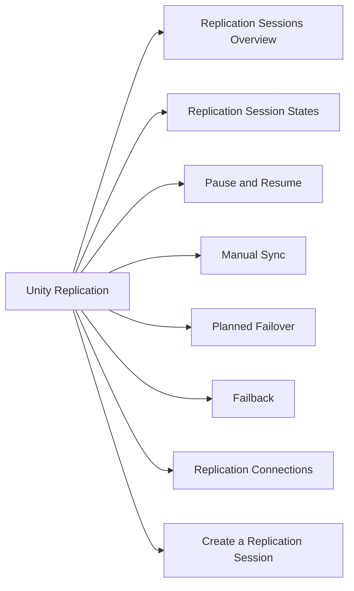

# Dell Unity Replication

Replication session management, monitoring, and failover on Dell Unity.



## Replication Sessions Overview

```bash
# List all replication sessions
uemcli -d <ip> -u admin /prot/rep/session show
uemcli -d <ip> -u admin /prot/rep/session show -detail

# View a specific session
uemcli -d <ip> -u admin /prot/rep/session -id <session_id> show -detail
```

## Replication Session States

| State | Meaning |
|---|---|
| Active | Replication is running normally |
| Idle | No active replication; awaiting next sync |
| Syncing | Data transfer in progress |
| Paused | Manually suspended |
| Failed | Error condition — check events |
| Failed Over | DR site is now active |

## Pause and Resume

```bash
# Pause replication (stops sync; source continues to accept writes)
uemcli -d <ip> -u admin /prot/rep/session -id <session_id> pause

# Resume replication (re-syncs changes accumulated during pause)
uemcli -d <ip> -u admin /prot/rep/session -id <session_id> resume
```

## Manual Sync

```bash
# Trigger an immediate synchronisation
uemcli -d <ip> -u admin /prot/rep/session -id <session_id> sync
```

## Planned Failover

```bash
# Failover with sync — syncs data then activates DR copy
uemcli -d <ip> -u admin /prot/rep/session -id <session_id> failover -keepSync

# Failover without final sync (emergency — data may lag)
uemcli -d <ip> -u admin /prot/rep/session -id <session_id> failover
```

## Failback

```bash
# After DR period, failback to original source
# Step 1 — reverse the replication (DR becomes source, primary becomes destination)
uemcli -d <ip> -u admin /prot/rep/session -id <session_id> reverse

# Step 2 — sync data back
uemcli -d <ip> -u admin /prot/rep/session -id <session_id> sync

# Step 3 — fail back to original
uemcli -d <ip> -u admin /prot/rep/session -id <session_id> failback
```

## Replication Connections

```bash
# List replication connections (Unity ↔ Unity or Unity ↔ PowerStore)
uemcli -d <ip> -u admin /prot/rep/connect show

# Create a replication connection
uemcli -d <ip> -u admin /prot/rep/connect create \
    -destAddress <destination_sp_ip> \
    -destUsername admin \
    -destPassword <password>
```

## Create a Replication Session

```bash
# Replicate a LUN to a remote Unity
uemcli -d <ip> -u admin /prot/rep/session create \
    -srcRes <lun_id> \
    -dstSys <connection_id> \
    -dstResName <remote_lun_name> \
    -rpo 3600   # RPO in seconds (3600 = 1 hour)
```

## Health Check

```bash
# Check all sessions for non-healthy states
uemcli -d <ip> -u admin /prot/rep/session show | grep -v "Active\|Idle\|Session"

# Check replication events/errors
uemcli -d <ip> -u admin /prac/alert show | grep -i repl
```
