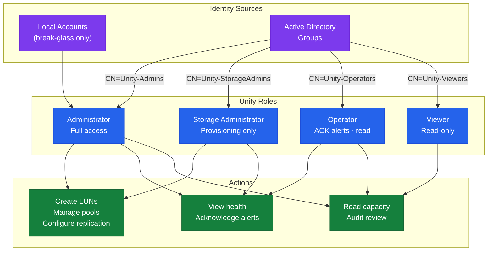
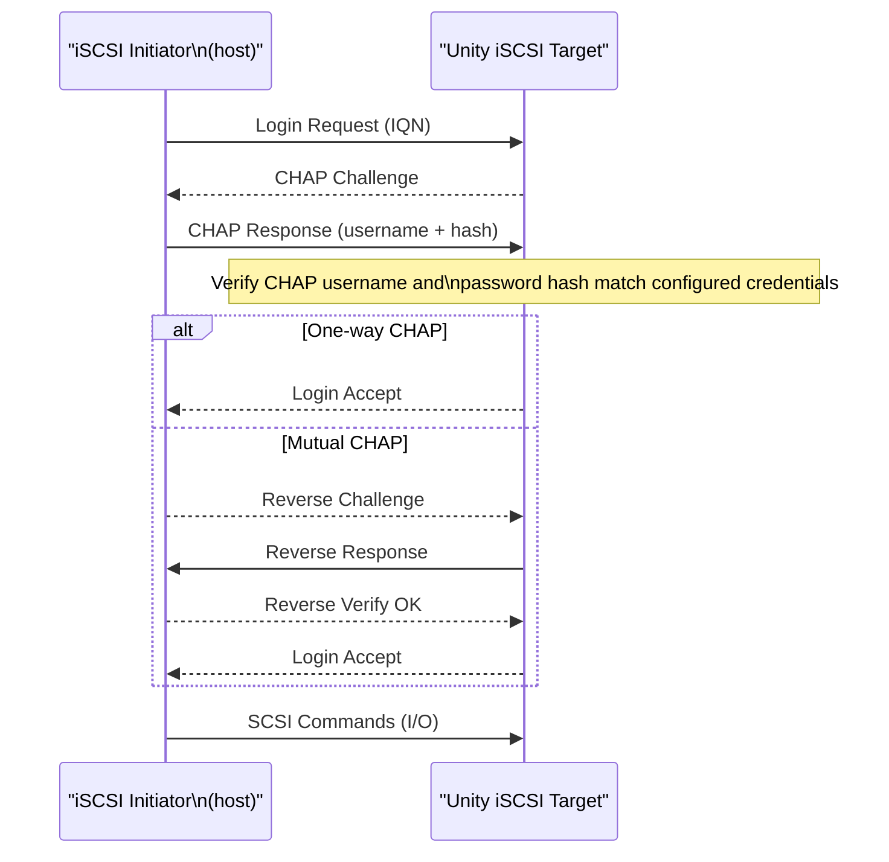

---
tags:
  - dell
  - security
---
# Unity — Access Control


<div class="kb-summary">
Access Control reference covering Role-Based Access Control (RBAC), Local User Management, LDAP and Active Directory Group Mapping, iSCSI CHAP Authentication, NFS Export Access Control and 4 more sections.
</div>
```text
┌─────────────────────────────────── Dell Unity XT — Access Control ────────────────────────────────────┐
│                                                                                                       │
│   ┌───────────────────────────────────────────────────────────────────────────────────────────────┐   │
│   │         Unity XT access control: RBAC roles, least-privilege, and access audit logging        │   │
│   │        Roles: admin (full), operator (read/modify), read-only (view); map to AD groups        │   │
│   │       Authentication: local accounts, LDAP/AD integration, and MFA for privileged users       │   │
│   │          Audit: log all admin actions; review access logs monthly; rotate credentials         │   │
│   └───────────────────────────────────────────────────────────────────────────────────────────────┘   │
│                                                                                                       │
│    Identify user → assign role → enforce MFA → audit → review quarterly                               │
│                                                                                                       │
│                  ▼                                ▼                                ▼                  │
│                                                                                                       │
│   ┌─────────────────────────────┐  ┌─────────────────────────────┐  ┌─────────────────────────────┐   │
│   │            Layer            │  │          Component          │  │            Notes            │   │
│   │             Ctrl            │  │         SP-A + SP-B         │  │        Cache mirrored       │   │
│   │             Pool            │  │       Dynamic FAST VP       │  │         Auto-tiering        │   │
│   │          NAS server         │  │        File protocols       │  │          Per-tenant         │   │
│   │           Snapshot          │  │        Writable snaps       │  │        Thin PiT copy        │   │
│   │         Replication         │  │         Async/Metro         │  │       Native or RP4VM       │   │
│   └─────────────────────────────┘  └─────────────────────────────┘  └─────────────────────────────┘   │
│                                                                                                       │
│                          ▼                                                 ▼                          │
│                                                                                                       │
│   ┌───────────────────────────────────────────────────────────────────────────────────────────────┐   │
│   │       Role       │   Permissions    │       Scope       │       Auth       │   Review cycle   │   │
│   │      Admin       │    Full CRUD     │       Global      │   MFA required   │     Monthly      │   │
│   │     Operator     │   Read/modify    │      Assigned     │   MFA required   │    Quarterly     │   │
│   │    Read-only     │    View only     │      Assigned     │     Password     │    Quarterly     │   │
│   │   Service acct   │     API only     │    Specific API   │    Token/cert    │      Annual      │   │
│   └───────────────────────────────────────────────────────────────────────────────────────────────┘   │
│                                                                                                       │
│    Physical: Unity XT 380F/480F/680F/880F · dual SPs · DPE/DAE expansion · 10/25 GbE                  │
│                                                                                                       │
│    Key terms:                                                                                         │
│                                                                                                       │
│    Unity XT           = Dell unified mid-range array; block LUNs, file NAS, and VMware vVols          │
│    Unisphere          = HTML5 GUI and REST API for Unity XT management; SP-hosted management portal   │
│    UEMCLI             = CLI for Unity XT; uemcli -d <ip> -u admin -p <pw> /show commands              │
│    Storage pool       = collection of drives forming a usable pool; FAST VP tiers data automatically  │
│    FAST VP            = Fully Automated Storage Tiering VP; moves hot and cold data between tiers     │
│    NAS server         = virtual file server on Unity; each has its own IP, DNS, and CIFS/NFS shares   │
│    Data Mover         = older EMC term for NAS server; used in VNX and early Unity documentation      │
│    SP-A / SP-B        = storage processors; active-active HA pair with mirrored cache                 │
│    Snapshot           = space-efficient PiT copy of LUN or FS; writable snapshots supported           │
│    RecoverPoint       = RP4VM; journal-based continuous data protection for Unity volumes             │
│    Metro              = synchronous replication between two Unity XT sites; active-active zero RPO    │
│    vVols              = Virtual Volumes; VASA provider exposes per-VM storage objects to vCenter      │
│                                                                                                       │
└───────────────────────────────────────────────────────────────────────────────────────────────────────┘
```


## Role-Based Access Control (RBAC)

Unisphere for Unity implements role-based access control for all administrative operations. Every Unisphere user — whether a local account or an LDAP/AD-mapped user — is assigned one of four built-in roles. There are no custom roles; access is controlled entirely by role assignment.



| Role | Permissions | Typical Assignment |
|---|---|---|
| Administrator | Full system access: storage provisioning, system configuration, user management, upgrades, and security settings | Storage team lead or senior engineer |
| Storage Administrator | Storage provisioning operations: create and manage pools, LUNs, file systems, snapshots, and replication; cannot modify system-level settings or manage users | Storage engineer |
| Operator | Read access plus limited operational actions: acknowledge alerts, collect service bundles, view health and capacity; cannot make configuration changes | NOC analyst, on-call operator |
| Viewer | Read-only access to all health, capacity, and configuration data; cannot make any changes | Capacity planning team, auditors |

Configure users and role assignments in Unisphere under **Settings > Access > Users and Roles**.

## Local User Management

Unity supports local accounts stored on the array. Local accounts are independent of LDAP or Active Directory and are always available — including when directory services are unavailable.

```bash
# List all local users
uemcli -d <ip> -u admin /user show

# Create a local user with Storage Administrator role
uemcli -d <ip> -u admin /user create \
    -name storageadmin01 \
    -role storageadmin \
    -passwd "InitialPassword1!"

# Modify a user's role
uemcli -d <ip> -u admin /user -name storageadmin01 set -role operator

# Change a user's password
uemcli -d <ip> -u admin /user -name storageadmin01 set -passwd "NewPassword1!"

# Delete a local user (cannot delete the last Administrator account)
uemcli -d <ip> -u admin /user -name storageadmin01 delete
```

### Local Account Best Practices

- Keep the number of local Administrator accounts to a minimum — ideally one break-glass account.
- Assign all regular operational access through LDAP/AD group mappings, not local accounts.
- Store the break-glass `admin` credentials in your secrets manager and rotate the password after any use.
- The built-in `admin` account cannot be deleted. Rename it to a non-obvious name if supported by your OE version, or use a strong, unique password.

## LDAP and Active Directory Group Mapping

Unity can authenticate Unisphere users via LDAP or Active Directory and map LDAP groups to Unity roles. This eliminates the need to manage local accounts for each operator.

### Configuring Directory Services

In Unisphere: **Settings > Access > Directory Services**

```bash
# View directory service configuration
uemcli -d <ip> -u admin /user/ldap show

# Create an LDAP directory service configuration
uemcli -d <ip> -u admin /user/ldap create \
    -addr <ldap_server_ip> \
    -protocol ldap \
    -port 389 \
    -baseDN "DC=corp,DC=local" \
    -bindDN "CN=unity-svc,OU=Service Accounts,DC=corp,DC=local" \
    -bindPasswd "ServiceAccountPassword"

# Modify an existing LDAP configuration
uemcli -d <ip> -u admin /user/ldap -id <ldap_id> set \
    -addr <new_ldap_server_ip>

# Test LDAP connectivity
uemcli -d <ip> -u admin /user/ldap -id <ldap_id> verify
```

### Mapping LDAP Groups to Unity Roles

Once directory services are configured, map LDAP/AD security groups to Unity roles:

```bash
# List existing role mappings
uemcli -d <ip> -u admin /user/role show

# Map an AD group to the Storage Administrator role
uemcli -d <ip> -u admin /user/role create \
    -name "CN=Unity-StorageAdmins,OU=Groups,DC=corp,DC=local" \
    -role storageadmin

# Map an AD group to Operator role (for NOC teams)
uemcli -d <ip> -u admin /user/role create \
    -name "CN=Unity-Operators,OU=Groups,DC=corp,DC=local" \
    -role operator

# Map an AD group to Viewer role (for read-only access)
uemcli -d <ip> -u admin /user/role create \
    -name "CN=Unity-Viewers,OU=Groups,DC=corp,DC=local" \
    -role viewer

# Delete a role mapping
uemcli -d <ip> -u admin /user/role -id <mapping_id> delete
```

## iSCSI CHAP Authentication

For iSCSI host access, Unity supports CHAP (Challenge Handshake Authentication Protocol) to authenticate initiators. This prevents unauthorised hosts from connecting to Unity iSCSI targets.



| CHAP Mode | Description | Recommendation |
|---|---|---|
| None | No authentication; all initiators accepted | Not recommended for production |
| One-way CHAP | Unity authenticates the host initiator; host does not authenticate Unity | Minimum for production iSCSI environments |
| Mutual CHAP | Both Unity and the host initiator authenticate each other | Recommended; prevents man-in-the-middle |

```bash
# Configure CHAP on a host object in Unity
uemcli -d <ip> -u admin /remote/host -id <host_id> set \
    -chapUser <chap_username> \
    -chapPassword <chap_secret>

# For mutual CHAP, also configure the reverse CHAP credentials
# (Unity as initiator authenticating to host)
uemcli -d <ip> -u admin /remote/host -id <host_id> set \
    -reverseChapUser <reverse_username> \
    -reverseChapPassword <reverse_secret>
```

On the Linux host side, configure `/etc/iscsi/iscsid.conf`:

```ini
node.session.auth.authmethod = CHAP
node.session.auth.username = <chap_username>
node.session.auth.password = <chap_secret>
# For mutual CHAP:
node.session.auth.username_in = <reverse_username>
node.session.auth.password_in = <reverse_secret>
```

## NFS Export Access Control

NFS access to Unity file systems is controlled at the export level. Each NFS export has an access control list that specifies which hosts or subnets can mount the export and with what permissions.

```bash
# List NFS exports and their access controls
uemcli -d <ip> -u admin /prot/nfs show -detail

# Create an NFS export with restricted read-write access to a subnet
uemcli -d <ip> -u admin /prot/nfs create \
    -server <nas_id> \
    -path / \
    -fs <fs_id> \
    -rwHosts 10.10.10.0/24 \
    -rootHosts 10.10.10.0/24 \
    -noAccessHosts 0.0.0.0/0

# Modify NFS export access — add a read-only host
uemcli -d <ip> -u admin /prot/nfs -id <nfs_id> set \
    -roHosts 10.10.20.0/24

# NFS access levels
# -rwHosts   : read-write access
# -roHosts   : read-only access
# -rootHosts : root squash disabled for these hosts (root on client = root on share)
# -noAccessHosts : explicitly deny access
```

**Root squash:** By default, Unity maps the root user from NFS clients to a non-privileged `nobody` account (root squash enabled). To allow root access from specific trusted hosts (such as backup servers), add those hosts to `-rootHosts`.

## SMB Share Permissions

SMB share permissions on Unity work in conjunction with NTFS file permissions. Unity applies two permission layers:

1. **Share-level permissions** — set in Unity; control who can connect to the share at all.
2. **NTFS permissions** — set on directories within the share; control file and directory access.

```bash
# List SMB shares and their current configuration
uemcli -d <ip> -u admin /prot/smb show -detail

# Create an SMB share with the default share permissions (Everyone: Full Control)
uemcli -d <ip> -u admin /prot/smb create \
    -name OracleBackups \
    -server <nas_id> \
    -path / \
    -fs <fs_id>

# Restrict share to a specific AD user or group (via Unisphere GUI)
# GUI path: Storage > File > File Systems > [filesystem] > SMB Shares > [share] > Permissions
```

For production environments, restrict share-level permissions to the AD groups that require access, then use NTFS permissions for fine-grained control within the share. Do not leave the default "Everyone: Full Control" share permission in place.

## Management Interface Restrictions

Restrict which IP ranges can access the Unity management interfaces to reduce the attack surface:

In Unisphere: **Settings > Security > Management Interfaces**

Best practice configuration:
- Allow management access only from the storage management VLAN or jump host subnet.
- Block management access from production workload VLANs.
- If SSH access to the SP CLI is required, restrict it to the management subnet only.

## Session and Password Policy

| Setting | Recommendation |
|---|---|
| Session timeout | 15–30 minutes of inactivity |
| Password minimum length | 12 characters |
| Password complexity | Uppercase, lowercase, digit, special character |
| Password history | Prevent reuse of the last 10 passwords |
| Account lockout | Lock after 5 failed attempts; unlock after 15 minutes |

Configure session timeout in Unisphere under **Settings > Access > Session Management**. Password and lockout policy is enforced on local accounts; for LDAP/AD accounts, the policy is inherited from Active Directory.

## Audit Log Review

All Unisphere administrative actions are recorded in the Unity audit log:

```bash
# View recent audit events (administrative actions)
uemcli -d <ip> -u admin /event/audit show

# View system events (including security-related events)
uemcli -d <ip> -u admin /event/syslog show
```

Review the audit log regularly for:
- Logins from unexpected IP addresses or user accounts.
- Configuration changes made outside of approved change windows.
- Multiple failed login attempts (potential credential stuffing).
- Privilege use — Administrator-role actions performed by accounts that should have Operator-level access.

Forward audit events to a SIEM via syslog for long-term retention and alerting. See the [Authentication](../authentication/index.md) page for syslog configuration.
