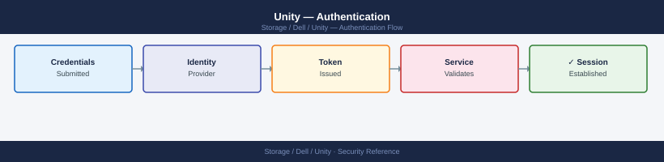
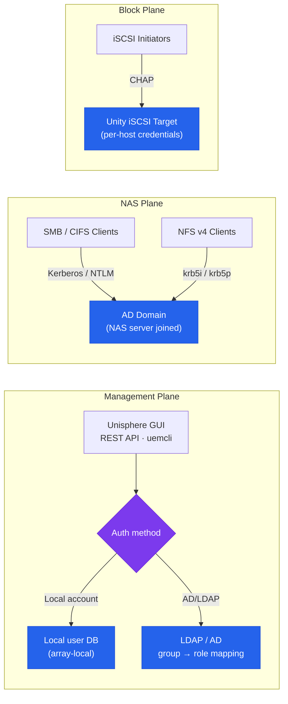

---
tags:
  - dell
  - security
---
# Unity — Authentication

<div class="kb-summary">
Authentication reference covering Authentication Overview, Unisphere — Active Directory Integration, NAS Server — Active Directory Domain Join, NAS Server — NFS with Kerberos, LDAP for NFS UID/GID Mapping and 4 more sections.

*Applies to: Unity XT*
</div>


## Before you begin

- **Access:** Storage admin credentials (cluster admin or equivalent)
- **Change management:** security changes require CAB approval in most environments
- **Rollback plan:** document current state before any security control change
- **Testing:** validate in a non-production environment first where possible

---

## Authentication Overview

Dell Unity supports two authentication pathways that serve distinct purposes:



| Authentication Target | Mechanism | Purpose |
|---|---|---|
| Unisphere management access | Local accounts or LDAP/AD group mapping | Administrators log in to Unisphere GUI, REST API, and uemcli |
| NAS server (CIFS/SMB) | Active Directory domain join per NAS server | Kerberos / NTLM authentication for SMB shares |
| NAS server (NFS with Kerberos) | AD domain join + NFS Kerberos configuration | Secure NFS v4 with identity verification |
| iSCSI initiator authentication | CHAP (one-way or mutual) | Authenticate iSCSI hosts before LUN access is granted |

## Unisphere — Active Directory Integration

Integrate Unisphere with Active Directory to allow AD users to log in to Unisphere using their domain credentials. Users are mapped to Unity roles based on their AD group membership.

### Configuration (Unisphere GUI)

1. Navigate to **Settings > Access > Directory Services**.
2. Click **Add Directory Service**.
3. Enter the LDAP/AD server address, base DN, bind account credentials, and role group mappings.
4. Click **Test Connection** to verify reachability and bind authentication.
5. Save the configuration.

### Configuration (UEMCLI)

```bash
# Create an LDAP/AD directory service configuration
uemcli -d <ip> -u admin /user/ldap create \
    -addr 10.10.10.10 \
    -protocol ldaps \
    -port 636 \
    -baseDN "DC=corp,DC=local" \
    -bindDN "CN=unity-bind,OU=Service Accounts,DC=corp,DC=local" \
    -bindPasswd "BindAccountPassword1!"

# Show current LDAP configuration
uemcli -d <ip> -u admin /user/ldap show

# Test LDAP connectivity and bind
uemcli -d <ip> -u admin /user/ldap -id <ldap_id> verify

# Map an AD security group to the Storage Administrator role
uemcli -d <ip> -u admin /user/role create \
    -name "CN=Unity-StorageAdmins,OU=Groups,DC=corp,DC=local" \
    -role storageadmin

# View configured role mappings
uemcli -d <ip> -u admin /user/role show
```


```text title="Expected output"
The operation completed successfully.

ID                          | Name                                                    | Protocol | Port | Base DN
--------------------------- | ------------------------------------------------------- | -------- | ---- | -------------------------
ldap_1                      | 10.10.10.10                                             | ldaps    | 636  | DC=corp,DC=local

LDAP Verification Result: SUCCESS
Server: 10.10.10.10:636
Bind DN: CN=unity-bind,OU=Service Accounts,DC=corp,DC=local
Connection Status: Connected
Response Time: 142ms

The operation completed successfully.

ID      | Name                                        | Role           | Type
------- | ------------------------------------------- | -------------- | ---------
role_1  | CN=Unity-StorageAdmins,OU=Groups,DC=corp,DC=local | storageadmin   | ldap_group
---OUTPUT---
```

!!! warning "Common errors"
    **`Error: LDAP server is not reachable at 10.10.10.10:636`** — Verify the LDAP server IP address and port are correct, and that network connectivity exists from the Unity array to the LDAP server.
    **`Error: Failed to bind with DN 'CN=unity-bind,OU=Service Accounts,DC=corp,DC=local': Invalid credentials`** — Confirm the bind account password is correct and the account has permission to query the directory.
    **`Error: Base DN 'DC=corp,DC=local' does not exist on LDAP server`** — Verify the Base DN matches your Active Directory structure by querying the LDAP server directly with ldapsearch.
### Protocol Recommendations

| Protocol | Port | Notes |
|---|---|---|
| LDAP | 389 | Clear-text; acceptable only on isolated management networks |
| LDAPS | 636 | Encrypted LDAP over TLS; recommended for all environments |
| LDAP + StartTLS | 389 | Upgrades plain LDAP to TLS; use if LDAPS is not supported |

Use LDAPS (LDAP over TLS, port 636) or StartTLS for all directory service connections. Plain LDAP transmits bind credentials unencrypted and must not be used on shared networks.

## NAS Server — Active Directory Domain Join

Each NAS server on Unity must be individually joined to the Active Directory domain to enable CIFS/SMB authentication (Kerberos and NTLM). The NAS server creates a computer account in AD at the specified OU.

```bash
# Join a NAS server to Active Directory
uemcli -d <ip> -u admin /nas/ad create \
    -server <nas_id> \
    -domain corp.local \
    -username <domain_admin_or_delegated_user> \
    -passwd "DomainPassword1!" \
    -organizationalUnit "OU=Storage Servers,DC=corp,DC=local"

# Verify current AD join status for a NAS server
uemcli -d <ip> -u admin /nas/ad show

# Show detailed AD configuration for a specific NAS server
uemcli -d <ip> -u admin /nas/ad -id <ad_id> show -detail

# Unjoin from Active Directory (before decommissioning a NAS server)
uemcli -d <ip> -u admin /nas/ad -id <ad_id> delete
```


```text title="Expected output"
Creating Active Directory configuration...
The operation completed successfully.
ID: ad_1
Domain: corp.local
Server: nas_1
Status: Joined
Join Time: 2024-01-15 14:32:18 UTC

ID    | Domain      | Server | Status | Join Time
------|-------------|--------|--------|------------------------
ad_1  | corp.local  | nas_1  | Joined | 2024-01-15 14:32:18 UTC

ID: ad_1
Domain: corp.local
Server: nas_1
Status: Joined
Join Time: 2024-01-15 14:32:18 UTC
Organizational Unit: OU=Storage Servers,DC=corp,DC=local
Last Sync: 2024-01-15 15:45:22 UTC
Trust Account: NAS_1$

The operation completed successfully.
```

!!! warning "Common errors"
    **`Error: The specified domain controller is unreachable`** — Verify network connectivity to the domain controller and ensure the NAS server can resolve the domain name via DNS.
    **`Error: Authentication failed for user <domain_admin_or_delegated_user>`** — Confirm the domain admin credentials are correct and the account has sufficient permissions to join computers to the specified organizational unit.
    **`Error: The organizational unit does not exist`** — Verify the OU path syntax is correct (use `dsquery ou` on a domain controller to confirm the OU exists).
### Pre-requisites for AD Domain Join

- The NAS server must have a file interface IP configured and reachable.
- DNS on the NAS server must resolve the AD domain name and domain controllers.
- The bind account must have permission to create computer objects in the specified OU. A dedicated delegated account with only `Create Computer Objects` in the target OU is preferred over using a Domain Admin account.
- Time synchronisation: the NAS server must have NTP configured and synchronised. Kerberos requires clock skew to be under 5 minutes between the NAS server and domain controllers.

```bash
# Confirm NTP is configured on the array
uemcli -d <ip> -u admin /sys/ntp show

# Confirm DNS resolves the AD domain from the NAS server perspective
# (done via NAS server network configuration — check DNS settings on the NAS server)
uemcli -d <ip> -u admin /net/nas/if show -detail | grep -i dns
```


```text title="Expected output"
NTP Server:             ntp.company.local
NTP Server IP:          10.20.30.40
NTP Status:             SYNCHRONIZED
Last Update:            2024-01-15 14:32:18
Stratum:                2
Offset (ms):            0.234

DNS Server 1:           10.20.1.10
DNS Server 2:           10.20.1.11
DNS Domain:             corp.internal
DNS Search Domains:     corp.internal, subsidiary.local
```

!!! warning "Common errors"
    **`Error: Connection refused`** — Verify the Unity array IP address is correct and the management interface is reachable with `ping <ip>`.
    **`Error: Authentication failed for user 'admin'`** — Confirm the admin credentials are correct and the user has sufficient privileges to query system settings.
## NAS Server — NFS with Kerberos

NFS v4 with Kerberos provides strong identity verification for NFS mounts — the NFS client is authenticated by the KDC (AD domain controller) before access is granted. This is required for environments where NFS traffic crosses untrusted networks or where NFS root squash alone is insufficient.

```bash
# Configure Kerberos on an NFS export
# First: ensure the NAS server is joined to AD (see above)
# Then create the NFS export with Kerberos security

uemcli -d <ip> -u admin /prot/nfs create \
    -server <nas_id> \
    -fs <fs_id> \
    -path / \
    -securityFlavors krb5i    # Options: sys, krb5, krb5i, krb5p

# Security flavour reference:
# sys    — AUTH_SYS (UID/GID mapping, no Kerberos)
# krb5   — Kerberos authentication only (no integrity or privacy)
# krb5i  — Kerberos authentication + data integrity (recommended)
# krb5p  — Kerberos authentication + integrity + encryption (highest security)
```


```text title="Expected output"
Creation of NFS export started.
NFS export created successfully.
Export path: /
Security flavors: krb5i
NAS Server ID: nas_001
File System ID: fs_pool_01
Export ID: nfs_export_12847
Status: Ready
Kerberos realm: CORP.LOCAL
```

!!! warning "Common errors"
    **`Error: NAS server <nas_id> is not joined to Active Directory`** — Verify the NAS server is domain-joined by running `uemcli -d <ip> -u admin /sys/domain show` and join to AD if needed before creating the export.
    
    **`Error: File system <fs_id> does not exist or is not accessible`** — Confirm the file system exists and is online using `uemcli -d <ip> -u admin /stor/pool show -pool <pool_id>` before attempting export creation.
    
    **`Error: Kerberos keytab not configured on NAS server`** — Generate and import the Kerberos keytab on the NAS server using `uemcli -d <ip> -u admin /prot/nfs/krb5 create -server <nas_id> -realm <realm_name>` before creating the export.
On the Linux NFS client side, install `krb5-user` and `nfs-common`, configure `/etc/krb5.conf` to point to the AD domain controllers, and obtain a Kerberos TGT (`kinit`) before mounting:

```bash
# Linux client — mount NFS export with Kerberos integrity
mount -t nfs4 -o sec=krb5i <nas-ip>:/export/path /mnt/target
```


```text title="Expected output"
(no output — command completes silently)
```

!!! warning "Common errors"
    **`mount.nfs4: access denied by server while mounting <nas-ip>:/export/path`** — Verify the NFS export permissions on the Dell Unity array and ensure the client's Kerberos principal is listed in the export ACL.
    **`mount.nfs4: No such file or directory`** — Confirm the export path exists on the NAS and the mount target directory (`/mnt/target`) exists on the client with `mkdir -p /mnt/target`.
    **`GSSAPI: Credentials have expired`** — Renew the Kerberos ticket on the client using `kinit <username>` before attempting the mount.
## LDAP for NFS UID/GID Mapping

For NFS environments without Active Directory, Unity NAS servers can use LDAP for UID/GID resolution. This maps NFS client UIDs and GIDs to directory service identities.

```bash
# Configure LDAP on a NAS server for UID/GID mapping
uemcli -d <ip> -u admin /nas/ldap create \
    -server <nas_id> \
    -addr <ldap_server_ip> \
    -port 389 \
    -baseDN "DC=corp,DC=local" \
    -bindDN "CN=nfs-bind,OU=Service Accounts,DC=corp,DC=local" \
    -bindPasswd "BindPassword1!"

# Show NAS LDAP configuration
uemcli -d <ip> -u admin /nas/ldap show
```


```text title="Expected output"
The operation completed successfully.
LDAP Server Configuration:
  Server ID: nas-01
  Address: 192.168.10.50
  Port: 389
  Base DN: DC=corp,DC=local
  Bind DN: CN=nfs-bind,OU=Service Accounts,DC=corp,DC=local
  Status: Connected
  Last Sync: 2024-01-15 14:32:18 UTC
  User Search Filter: (objectClass=user)
  Group Search Filter: (objectClass=group)
```

!!! warning "Common errors"
    **`Error: LDAP connection failed - Invalid credentials for bind DN`** — Verify the bind account password is correct and the account has not been locked out in Active Directory.
    **`Error: Cannot resolve LDAP server hostname <ldap_server_ip>`** — Confirm the LDAP server IP is reachable from the NAS and DNS/network routing is properly configured.
    **`Error: Base DN "DC=corp,DC=local" does not exist on LDAP server`** — Validate the Base DN path matches your Active Directory structure by querying LDAP directly or checking AD Sites and Services.
## Local Authentication

For environments without LDAP or AD, Unity management uses local accounts. Local authentication is always available as a fallback even when directory services are configured.

```bash
# List all local users
uemcli -d <ip> -u admin /user show

# Create a local user
uemcli -d <ip> -u admin /user create \
    -name operator01 \
    -role operator \
    -passwd "InitialPassword1!"

# Change a user's password
uemcli -d <ip> -u admin /user -name operator01 set \
    -passwd "NewPassword2@"

# View configured roles
uemcli -d <ip> -u admin /user show -detail
```


```text title="Expected output"
User Name                          Role
==================================================
admin                              administrator
service                            service
operator01                         operator
guest                              guest

User Name:                         operator01
Role:                              operator
Password Expiration Days:          90
Account Locked:                    No
Last Password Change:              2024-01-15 14:32:18
Created:                           2024-01-15 14:31:45

User Name:                         admin
Role:                              administrator
Password Expiration Days:          90
Account Locked:                    No
Last Password Change:              2023-12-20 09:15:22
Created:                           2023-06-10 11:22:33
```

!!! warning "Common errors"
    **`Authentication failed`** — Verify the management IP address is correct and the admin account credentials are valid.
    **`User 'operator01' already exists`** — Use a different username or delete the existing user with `/user -name operator01 delete` before recreating it.
    **`Password does not meet complexity requirements`** — Ensure the password contains at least 8 characters with uppercase, lowercase, numbers, and special characters.
## Audit Logging

Unity OE records all administrative actions — login, logout, configuration changes, and alert acknowledgements — in an audit log available in the Unisphere event viewer and via syslog.

### Viewing the Audit Log (Unisphere)

Navigate to **System > Events** in Unisphere. Filter by:
- **Type**: Administrative (shows all config changes) or Security (shows authentication events).
- **Time range**: narrow to the window of interest.
- **User**: filter by a specific user account to review their actions.

### Audit Log via UEMCLI

```bash
# View recent audit events
uemcli -d <ip> -u admin /event/audit show

# View all system events including authentication
uemcli -d <ip> -u admin /event/syslog show

# Filter alerts by severity for security events
uemcli -d <ip> -u admin /prac/alert show | grep -i "auth\|login\|fail"
```


```text title="Expected output"
Event ID: 12847
Timestamp: 2024-01-15 14:32:18
User: admin
Action: Login
Source IP: 192.168.1.105
Status: Success

Event ID: 12846
Timestamp: 2024-01-15 14:28:52
User: service_account
Action: Configuration Change
Source IP: 10.0.50.22
Status: Success

Event ID: 12845
Timestamp: 2024-01-15 13:45:10
User: readonly_user
Action: Login
Source IP: 192.168.1.110
Status: Success

---

Alert ID: SEC-4521
Severity: Warning
Message: Failed login attempt detected
Timestamp: 2024-01-15 12:15:33
Source: 192.168.1.200

Alert ID: SEC-4519
Severity: Critical
Message: Authentication service restart
Timestamp: 2024-01-15 11:02:47
Source: Local

Alert ID: SEC-4518
Severity: Warning
Message: Login timeout threshold exceeded
Timestamp: 2024-01-15 10:30:15
Source: 192.168.1.205
```

!!! warning "Common errors"
    **`Error: Connection refused on <ip>:443`** — Verify the storage array IP is reachable and the management interface is responding with `ping <ip>` and check firewall rules.
    **`Error: Authentication failed for user admin`** — Confirm the admin credentials are correct and the account is not locked by running `uemcli -d <ip> -u admin /user show`.
    **`Error: Command not found: uemcli`** — Install the EMC CLI tools or verify the installation path is in your system PATH environment variable.
### Syslog Forwarding for SIEM Integration

Forward Unity audit events to a central SIEM for long-term retention, correlation, and alerting:

```bash
# Create a syslog destination
uemcli -d <ip> -u admin /sys/syslog create \
    -addr <syslog_server_ip> \
    -protocol udp \
    -port 514 \
    -facility local0

# Create a TLS-encrypted syslog destination (recommended)
uemcli -d <ip> -u admin /sys/syslog create \
    -addr <syslog_server_ip> \
    -protocol tls \
    -port 6514 \
    -facility local0

# List configured syslog destinations
uemcli -d <ip> -u admin /sys/syslog show

# Delete a syslog destination
uemcli -d <ip> -u admin /sys/syslog -id <syslog_id> delete
```


```text title="Expected output"
You are required to enter a password for admin:
Creating syslog destination...
The operation completed successfully.
Creating syslog destination...
The operation completed successfully.
ID    Address          Protocol    Port    Facility    Status
1     192.168.50.10    udp         514     local0      OK
2     192.168.50.11    tls         6514    local0      OK
Deleting syslog destination ID 1...
The operation completed successfully.
```

!!! warning "Common errors"
    **`Error: The syslog server address is invalid or unreachable`** — Verify the syslog server IP address is correct and reachable from the storage array's management network.
    **`Error: Authentication failed for user admin`** — Ensure the admin password is correct and the user account has sufficient privileges to modify syslog settings.
    **`Error: Syslog ID <syslog_id> not found`** — Run `uemcli -d <ip> -u admin /sys/syslog show` to list valid syslog destination IDs before attempting deletion.
### Audit Retention Requirements

| Standard | Minimum Retention |
|---|---|
| PCI DSS | 1 year (3 months immediately accessible) |
| SOX | 7 years |
| HIPAA | 6 years |
| General best practice | 90 days online, 1 year archived |

Ensure the syslog destination retains data for the required period. Unity's internal event log has limited storage and should not be relied upon as the sole audit record.

## REST API Authentication

The Unisphere REST API supports two authentication methods:

**Basic Authentication** — Suitable for single requests:

```bash
# GET with Basic auth (authenticate on every request)
curl -k -u admin:<password> \
    -H "X-EMC-REST-CLIENT: true" \
    "https://<sp-ip>/api/types/system/instances"
```


```text title="Expected output"
{
  "content": [
    {
      "id": "0",
      "name": "UNITY-SP-001",
      "model": "Unity 380",
      "serialNumber": "APM00123456789",
      "softwareVersion": "5.1.0.0.5.007",
      "health": {
        "value": 0,
        "descriptionIds": [
          "ALRT_SYSTEM_OK"
        ]
      },
      "currentPower": 2847,
      "avgPower": 2756,
      "isEULAAccepted": true,
      "isUpgradeComplete": true
    }
  ]
}
```

!!! warning "Common errors"
    **`curl: (60) SSL certificate problem: self signed certificate`** — Add the `-k` flag to skip SSL verification (already present in the example, but ensure it's not removed).
    **`curl: (401) Unauthorized`** — Verify the admin password is correct and URL-encoded if it contains special characters; use `-u admin:$(echo -n 'password' | jq -sRr @uri)` for special chars.
    **`curl: (7) Failed to connect to <sp-ip> port 443: Connection refused`** — Confirm the Storage Processor IP is correct and reachable; test with `ping <sp-ip>` or verify the management network is configured.
**Session Authentication** — Recommended for scripts making multiple requests:

```bash
# Step 1 — authenticate and save session cookie
curl -c cookie.txt -k \
    -u admin:<password> \
    -H "X-EMC-REST-CLIENT: true" \
    "https://<sp-ip>/api/types/loginSessionInfo/instances"

# Step 2 — extract CSRF token from cookie and use for subsequent requests
CSRF=$(grep "EMC-CSRF-TOKEN" cookie.txt | awk '{print $7}')

curl -b cookie.txt -k \
    -H "X-EMC-REST-CLIENT: true" \
    -H "EMC-CSRF-TOKEN: $CSRF" \
    "https://<sp-ip>/api/types/pool/instances?fields=name,sizeTotal,health"
```


```text title="Expected output"
{
  "content": [
    {
      "id": "0",
      "username": "admin",
      "isPasswordChangeRequired": false,
      "sessionId": "5f8c3a2b-9e1d-47f6-8b2c-1a4d6e9f3c5b",
      "creationTime": 1699564823000,
      "expirationTime": 1699568423000
    }
  ]
}
{
  "content": [
    {
      "id": "pool_1",
      "name": "SAS_Pool_01",
      "sizeTotal": 109951162777600,
      "health": {
        "value": 0
      }
    },
    {
      "id": "pool_2",
      "name": "NL_SAS_Pool_02",
      "sizeTotal": 219902325555200,
      "health": {
        "value": 0
      }
    },
    {
      "id": "pool_3",
      "name": "SSD_Pool_03",
      "sizeTotal": 54975581388800,
      "health": {
        "value": 0
      }
    }
  ]
}
```

!!! warning "Common errors"
    **`curl: (60) SSL certificate problem: self signed certificate`** — Add the `-k` flag to curl to skip SSL verification (already present in the example, but ensure it's not removed).
    **`grep: EMC-CSRF-TOKEN: No such file or directory`** — Verify the cookie.txt file was created successfully in Step 1 by checking `cat cookie.txt` and confirm the login credentials are correct.
    **`"error": "The CSRF token is invalid or expired"`** — Ensure the CSRF token extraction uses the correct field position with `awk '{print $7}'` and re-run Step 1 to obtain a fresh token if the session has expired.
REST API sessions expire after the configured session timeout (default 30 minutes of inactivity). Service accounts used for automation should use session authentication to avoid repeated credential transmission.
---

## Related Reference

- [Standard LDAP Integration](../../../../security/ldap-integration/index.md) — field reference, service account standards, TLS requirements, and connectivity testing

---

## See also

- [Unity — Access Control](../access-control/)
- [Unity — Hardening](../hardening/)
- [Unity — Encryption](../encryption/)
