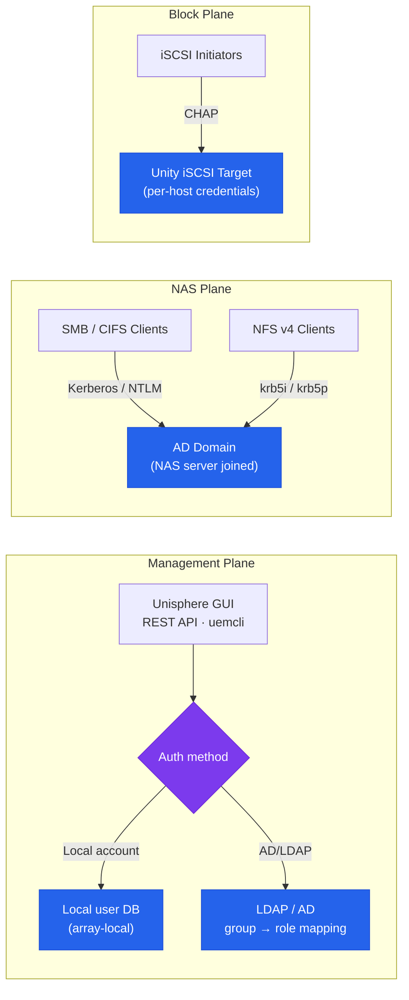

# Unity — Authentication


<div class="kb-summary">
Authentication reference covering Authentication Overview, Unisphere — Active Directory Integration, NAS Server — Active Directory Domain Join, NAS Server — NFS with Kerberos, LDAP for NFS UID/GID Mapping and 4 more sections.
</div>
```
┌─────────────────────────────────── Dell Unity XT — Authentication ────────────────────────────────────┐
│                                                                                                       │
│   ┌───────────────────────────────────────────────────────────────────────────────────────────────┐   │
│   │         Unity XT authentication: local accounts, LDAP/AD, RADIUS, and SAML SSO options        │   │
│   │        MFA: time-based OTP or hardware token required for all privileged admin accounts       │   │
│   │         Service accounts: dedicated accounts for automation; API tokens/keys preferred        │   │
│   │       Session: idle timeout enforced; concurrent session limits for admin role accounts       │   │
│   └───────────────────────────────────────────────────────────────────────────────────────────────┘   │
│                                                                                                       │
│    Login → authenticate LDAP/SAML/local → MFA → authorise role → session                              │
│                                                                                                       │
│                  ▼                                ▼                                ▼                  │
│                                                                                                       │
│   ┌─────────────────────────────┐  ┌─────────────────────────────┐  ┌─────────────────────────────┐   │
│   │            Layer            │  │          Component          │  │            Notes            │   │
│   │             Ctrl            │  │         SP-A + SP-B         │  │        Cache mirrored       │   │
│   │             Pool            │  │       Dynamic FAST VP       │  │         Auto-tiering        │   │
│   │          NAS server         │  │        File protocols       │  │          Per-tenant         │   │
│   │           Snapshot          │  │        Writable snaps       │  │        Thin PiT copy        │   │
│   │         Replication         │  │         Async/Metro         │  │       Native or RP4VM       │   │
│   └─────────────────────────────┘  └─────────────────────────────┘  └─────────────────────────────┘   │
│                                                                                                       │
│                          ▼                                                 ▼                          │
│                                                                                                       │
│   ┌───────────────────────────────────────────────────────────────────────────────────────────────┐   │
│   │      Method      │     Use case     │  Config location  │       MFA        │     Priority     │   │
│   │     LDAP/AD      │  Staff accounts  │   Auth settings   │     Required     │     Primary      │   │
│   │     SAML SSO     │    Federated     │    SSO settings   │   IdP-enforced   │    Preferred     │   │
│   │      Local       │   Break-glass    │    Local users    │     Required     │  Emergency only  │   │
│   │    API token     │    Automation    │  Service account  │   N/A (token)    │    Automation    │   │
│   └───────────────────────────────────────────────────────────────────────────────────────────────┘   │
│                                                                                                       │
│    Physical: Unity XT 380F/480F/680F/880F · dual SPs · DPE/DAE expansion · 10/25 GbE                  │
│                                                                                                       │
│    Key terms:                                                                                         │
│                                                                                                       │
│    Unity XT           = Dell unified mid-range array; block LUNs, file NAS, and VMware vVols          │
│    Unisphere          = HTML5 GUI and REST API for Unity XT management; SP-hosted management portal   │
│    UEMCLI             = CLI for Unity XT; uemcli -d <ip> -u admin -p <pw> /show commands              │
│    Storage pool       = collection of drives forming a usable pool; FAST VP tiers data automatically  │
│    FAST VP            = Fully Automated Storage Tiering VP; moves hot and cold data between tiers     │
│    NAS server         = virtual file server on Unity; each has its own IP, DNS, and CIFS/NFS shares   │
│    Data Mover         = older EMC term for NAS server; used in VNX and early Unity documentation      │
│    SP-A / SP-B        = storage processors; active-active HA pair with mirrored cache                 │
│    Snapshot           = space-efficient PiT copy of LUN or FS; writable snapshots supported           │
│    RecoverPoint       = RP4VM; journal-based continuous data protection for Unity volumes             │
│    Metro              = synchronous replication between two Unity XT sites; active-active zero RPO    │
│    vVols              = Virtual Volumes; VASA provider exposes per-VM storage objects to vCenter      │
│                                                                                                       │
└───────────────────────────────────────────────────────────────────────────────────────────────────────┘
```


## Authentication Overview

Dell Unity supports two authentication pathways that serve distinct purposes:



| Authentication Target | Mechanism | Purpose |
|---|---|---|
| Unisphere management access | Local accounts or LDAP/AD group mapping | Administrators log in to Unisphere GUI, REST API, and uemcli |
| NAS server (CIFS/SMB) | Active Directory domain join per NAS server | Kerberos / NTLM authentication for SMB shares |
| NAS server (NFS with Kerberos) | AD domain join + NFS Kerberos configuration | Secure NFS v4 with identity verification |
| iSCSI initiator authentication | CHAP (one-way or mutual) | Authenticate iSCSI hosts before LUN access is granted |

## Unisphere — Active Directory Integration

Integrate Unisphere with Active Directory to allow AD users to log in to Unisphere using their domain credentials. Users are mapped to Unity roles based on their AD group membership.

### Configuration (Unisphere GUI)

1. Navigate to **Settings > Access > Directory Services**.
2. Click **Add Directory Service**.
3. Enter the LDAP/AD server address, base DN, bind account credentials, and role group mappings.
4. Click **Test Connection** to verify reachability and bind authentication.
5. Save the configuration.

### Configuration (UEMCLI)

```bash
# Create an LDAP/AD directory service configuration
uemcli -d <ip> -u admin /user/ldap create \
    -addr 10.10.10.10 \
    -protocol ldaps \
    -port 636 \
    -baseDN "DC=corp,DC=local" \
    -bindDN "CN=unity-bind,OU=Service Accounts,DC=corp,DC=local" \
    -bindPasswd "BindAccountPassword1!"

# Show current LDAP configuration
uemcli -d <ip> -u admin /user/ldap show

# Test LDAP connectivity and bind
uemcli -d <ip> -u admin /user/ldap -id <ldap_id> verify

# Map an AD security group to the Storage Administrator role
uemcli -d <ip> -u admin /user/role create \
    -name "CN=Unity-StorageAdmins,OU=Groups,DC=corp,DC=local" \
    -role storageadmin

# View configured role mappings
uemcli -d <ip> -u admin /user/role show
```

### Protocol Recommendations

| Protocol | Port | Notes |
|---|---|---|
| LDAP | 389 | Clear-text; acceptable only on isolated management networks |
| LDAPS | 636 | Encrypted LDAP over TLS; recommended for all environments |
| LDAP + StartTLS | 389 | Upgrades plain LDAP to TLS; use if LDAPS is not supported |

Use LDAPS (LDAP over TLS, port 636) or StartTLS for all directory service connections. Plain LDAP transmits bind credentials unencrypted and must not be used on shared networks.

## NAS Server — Active Directory Domain Join

Each NAS server on Unity must be individually joined to the Active Directory domain to enable CIFS/SMB authentication (Kerberos and NTLM). The NAS server creates a computer account in AD at the specified OU.

```bash
# Join a NAS server to Active Directory
uemcli -d <ip> -u admin /nas/ad create \
    -server <nas_id> \
    -domain corp.local \
    -username <domain_admin_or_delegated_user> \
    -passwd "DomainPassword1!" \
    -organizationalUnit "OU=Storage Servers,DC=corp,DC=local"

# Verify current AD join status for a NAS server
uemcli -d <ip> -u admin /nas/ad show

# Show detailed AD configuration for a specific NAS server
uemcli -d <ip> -u admin /nas/ad -id <ad_id> show -detail

# Unjoin from Active Directory (before decommissioning a NAS server)
uemcli -d <ip> -u admin /nas/ad -id <ad_id> delete
```

### Pre-requisites for AD Domain Join

- The NAS server must have a file interface IP configured and reachable.
- DNS on the NAS server must resolve the AD domain name and domain controllers.
- The bind account must have permission to create computer objects in the specified OU. A dedicated delegated account with only `Create Computer Objects` in the target OU is preferred over using a Domain Admin account.
- Time synchronisation: the NAS server must have NTP configured and synchronised. Kerberos requires clock skew to be under 5 minutes between the NAS server and domain controllers.

```bash
# Confirm NTP is configured on the array
uemcli -d <ip> -u admin /sys/ntp show

# Confirm DNS resolves the AD domain from the NAS server perspective
# (done via NAS server network configuration — check DNS settings on the NAS server)
uemcli -d <ip> -u admin /net/nas/if show -detail | grep -i dns
```

## NAS Server — NFS with Kerberos

NFS v4 with Kerberos provides strong identity verification for NFS mounts — the NFS client is authenticated by the KDC (AD domain controller) before access is granted. This is required for environments where NFS traffic crosses untrusted networks or where NFS root squash alone is insufficient.

```bash
# Configure Kerberos on an NFS export
# First: ensure the NAS server is joined to AD (see above)
# Then create the NFS export with Kerberos security

uemcli -d <ip> -u admin /prot/nfs create \
    -server <nas_id> \
    -fs <fs_id> \
    -path / \
    -securityFlavors krb5i    # Options: sys, krb5, krb5i, krb5p

# Security flavour reference:
# sys    — AUTH_SYS (UID/GID mapping, no Kerberos)
# krb5   — Kerberos authentication only (no integrity or privacy)
# krb5i  — Kerberos authentication + data integrity (recommended)
# krb5p  — Kerberos authentication + integrity + encryption (highest security)
```

On the Linux NFS client side, install `krb5-user` and `nfs-common`, configure `/etc/krb5.conf` to point to the AD domain controllers, and obtain a Kerberos TGT (`kinit`) before mounting:

```bash
# Linux client — mount NFS export with Kerberos integrity
mount -t nfs4 -o sec=krb5i <nas-ip>:/export/path /mnt/target
```

## LDAP for NFS UID/GID Mapping

For NFS environments without Active Directory, Unity NAS servers can use LDAP for UID/GID resolution. This maps NFS client UIDs and GIDs to directory service identities.

```bash
# Configure LDAP on a NAS server for UID/GID mapping
uemcli -d <ip> -u admin /nas/ldap create \
    -server <nas_id> \
    -addr <ldap_server_ip> \
    -port 389 \
    -baseDN "DC=corp,DC=local" \
    -bindDN "CN=nfs-bind,OU=Service Accounts,DC=corp,DC=local" \
    -bindPasswd "BindPassword1!"

# Show NAS LDAP configuration
uemcli -d <ip> -u admin /nas/ldap show
```

## Local Authentication

For environments without LDAP or AD, Unity management uses local accounts. Local authentication is always available as a fallback even when directory services are configured.

```bash
# List all local users
uemcli -d <ip> -u admin /user show

# Create a local user
uemcli -d <ip> -u admin /user create \
    -name operator01 \
    -role operator \
    -passwd "InitialPassword1!"

# Change a user's password
uemcli -d <ip> -u admin /user -name operator01 set \
    -passwd "NewPassword2@"

# View configured roles
uemcli -d <ip> -u admin /user show -detail
```

## Audit Logging

Unity OE records all administrative actions — login, logout, configuration changes, and alert acknowledgements — in an audit log available in the Unisphere event viewer and via syslog.

### Viewing the Audit Log (Unisphere)

Navigate to **System > Events** in Unisphere. Filter by:
- **Type**: Administrative (shows all config changes) or Security (shows authentication events).
- **Time range**: narrow to the window of interest.
- **User**: filter by a specific user account to review their actions.

### Audit Log via UEMCLI

```bash
# View recent audit events
uemcli -d <ip> -u admin /event/audit show

# View all system events including authentication
uemcli -d <ip> -u admin /event/syslog show

# Filter alerts by severity for security events
uemcli -d <ip> -u admin /prac/alert show | grep -i "auth\|login\|fail"
```

### Syslog Forwarding for SIEM Integration

Forward Unity audit events to a central SIEM for long-term retention, correlation, and alerting:

```bash
# Create a syslog destination
uemcli -d <ip> -u admin /sys/syslog create \
    -addr <syslog_server_ip> \
    -protocol udp \
    -port 514 \
    -facility local0

# Create a TLS-encrypted syslog destination (recommended)
uemcli -d <ip> -u admin /sys/syslog create \
    -addr <syslog_server_ip> \
    -protocol tls \
    -port 6514 \
    -facility local0

# List configured syslog destinations
uemcli -d <ip> -u admin /sys/syslog show

# Delete a syslog destination
uemcli -d <ip> -u admin /sys/syslog -id <syslog_id> delete
```

### Audit Retention Requirements

| Standard | Minimum Retention |
|---|---|
| PCI DSS | 1 year (3 months immediately accessible) |
| SOX | 7 years |
| HIPAA | 6 years |
| General best practice | 90 days online, 1 year archived |

Ensure the syslog destination retains data for the required period. Unity's internal event log has limited storage and should not be relied upon as the sole audit record.

## REST API Authentication

The Unisphere REST API supports two authentication methods:

**Basic Authentication** — Suitable for single requests:

```bash
# GET with Basic auth (authenticate on every request)
curl -k -u admin:<password> \
    -H "X-EMC-REST-CLIENT: true" \
    "https://<sp-ip>/api/types/system/instances"
```

**Session Authentication** — Recommended for scripts making multiple requests:

```bash
# Step 1 — authenticate and save session cookie
curl -c cookie.txt -k \
    -u admin:<password> \
    -H "X-EMC-REST-CLIENT: true" \
    "https://<sp-ip>/api/types/loginSessionInfo/instances"

# Step 2 — extract CSRF token from cookie and use for subsequent requests
CSRF=$(grep "EMC-CSRF-TOKEN" cookie.txt | awk '{print $7}')

curl -b cookie.txt -k \
    -H "X-EMC-REST-CLIENT: true" \
    -H "EMC-CSRF-TOKEN: $CSRF" \
    "https://<sp-ip>/api/types/pool/instances?fields=name,sizeTotal,health"
```

REST API sessions expire after the configured session timeout (default 30 minutes of inactivity). Service accounts used for automation should use session authentication to avoid repeated credential transmission.
---

## Related Reference

- [Standard LDAP Integration](../../../../../security/ldap-integration/index.md) — field reference, service account standards, TLS requirements, and connectivity testing
