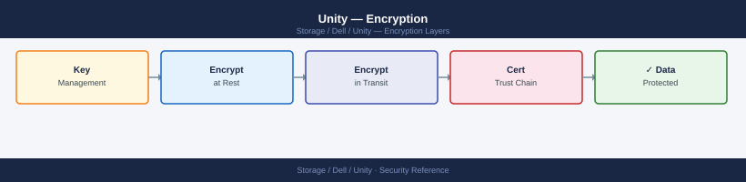
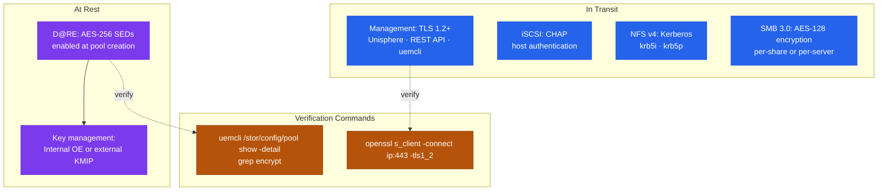

---
tags:
  - dell
  - security
---
# Unity — Encryption

<div class="kb-summary">
Encryption reference covering Encryption Layers, Data at Rest Encryption (D@RE), External Key Management (KMIP), Management Channel Encryption (TLS), iSCSI CHAP Authentication and 4 more sections.

*Applies to: Unity XT*
</div>


## Before you begin

- **Access:** Storage admin credentials (cluster admin or equivalent)
- **Change management:** security changes require CAB approval in most environments
- **Rollback plan:** document current state before any security control change
- **Testing:** validate in a non-production environment first where possible

---

## Encryption Layers

Dell Unity provides encryption at multiple layers. Understanding which layer is active and how to verify it is essential for compliance audits and security assessments.



| Layer | Method | Status by Default | Notes |
|---|---|---|---|
| Data at Rest (D@RE) | AES-256 self-encrypting drives (SEDs) | Disabled (hardware-dependent) | Must be enabled at pool creation; cannot retrofit to existing unencrypted pools without data migration |
| External Key Management | KMIP protocol to external KMS | Optional | Recommended for environments requiring key separation from the array |
| Data in Transit — Management | TLS 1.2+ for Unisphere GUI, REST API, and uemcli | Enabled by default | Disable TLS 1.0 and 1.1 explicitly |
| Data in Transit — iSCSI | CHAP authentication | Disabled by default | Enable per-host; mutual CHAP recommended |
| Data in Transit — NFS | Kerberos (krb5, krb5i, krb5p) | Disabled by default | Requires AD-joined NAS server; NFS v4 only |
| Data in Transit — SMB | SMB signing and encryption | Configurable | SMB 3.0 encryption available for sensitive shares |

## Data at Rest Encryption (D@RE)

D@RE uses AES-256 self-encrypting drives. When a drive is removed from the array, data cannot be read without the encryption key, which is bound to the Unity system. This protects against physical drive theft.

### Verifying D@RE Status

```bash
# Check if D@RE is enabled on the system
uemcli -d <ip> -u admin /sys/security show -detail | grep -i encrypt

# Check D@RE status per pool
uemcli -d <ip> -u admin /stor/config/pool show -detail | grep -i encrypt

# View drive encryption status
uemcli -d <ip> -u admin /stor/config/disk show -detail | grep -i "encrypt\|sed"
```

In Unisphere: **Settings > Encryption** displays D@RE status and key management configuration.

### Enabling D@RE

D@RE must be enabled at pool creation time. It cannot be applied to an existing pool that was created without encryption. To enable D@RE:

1. Confirm the hardware supports SEDs — not all drive types and Unity models support D@RE. Check the Dell Unity Product Guide for your specific model.
2. Ensure all drives in the pool are SED-capable.
3. Enable encryption when creating the pool in Unisphere (**Storage > Pools > Create Pool**) or via `uemcli`:

```bash
# Create an encrypted pool (requires SED drives)
uemcli -d <ip> -u admin /stor/config/pool create \
    -name pool-encrypted \
    -diskGroup <dg_id> \
    -raidType RAID5 \
    -isDataReductionEnabled true \
    -isEncryptionEnabled true
```

4. Verify the pool is marked as encrypted after creation:

```bash
uemcli -d <ip> -u admin /stor/config/pool -id <pool_id> show -detail | grep -i encrypt
```

### Key Management

By default, D@RE encryption keys are managed internally by Unity OE. For environments requiring separation of key management from the storage array (FIPS compliance, PCI DSS, or DoD requirements), configure an external KMIP-compatible key management server.

| Key Mode | Description | Recommendation |
|---|---|---|
| Internal | Unity manages encryption keys internally | Acceptable for most environments |
| External (KMIP) | Keys stored in an external KMS (Thales, Entrust, HashiCorp Vault) | Required for strong key separation; use for regulated workloads |

## External Key Management (KMIP)

Configure KMIP key management in Unisphere: **Settings > Encryption > Key Management**

```bash
# Show current key management configuration
uemcli -d <ip> -u admin /sys/security/keymanager show

# Configure an external KMIP server
# (Configuration is GUI-driven for certificate exchange; CLI is limited for KMIP)
# In Unisphere: Settings > Encryption > Key Management Servers > Add
```

Steps to configure KMIP:

1. Generate a Certificate Signing Request (CSR) from Unity in Unisphere > **Settings > Encryption > Key Management**.
2. Have the CSR signed by your PKI CA or use a self-signed certificate per the KMS vendor's documentation.
3. Import the signed certificate and the KMS server's CA certificate into Unity.
4. Enter the KMS server IP, port (typically 5696), and client certificate in Unisphere.
5. Test connectivity — Unity connects to the KMS and verifies key retrieval before completing configuration.
6. On the KMS server side, create a key group or policy for the Unity array.

Supported KMIP-compatible KMS solutions include Thales CipherTrust, Entrust KeyControl, SafeNet KeySecure, and HashiCorp Vault (with KMIP plugin).

## Management Channel Encryption (TLS)

All management access — Unisphere GUI, REST API, and uemcli — uses HTTPS. By default, Unity OE enables TLS 1.2 and TLS 1.3. TLS 1.0 and 1.1 are considered deprecated and must be explicitly disabled.

```bash
# Check TLS configuration
uemcli -d <ip> -u admin /sys/security show -detail | grep -i tls

# Disable TLS 1.0 and 1.1 (Unisphere: Settings > Security > TLS Settings)
# CLI command for TLS version restriction varies by OE version:
uemcli -d <ip> -u admin /sys/security set -tlsMinVersion TLSv1_2
```

### Verifying TLS Version from Outside the Array

```bash
# Test which TLS versions the array accepts (from a Linux host)
openssl s_client -connect <sp-ip>:443 -tls1   # Should fail if TLS 1.0 disabled
openssl s_client -connect <sp-ip>:443 -tls1_1 # Should fail if TLS 1.1 disabled
openssl s_client -connect <sp-ip>:443 -tls1_2 # Should succeed
openssl s_client -connect <sp-ip>:443 -tls1_3 # Should succeed if supported

# Check the cipher suites advertised by Unity
nmap --script ssl-enum-ciphers -p 443 <sp-ip>
```

Expected result after hardening: TLS 1.0 and 1.1 connections refused; TLS 1.2 and 1.3 accepted; no weak ciphers (RC4, 3DES, NULL) in the cipher list.

## iSCSI CHAP Authentication

CHAP provides authentication for iSCSI sessions, ensuring that only registered hosts can access Unity iSCSI targets.

| CHAP Mode | Description | When to Use |
|---|---|---|
| None | No authentication | Lab environments only |
| One-way CHAP | Unity authenticates the host | Minimum for production iSCSI |
| Mutual CHAP | Unity and host authenticate each other | Recommended; prevents spoofed targets |

```bash
# Configure CHAP credentials on a host object
uemcli -d <ip> -u admin /remote/host -id <host_id> set \
    -chapUser <initiator_username> \
    -chapPassword <initiator_secret>

# For mutual CHAP, also set the reverse credentials
uemcli -d <ip> -u admin /remote/host -id <host_id> set \
    -reverseChapUser <target_username> \
    -reverseChapPassword <target_secret>

# List all hosts and their CHAP configuration
uemcli -d <ip> -u admin /remote/host show -detail | grep -i chap
```

CHAP secrets must be 12–16 characters. Use unique secrets per host — do not reuse the same CHAP secret across multiple hosts.

## NFS Kerberos Encryption

NFS v4 with Kerberos provides authentication, optional integrity checking, and optional encryption for NFS traffic.

| Security Mode | Auth | Integrity | Privacy | Use Case |
|---|---|---|---|---|
| `sys` | UID/GID | None | None | Trusted networks only |
| `krb5` | Kerberos | None | None | Identity verification without data protection |
| `krb5i` | Kerberos | Yes | None | Recommended — auth + integrity without performance overhead |
| `krb5p` | Kerberos | Yes | Yes (encrypted) | Maximum security; use for sensitive data over untrusted networks |

```bash
# Create an NFS export with Kerberos integrity
uemcli -d <ip> -u admin /prot/nfs create \
    -server <nas_id> \
    -fs <fs_id> \
    -path / \
    -securityFlavors krb5i

# Modify an existing NFS export to require Kerberos
uemcli -d <ip> -u admin /prot/nfs -id <nfs_id> set \
    -securityFlavors krb5i

# Show NFS export security configuration
uemcli -d <ip> -u admin /prot/nfs show -detail | grep -i "security\|krb"
```

## SMB Encryption

SMB 3.0 supports per-share or per-server encryption for SMB traffic in transit. When enabled, data is encrypted between the SMB client and the Unity NAS server using AES-128-CCM or AES-128-GCM.

```bash
# Enable SMB encryption on a NAS server (all shares on the server)
uemcli -d <ip> -u admin /prot/smb/server -id <nas_id> set \
    -isEncryptionEnabled true

# Enable SMB encryption on a specific share
# (Unisphere: Storage > File > File Systems > [fs] > SMB Shares > [share] > Edit > Encryption)
```

SMB encryption requires Windows 8/Windows Server 2012 or later on the client side. Older clients connecting to an encryption-required server will be denied access.

## FIPS 140-2 Mode

Unity OE uses FIPS 140-2 validated cryptographic modules. FIPS mode restricts the cipher suites and algorithms available for management connections to FIPS-approved options only.

```bash
# Check FIPS mode status
uemcli -d <ip> -u admin /sys/security show -detail | grep -i fips
```

In Unisphere: **Settings > Security** — FIPS mode is shown and can be toggled. Enabling FIPS mode may disable some legacy cipher suites and require clients to support FIPS-approved TLS ciphers.

**Impact of enabling FIPS mode:**
- TLS connections restricted to FIPS-approved cipher suites (no RC4, no export ciphers).
- Some older management clients or monitoring tools using non-FIPS ciphers will be unable to connect.
- Test FIPS mode in a lab environment before enabling on production systems.

## Encryption Compliance Summary

| Requirement | Unity Capability | Verification |
|---|---|---|
| Encryption at rest (AES-256) | D@RE with SEDs | `uemcli /stor/config/pool show -detail | grep encrypt` |
| Encryption key management | Internal or external KMIP | `uemcli /sys/security/keymanager show` |
| Encryption in transit — management | TLS 1.2+ | `openssl s_client -connect <ip>:443 -tls1_2` |
| Encryption in transit — iSCSI | Mutual CHAP + IPSec (if required) | `uemcli /remote/host show -detail | grep chap` |
| Encryption in transit — NFS | Kerberos (krb5i or krb5p) | `uemcli /prot/nfs show -detail | grep security` |
| Encryption in transit — SMB | SMB 3.0 encryption | `uemcli /prot/smb/server show -detail | grep encrypt` |
| FIPS 140-2 | FIPS mode supported | `uemcli /sys/security show | grep fips` |

---

## See also

- [Unity — Hardening](hardening/)
- [Unity — Authentication](authentication/)
- [Unity — Access Control](access-control/)
