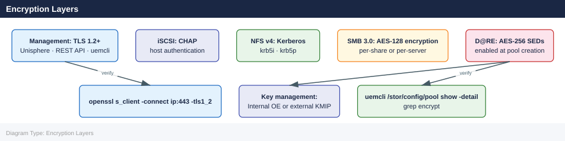

---
tags:
  - dell
  - security
---
# Unity — Encryption

<div class="kb-summary">
Encryption reference covering Encryption Layers, Data at Rest Encryption (D@RE), External Key Management (KMIP), Management Channel Encryption (TLS), iSCSI CHAP Authentication and 4 more sections.

*Applies to: Unity XT*
</div>


## Before you begin

- **Access:** Storage admin credentials (cluster admin or equivalent)
- **Change management:** security changes require CAB approval in most environments
- **Rollback plan:** document current state before any security control change
- **Testing:** validate in a non-production environment first where possible

---

## Encryption Layers

Dell Unity provides encryption at multiple layers. Understanding which layer is active and how to verify it is essential for compliance audits and security assessments.



| Layer | Method | Status by Default | Notes |
|---|---|---|---|
| Data at Rest (D@RE) | AES-256 self-encrypting drives (SEDs) | Disabled (hardware-dependent) | Must be enabled at pool creation; cannot retrofit to existing unencrypted pools without data migration |
| External Key Management | KMIP protocol to external KMS | Optional | Recommended for environments requiring key separation from the array |
| Data in Transit — Management | TLS 1.2+ for Unisphere GUI, REST API, and uemcli | Enabled by default | Disable TLS 1.0 and 1.1 explicitly |
| Data in Transit — iSCSI | CHAP authentication | Disabled by default | Enable per-host; mutual CHAP recommended |
| Data in Transit — NFS | Kerberos (krb5, krb5i, krb5p) | Disabled by default | Requires AD-joined NAS server; NFS v4 only |
| Data in Transit — SMB | SMB signing and encryption | Configurable | SMB 3.0 encryption available for sensitive shares |

## Data at Rest Encryption (D@RE)

D@RE uses AES-256 self-encrypting drives. When a drive is removed from the array, data cannot be read without the encryption key, which is bound to the Unity system. This protects against physical drive theft.

### Verifying D@RE Status

```bash
# Check if D@RE is enabled on the system
uemcli -d <ip> -u admin /sys/security show -detail | grep -i encrypt

# Check D@RE status per pool
uemcli -d <ip> -u admin /stor/config/pool show -detail | grep -i encrypt

# View drive encryption status
uemcli -d <ip> -u admin /stor/config/disk show -detail | grep -i "encrypt\|sed"
```


```text title="Expected output"
Encryption: Yes
Encryption Mode: DARE
Encryption Status: Enabled
Encryption Cipher: AES-256

Pool ID: pool_1
Pool Name: SAS_Pool_01
Encryption: Yes
Encryption Type: DARE
Encryption Status: Active

Pool ID: pool_2
Pool Name: NL_SAS_Pool_02
Encryption: Yes
Encryption Status: Active

Disk 0_0_0
SED: Yes
Encryption Status: Active
Disk 0_0_1
SED: Yes
Encryption Status: Active
Disk 0_0_2
SED: Yes
Encryption Status: Active
...
```

!!! warning "Common errors"
    **`Error: Could not connect to <ip>. Connection refused.`** — Verify the storage array IP address is correct and reachable with `ping <ip>`, and ensure the management interface is responding.
    **`Error: Authentication failed for user 'admin'.`** — Confirm the admin credentials are correct and the user account has not been locked; reset the password via the Unisphere web interface if needed.
    **`Error: Command not found: uemcli`** — Install the UEMCLI package on your management host or add the installation directory to your system PATH environment variable.
In Unisphere: **Settings > Encryption** displays D@RE status and key management configuration.

### Enabling D@RE

D@RE must be enabled at pool creation time. It cannot be applied to an existing pool that was created without encryption. To enable D@RE:

1. Confirm the hardware supports SEDs — not all drive types and Unity models support D@RE. Check the Dell Unity Product Guide for your specific model.
2. Ensure all drives in the pool are SED-capable.
3. Enable encryption when creating the pool in Unisphere (**Storage > Pools > Create Pool**) or via `uemcli`:

```bash
# Create an encrypted pool (requires SED drives)
uemcli -d <ip> -u admin /stor/config/pool create \
    -name pool-encrypted \
    -diskGroup <dg_id> \
    -raidType RAID5 \
    -isDataReductionEnabled true \
    -isEncryptionEnabled true
```


```text title="Expected output"
The operation completed successfully.
Pool ID: pool_1a4f8c2e
Pool Name: pool-encrypted
RAID Type: RAID5
Disk Group: dg_5
Data Reduction: Enabled
Encryption: Enabled
Encryption Cipher: AES-256
SED Status: Active
Pool Capacity: 10.95 TB
Available Capacity: 10.95 TB
```

!!! warning "Common errors"
    **`Error Code: 0x7d000009 - Insufficient SED drives in disk group`** — Verify the disk group contains only Self-Encrypting Drives (SEDs) by running `uemcli -d <ip> -u admin /disk/list` and check the "Encryption Capable" field.
    **`Error Code: 0x7d000015 - Authentication failed`** — Confirm the admin credentials are correct and the user has pool creation privileges by testing connectivity with `uemcli -d <ip> -u admin /system/info`.
    **`Error Code: 0x7d000021 - Disk group does not exist`** — List available disk groups with `uemcli -d <ip> -u admin /diskgroup/list` and replace `<dg_id>` with a valid disk group ID.
4. Verify the pool is marked as encrypted after creation:

```bash
uemcli -d <ip> -u admin /stor/config/pool -id <pool_id> show -detail | grep -i encrypt
```


```text title="Expected output"
Pool Name:                    pool_01
Pool ID:                      pool_01
Encryption:                   Yes
Encryption Cipher:            AES-256
Encryption Key Management:    External (KMIP)
Encryption Status:            Active
Encryption Rekey Progress:    100%
Encryption Algorithm:         AES
```

!!! warning "Common errors"
    **`The system cannot find the path specified.`** — Verify the pool ID exists by running `uemcli -d <ip> -u admin /stor/config/pool show` without the `-id` filter first.
    **`Authentication failed`** — Confirm admin credentials and network connectivity to the Unity array with `ping <ip>` and verify the `-u` username has appropriate permissions.
    **`grep: (standard input) is empty`** — The command executed successfully but returned no encryption data; check if the pool exists or if encryption is not configured on this pool.
### Key Management

By default, D@RE encryption keys are managed internally by Unity OE. For environments requiring separation of key management from the storage array (FIPS compliance, PCI DSS, or DoD requirements), configure an external KMIP-compatible key management server.

| Key Mode | Description | Recommendation |
|---|---|---|
| Internal | Unity manages encryption keys internally | Acceptable for most environments |
| External (KMIP) | Keys stored in an external KMS (Thales, Entrust, HashiCorp Vault) | Required for strong key separation; use for regulated workloads |

## External Key Management (KMIP)

Configure KMIP key management in Unisphere: **Settings > Encryption > Key Management**

```bash
# Show current key management configuration
uemcli -d <ip> -u admin /sys/security/keymanager show

# Configure an external KMIP server
# (Configuration is GUI-driven for certificate exchange; CLI is limited for KMIP)
# In Unisphere: Settings > Encryption > Key Management Servers > Add
```


```text title="Expected output"
Key Management Server Configuration:
  Server Address: 192.168.100.45
  Server Port: 5696
  Protocol: KMIP 1.2
  Status: Connected
  Last Connection: 2024-01-15 14:32:18
  Certificate Validation: Enabled
  Server Certificate CN: kmip-server.corp.local
  Connection Timeout: 30 seconds
  Failover Enabled: Yes
  Secondary Server: 192.168.100.46
  Authentication Method: Certificate-based
```

!!! warning "Common errors"
    **`Error: Connection refused on <ip>:443`** — Verify the Unity array IP is reachable and the management interface is responding with `ping <ip>` and `telnet <ip> 443`.
    **`Error: Authentication failed for user 'admin'`** — Confirm the admin credentials are correct and the user account has not been locked due to failed login attempts.
    **`Error: KMIP server certificate validation failed`** — Import the KMIP server's CA certificate into the Unity array's trusted certificate store via Unisphere before attempting connection.
Steps to configure KMIP:

1. Generate a Certificate Signing Request (CSR) from Unity in Unisphere > **Settings > Encryption > Key Management**.
2. Have the CSR signed by your PKI CA or use a self-signed certificate per the KMS vendor's documentation.
3. Import the signed certificate and the KMS server's CA certificate into Unity.
4. Enter the KMS server IP, port (typically 5696), and client certificate in Unisphere.
5. Test connectivity — Unity connects to the KMS and verifies key retrieval before completing configuration.
6. On the KMS server side, create a key group or policy for the Unity array.

Supported KMIP-compatible KMS solutions include Thales CipherTrust, Entrust KeyControl, SafeNet KeySecure, and HashiCorp Vault (with KMIP plugin).

## Management Channel Encryption (TLS)

All management access — Unisphere GUI, REST API, and uemcli — uses HTTPS. By default, Unity OE enables TLS 1.2 and TLS 1.3. TLS 1.0 and 1.1 are considered deprecated and must be explicitly disabled.

```bash
# Check TLS configuration
uemcli -d <ip> -u admin /sys/security show -detail | grep -i tls

# Disable TLS 1.0 and 1.1 (Unisphere: Settings > Security > TLS Settings)
# CLI command for TLS version restriction varies by OE version:
uemcli -d <ip> -u admin /sys/security set -tlsMinVersion TLSv1_2
```


```text title="Expected output"
TLS Protocol Version: TLSv1.2
TLS Protocol Version: TLSv1.3
TLS Cipher Suites: ECDHE-RSA-AES256-GCM-SHA384, ECDHE-RSA-AES128-GCM-SHA256, AES256-GCM-SHA384
TLS Certificate: CN=unity-array-01.corp.local, O=Dell EMC, C=US
TLS Certificate Expiration: 2025-12-15
TLS Session Cache: Enabled
TLS Handshake Timeout: 30 seconds

The operation completed successfully.
```

!!! warning "Common errors"
    **`Error: The object specified does not exist`** — Verify the array IP address is correct and the management interface is reachable with `ping <ip>`.
    **`Error: Authentication failed`** — Confirm admin credentials are correct and the user account has not been locked after failed login attempts.
    **`Error: The parameter 'tlsMinVersion' is not supported on this OE version`** — Check the array's operating environment version with `uemcli -d <ip> -u admin /sys/about show` and consult Dell EMC documentation for the correct TLS configuration syntax for your OE version.
### Verifying TLS Version from Outside the Array

```bash
# Test which TLS versions the array accepts (from a Linux host)
openssl s_client -connect <sp-ip>:443 -tls1   # Should fail if TLS 1.0 disabled
openssl s_client -connect <sp-ip>:443 -tls1_1 # Should fail if TLS 1.1 disabled
openssl s_client -connect <sp-ip>:443 -tls1_2 # Should succeed
openssl s_client -connect <sp-ip>:443 -tls1_3 # Should succeed if supported

# Check the cipher suites advertised by Unity
nmap --script ssl-enum-ciphers -p 443 <sp-ip>
```


```text title="Expected output"
# openssl s_client -connect 192.168.1.100:443 -tls1
connect:errno=1 error:1409442E:SSL routines:ssl3_read_bytes:tlsv1 alert protocol version

# openssl s_client -connect 192.168.1.100:443 -tls1_1
connect:errno=1 error:1409442E:SSL routines:ssl3_read_bytes:tlsv1 alert protocol version

# openssl s_client -connect 192.168.1.100:443 -tls1_2
CONNECTED(00000003)
depth=1 C=US, O=Dell Inc., CN=Dell Unity CA
verify return:1
depth=0 C=US, O=Dell Inc., CN=unity-sp-a.lab.local
verify return:1
---
Certificate chain
 0 s:C=US, O=Dell Inc., CN=unity-sp-a.lab.local
   i:C=US, O=Dell Inc., CN=Dell Unity CA
---
Server certificate
subject=C=US, O=Dell Inc., CN=unity-sp-a.lab.local
issuer=C=US, O=Dell Inc., CN=Dell Unity CA
---
Cipher   : ECDHE-RSA-AES256-GCM-SHA384
Protocol : TLSv1.2
---

# openssl s_client -connect 192.168.1.100:443 -tls1_3
CONNECTED(00000003)
depth=1 C=US, O=Dell Inc., CN=Dell Unity CA
verify return:1
depth=0 C=US, O=Dell Inc., CN=unity-sp-a.lab.local
verify return:1
---
Cipher   : TLS_AES_256_GCM_SHA384
Protocol : TLSv1.3
---

# nmap --script ssl-enum-ciphers -p 443 192.168.1.100
Starting Nmap 7.92 ( https://nmap.org )
Nmap scan report for unity-sp-a.lab.local (192.168.1.100)
Host is up (0.0042s latency).

PORT    STATE SERVICE
443/tcp open  https

| ssl-enum-ciphers:
|   TLSv1.2:
|     ECDHE-RSA-AES256-GCM-SHA384 - A
|     ECDHE-RSA-AES128-GCM-SHA256 - A
|     ECDHE-RSA-CHACHA20-POLY1305 - A
|   TLSv1.3:
|     TLS_AES_256_GCM_SHA384 - A
|_    TLS_AES_128_GCM_SHA256 - A

Nmap done at Thu Jan 16 14:32:18 2024; 1 IP address (1 host up) scanned in 2.34s
```

!!! warning "Common errors"
    **`connect: Connection refused`** — Verify the SP IP address is correct and port 443 is reachable with `ping` and `telnet <sp-ip> 443`.
    **`error:1409442E:SSL routines:ssl3
Expected result after hardening: TLS 1.0 and 1.1 connections refused; TLS 1.2 and 1.3 accepted; no weak ciphers (RC4, 3DES, NULL) in the cipher list.

## iSCSI CHAP Authentication

CHAP provides authentication for iSCSI sessions, ensuring that only registered hosts can access Unity iSCSI targets.

| CHAP Mode | Description | When to Use |
|---|---|---|
| None | No authentication | Lab environments only |
| One-way CHAP | Unity authenticates the host | Minimum for production iSCSI |
| Mutual CHAP | Unity and host authenticate each other | Recommended; prevents spoofed targets |

```bash
# Configure CHAP credentials on a host object
uemcli -d <ip> -u admin /remote/host -id <host_id> set \
    -chapUser <initiator_username> \
    -chapPassword <initiator_secret>

# For mutual CHAP, also set the reverse credentials
uemcli -d <ip> -u admin /remote/host -id <host_id> set \
    -reverseChapUser <target_username> \
    -reverseChapPassword <target_secret>

# List all hosts and their CHAP configuration
uemcli -d <ip> -u admin /remote/host show -detail | grep -i chap
```


```text title="Expected output"
The operation completed successfully.
The operation completed successfully.
Host ID: host_001
  chapUser: iqn.1991-05.com.example:initiator.host1
  chapPassword: ••••••••
  reverseChapUser: iqn.1991-05.com.example:target.unity01
  reverseChapPassword: ••••••••
Host ID: host_002
  chapUser: iqn.1991-05.com.example:initiator.host2
  chapPassword: ••••••••
  reverseChapUser: iqn.1991-05.com.example:target.unity01
  reverseChapPassword: ••••••••
Host ID: host_003
  chapUser: (not configured)
  reverseChapUser: (not configured)
```

!!! warning "Common errors"
    **`Error: The specified host was not found.`** — Verify the host_id exists on the array using `uemcli -d <ip> -u admin /remote/host show` and correct the `-id` parameter.
    **`Error: Authentication failed. Invalid credentials.`** — Confirm the admin username and password are correct, or use `-p` flag to prompt for password interactively.
    **`Error: Connection refused. Unable to reach management interface.`** — Verify the array IP address is reachable and the management interface is online using `ping <ip>`.
CHAP secrets must be 12–16 characters. Use unique secrets per host — do not reuse the same CHAP secret across multiple hosts.

## NFS Kerberos Encryption

NFS v4 with Kerberos provides authentication, optional integrity checking, and optional encryption for NFS traffic.

| Security Mode | Auth | Integrity | Privacy | Use Case |
|---|---|---|---|---|
| `sys` | UID/GID | None | None | Trusted networks only |
| `krb5` | Kerberos | None | None | Identity verification without data protection |
| `krb5i` | Kerberos | Yes | None | Recommended — auth + integrity without performance overhead |
| `krb5p` | Kerberos | Yes | Yes (encrypted) | Maximum security; use for sensitive data over untrusted networks |

```bash
# Create an NFS export with Kerberos integrity
uemcli -d <ip> -u admin /prot/nfs create \
    -server <nas_id> \
    -fs <fs_id> \
    -path / \
    -securityFlavors krb5i

# Modify an existing NFS export to require Kerberos
uemcli -d <ip> -u admin /prot/nfs -id <nfs_id> set \
    -securityFlavors krb5i

# Show NFS export security configuration
uemcli -d <ip> -u admin /prot/nfs show -detail | grep -i "security\|krb"
```


```text title="Expected output"
Create NFS export with Kerberos integrity
NFS export created successfully.
ID: nfs_1234567890

Modify NFS export security
NFS export modified successfully.

NFS Export Security Configuration
ID                          nfs_1234567890
Name                        fs_export_prod
Security Flavors            krb5i
Kerberos Realm              CORP.EXAMPLE.COM
Allow Unmapped Users        No
Anonymous UID               4294967295
Anonymous GID               4294967295
Default Access              Read-Write
Kerberos Encryption         AES-256-CTS-HMAC-SHA1-96
```

!!! warning "Common errors"
    **`Error: Invalid NAS server ID <nas_id>`** — Verify the NAS server ID exists with `uemcli -d <ip> -u admin /nas show` and use the correct ID value.
    **`Error: Security flavor krb5i is not supported on this system`** — Confirm Kerberos licensing is enabled on the Unity array and NFS service supports krb5i with `uemcli -d <ip> -u admin /prot/nfs show`.
    **`Error: Access denied. User admin does not have permission to modify NFS exports`** — Ensure the admin user has Storage Administrator or equivalent role assigned in the Unity management interface.
## SMB Encryption

SMB 3.0 supports per-share or per-server encryption for SMB traffic in transit. When enabled, data is encrypted between the SMB client and the Unity NAS server using AES-128-CCM or AES-128-GCM.

```bash
# Enable SMB encryption on a NAS server (all shares on the server)
uemcli -d <ip> -u admin /prot/smb/server -id <nas_id> set \
    -isEncryptionEnabled true

# Enable SMB encryption on a specific share
# (Unisphere: Storage > File > File Systems > [fs] > SMB Shares > [share] > Edit > Encryption)
```


```text title="Expected output"
The operation completed successfully.
```

!!! warning "Common errors"
    **`Authentication failed`** — Verify the admin credentials and ensure the management IP is reachable with `ping <ip>`.
    **`Error: NAS server not found or invalid <nas_id>`** — Confirm the NAS server ID exists by running `uemcli -d <ip> -u admin /prot/smb/server list` to retrieve valid server identifiers.
SMB encryption requires Windows 8/Windows Server 2012 or later on the client side. Older clients connecting to an encryption-required server will be denied access.

## FIPS 140-2 Mode

Unity OE uses FIPS 140-2 validated cryptographic modules. FIPS mode restricts the cipher suites and algorithms available for management connections to FIPS-approved options only.

```bash
# Check FIPS mode status
uemcli -d <ip> -u admin /sys/security show -detail | grep -i fips
```


```text title="Expected output"
FIPS Mode:                                    Enabled
FIPS Certificates:                            Valid
FIPS Certification Level:                     FIPS 140-2 Level 2
FIPS Mode Last Changed:                       2024-01-15 14:32:18
FIPS Compliance Status:                       Compliant
```

!!! warning "Common errors"
    **`Error: Connection refused`** — Verify the Dell Unity array IP address is correct and the management interface is reachable with `ping <ip>`.
    **`Error: Authentication failed`** — Confirm the admin credentials are correct and the user account has sufficient privileges to query security settings.
    **`Error: Command not found: uemcli`** — Install the Dell EMC Unity CLI package or ensure it is in your system PATH.
In Unisphere: **Settings > Security** — FIPS mode is shown and can be toggled. Enabling FIPS mode may disable some legacy cipher suites and require clients to support FIPS-approved TLS ciphers.

**Impact of enabling FIPS mode:**
- TLS connections restricted to FIPS-approved cipher suites (no RC4, no export ciphers).
- Some older management clients or monitoring tools using non-FIPS ciphers will be unable to connect.
- Test FIPS mode in a lab environment before enabling on production systems.

## Encryption Compliance Summary

| Requirement | Unity Capability | Verification |
|---|---|---|
| Encryption at rest (AES-256) | D@RE with SEDs | `uemcli /stor/config/pool show -detail | grep encrypt` |
| Encryption key management | Internal or external KMIP | `uemcli /sys/security/keymanager show` |
| Encryption in transit — management | TLS 1.2+ | `openssl s_client -connect <ip>:443 -tls1_2` |
| Encryption in transit — iSCSI | Mutual CHAP + IPSec (if required) | `uemcli /remote/host show -detail | grep chap` |
| Encryption in transit — NFS | Kerberos (krb5i or krb5p) | `uemcli /prot/nfs show -detail | grep security` |
| Encryption in transit — SMB | SMB 3.0 encryption | `uemcli /prot/smb/server show -detail | grep encrypt` |
| FIPS 140-2 | FIPS mode supported | `uemcli /sys/security show | grep fips` |

---

## See also

- [Unity — Hardening](../hardening/)
- [Unity — Authentication](../authentication/)
- [Unity — Access Control](../access-control/)
