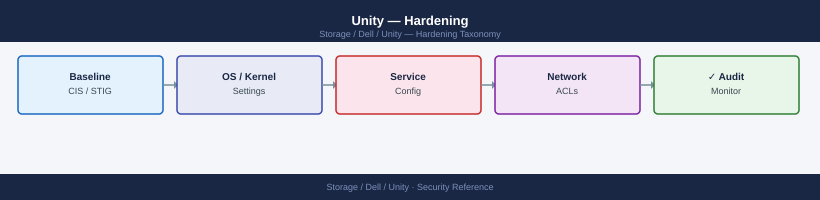
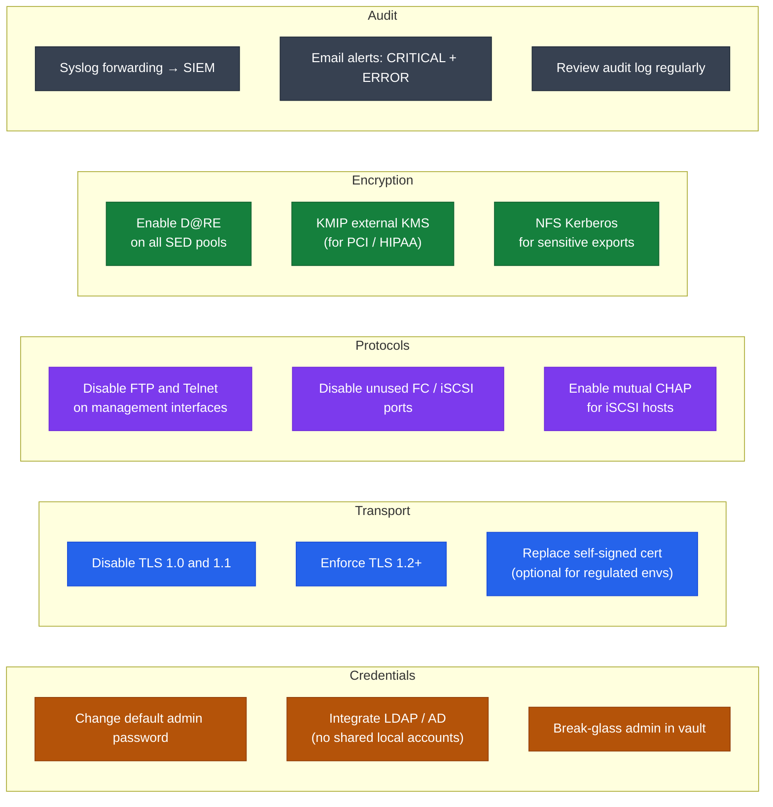

---
tags:
  - dell
  - security
---
# Unity — Hardening

<div class="kb-summary">
Hardening reference covering Hardening Overview, Hardening Checklist, Credentials, Transport Security, Protocol Restrictions and 5 more sections.

*Applies to: Unity XT*
</div>


## Before you begin

- **Access:** Storage admin credentials (cluster admin or equivalent)
- **Change management:** security changes require CAB approval in most environments
- **Rollback plan:** document current state before any security control change
- **Testing:** validate in a non-production environment first where possible

---

## Hardening Overview

Apply these hardening steps to all Unity deployments before handing over to production operations. Each step reduces the attack surface, limits privilege exposure, or ensures audit trails are in place.



## Hardening Checklist

| Category | Control | How to Verify |
|---|---|---|
| Credentials | Change default admin password on first login | Confirm password meets policy; store in secrets manager |
| Credentials | Rename or restrict built-in admin account | Avoid predictable account names for privileged access |
| Transport | Disable TLS 1.0 and 1.1 | `openssl s_client -connect <ip>:443 -tls1` should fail |
| Transport | Enforce TLS 1.2 or higher | `openssl s_client -connect <ip>:443 -tls1_2` should succeed |
| Protocols | Disable FTP on management interfaces | `uemcli /sys/security show | grep ftp` |
| Protocols | Disable Telnet on management interfaces | `uemcli /sys/security show | grep telnet` |
| Protocols | Disable unused SP ports (FC, iSCSI) | Unisphere > **System > Hardware > Ports** |
| Access | Restrict management access to known subnets | Unisphere > **Settings > Security > Management Interfaces** |
| Access | Implement RBAC — no shared administrator accounts | `uemcli /user show` — each operator has an individual account |
| Access | Integrate LDAP/AD — no local accounts for operational use | `uemcli /user/ldap show` |
| Encryption | Enable D@RE on all flash and SAS SED pools | `uemcli /stor/config/pool show -detail | grep encrypt` |
| Encryption | CHAP for iSCSI (mutual where supported) | `uemcli /remote/host show -detail | grep chap` |
| Encryption | NFS Kerberos for sensitive NFS exports | `uemcli /prot/nfs show -detail | grep security` |
| Audit | Enable syslog forwarding to SIEM | `uemcli /sys/syslog show` |
| Audit | Enable email alerting for CRITICAL and ERROR alerts | Unisphere > **Settings > Alerts > Email Notifications** |
| Support | Enable SupportAssist (ESRS) | Unisphere > **Settings > Support > SupportAssist** |
| Patching | Run current recommended OE version | `uemcli /sys/sw show` |
| Certificates | Replace self-signed management certificate (optional, for regulated environments) | Unisphere > **Settings > Security > Certificates** |

## Credentials

### Default Admin Password

Change the built-in `admin` password immediately after first login. The factory default password is documented in Dell's installation guides and is publicly known.

```bash
# Change the admin password
uemcli -d <ip> -u admin /user -name admin set -passwd "NewStrongPassword1!"
```


```text title="Expected output"
The command completed successfully.
User 'admin' password has been changed.
```

!!! warning "Common errors"
    **`Error: The system is unable to connect to the specified management server.`** — Verify the Dell Unity array IP address is correct and reachable from your management host using `ping <ip>`.
    **`Error: Authentication failed. Invalid username or password.`** — Ensure you are currently authenticated with valid admin credentials before attempting to change the password.
Requirements for a strong password:
- Minimum 16 characters.
- Mix of uppercase, lowercase, digits, and special characters.
- Not based on dictionary words, product names, or predictable patterns.
- Store in a secrets manager (HashiCorp Vault, CyberArk, or equivalent). Do not store in spreadsheets or plain-text files.

### Service Account Accounts

For LDAP integration and automation scripts:

- Use dedicated service accounts for LDAP bind operations — do not use personal accounts or domain admin accounts.
- Assign the minimum role necessary: most monitoring and automation needs only **Operator** or **Storage Administrator** — not **Administrator**.
- Rotate service account credentials at least annually or after any personnel change.

## Transport Security

### Disabling TLS 1.0 and 1.1

TLS 1.0 and 1.1 contain known vulnerabilities (POODLE, BEAST) and have been deprecated by all major standards bodies. Disable them explicitly.

In Unisphere: **Settings > Security > TLS Settings**

```bash
# Set minimum TLS version (varies by OE version; consult release notes)
uemcli -d <ip> -u admin /sys/security set -tlsMinVersion TLSv1_2

# Verify TLS version after change (from a separate Linux host)
openssl s_client -connect <sp-ip>:443 -tls1    2>&1 | grep -E "handshake|alert"
openssl s_client -connect <sp-ip>:443 -tls1_1  2>&1 | grep -E "handshake|alert"
openssl s_client -connect <sp-ip>:443 -tls1_2  2>&1 | grep "CONNECTED"
```


```text title="Expected output"
# Set minimum TLS version (varies by OE version; consult release notes)
The operation completed successfully.

# Verify TLS version after change (from a separate Linux host)
alert handshake failure
alert handshake failure
CONNECTED(00000003)
```

!!! warning "Common errors"
    **`uemcli: command not found`** — Install the EMC CLI tools package or add the uemcli binary directory to your PATH.
    **`alert handshake failure`** — This is expected output when testing disabled TLS versions; if TLSv1_2 also shows handshake failure, verify the array accepted the setting with `uemcli -d <ip> -u admin /sys/security show -tlsMinVersion`.
    **`connect: Connection refused`** — Ensure the storage processor IP is correct and reachable from your Linux host, and that the array's management interface is online.
### Replacing the Self-Signed Management Certificate

By default, Unity uses a self-signed certificate for the Unisphere HTTPS management interface. For production environments, replace this with a certificate signed by your internal CA or a commercial CA:

1. Generate a Certificate Signing Request (CSR) in Unisphere: **Settings > Security > Certificates > Generate CSR**.
2. Submit the CSR to your CA and obtain a signed certificate.
3. Import the signed certificate: **Settings > Security > Certificates > Import Certificate**.
4. Verify the certificate is applied: access Unisphere via HTTPS and confirm the browser shows the correct certificate.

Replacing the certificate eliminates certificate warnings for operators and allows certificate pinning in monitoring tools.

## Protocol Restrictions

### Disabling FTP and Telnet

Unity management interfaces may optionally support FTP and Telnet for legacy compatibility. Both protocols transmit credentials in plain text and must be disabled.

In Unisphere: **Settings > Security > Management Protocols**

```bash
# Verify current management protocol configuration
uemcli -d <ip> -u admin /sys/security show -detail | grep -E "ftp|telnet|ssh"
```


```text title="Expected output"
FTP_Enabled                                    false
Telnet_Enabled                                 false
SSH_Enabled                                    true
SSH_Port                                       22
```

!!! warning "Common errors"
    **`Error: The system is not responding to management requests`** — Verify the Dell Unity array IP address is correct and reachable with `ping <ip>`, and confirm the management interface is online.
    **`Error: Authentication failed`** — Ensure the admin user credentials are correct and the account has not been locked after failed login attempts; reset via the Unisphere GUI if needed.
Only SSH and HTTPS should be enabled for management access.

### Disabling Unused Host Ports

Unused FC or iSCSI host ports expose additional attack surface. If specific SFP-equipped ports are permanently unused, consider:

1. Not installing SFPs in unused port bays.
2. Tracking unused ports in your asset inventory and reviewing quarterly.
3. If software-level port disable is supported, disable the port in Unisphere: **System > Hardware > Storage Processors > [SP] > Ports**.

```bash
# List all FC ports and their status
uemcli -d <ip> -u admin /net/port/fc show -detail

# List all iSCSI ports and their status
uemcli -d <ip> -u admin /net/port/eth show -detail
```


```text title="Expected output"
FC Port Information:
  SP Name: SP A
  Port ID: 0
  Port Name: FC0
  Status: Link Up
  Speed: 8 Gbps
  WWN: 50:00:14:40:5d:2b:a1:c0
  Connected Devices: 3

  SP Name: SP B
  Port ID: 0
  Port Name: FC0
  Status: Link Up
  Speed: 8 Gbps
  WWN: 50:00:14:40:5d:2b:a1:c1
  Connected Devices: 2

iSCSI Port Information:
  SP Name: SP A
  Port ID: 0
  Port Name: eth0
  Status: Link Up
  Speed: 1 Gbps
  IP Address: 192.168.1.50
  Subnet Mask: 255.255.255.0
  MTU: 1500

  SP Name: SP B
  Port ID: 0
  Port Name: eth0
  Status: Link Up
  Speed: 1 Gbps
  IP Address: 192.168.1.51
  Subnet Mask: 255.255.255.0
  MTU: 1500
```

!!! warning "Common errors"
    **`Authentication failed: Invalid credentials`** — Verify the admin username and password, or use `-p` flag to prompt for password interactively.
    **`Error: Unable to connect to <ip>. Connection refused.`** — Confirm the Unity array IP address is reachable and the management interface is accessible on port 443.
    **`Error: Command not found: uemcli`** — Install the EMC Unity CLI package or ensure the uemcli binary is in your system PATH.
## Management Access Restrictions

Restrict which source IP addresses can access Unity management interfaces. Only the storage management VLAN, jump hosts, and monitoring servers should have access.

In Unisphere: **Settings > Security > Management Interfaces**

Configuration approach:
- Define an allowlist of management source subnets.
- Block access from production workload VLANs.
- Verify the restriction does not block SupportAssist outbound connectivity — SupportAssist uses HTTPS outbound to Dell; incoming management access restrictions do not affect it.

```bash
# Show current management interface configuration
uemcli -d <ip> -u admin /net/if show -detail | grep -i mgmt
```


```text title="Expected output"
Management/0                    SP A                    10.45.120.15            255.255.255.0           10.45.120.1             Yes                     Yes
Management/1                    SP B                    10.45.120.16            255.255.255.0           10.45.120.1             Yes                     Yes
IPv4 Address:                   10.45.120.15
Netmask:                        255.255.255.0
Gateway:                        10.45.120.1
MTU:                            1500
Speed:                          1000 Mbps
Duplex:                         Full
```

!!! warning "Common errors"
    **`The system cannot find the file specified.`** — Ensure uemcli is installed and in your system PATH, or use the full path to the binary (typically `/opt/emc/uemcli/uemcli`).
    **`Connection refused`** — Verify the Dell Unity array IP address is correct, reachable, and that the management interface is online with `ping <ip>`.
    **`Authentication failed`** — Confirm the admin credentials are correct and the user account has sufficient privileges to query network interface details.
## Alerting and Monitoring

Configure email and SNMP alerting to ensure all security-relevant events are actioned promptly.

### Email Notifications

In Unisphere: **Settings > System > Notifications > Email**

Configure email alerts for:
- **CRITICAL** severity: immediate on-call notification.
- **ERROR** severity: within-hours response.
- **WARNING** severity: daily digest review.

```bash
# List configured email notification rules
uemcli -d <ip> -u admin /sys/email show

# Create an email notification
uemcli -d <ip> -u admin /sys/email create \
    -smtpServer mail.example.local \
    -smtpPort 25 \
    -toList storage-alerts@corp.local \
    -fromAddress unity-alerts@corp.local
```


```text title="Expected output"
Email Notification Settings
IP Address: 192.168.1.50
SMTP Server: mail.example.local
SMTP Port: 25
To List: storage-alerts@corp.local
From Address: unity-alerts@corp.local
TLS Enabled: No
Authentication Required: No
Test Email Status: Not Sent
Last Configuration Change: 2024-01-15 14:32:18
Request completed successfully with status: 0x0.
```

!!! warning "Common errors"
    **`Error: The SMTP server is not reachable on port 25`** — Verify network connectivity to mail.example.local and confirm the SMTP port is open in firewall rules.
    **`Error: Authentication failed for user admin`** — Ensure the admin credentials are correct and the user has sufficient privileges; use `-p` flag to provide password interactively if needed.
    **`Error: Invalid email address format in -toList parameter`** — Verify all email addresses follow standard format (user@domain.local) with no spaces or special characters.
### SNMP

```bash
# Configure SNMP v2c
uemcli -d <ip> -u admin /sys/snmp create \
    -version v2c \
    -community public \
    -addr <snmp_manager_ip>

# Configure SNMP v3 (recommended over v2c)
uemcli -d <ip> -u admin /sys/snmp create \
    -version v3 \
    -username snmpmonitor \
    -authProto SHA \
    -authPasswd "AuthPassword1!" \
    -privProto AES \
    -privPasswd "PrivPassword1!" \
    -addr <snmp_manager_ip>

# List SNMP configuration
uemcli -d <ip> -u admin /sys/snmp show
```


```text title="Expected output"
The operation completed successfully.
The operation completed successfully.
SNMP Configuration:
  Version:           v3
  Username:          snmpmonitor
  Auth Protocol:     SHA
  Priv Protocol:     AES
  Manager Address:   192.168.1.50
  Engine ID:         800007E5-7D2A4F1B-C9E3-42F6
  Trap Port:         162
  Status:            Enabled
```

!!! warning "Common errors"
    **`Authentication failed: Invalid credentials for admin user`** — Verify the Unity array IP address is correct and admin credentials are valid with `uemcli -d <ip> -u admin /sys/general show`.
    **`SNMP version v2c is not supported on this system`** — Use SNMP v3 instead, as v2c may be disabled by default on newer Unity firmware versions.
    **`Invalid password: Password does not meet complexity requirements`** — Ensure auth and priv passwords contain at least 8 characters with uppercase, lowercase, numbers, and special characters.
Use SNMP v3 with authentication and privacy (authPriv) in all environments. SNMP v2c community strings are transmitted in plain text and are vulnerable to interception.

## SupportAssist (ESRS)

SupportAssist (formerly ESRS/SRS) enables Dell to proactively monitor Unity health, auto-create cases for hardware faults, and provide remote diagnostic access when requested.

```bash
# Check SupportAssist status
uemcli -d <ip> -u admin /sys/esrs show

# Enable SupportAssist
uemcli -d <ip> -u admin /sys/esrs set -enabled true

# Send a test heartbeat to verify connectivity to Dell
uemcli -d <ip> -u admin /sys/esrs callhome -type heartbeat
```


```text title="Expected output"
# Check SupportAssist status
ESRS Status:
  Enabled: true
  Contact Phone: +1-800-555-0123
  Primary Contact: admin@company.com
  Last Heartbeat: 2024-01-15 14:32:18 UTC
  Connection Status: Connected
  Gateway IP: 192.168.1.254

# Enable SupportAssist
ESRS configuration updated successfully.
  Enabled: true
  Effective immediately

# Send a test heartbeat to verify connectivity to Dell
Heartbeat transmission initiated.
  Message ID: HB-20240115-a7f3c9e2
  Destination: Dell ESRS Gateway
  Status: Sent successfully
  Response received: ACK (2024-01-15 14:33:05 UTC)
```

!!! warning "Common errors"
    **`Error: Connection refused on <ip>:443`** — Verify the Unity array IP address is correct and reachable from your management network, and that port 443 is not blocked by firewall rules.
    **`Error: Authentication failed for user 'admin'`** — Confirm the admin credentials are correct and the user account has not been locked due to failed login attempts.
    **`Error: ESRS gateway unreachable - heartbeat timeout after 30s`** — Check that the Unity array has outbound HTTPS connectivity to Dell's ESRS servers and that any proxy/firewall rules allow the connection.
SupportAssist does not provide Dell with unrestricted access to the array. Remote diagnostic sessions require explicit acceptance from an administrator before Dell support can connect.

## OE Patching

Run the current recommended Unity OE version. Outdated OE versions contain known security vulnerabilities and bugs that are fixed in later releases.

```bash
# Check current OE version
uemcli -d <ip> -u admin /sys/sw show

# Check for available upgrades (if connected to Dell network via SupportAssist)
# Unisphere > Maintenance > Software Upgrades > Check for Updates
```


```text title="Expected output"
A/SN: APM00123456789
B/SN: APM00123456790
Installed Version: OE 4.7.1.0 (Build 1234)
Release Date: 2023-11-15
Upgrade Available: OE 4.8.0.1 (Build 5678)
Current Status: Healthy
Last Check: 2024-01-10 14:32:15
SupportAssist Connected: Yes
Recommended Action: Schedule upgrade during maintenance window
```

!!! warning "Common errors"
    **`Connection refused (111)`** — Verify the Unity array IP is reachable with `ping <ip>` and confirm uemcli is installed with `which uemcli`.
    **`Authentication failed for user 'admin'`** — Reset the admin password in Unisphere or use `-p` flag to provide the correct password interactively.
    **`Command not found: uemcli`** — Install the EMC CLI tools package or add the uemcli binary directory to your PATH environment variable.
Maintain a Unity OE upgrade cadence:
- Apply security-focused patch releases within 90 days of availability.
- Apply major OE version upgrades within the lifecycle support window.
- Review Dell Security Advisories for Unity at [https://www.dell.com/support/security](https://www.dell.com/support/security).

## Compliance Notes

| Standard | Unity Capability | Key Controls |
|---|---|---|
| FIPS 140-2 | Unity OE uses FIPS 140-2 validated cryptographic modules; FIPS mode available | Enable FIPS mode in Unisphere > Settings > Security |
| DISA STIG | Dell publishes Unity STIGs for DoD environments | Download from DISA STIG Viewer; apply applicable findings |
| PCI DSS | D@RE, TLS enforcement, RBAC, audit logging, and network segmentation support PCI DSS controls | Controls span multiple requirement areas; map Unity capabilities to PCI scope boundary |
| HIPAA | Encryption at rest and in transit, access logging, and RBAC support HIPAA technical safeguards | Document encryption and access control as part of your HIPAA technical safeguard evidence |
| ISO 27001 | Unity's RBAC, audit logging, and encryption controls support multiple ISO 27001 Annex A controls | Map Unity controls to your ISMS in the Statement of Applicability |

For regulated environments, supplement Unity's built-in controls with:
- Network segmentation (dedicated storage VLAN with ACLs).
- Vulnerability scanning of the management interface IPs.
- Quarterly review of Unity user accounts and role assignments.
- Annual penetration testing of the storage management network segment.

---

## See also

- [Unity — Authentication](../authentication/)
- [Unity — Access Control](../access-control/)
- [Unity — Encryption](../encryption/)
