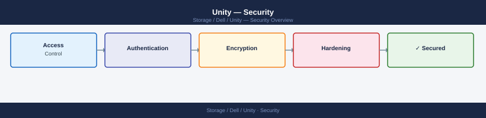

---
tags:
  - dell
  - security
---
# Unity — Security

Unity hardening — management access control, audit logging, replication channel security, and NAS share permissions.

*Applies to: Unity XT*

<a class="kb-card" href="authentication/">
  <strong>Authentication</strong>
  Active Directory, LDAP integration, and audit logging.
</a>

<a class="kb-card" href="access-control/">
  <strong>Access Control</strong>
  RBAC roles and permissions for Unisphere.
</a>

<a class="kb-card" href="encryption/">
  <strong>Encryption</strong>
  Data at rest, data in flight, and key management.
</a>

<a class="kb-card" href="hardening/">
  <strong>Hardening</strong>
  Security hardening checklist and compliance notes.
</a>

