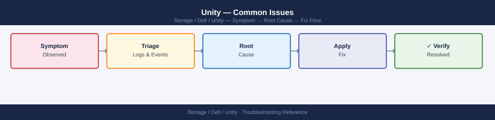

---
tags:
  - dell
  - troubleshooting
search:
  boost: 1.5
---
# Unity — Common Issues

<div class="kb-summary">
Common Issues reference covering Common Issues Reference, Incident Triage Sequence, Known Behaviours (Not Bugs).

*Applies to: Unity XT*
</div>


```d2
direction: down

symptom: Identify Symptom {shape: diamond}
diagnostic_flow: "Diagnostic Flow" {shape: rectangle}
common_issues_reference: "Common Issues Reference" {shape: rectangle}
incident_triage_sequence: "Incident Triage Sequence" {shape: rectangle}
known_behaviours_not_bugs: "Known Behaviours (Not Bugs)" {shape: rectangle}
verify_resolution: "Verify resolution" {shape: rectangle}
resolution: Resolve or Escalate {shape: oval}

symptom -> diagnostic_flow: investigate
symptom -> common_issues_reference: investigate
symptom -> incident_triage_sequence: investigate
symptom -> known_behaviours_not_bugs: investigate
symptom -> verify_resolution: investigate
diagnostic_flow -> resolution
common_issues_reference -> resolution
incident_triage_sequence -> resolution
known_behaviours_not_bugs -> resolution
verify_resolution -> resolution
```

## Diagnostic Flow

```d2
direction: right

D1: "D1" {shape: rectangle}
R1: "See Storage Processors —\nOne SP offline: open Dell case" {shape: rectangle}
R2: "See Storage Processors —\nBoth SPs offline: P1 case" {shape: rectangle}
D2: "D2" {shape: rectangle}
R3: "See Block Storage —\nLUN not visible to FC host" {shape: rectangle}
R4: "See Block Storage —\nLUN not visible to iSCSI host" {shape: rectangle}
D3: "D3" {shape: rectangle}
R5: "See Pool and Capacity —\nPool capacity alert at 80%" {shape: rectangle}
R6: "See Replication —\nReplication session in Error state" {shape: rectangle}
D4: "D4" {shape: rectangle}
R7: "See NAS / File Storage —\nNAS server not responding after SP failover" {shape: rectangle}
R8: "See NAS / File Storage —\nSMB share inaccessible" {shape: rectangle}
D5: "D5" {shape: rectangle}
R9: "See Pool and Capacity —\nPool health Degraded" {shape: rectangle}
R10: "See Pool and Capacity —\nPool over-subscribed warning" {shape: rectangle}
S: "What is the symptom?" {shape: rectangle}
B1: "B1" {shape: rectangle}
B2: "B2" {shape: rectangle}
B3: "B3" {shape: rectangle}
B4: "B4" {shape: rectangle}
B5: "B5" {shape: rectangle}

D1 -> R1
D1 -> R2
D2 -> R3
D2 -> R4
D3 -> R5
D3 -> R6
D4 -> R7
D4 -> R8
D5 -> R9
D5 -> R10
```

---

## Before you begin

- **Access:** Storage admin credentials (cluster admin or equivalent)
- **Gather first:** recent error message text, event timestamps, and affected object names
- **Scope:** confirm whether the issue affects a single object, host, cluster, or site
- **Escalation:** open a vendor support ticket before running any destructive step
- **Logging:** document each command and output — required if escalation is needed

---

## Common Issues Reference

### Block Storage (FC / iSCSI)

| Symptom | Likely Cause | Diagnostic Steps | Resolution |
|---|---|---|---|
| LUN not visible to FC host after provisioning | Host not registered, FC zone not active, or LUN not mapped | Check `uemcli /remote/host show` for the host; check `uemcli /stor/config/lunacl show` for LUN access | Register host and initiator WWNs in Unisphere > Hosts; verify FC zone contains both host HBA WWNs and Unity SP port WWNs; confirm LUN ACL maps to the host |
| LUN not visible to iSCSI host | IQN not registered, iSCSI portal unreachable, or CHAP mismatch | `uemcli /remote/host show -detail`; `uemcli /net/if show` for iSCSI interface IPs; check iSCSI initiator connection log on host | Add host IQN in Unisphere > Hosts; confirm iSCSI portal IP is reachable from host; verify CHAP credentials match between host and Unity |
| LUN disappeared from host (not a planned failover) | SP failover — host I/O redirected to peer SP; multipath driver may not have recovered | `uemcli /env/sp show` — is one SP offline? `uemcli /env/health show -filter "health.value ne OK"` | If SP failover, wait for multipath to re-path (30–60 seconds); rescan HBAs on host; if SP remains offline, open Dell support case |
| LUN visible to host but I/O errors | Pool degraded, disk fault in RAID group, or cache issue | `uemcli /stor/config/pool show -detail`; `uemcli /stor/config/dg show -detail`; check Unisphere alerts | Resolve disk fault or pool degradation; check RAID rebuild progress; do not expand or change pool during rebuild |
| Cannot expand LUN | Pool does not have sufficient free space | `uemcli /stor/config/pool show -detail | grep -E "Size|Free"` | Expand the pool by adding disk groups; delete unneeded LUNs or snapshots to reclaim space |
| LUN delete fails | LUN is still mapped to a host or has dependent snapshots | `uemcli /stor/config/lunacl show`; `uemcli /prot/snap show -res <lun_id>` | Remove all host access entries; delete all snapshots; then delete the LUN |

### NAS / File Storage

| Symptom | Likely Cause | Diagnostic Steps | Resolution |
|---|---|---|---|
| NFS mount fails with "No route to host" | NAS server interface IP unreachable | Ping the NAS server IP from client; `uemcli /net/nas/if show -detail` | Confirm NAS file interface IP is configured and the port is up; check VLAN and routing between client and NAS server |
| NFS mount fails with "Permission denied" | NFS export access control does not include client IP | `uemcli /prot/nfs show -detail` — check `rwHosts`, `roHosts` | Add client IP or subnet to the export access list |
| NFS stale file handle after maintenance | Client cached SP IP that has moved to peer SP, or NAS server restarted | Check current NAS server IP with `uemcli /net/nas/if show` | Remount the NFS export on affected clients; use the NAS server hostname (DNS-resolvable) rather than a hard-coded IP |
| SMB share inaccessible | NAS server lost AD connectivity or Kerberos tickets expired | `uemcli /nas/ad show`; check domain controller reachability from NAS server IP | Verify DNS resolves AD domain; check DC connectivity; re-join AD if the machine account was reset |
| File system full — cannot write | File system has hit its provisioned size limit | `uemcli /stor/config/fs show -detail | grep -E "Size|Used"` | Expand the file system: `uemcli /stor/config/fs -id <fs_id> set -size <new_size>` |
| NAS server not responding after SP failover | NAS file interfaces moved to peer SP; client DNS or cached IP still points to old SP | `uemcli /nas/server show | grep SP` — confirm NAS server SP ownership | Wait 30–60 seconds for NAS to come online on the peer SP; remount NFS or reconnect SMB from clients |
| CIFS/SMB access denied despite correct AD credentials | Time skew > 5 minutes between client, NAS server, and domain controller | Check system time on Unity; `uemcli /sys/ntp show` | Sync NTP on Unity and clients; ensure all systems use the same NTP source |

### Replication

| Symptom | Likely Cause | Diagnostic Steps | Resolution |
|---|---|---|---|
| Replication session in Error state | Network interruption between source and destination; destination array unreachable | `uemcli /prot/rep/session -id <id> show -detail`; ping destination array management IP from source; check Unisphere alerts | Resolve network connectivity issue; resume session: `uemcli /prot/rep/session -id <id> resume` |
| Replication session in Paused state | Manual pause by operator, or destination pool full | `uemcli /prot/rep/session show -detail` | Resume if pause was unintended: `uemcli /prot/rep/session -id <id> resume`; or resolve pool capacity at destination before resuming |
| Replication lag growing | Network bandwidth insufficient, or source write rate exceeds replication throughput | Check network utilisation between source and destination; `uemcli /prot/rep/session -id <id> show -detail | grep -i lag` | Evaluate bandwidth; consider QoS or scheduling replication during lower-activity periods; review RPO requirements |
| Cannot create replication session | No replication connection between source and destination; license not installed | `uemcli /prot/rep/connect show` | Create a replication connection to the destination array; verify replication license with `uemcli /sys/lic show` |
| Destination LUN is not accessible after failover | LUN is in replica (read-only) state until failover is complete | `uemcli /prot/rep/session show -detail` — check failover state | Complete the failover operation: `uemcli /prot/rep/session -id <id> failover` |

### Pool and Capacity

| Symptom | Likely Cause | Diagnostic Steps | Resolution |
|---|---|---|---|
| Pool health = Degraded | Drive failure in a RAID group; rebuild in progress | `uemcli /stor/config/disk show -detail | grep -v Normal`; `uemcli /stor/config/dg show -detail` | Identify faulted drive; arrange physical replacement; monitor rebuild progress in Unisphere |
| Pool over-subscribed warning | Sum of thin LUN allocated sizes exceeds physical pool capacity | `uemcli /stor/config/pool show -detail | grep -E "Subscribed|Total"` | Reclaim space by deleting unneeded LUNs/snapshots; expand pool; enforce allocation controls on new LUN requests |
| Pool capacity alert at 80% | Snapshot accumulation or LUN growth consuming space faster than expected | `uemcli /prot/snap show -detail | grep Size`; check LUN consumption vs. provisioned size | Delete expired snapshots; expand pool; add disk groups |
| Unity auto-deleted snapshots | Pool free space fell below 5%; Unity protection mechanism triggered | Check Unisphere alerts for snapshot auto-deletion events | Immediate: add capacity or delete large LUNs; preventive: set alerts at 70% and 80% to catch this before Unity intervenes |
| FAST Cache health degraded | A FAST Cache drive has failed | `uemcli /stor/config/disk show -detail | grep -i fast` | Replace the failed FAST Cache drive; Unity rebuilds FAST Cache automatically |

### Storage Processors and Hardware

| Symptom | Likely Cause | Diagnostic Steps | Resolution |
|---|---|---|---|
| One SP offline | Hardware failure (memory, CPU, power), OE software panic, or planned maintenance | `uemcli /env/sp show`; `uemcli /env/health show -filter "health.value ne OK"`; check SP fault LEDs on chassis | Peer SP takes over automatically; open Dell support case for unplanned SP offline; for planned maintenance, verify peer SP is healthy before starting |
| Write cache warning — "Write cache dirty" | SP interconnect link lost; cache cannot mirror to partner | `uemcli /env/health show`; check SP interconnect port status | Restore SP interconnect; if both SPs are up and interconnect is up but alert persists, open support case |
| Both SPs offline (system completely unavailable) | Power loss (both SPs lost power simultaneously), or a cascading software fault | Check physical power — UPS, PDU, and power supply status; check management network | Restore power; if both SPs come back and pool is degraded, run `uemcli /env/health show` for detail; open P1 support case |
| SP temperature alert | Inadequate airflow, ambient temperature too high, or blocked air filters | Check Unisphere > System > Hardware for temperature readings; `uemcli /env/sp show -detail | grep -i temp` | Verify datacenter cooling; check/clean air filters on enclosure; ensure front-to-back airflow is unobstructed |
| Battery (BBU) low or failed | BBU has reached end of life or charging circuit fault | `uemcli /sys/battery show -detail` | Replace BBU module; Unity will restrict write cache usage until BBU is replaced (writes still complete but may be slower) |

### Management and Connectivity

| Symptom | Likely Cause | Diagnostic Steps | Resolution |
|---|---|---|---|
| Unisphere GUI unreachable | SP management NIC fault, management service crash, or network change | Try the peer SP's management IP; ping the management IP; check management VLAN | Restart Unisphere service: `uemcli /sys/service start -svc unisphere`; if unreachable via CLI, check management port connectivity physically |
| uemcli connection refused | Wrong IP, wrong port, or management service down | Verify the IP; try HTTPS to port 443 from a browser | Confirm management IP with `ping`; try the peer SP IP; check management network VLAN |
| REST API returns 401 Unauthorized | Incorrect credentials or expired session | Test with Basic auth: `curl -k -u admin:<pass> -H "X-EMC-REST-CLIENT: true" https://<ip>/api/types/system/instances` | Verify credentials; re-authenticate and get a new session cookie |
| SupportAssist not calling home | Network path from Unity to Dell blocked at firewall | `uemcli /sys/esrs show` — check connectivity status; try `uemcli /sys/esrs callhome -type heartbeat` | Allow outbound HTTPS (port 443) from the Unity management IP to `*.dell.com` at the firewall |

## Incident Triage Sequence

When a host reports I/O errors or a LUN is inaccessible, work through this sequence:

```d2
direction: right

SP: "SP" {shape: rectangle}
SPWAIT: "Wait 60 sec for\nmultipath re-path\nIf SP stays offline → P1 case" {shape: rectangle}
POOL: "POOL" {shape: rectangle}
DRIVE: "Identify faulted drive\nInitiate replacement\nMonitor RAID rebuild" {shape: rectangle}
ACL: "ACL" {shape: rectangle}
ADDACL: "uemcli /stor/config/lunacl create\n-lun -host" {shape: rectangle}
PROTO: "PROTO" {shape: rectangle}
FCCHECK: "Verify FC zone:\nhost HBA WWN + Unity port WWN\nboth present" {shape: rectangle}
ISCSICHECK: "Verify host IQN registered\nCheck CHAP credentials\nPing iSCSI portal IP" {shape: rectangle}
NIC: "NIC" {shape: rectangle}
NICFIX: "Check SP port; restore interface\nuemcli /net/port/fc show" {shape: rectangle}
ALERTS: "ALERTS" {shape: rectangle}
ALINV: "Investigate alert details\nin Unisphere event log" {shape: rectangle}
BUNDLE: "Collect support bundle\nOpen Dell case" {shape: rectangle}
START: "Host reports I/O errors\nor LUN inaccessible" {shape: rectangle}

SP -> SPWAIT
POOL -> DRIVE
ACL -> ADDACL
PROTO -> FCCHECK
PROTO -> ISCSICHECK
FCCHECK -> ISCSICHECK
NIC -> NICFIX
ALERTS -> ALINV
ALERTS -> BUNDLE
```

```bash
# Step 1 — determine if the array is healthy
uemcli -d <ip> -u admin /env/health show -filter "health.value ne OK"

# Step 2 — are both SPs online?
uemcli -d <ip> -u admin /env/sp show

# Step 3 — are the pools healthy and is there free space?
uemcli -d <ip> -u admin /stor/config/pool show -detail

# Step 4 — are there active alerts? (check the last 2 hours)
uemcli -d <ip> -u admin /prac/alert show

# Step 5 — is the host registered and does it have LUN access?
uemcli -d <ip> -u admin /remote/host show -detail
uemcli -d <ip> -u admin /stor/config/lunacl show

# Step 6 — for NAS issues, check NAS server health and file interfaces
uemcli -d <ip> -u admin /nas/server show -detail
uemcli -d <ip> -u admin /net/nas/if show

# Step 7 — check replication sessions (a failed session may indicate broader connectivity issues)
uemcli -d <ip> -u admin /prot/rep/session show
```

### Incident Data Collection Form

| Question | Answer |
|---|---|
| Which hosts are affected and what LUN/share names? | |
| When did the issue start (approximate time)? | |
| Were any changes made in the 48 hours before the fault? | |
| Are both SPs online? | |
| Is the pool healthy and have sufficient capacity? | |
| Are there active CRITICAL or ERROR alerts at the time of the incident? | |
| Has the replication session state changed? | |
| Is the issue affecting all hosts or a subset? | |

Fill in this form before opening a Dell support case or escalating internally. It reduces mean time to resolution by ensuring all relevant context is available to the first responder.

## Known Behaviours (Not Bugs)

| Behaviour | Explanation |
|---|---|
| LUN briefly inaccessible during SP failover | Expected — SP failover takes ~30 seconds; host multipath re-paths automatically |
| NFS mounts hang briefly after SP restart | Expected — the NAS server is restarting on the peer SP; NFS clients will reconnect within 60–90 seconds |
| Snapshot schedule misses one run after a major OE upgrade | Expected — the upgrade restarts both SPs sequentially; schedules resume after upgrade completes |
| Pool subscription > 100% (thin provisioning) | Expected behaviour for thin-provisioned pools — subscription > physical capacity is allowed; monitor actual consumption, not subscribed size |
| Write performance drops briefly after pool expansion | Expected — Unity rebalances data and FAST Cache after a disk group addition; temporary performance impact |
| Alert generated when a disk in a disk group is replaced | Expected — Unity logs a disk replacement event and tracks rebuild progress; this is informational |

---

## Verify resolution

- Confirm the original symptom no longer occurs
- Check logs for any residual errors related to the issue
- Monitor for 10–15 minutes to confirm the fix is stable

---

## See also

- [Unity — Diagnostics](../diagnostics/)
- [Unity — Escalation](../escalation/)
- [Unity — Health Checks](../../operations/health-checks/)
