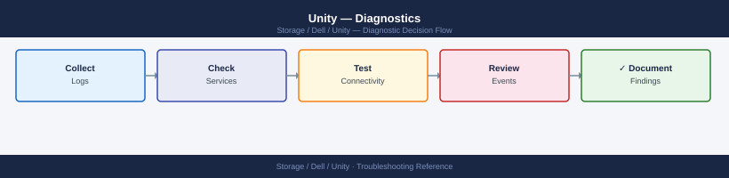

---
tags:
  - dell
  - troubleshooting
search:
  boost: 1.5
---
# Unity — Diagnostics

<div class="kb-summary">
Unity XT diagnostic commands: check system-wide health with <code>uemcli /env/health show -filter "health.value ne OK"</code> and active alerts with <code>/prac/alert show</code>, inspect SP-A and SP-B state with <code>/env/sp show -detail</code>, identify faulted drives and RAID rebuild progress with <code>/stor/config/disk show</code>, verify LUN host access with <code>/stor/config/lunacl show</code>, and collect the support bundle via <code>/sys/serviceinfo collect</code> for Dell support escalation.

*Applies to: Unity XT*
</div>


```d2
direction: right

SP: "SP" {shape: rectangle}
SPCK: "uemcli /env/sp show -detail\nWait 60 sec — SP may be recovering" {shape: rectangle}
SPSTILL: "SPSTILL" {shape: rectangle}
P1: "Open Dell P1 case immediately" {shape: rectangle}
POOL: "POOL" {shape: rectangle}
DRIVE: "uemcli /stor/config/disk show\nReplace drive and monitor rebuild\nNo pool changes during rebuild" {shape: rectangle}
ACL: "ACL" {shape: rectangle}
ADDACL: "Add host access\nuemcli /stor/config/lunacl create" {shape: rectangle}
NIC: "NIC" {shape: rectangle}
NICFIX: "uemcli /net/port/fc show\nRestore port or recheck LIF" {shape: rectangle}
ALT: "ALT" {shape: rectangle}
ALINV: "uemcli /prac/alert show -detail\nInvestigate alert root cause" {shape: rectangle}
BUNDLE: "uemcli /sys/serviceinfo collect\nOpen Dell support case" {shape: rectangle}
START: "Host reports I/O errors" {shape: rectangle}

SP -> SPCK
SPSTILL -> P1
SPSTILL -> POOL
POOL -> DRIVE
ACL -> ADDACL
NIC -> NICFIX
ALT -> ALINV
ALT -> BUNDLE
```

```d2
direction: down

symptom: Identify Symptom {shape: diamond}
step_1_system_health_and_alerts: "Step 1 — System health and alerts" {shape: rectangle}
step_2_storage_processor_diagnostics: "Step 2 — Storage processor diagnostics" {shape: rectangle}
step_3_storage_pool_and_disk_diagnos: "Step 3 — Storage pool and disk diagnostics" {shape: rectangle}
step_4_lun_diagnostics: "Step 4 — LUN diagnostics" {shape: rectangle}
step_5_nas_and_file_system_diagnosti: "Step 5 — NAS and file system diagnostics" {shape: rectangle}
step_6_network_interface_diagnostics: "Step 6 — Network interface diagnostics" {shape: rectangle}
resolution: Resolve or Escalate {shape: oval}

symptom -> step_1_system_health_and_alerts: investigate
symptom -> step_2_storage_processor_diagnostics: investigate
symptom -> step_3_storage_pool_and_disk_diagnos: investigate
symptom -> step_4_lun_diagnostics: investigate
symptom -> step_5_nas_and_file_system_diagnosti: investigate
symptom -> step_6_network_interface_diagnostics: investigate
step_1_system_health_and_alerts -> resolution
step_2_storage_processor_diagnostics -> resolution
step_3_storage_pool_and_disk_diagnos -> resolution
step_4_lun_diagnostics -> resolution
step_5_nas_and_file_system_diagnosti -> resolution
step_6_network_interface_diagnostics -> resolution
```

## Before you begin

- **Access:** SSH or HTTPS to the Unity management IP; `uemcli -d <sp_ip> -u admin -p <password>` — both SP-A and SP-B management IPs work; storage administrator role required for diagnostic commands
- **Gather first:** the exact error message from the host or Unisphere alert, the affected component name (LUN ID, pool name, NAS server name), and both SP management IPs (run `/env/sp show` if needed)
- **Scope:** determine whether the issue is host-side (can't see LUN, network path down) or array-side (SP health, pool degraded, disk failure) — `uemcli /env/health show -filter "health.value ne OK"` is the fastest initial check

---

## Step 1 — System health and alerts

```bash
# System general info — name, model, serial, software version
uemcli -d <sp_ip> -u admin -p <password> /sys/general show -detail

# Show all components NOT in an OK health state — start here
uemcli -d <sp_ip> -u admin -p <password> /env/health show -filter "health.value ne OK"

# All active alerts (unresolved)
uemcli -d <sp_ip> -u admin -p <password> /prac/alert show

# Alert history — ordered by time (most recent first)
uemcli -d <sp_ip> -u admin -p <password> /prac/alert show -detail

# Filter alerts by severity
uemcli -d <sp_ip> -u admin -p <password> /prac/alert show | grep -i "critical\|error"

# System event log
uemcli -d <sp_ip> -u admin -p <password> /event/syslog show

# Audit log — administrative actions
uemcli -d <sp_ip> -u admin -p <password> /event/audit show

# Software version
uemcli -d <sp_ip> -u admin -p <password> /sys/sw/version show
```


```text title="Expected output"
System General Information:
  Name: UNITY-SPA-001
  Model: Unity 380
  Serial Number: APM00123456789
  Software Version: 5.1.0.0.5.999
  Health State: Degraded

Health Status (Non-OK Components):
  ID: dae_0
  Health: Degraded
  Component: DAE
  Reason: One disk in enclosure 0 is offline

  ID: disk_0_0_2
  Health: Offline
  Component: Disk
  Reason: Disk failure detected

Active Alerts:
  ID: 3847
  Severity: Error
  Message: Disk 0_0_2 offline in DAE 0
  Timestamp: 2024-01-15 14:32:18

  ID: 3848
  Severity: Warning
  Message: DAE 0 operating in degraded mode
  Timestamp: 2024-01-15 14:32:45

Alert History (Detail):
  ID: 3847
  Severity: Error
  State: Unresolved
  Message: Disk 0_0_2 offline in DAE 0
  First Occurrence: 2024-01-15 14:32:18
  Last Occurrence: 2024-01-15 14:32:18
  Occurrences: 1

Critical/Error Alerts:
  ID: 3847 | Error | Disk 0_0_2 offline in DAE 0 | 2024-01-15 14:32:18

System Event Log:
  Timestamp: 2024-01-15 14:32:18 | Event: DISK_OFFLINE | Disk 0_0_2 | Severity: Error
  Timestamp: 2024-01-15 14:31:05 | Event: DAE_DEGRADED | DAE 0 | Severity: Warning
  Timestamp: 2024-01-15 13:45:22 | Event: SYSTEM_BOOT | SPA | Severity: Info

Audit Log:
  Timestamp: 2024-01-15 10:15:33 | User: admin | Action: LOGIN | Status: Success
  Timestamp: 2024-01-15 10:16:12 | User: admin | Action: POOL_MODIFY | Target: Pool_01 | Status: Success

Software Version:
  Current Version: 5.1.0.0.5.999
  Build Date: 2023-12-20
```

!!! warning "Common errors"
    **`Connection refused — unable to connect to <sp_ip>:443`** — Verify the SP IP address is correct and reachable with `ping <sp_ip>`, and ensure the management port is accessible.
    **`Authentication failed for user admin`** — Confirm the password is correct and the admin account is not locked; reset credentials in Unisphere if needed.
    **`uemcli: command not found`** — Install the UEMCLI package on your management host or add its installation directory to your PATH environment variable.
### Alert severity reference

| Severity Code | Meaning | Expected Response Time |
|---|---|---|
| CRITICAL (8) | Service-impacting fault | Immediate — within minutes |
| ERROR (6) | Degraded functionality | Within the hour |
| WARNING (4) | Potential issue; non-impacting | Within the business day |
| NOTICE / INFO (2) | Informational | Review at next operational check |

---

## Step 2 — Storage processor diagnostics

```bash
# Show both SP states
uemcli -d <sp_ip> -u admin -p <password> /env/sp show

# Detailed SP view — health, CPU, memory, temperature
uemcli -d <sp_ip> -u admin -p <password> /env/sp show -detail

# Check SP A specifically
uemcli -d <sp_ip> -u admin -p <password> /env/sp -id spa show -detail

# Check SP B specifically
uemcli -d <sp_ip> -u admin -p <password> /env/sp -id spb show -detail

# Battery / BBU status (protects write cache)
uemcli -d <sp_ip> -u admin -p <password> /sys/battery show -detail

# Power supply status
uemcli -d <sp_ip> -u admin -p <password> /sys/powersupply show
```


```text title="Expected output"
SP A
    Health: OK
    Needs Attention: false
    Manufacturer: EMC
    Model: SP-400F
    Serial Number: APM00123456789
    CPU Count: 2
    Memory Size: 32 GB
    Temperature: 38°C
    State: Present

SP B
    Health: OK
    Needs Attention: false
    Manufacturer: EMC
    Model: SP-400F
    Serial Number: APM00987654321
    CPU Count: 2
    Memory Size: 32 GB
    Temperature: 41°C
    State: Present

Battery 0
    Health: OK
    State: Present
    Charge Level: 100%
    Capacity: 100%
    Estimated Runtime: 4 hours 32 minutes

Power Supply 0
    Health: OK
    State: Present
    Output Power: 850 W
    Input Voltage: 240 V AC

Power Supply 1
    Health: OK
    State: Present
    Output Power: 850 W
    Input Voltage: 240 V AC
```

!!! warning "Common errors"
    **`The specified SP could not be found.`** — Verify the SP IP address is correct and reachable with `ping <sp_ip>`.
    **`Authentication failed: Invalid username or password`** — Confirm admin credentials are correct and the account has not been locked after failed login attempts.
    **`Connection timeout: Unable to reach management interface`** — Check network connectivity to the SP and ensure the management port (port 443) is not blocked by firewall rules.
---

## Step 3 — Storage pool and disk diagnostics

```bash
# All pools with capacity and health
uemcli -d <sp_ip> -u admin -p <password> /stor/config/pool show -detail

# Specific pool detail
uemcli -d <sp_ip> -u admin -p <password> /stor/config/pool -id <pool_id> show -detail

# All disk groups (RAID sets) in pools
uemcli -d <sp_ip> -u admin -p <password> /stor/config/dg show -detail

# All drives — health, location, type
uemcli -d <sp_ip> -u admin -p <password> /stor/config/disk show -detail

# Flag any non-healthy drives
uemcli -d <sp_ip> -u admin -p <password> /stor/config/disk show -detail | \
    grep -v -E "Normal|Health State|---"

# FAST Cache status
uemcli -d <sp_ip> -u admin -p <password> /stor/config/fastcache show -detail
```


```text title="Expected output"
ID                          Name                    Type        Size            Free            Health State
==================================================================================================
pool_1                      Production_Pool         RAID 5      10.7 TB         3.2 TB          OK
pool_2                      Archive_Pool            RAID 6      21.4 TB         8.9 TB          OK
pool_3                      Backup_Pool             RAID 5      5.4 TB          1.1 TB          Degraded

ID      Name              Raid Type    Stripe Length    Size        Free        Health State    Status
==================================================================================================
pool_2  Archive_Pool      RAID 6       8                21.4 TB     8.9 TB      OK              Ready

ID          Raid Type    Size        Free        Health State    Disks    Status
==================================================================================================
dg_1        RAID 5       10.7 TB     3.2 TB      OK              14       Ready
dg_2        RAID 6       21.4 TB     8.9 TB      OK              18       Ready
dg_3        RAID 5       5.4 TB      1.1 TB      Degraded        14       Rebuilding

Slot    Disk ID         Type            Size        Health State    Pool        Status
==================================================================================================
0.0     DPE_DISK_0      SAS 10K         600 GB      Normal          pool_1      Ready
0.1     DPE_DISK_1      SAS 10K         600 GB      Normal          pool_1      Ready
0.2     DPE_DISK_2      SAS 10K         600 GB      Predictive_Failure  pool_1  Rebuilding
0.3     DPE_DISK_3      SAS 10K         600 GB      Normal          pool_2      Ready
0.4     DPE_DISK_4      SAS 10K         600 GB      Normal          pool_2      Ready

Slot    Disk ID         Type            Size        Health State    Pool        Status
==================================================================================================
0.2     DPE_DISK_2      SAS 10K         600 GB      Predictive_Failure  pool_1  Rebuilding

Enabled    Read_Hit_Rate    Write_Hit_Rate    Size        Health State    Status
==================================================================================================
Yes        78.4%            65.2%             3.2 TB      OK              Ready
```

!!! warning "Common errors"
    **`Connection failed: Authentication error`** — Verify the SP IP address is correct and admin credentials are valid with `uemcli -d <sp_ip> -u admin -p <password> /sys show`.
    **`Command not found: uemcli`** — Install the EMC Unity CLI package or ensure the uemcli binary is in your system PATH.
    **`Error: Invalid pool ID '<pool_id>'`** — Confirm the pool ID exists by running the first command to list all pools and their IDs.
### RAID rebuild status

When a drive is replaced, Unity begins a RAID rebuild automatically. Monitor rebuild progress:

```bash
# Disk group health shows "Rebuilding" or "Degraded" during rebuild
uemcli -d <sp_ip> -u admin -p <password> /stor/config/dg show -detail | \
    grep -E "Health|Remaining"

# Pool health transitions from Degraded back to OK after rebuild completes
uemcli -d <sp_ip> -u admin -p <password> /stor/config/pool show -detail | \
    grep -E "Name|Health"
```


```text title="Expected output"
Health: OK
Remaining Time: 2 days 14 hours 23 minutes
Remaining Capacity: 847.3 GB

Name: pool_01
Health: Degraded

Name: pool_02
Health: OK

Name: pool_03
Health: Rebuilding
```

!!! warning "Common errors"
    **`Error: Connection refused (Connection refused)`** — Verify the SP IP address is correct and reachable with `ping <sp_ip>`, and confirm the management interface is online.
    **`Error: Authentication failed`** — Confirm the admin credentials are correct and the user account has not been locked after failed login attempts; reset the password if needed.
    **`Error: Command not found: uemcli`** — Install the EMC CLI tools or add the installation directory to your PATH environment variable.
Do not expand a pool, add disk groups, or perform OE upgrades while a RAID rebuild is in progress. Allow the rebuild to complete before making further changes.

---

## Step 4 — LUN diagnostics

```bash
# List all LUNs with health and capacity
uemcli -d <sp_ip> -u admin -p <password> /stor/config/lun show -detail

# Specific LUN
uemcli -d <sp_ip> -u admin -p <password> /stor/config/lun -id <lun_id> show -detail

# LUN access control — which hosts have access?
uemcli -d <sp_ip> -u admin -p <password> /stor/config/lunacl show

# Filter access for a specific LUN
uemcli -d <sp_ip> -u admin -p <password> /stor/config/lunacl show | grep <lun_id>

# Snapshots for a specific LUN
uemcli -d <sp_ip> -u admin -p <password> /prot/snap show -res <lun_id>
```


```text title="Expected output"
LUN ID    Name                Health    Capacity      Allocated     State
lun_0     prod-db-01          OK        1.0 TB        856.2 GB      Ready
lun_1     prod-db-02          OK        2.0 TB        1.8 TB        Ready
lun_2     backup-tier-01      OK        5.0 TB        3.2 TB        Ready
lun_3     dev-test-lun        Degraded  500.0 GB      450.1 GB      Ready
lun_4     archive-cold        OK        10.0 TB       7.5 TB        Ready
...

LUN ID: lun_0
Name: prod-db-01
Health: OK
Capacity: 1.0 TB
Allocated: 856.2 GB
Thin Provisioned: Yes
Snapshots: 3
Access Control: 4 hosts

LUN ID    Host Name           Access Type    Initiator Type
lun_0     esx-host-01.lab     Read/Write     iSCSI
lun_0     esx-host-02.lab     Read/Write     iSCSI
lun_1     db-server-03.prod   Read/Write     Fibre Channel
lun_2     backup-client-01    Read/Write     iSCSI
lun_3     dev-vm-cluster      Read/Write     iSCSI
...

lun_0     esx-host-01.lab     Read/Write     iSCSI
lun_0     esx-host-02.lab     Read/Write     iSCSI

Snapshot ID           Source LUN    Created              Size        State
snap_lun0_20240115    lun_0         2024-01-15 14:32    45.6 GB     Ready
snap_lun0_20240114    lun_0         2024-01-14 22:15    42.1 GB     Ready
snap_lun0_20240113    lun_0         2024-01-13 18:47    38.9 GB     Ready
```

!!! warning "Common errors"
    **`Authentication failed. Invalid credentials.`** — Verify the SP IP address is correct and admin password is current; reset credentials in Unisphere if needed.
    **`The specified LUN ID <lun_id> does not exist.`** — Confirm the LUN ID exists by running the list command without filters first.
    **`Connection timeout: Unable to reach <sp_ip>.`** — Ensure the storage processor IP is reachable and the management network is configured; test with `ping <sp_ip>`.
---

## Step 5 — NAS and file system diagnostics

```bash
# NAS servers — health and SP assignment
uemcli -d <sp_ip> -u admin -p <password> /nas/server show -detail

# File interfaces (IPs for NAS access)
uemcli -d <sp_ip> -u admin -p <password> /net/nas/if show -detail

# Active NFS exports and their access configuration
uemcli -d <sp_ip> -u admin -p <password> /prot/nfs show -detail

# Active SMB shares
uemcli -d <sp_ip> -u admin -p <password> /prot/smb show -detail

# Active NFS sessions (connected NFS clients)
uemcli -d <sp_ip> -u admin -p <password> /prot/nfs/session show

# Active SMB sessions (connected SMB clients)
uemcli -d <sp_ip> -u admin -p <password> /prot/smb/session show

# AD join status for a NAS server
uemcli -d <sp_ip> -u admin -p <password> /nas/ad show -detail

# File system list with capacity
uemcli -d <sp_ip> -u admin -p <password> /stor/config/fs show -detail
```


```text title="Expected output"
NAS Server: "nas_server_01"
  Health: OK
  SP Owner: SPA
  Replication Role: Source
  Multi-Protocol: Enabled

File Interface: "nas_cifs_if"
  IP Address: 192.168.10.45
  Netmask: 255.255.255.0
  Gateway: 192.168.10.1
  Status: Linked

NFS Export: "/export/data"
  File System: fs_data_01
  Access: 192.168.10.0/24 (RW), 10.0.0.0/8 (RO)
  Root Squash: Enabled

SMB Share: "shared_folder"
  File System: fs_data_01
  Continuous Availability: Enabled
  ABE: Disabled

NFS Session: 3 active
  Client: 192.168.10.102, Mount: /export/data, Operations: 1247

SMB Session: 5 active
  Client: 192.168.10.50, User: DOMAIN\jsmith, Idle: 45s

AD Join Status: "nas_server_01"
  Domain: corp.internal
  Status: Joined
  Last Sync: 2024-01-15 14:32:18

File System: "fs_data_01"
  Size: 2.0 TB
  Used: 1.3 TB
  Available: 700 GB
  Thin Provisioned: Yes
```

!!! warning "Common errors"
    **`Error: The specified Storage Processor is not reachable`** — Verify the SP IP address is correct and the management network is accessible from your admin host.
    **`Error: Authentication failed for user 'admin'`** — Confirm the password is correct and the admin account has not been locked due to failed login attempts.
    **`Error: Object not found: /prot/nfs/session`** — Ensure NFS protocol is licensed and enabled on the array; if no NFS exports exist, this command will return empty results.
---

## Step 6 — Network interface diagnostics

```bash
# All network interfaces (management, iSCSI, NAS)
uemcli -d <sp_ip> -u admin -p <password> /net/if show -detail

# Physical Ethernet ports and their link state
uemcli -d <sp_ip> -u admin -p <password> /net/port/eth show -detail

# FC ports and their state
uemcli -d <sp_ip> -u admin -p <password> /net/port/fc show -detail

# iSCSI nodes and targets
uemcli -d <sp_ip> -u admin -p <password> /net/iscsi/node show -detail

# DNS configuration
uemcli -d <sp_ip> -u admin -p <password> /sys/dns show

# NTP configuration and sync status
uemcli -d <sp_ip> -u admin -p <password> /sys/ntp show
```


```text title="Expected output"
ID                          Name                        IPv4Address         IPv6Address         Netmask             Gateway
==============================================================================================================================================
eth0                        Management                  192.168.1.50        ::1                 255.255.255.0       192.168.1.1
eth1                        iSCSI-A                     10.20.30.100        ::1                 255.255.255.0       10.20.30.1
eth2                        iSCSI-B                     10.20.31.100        ::1                 255.255.255.0       10.20.31.1
eth3                        NAS                         172.16.50.50        ::1                 255.255.255.0       172.16.50.1

Port                        LinkState               Speed               Duplex
==============================================================================================================================================
SP A Port 0                 Up                      1 Gbps              Full
SP A Port 1                 Up                      1 Gbps              Full
SP B Port 0                 Up                      1 Gbps              Full
SP B Port 1                 Down                    Unknown             Unknown

Port                        State                   Speed               WWN
==============================================================================================================================================
SP A FC Port 0              Online                  8 Gbps              50:00:14:40:5a:2b:c1:a0
SP A FC Port 1              Online                  8 Gbps              50:00:14:40:5a:2b:c1:a1
SP B FC Port 0              Online                  8 Gbps              50:00:14:40:5a:2b:c1:b0
SP B FC Port 1              Offline                 Unknown             50:00:14:40:5a:2b:c1:b1

Node                        Alias                   State               IP Address
==============================================================================================================================================
iqn.1991-05.com.dell:01:5a2bc1a0  Unity-SPA-Node-0    Enabled             10.20.30.100
iqn.1991-05.com.dell:01:5a2bc1b0  Unity-SPB-Node-0    Enabled             10.20.31.100

DNS Servers: 8.8.8.8, 8.8.4.4
Search Domains: corp.local, backup.local

NTP Servers: ntp.corp.local (192.168.1.10), pool.ntp.org
NTP Status: Synchronized
Last Sync: 2024-01-15 14:32:18 UTC
Stratum: 2
```

!!! warning "Common errors"
    **`Authentication failed. Verify credentials and SP IP address.`** — Confirm the SP IP address is reachable and admin credentials are correct by testing with `ping <sp_ip>` first.
    **`Command not found: uemcli`** — Install the EMC Unity CLI package or add its installation directory to your PATH environment variable.
    **`Connection timeout after 30 seconds`** — Verify network connectivity to the SP management interface and ensure the storage processor is powered on and responsive.
---

## Step 7 — Replication diagnostics

```bash
# All replication sessions with state and lag
uemcli -d <sp_ip> -u admin -p <password> /prot/rep/session show

# Detailed session view — includes current lag, last sync time, error details
uemcli -d <sp_ip> -u admin -p <password> /prot/rep/session show -detail

# Specific session
uemcli -d <sp_ip> -u admin -p <password> /prot/rep/session -id <session_id> show -detail

# Replication connections to remote arrays
uemcli -d <sp_ip> -u admin -p <password> /prot/rep/connect show

# Test replication connection (verify the destination array is reachable)
uemcli -d <sp_ip> -u admin -p <password> /prot/rep/connect -id <conn_id> verify
```


```text title="Expected output"
ID                                    State          Lag(sec)  Last_Sync_Time
rep_session_001                       Synchronized  0         2024-01-15 14:32:18
rep_session_002                       Synchronizing 45        2024-01-15 14:31:33
rep_session_003                       Paused        892       2024-01-15 14:15:22
rep_session_004                       Failed        N/A       2024-01-15 13:58:07

ID                                    State          Lag(sec)  Last_Sync_Time       Error_Details
rep_session_002                       Synchronizing 47        2024-01-15 14:31:33   None
  Source_LUN: lun_123, Destination_LUN: lun_456
  Replication_Type: Synchronous, Bandwidth_Limit: Unlimited
  Last_Error: None, Error_Count: 0

ID                                    State          Lag(sec)  Last_Sync_Time       Error_Details
rep_session_004                       Failed        N/A       2024-01-15 13:58:07   Connection timeout to destination array
  Source_LUN: lun_789, Destination_LUN: lun_012
  Replication_Type: Asynchronous, Bandwidth_Limit: 100 MB/s
  Last_Error: Network unreachable, Error_Count: 3

ID                                    Local_IP      Remote_IP      Status      Last_Test_Time
conn_rep_001                          192.168.1.50  192.168.2.100  Connected   2024-01-15 14:30:45
conn_rep_002                          192.168.1.51  192.168.2.101  Disconnected 2024-01-15 13:45:22
conn_rep_003                          192.168.1.50  192.168.2.102  Connected   2024-01-15 14:28:10

Connection conn_rep_001 verification: PASSED
  Round-trip latency: 2.3 ms
  Bandwidth available: 950 Mbps
  Last verified: 2024-01-15 14:35:12
```

!!! warning "Common errors"
    **`Error: Connection refused to <sp_ip>:443`** — Verify the SP IP address is correct, the array is powered on, and network connectivity exists from your management station.
    **`Error: Authentication failed for user 'admin'`** — Confirm the password is correct and the admin account is not locked; reset credentials in Unisphere if needed.
    **`Error: Session rep_session_004 not found`** — Check the session ID spelling and verify the session exists with the first `show` command before querying specific sessions.
---

## Step 8 — Performance diagnostics

Unity provides real-time and historical performance metrics via the REST API and Unisphere dashboards. UEMCLI provides limited real-time metrics.

```bash
# Real-time system performance metrics (polling interval in seconds)
uemcli -d <sp_ip> -u admin -p <password> /metrics/value/rt show \
    -interval 5

# Show available real-time metrics
uemcli -d <sp_ip> -u admin -p <password> /metrics/rt show

# Historical performance — use Unisphere GUI: System > Performance
# Or pull via REST API:
# GET https://<sp-ip>/api/types/metricRealTimeQuery/instances
```


```text title="Expected output"
Real-time system performance metrics (polling interval 5 seconds):

Timestamp                    CPU Usage    Memory Usage    Read IOPS    Write IOPS    Latency(ms)
2024-01-15 14:23:45 UTC      42.3%        68.5%           12847        8934          2.1
2024-01-15 14:23:50 UTC      45.1%        69.2%           13102        9156          2.3
2024-01-15 14:23:55 UTC      41.8%        67.9%           12654        8812          2.0
2024-01-15 14:24:00 UTC      48.6%        70.1%           13456        9423          2.5

Available real-time metrics:
  - cpu.utilization.avg
  - memory.utilization.avg
  - disk.reads.iops
  - disk.writes.iops
  - disk.latency.avg
  - cache.hit.ratio
  - network.throughput.mbps
  - pool.capacity.used.percent
```

!!! warning "Common errors"
    **`Authentication failed for user 'admin' on <sp_ip>`** — Verify the storage processor IP address is reachable and credentials are correct with `ping <sp_ip>` and confirm password has no special characters requiring escaping.
    **`Connection timeout connecting to <sp_ip>:443`** — Ensure the management network interface on the storage processor is configured and the firewall allows HTTPS (port 443) from your management host.
    **`Metric 'cpu.utilization.avg' not available on this system`** — Confirm the Unity system firmware supports real-time metrics collection; older firmware versions may require a REST API call instead of uemcli.
For sustained performance investigation, use the Unisphere Performance dashboard to identify:

- Peak I/O periods.
- Latency distribution across LUNs and pools.
- Cache hit rate (FAST Cache and DRAM write cache).
- SP CPU and memory utilisation.

---

## Step 9 — Support bundle collection

```bash
# Trigger support bundle collection from CLI
uemcli -d <sp_ip> -u admin -p <password> /sys/serviceinfo collect

# Check collection status
uemcli -d <sp_ip> -u admin -p <password> /sys/serviceinfo show
```


```text title="Expected output"
Collection request submitted successfully.
Collection ID: 12345
Status: In Progress
Estimated time remaining: 8 minutes

Collection ID: 12345
Status: Completed
Size: 2.3 GB
Location: /var/log/emc/support/bundle_12345.tar.gz
Created: 2024-01-15 14:32:18
Expiration: 2024-02-14 14:32:18
```

!!! warning "Common errors"
    **`Authentication failed`** — Verify the SP IP address is correct and admin credentials are current; reset the password if needed.
    **`Command not found: uemcli`** — Install the EMC CLI tools package or ensure the uemcli binary is in your system PATH.
    **`Connection timeout to <sp_ip>`** — Confirm network connectivity to the Storage Processor and that the management interface is reachable via ping.
Via Unisphere:

1. Navigate to **System > Support > Collect Service Information**.
2. Click **Collect** — collection typically takes 5–15 minutes.
3. Download the bundle.
4. Upload to the Dell support case via the **Secure Upload** link in the case portal.

### Pre-collection diagnostic snapshot

```bash
UNITY_IP=<sp_ip>
UNITY_USER=admin
UNITY_PASS=<password>
U="uemcli -d $UNITY_IP -u $UNITY_USER -p $UNITY_PASS"

{
  echo "=== System Info ===" && $U /sys/general show -detail
  echo "=== Health ===" && $U /env/health show -filter "health.value ne OK"
  echo "=== Alerts ===" && $U /prac/alert show -detail
  echo "=== SP Status ===" && $U /env/sp show -detail
  echo "=== Pools ===" && $U /stor/config/pool show -detail
  echo "=== Disks ===" && $U /stor/config/disk show -detail
  echo "=== Replication ===" && $U /prot/rep/session show -detail
} > unity_diagnostics_$(date +%Y%m%d_%H%M%S).txt
```


```text title="Expected output"
=== System Info ===
System Name:                    UNITY-SPA
System ID:                      APM00123456789
Model:                          Unity 380
Serial Number:                  APM123456
Software Version:               5.1.0.0.5.123
Health State:                   OK
=== Health ===
Health Component:               Battery
Health Value:                   DEGRADED
Health Description:             Battery backup unit requires service
=== Alerts ===
Alert ID:                       alert_001
Severity:                        WARNING
Message:                         Disk 0_0_0 predictive failure threshold exceeded
Timestamp:                       2024-01-15 14:32:18
=== SP Status ===
Storage Processor:              SPA
Status:                          Ready
IP Address:                      192.168.1.100
Firmware Version:                5.1.0.0.5.123
Temperature:                     38°C
=== Pools ===
Pool Name:                       pool_ssd_01
Pool ID:                         pool_1
Total Capacity:                  10.7 TB
Used Capacity:                   7.2 TB
Available Capacity:              3.5 TB
Health State:                    OK
=== Disks ===
Disk ID:                         0_0_0
Disk Type:                        SSD
Capacity:                         1.92 TB
Health State:                    DEGRADED
=== Replication ===
Session Name:                    rep_session_dr01
Status:                          Synchronized
Last Sync Time:                  2024-01-15 14:30:45
RPO:                             0 seconds
unity_diagnostics_20240115_143215.txt
```

!!! warning "Common errors"
    **`Error: Unable to connect to <sp_ip>. Connection refused.`** — Verify the UNITY_IP variable is correct and the management interface is reachable with `ping $UNITY_IP`.
    **`Error: Authentication failed for user 'admin'. Invalid credentials.`** — Confirm UNITY_USER and UNITY_PASS are correct by testing with `uemcli -d $UNITY_IP -u $UNITY_USER -p $UNITY_PASS /sys/general show`.
    **`Error: uemcli: command not found`** — Install the EMC Unity CLI tools or add the installation directory to your PATH environment variable.
Attach the resulting file to the support case along with the support bundle.

---

## Log locations

| Log / Data | Location | How to Access |
|---|---|---|
| Support bundle (all SP logs) | Collected on demand | Unisphere: **System > Support > Collect Service Information**; or `uemcli /sys/serviceinfo collect` |
| Unisphere event log | Unisphere GUI | **Unisphere > System > Events** — filter by type and time range |
| Alert history | UEMCLI or Unisphere | `uemcli /prac/alert show -detail` |
| Audit log (admin actions) | UEMCLI or Unisphere | `uemcli /event/audit show` |
| Syslog (if configured) | External syslog server | Check your SIEM or syslog server |
| Replication session log | Embedded in session detail | `uemcli /prot/rep/session show -detail` |
| Hardware event log | Embedded in component health | `uemcli /env/health show -detail` |

---

## See also

- [Unity — Common Issues](../common-issues/)
- [Unity — Escalation](../escalation/)

## Verify resolution

- `uemcli -d <sp_ip> -u admin -p <password> /env/health show -filter "health.value ne OK"` returns no results (all components healthy)
- `uemcli -d <sp_ip> -u admin -p <password> /prac/alert show` shows no active critical or error alerts
- `uemcli -d <sp_ip> -u admin -p <password> /env/sp show` shows both SP-A and SP-B in `OK` health state
- `uemcli -d <sp_ip> -u admin -p <password> /stor/config/pool show -detail` shows all pools with OK health
- `uemcli -d <sp_ip> -u admin -p <password> /stor/config/disk show -detail | grep -v Normal | grep -v "Health State" | grep -v "^$"` returns no output (all disks normal)
- The affected host can mount or access the LUN/NAS resource without I/O errors
