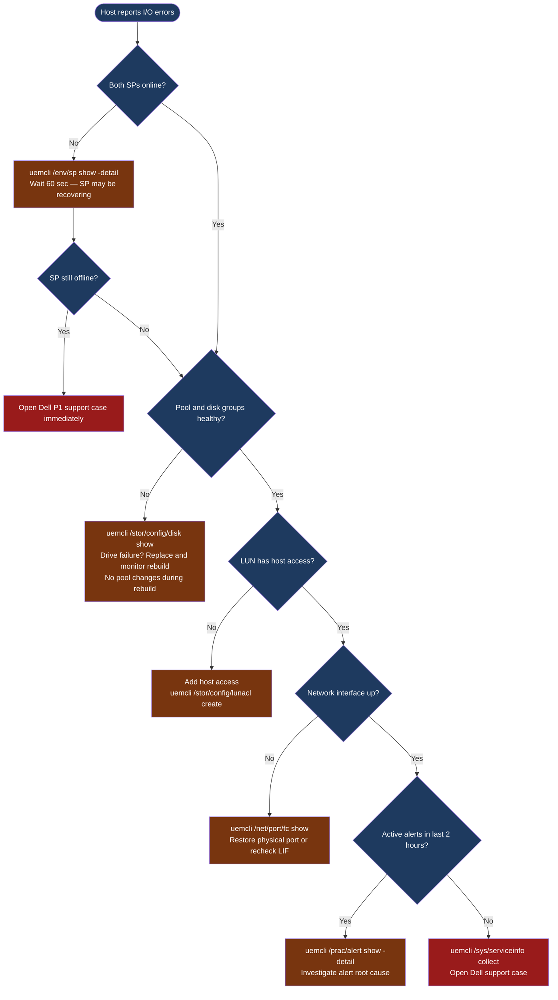

---
tags:
  - dell
  - troubleshooting
search:
  boost: 1.5
---
# Unity — Diagnostics

<div class="kb-summary">
Unity XT diagnostic commands: check system-wide health with <code>uemcli /env/health show -filter "health.value ne OK"</code> and active alerts with <code>/prac/alert show</code>, inspect SP-A and SP-B state with <code>/env/sp show -detail</code>, identify faulted drives and RAID rebuild progress with <code>/stor/config/disk show</code>, verify LUN host access with <code>/stor/config/lunacl show</code>, and collect the support bundle via <code>/sys/serviceinfo collect</code> for Dell support escalation.

*Applies to: Unity XT*
</div>

```text
┌───────────────────────────────────── Dell Unity XT — Diagnostics ─────────────────────────────────────┐
│                                                                                                       │
│   ┌────────────────────────────────────────────────────────────────────────────────────────────┐      │
│   │  Start here: uemcli /env/health show -filter "health.value ne OK"                         │       │
│   │  SP issue: uemcli /env/sp show -detail → check CPU, memory, battery, temperature          │       │
│   │  Pool/disk alert: uemcli /stor/config/disk show → identify faulted or rebuilding drives   │       │
│   │  Host access: uemcli /stor/config/lunacl show → confirm LUN access control for host       │       │
│   └────────────────────────────────────────────────────────────────────────────────────────────┘      │
│                                                                                                       │
│   ┌─────────────────────────────────────────┐  ┌──────────────────────────────────────────────┐       │
│   │         System Health and Alerts        │  │         Storage Processors (SP-A/SP-B)       │       │
│   │   /env/health show: non-OK components  │  │   /env/sp show -detail: CPU, memory, temp    │        │
│   │   /prac/alert show: active alerts      │  │   /env/sp -id spa show: SP-A component view  │        │
│   │   /sys/general show: system info       │  │   /env/sp -id spb show: SP-B component view  │        │
│   │   /event/syslog show: event log        │  │   /sys/battery show: BBU (write cache guard) │        │
│   │   /event/audit show: admin actions     │  │   /sys/powersupply show: PSU health          │        │
│   └─────────────────────────────────────────┘  └──────────────────────────────────────────────┘       │
│                                                                                                       │
│   ┌─────────────────────────────────────────┐  ┌──────────────────────────────────────────────┐       │
│   │       Storage Pools and Disks           │  │        LUN, NAS, and Network Access          │       │
│   │   /stor/config/pool show: capacity      │  │   /stor/config/lun show: LUN health          │       │
│   │   /stor/config/dg show: disk groups     │  │   /stor/config/lunacl show: host access      │       │
│   │   /stor/config/disk show: drive states  │  │   /nas/server show: NAS server health        │       │
│   │   /stor/config/fastcache show: cache    │  │   /net/if show: interfaces + link state      │       │
│   │   /prot/rep/session show: replication   │  │   /net/port/fc show: FC port state           │       │
│   └─────────────────────────────────────────┘  └──────────────────────────────────────────────┘       │
│                                                                                                       │
│  Physical Infrastructure:                                                                             │
│  Unity XT 380F/480F/680F/880F · dual SPs (SP-A, SP-B) · DPE / DAE expansion enclosures                │
│  10/25 GbE data ports · FC ports (front-end) · management port (SSH/HTTPS to Unisphere)               │
│                                                                                                       │
│  Key terms:                                                                                           │
│  Unity XT           = Dell unified mid-range array; block LUNs, file NAS, and VMware vVols            │
│  Unisphere          = HTML5 GUI and REST API for Unity XT management; SP-hosted management portal     │
│  UEMCLI             = CLI for Unity XT; uemcli -d <ip> -u admin -p <pw> /show commands                │
│  Storage pool       = collection of drives forming a usable pool; FAST VP tiers data automatically    │
│  FAST VP            = Fully Automated Storage Tiering VP; moves hot and cold data between tiers       │
│  NAS server         = virtual file server on Unity; each has its own IP, DNS, and CIFS/NFS shares     │
│  Data Mover         = older EMC term for NAS server; used in VNX and early Unity documentation        │
│  SP-A / SP-B        = storage processors; active-active HA pair with mirrored cache                   │
│  Snapshot           = space-efficient PiT copy of LUN or FS; writable snapshots supported             │
│  RecoverPoint       = RP4VM; journal-based continuous data protection for Unity volumes               │
│  Metro              = synchronous replication between two Unity XT sites; active-active zero RPO      │
│  vVols              = Virtual Volumes; VASA provider exposes per-VM storage objects to vCenter        │
│                                                                                                       │
└───────────────────────────────────────────────────────────────────────────────────────────────────────┘
```



## Before you begin

- **Access:** SSH or HTTPS to the Unity management IP; `uemcli -d <sp_ip> -u admin -p <password>` — both SP-A and SP-B management IPs work; storage administrator role required for diagnostic commands
- **Gather first:** the exact error message from the host or Unisphere alert, the affected component name (LUN ID, pool name, NAS server name), and both SP management IPs (run `/env/sp show` if needed)
- **Scope:** determine whether the issue is host-side (can't see LUN, network path down) or array-side (SP health, pool degraded, disk failure) — `uemcli /env/health show -filter "health.value ne OK"` is the fastest initial check

---

## Step 1 — System health and alerts

```bash
# System general info — name, model, serial, software version
uemcli -d <sp_ip> -u admin -p <password> /sys/general show -detail

# Show all components NOT in an OK health state — start here
uemcli -d <sp_ip> -u admin -p <password> /env/health show -filter "health.value ne OK"

# All active alerts (unresolved)
uemcli -d <sp_ip> -u admin -p <password> /prac/alert show

# Alert history — ordered by time (most recent first)
uemcli -d <sp_ip> -u admin -p <password> /prac/alert show -detail

# Filter alerts by severity
uemcli -d <sp_ip> -u admin -p <password> /prac/alert show | grep -i "critical\|error"

# System event log
uemcli -d <sp_ip> -u admin -p <password> /event/syslog show

# Audit log — administrative actions
uemcli -d <sp_ip> -u admin -p <password> /event/audit show

# Software version
uemcli -d <sp_ip> -u admin -p <password> /sys/sw/version show
```

### Alert severity reference

| Severity Code | Meaning | Expected Response Time |
|---|---|---|
| CRITICAL (8) | Service-impacting fault | Immediate — within minutes |
| ERROR (6) | Degraded functionality | Within the hour |
| WARNING (4) | Potential issue; non-impacting | Within the business day |
| NOTICE / INFO (2) | Informational | Review at next operational check |

---

## Step 2 — Storage processor diagnostics

```bash
# Show both SP states
uemcli -d <sp_ip> -u admin -p <password> /env/sp show

# Detailed SP view — health, CPU, memory, temperature
uemcli -d <sp_ip> -u admin -p <password> /env/sp show -detail

# Check SP A specifically
uemcli -d <sp_ip> -u admin -p <password> /env/sp -id spa show -detail

# Check SP B specifically
uemcli -d <sp_ip> -u admin -p <password> /env/sp -id spb show -detail

# Battery / BBU status (protects write cache)
uemcli -d <sp_ip> -u admin -p <password> /sys/battery show -detail

# Power supply status
uemcli -d <sp_ip> -u admin -p <password> /sys/powersupply show
```

---

## Step 3 — Storage pool and disk diagnostics

```bash
# All pools with capacity and health
uemcli -d <sp_ip> -u admin -p <password> /stor/config/pool show -detail

# Specific pool detail
uemcli -d <sp_ip> -u admin -p <password> /stor/config/pool -id <pool_id> show -detail

# All disk groups (RAID sets) in pools
uemcli -d <sp_ip> -u admin -p <password> /stor/config/dg show -detail

# All drives — health, location, type
uemcli -d <sp_ip> -u admin -p <password> /stor/config/disk show -detail

# Flag any non-healthy drives
uemcli -d <sp_ip> -u admin -p <password> /stor/config/disk show -detail | \
    grep -v -E "Normal|Health State|---"

# FAST Cache status
uemcli -d <sp_ip> -u admin -p <password> /stor/config/fastcache show -detail
```

### RAID rebuild status

When a drive is replaced, Unity begins a RAID rebuild automatically. Monitor rebuild progress:

```bash
# Disk group health shows "Rebuilding" or "Degraded" during rebuild
uemcli -d <sp_ip> -u admin -p <password> /stor/config/dg show -detail | \
    grep -E "Health|Remaining"

# Pool health transitions from Degraded back to OK after rebuild completes
uemcli -d <sp_ip> -u admin -p <password> /stor/config/pool show -detail | \
    grep -E "Name|Health"
```

Do not expand a pool, add disk groups, or perform OE upgrades while a RAID rebuild is in progress. Allow the rebuild to complete before making further changes.

---

## Step 4 — LUN diagnostics

```bash
# List all LUNs with health and capacity
uemcli -d <sp_ip> -u admin -p <password> /stor/config/lun show -detail

# Specific LUN
uemcli -d <sp_ip> -u admin -p <password> /stor/config/lun -id <lun_id> show -detail

# LUN access control — which hosts have access?
uemcli -d <sp_ip> -u admin -p <password> /stor/config/lunacl show

# Filter access for a specific LUN
uemcli -d <sp_ip> -u admin -p <password> /stor/config/lunacl show | grep <lun_id>

# Snapshots for a specific LUN
uemcli -d <sp_ip> -u admin -p <password> /prot/snap show -res <lun_id>
```

---

## Step 5 — NAS and file system diagnostics

```bash
# NAS servers — health and SP assignment
uemcli -d <sp_ip> -u admin -p <password> /nas/server show -detail

# File interfaces (IPs for NAS access)
uemcli -d <sp_ip> -u admin -p <password> /net/nas/if show -detail

# Active NFS exports and their access configuration
uemcli -d <sp_ip> -u admin -p <password> /prot/nfs show -detail

# Active SMB shares
uemcli -d <sp_ip> -u admin -p <password> /prot/smb show -detail

# Active NFS sessions (connected NFS clients)
uemcli -d <sp_ip> -u admin -p <password> /prot/nfs/session show

# Active SMB sessions (connected SMB clients)
uemcli -d <sp_ip> -u admin -p <password> /prot/smb/session show

# AD join status for a NAS server
uemcli -d <sp_ip> -u admin -p <password> /nas/ad show -detail

# File system list with capacity
uemcli -d <sp_ip> -u admin -p <password> /stor/config/fs show -detail
```

---

## Step 6 — Network interface diagnostics

```bash
# All network interfaces (management, iSCSI, NAS)
uemcli -d <sp_ip> -u admin -p <password> /net/if show -detail

# Physical Ethernet ports and their link state
uemcli -d <sp_ip> -u admin -p <password> /net/port/eth show -detail

# FC ports and their state
uemcli -d <sp_ip> -u admin -p <password> /net/port/fc show -detail

# iSCSI nodes and targets
uemcli -d <sp_ip> -u admin -p <password> /net/iscsi/node show -detail

# DNS configuration
uemcli -d <sp_ip> -u admin -p <password> /sys/dns show

# NTP configuration and sync status
uemcli -d <sp_ip> -u admin -p <password> /sys/ntp show
```

---

## Step 7 — Replication diagnostics

```bash
# All replication sessions with state and lag
uemcli -d <sp_ip> -u admin -p <password> /prot/rep/session show

# Detailed session view — includes current lag, last sync time, error details
uemcli -d <sp_ip> -u admin -p <password> /prot/rep/session show -detail

# Specific session
uemcli -d <sp_ip> -u admin -p <password> /prot/rep/session -id <session_id> show -detail

# Replication connections to remote arrays
uemcli -d <sp_ip> -u admin -p <password> /prot/rep/connect show

# Test replication connection (verify the destination array is reachable)
uemcli -d <sp_ip> -u admin -p <password> /prot/rep/connect -id <conn_id> verify
```

---

## Step 8 — Performance diagnostics

Unity provides real-time and historical performance metrics via the REST API and Unisphere dashboards. UEMCLI provides limited real-time metrics.

```bash
# Real-time system performance metrics (polling interval in seconds)
uemcli -d <sp_ip> -u admin -p <password> /metrics/value/rt show \
    -interval 5

# Show available real-time metrics
uemcli -d <sp_ip> -u admin -p <password> /metrics/rt show

# Historical performance — use Unisphere GUI: System > Performance
# Or pull via REST API:
# GET https://<sp-ip>/api/types/metricRealTimeQuery/instances
```

For sustained performance investigation, use the Unisphere Performance dashboard to identify:

- Peak I/O periods.
- Latency distribution across LUNs and pools.
- Cache hit rate (FAST Cache and DRAM write cache).
- SP CPU and memory utilisation.

---

## Step 9 — Support bundle collection

```bash
# Trigger support bundle collection from CLI
uemcli -d <sp_ip> -u admin -p <password> /sys/serviceinfo collect

# Check collection status
uemcli -d <sp_ip> -u admin -p <password> /sys/serviceinfo show
```

Via Unisphere:

1. Navigate to **System > Support > Collect Service Information**.
2. Click **Collect** — collection typically takes 5–15 minutes.
3. Download the bundle.
4. Upload to the Dell support case via the **Secure Upload** link in the case portal.

### Pre-collection diagnostic snapshot

```bash
UNITY_IP=<sp_ip>
UNITY_USER=admin
UNITY_PASS=<password>
U="uemcli -d $UNITY_IP -u $UNITY_USER -p $UNITY_PASS"

{
  echo "=== System Info ===" && $U /sys/general show -detail
  echo "=== Health ===" && $U /env/health show -filter "health.value ne OK"
  echo "=== Alerts ===" && $U /prac/alert show -detail
  echo "=== SP Status ===" && $U /env/sp show -detail
  echo "=== Pools ===" && $U /stor/config/pool show -detail
  echo "=== Disks ===" && $U /stor/config/disk show -detail
  echo "=== Replication ===" && $U /prot/rep/session show -detail
} > unity_diagnostics_$(date +%Y%m%d_%H%M%S).txt
```

Attach the resulting file to the support case along with the support bundle.

---

## Log locations

| Log / Data | Location | How to Access |
|---|---|---|
| Support bundle (all SP logs) | Collected on demand | Unisphere: **System > Support > Collect Service Information**; or `uemcli /sys/serviceinfo collect` |
| Unisphere event log | Unisphere GUI | **Unisphere > System > Events** — filter by type and time range |
| Alert history | UEMCLI or Unisphere | `uemcli /prac/alert show -detail` |
| Audit log (admin actions) | UEMCLI or Unisphere | `uemcli /event/audit show` |
| Syslog (if configured) | External syslog server | Check your SIEM or syslog server |
| Replication session log | Embedded in session detail | `uemcli /prot/rep/session show -detail` |
| Hardware event log | Embedded in component health | `uemcli /env/health show -detail` |

---

## See also

- [Unity — Common Issues](common-issues/)
- [Unity — Escalation](escalation/)

## Verify resolution

- `uemcli -d <sp_ip> -u admin -p <password> /env/health show -filter "health.value ne OK"` returns no results (all components healthy)
- `uemcli -d <sp_ip> -u admin -p <password> /prac/alert show` shows no active critical or error alerts
- `uemcli -d <sp_ip> -u admin -p <password> /env/sp show` shows both SP-A and SP-B in `OK` health state
- `uemcli -d <sp_ip> -u admin -p <password> /stor/config/pool show -detail` shows all pools with OK health
- `uemcli -d <sp_ip> -u admin -p <password> /stor/config/disk show -detail | grep -v Normal | grep -v "Health State" | grep -v "^$"` returns no output (all disks normal)
- The affected host can mount or access the LUN/NAS resource without I/O errors
