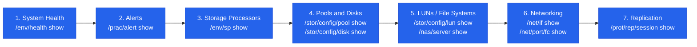
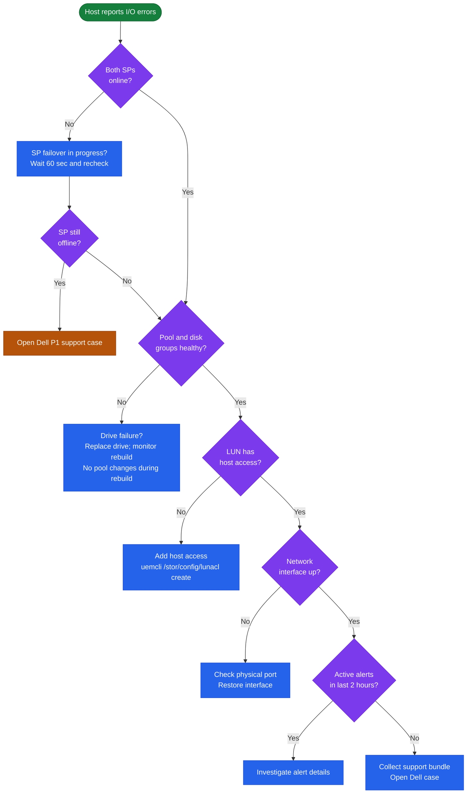

# Unity — Diagnostics

## Diagnostic Approach

Follow this sequence when diagnosing a Unity issue. Start at the system level and narrow down to the specific component:

1. **System health** — any non-OK component?
2. **Alerts** — what events occurred and when?
3. **Storage processors** — are both SPs online and healthy?
4. **Pools and disks** — is any RAID group degraded or a disk faulted?
5. **LUNs / file systems** — is the specific resource healthy and accessible?
6. **Networking** — are the relevant interfaces up and reachable?
7. **Replication** — are replication sessions in a consistent state?



## System-Level Diagnostics

```bash
# System general info — name, model, serial, software version
uemcli -d <sp_ip> -u admin -p <password> /sys/general show -detail

# Show all components NOT in an OK health state
uemcli -d <sp_ip> -u admin -p <password> /env/health show -filter "health.value ne OK"

# Show system-wide health score and health details
uemcli -d <sp_ip> -u admin -p <password> /sys/health show

# Software version
uemcli -d <sp_ip> -u admin -p <password> /sys/sw/version show
```

## Storage Processor Diagnostics

```bash
# Show both SP states
uemcli -d <sp_ip> -u admin -p <password> /env/sp show

# Detailed SP view — health, CPU, memory, temperature
uemcli -d <sp_ip> -u admin -p <password> /env/sp show -detail

# Check SP A specifically
uemcli -d <sp_ip> -u admin -p <password> /env/sp -id spa show -detail

# Check SP B specifically
uemcli -d <sp_ip> -u admin -p <password> /env/sp -id spb show -detail

# Battery / BBU status (protects write cache)
uemcli -d <sp_ip> -u admin -p <password> /sys/battery show -detail

# Power supply status
uemcli -d <sp_ip> -u admin -p <password> /sys/powersupply show
```

## Alert and Event Diagnostics

```bash
# All active alerts (unresolved)
uemcli -d <sp_ip> -u admin -p <password> /prac/alert show

# Alert history — ordered by time (most recent first)
uemcli -d <sp_ip> -u admin -p <password> /prac/alert show -detail

# Filter alerts by severity
uemcli -d <sp_ip> -u admin -p <password> /prac/alert show | grep -i "critical\|error"

# System event log
uemcli -d <sp_ip> -u admin -p <password> /event/syslog show

# Audit log — administrative actions
uemcli -d <sp_ip> -u admin -p <password> /event/audit show

# Audit log filtered by a specific user
uemcli -d <sp_ip> -u admin -p <password> /event/audit show | grep "admin"
```

### Alert Severity Reference

| Severity Code | Meaning | Expected Response Time |
|---|---|---|
| CRITICAL (8) | Service-impacting fault | Immediate — within minutes |
| ERROR (6) | Degraded functionality | Within the hour |
| WARNING (4) | Potential issue; non-impacting | Within the business day |
| NOTICE / INFO (2) | Informational | Review at next operational check |

## Storage Pool and Disk Diagnostics

```bash
# All pools with capacity and health
uemcli -d <sp_ip> -u admin -p <password> /stor/config/pool show -detail

# Specific pool detail
uemcli -d <sp_ip> -u admin -p <password> /stor/config/pool -id <pool_id> show -detail

# All disk groups (RAID sets) in pools
uemcli -d <sp_ip> -u admin -p <password> /stor/config/dg show -detail

# All drives — health, location, type
uemcli -d <sp_ip> -u admin -p <password> /stor/config/disk show -detail

# Flag any non-healthy drives
uemcli -d <sp_ip> -u admin -p <password> /stor/config/disk show -detail | \
    grep -v -E "Normal|Health State|---"

# FAST Cache status
uemcli -d <sp_ip> -u admin -p <password> /stor/config/fastcache show -detail
```

### RAID Rebuild Status

When a drive is replaced, Unity begins a RAID rebuild automatically. Monitor rebuild progress:

```bash
# Disk group health shows "Rebuilding" or "Degraded" during rebuild
uemcli -d <sp_ip> -u admin -p <password> /stor/config/dg show -detail | \
    grep -E "Health|Remaining"

# Pool health transitions from Degraded back to OK after rebuild completes
uemcli -d <sp_ip> -u admin -p <password> /stor/config/pool show -detail | \
    grep -E "Name|Health"
```

Do not expand a pool, add disk groups, or perform OE upgrades while a RAID rebuild is in progress. Allow the rebuild to complete before making further changes.

## LUN Diagnostics

```bash
# List all LUNs with health and capacity
uemcli -d <sp_ip> -u admin -p <password> /stor/config/lun show -detail

# Specific LUN
uemcli -d <sp_ip> -u admin -p <password> /stor/config/lun -id <lun_id> show -detail

# LUN access control — which hosts have access?
uemcli -d <sp_ip> -u admin -p <password> /stor/config/lunacl show

# Filter access for a specific LUN
uemcli -d <sp_ip> -u admin -p <password> /stor/config/lunacl show | grep <lun_id>

# Snapshots for a specific LUN
uemcli -d <sp_ip> -u admin -p <password> /prot/snap show -res <lun_id>
```

## NAS and File System Diagnostics

```bash
# NAS servers — health and SP assignment
uemcli -d <sp_ip> -u admin -p <password> /nas/server show -detail

# File interfaces (IPs for NAS access)
uemcli -d <sp_ip> -u admin -p <password> /net/nas/if show -detail

# Active NFS exports and their access configuration
uemcli -d <sp_ip> -u admin -p <password> /prot/nfs show -detail

# Active SMB shares
uemcli -d <sp_ip> -u admin -p <password> /prot/smb show -detail

# Active NFS sessions (connected NFS clients)
uemcli -d <sp_ip> -u admin -p <password> /prot/nfs/session show

# Active SMB sessions (connected SMB clients)
uemcli -d <sp_ip> -u admin -p <password> /prot/smb/session show

# AD join status for a NAS server
uemcli -d <sp_ip> -u admin -p <password> /nas/ad show -detail

# File system list with capacity
uemcli -d <sp_ip> -u admin -p <password> /stor/config/fs show -detail
```

## Network Interface Diagnostics

```bash
# All network interfaces (management, iSCSI, NAS)
uemcli -d <sp_ip> -u admin -p <password> /net/if show -detail

# Physical Ethernet ports and their link state
uemcli -d <sp_ip> -u admin -p <password> /net/port/eth show -detail

# FC ports and their state
uemcli -d <sp_ip> -u admin -p <password> /net/port/fc show -detail

# iSCSI nodes and targets
uemcli -d <sp_ip> -u admin -p <password> /net/iscsi/node show -detail

# DNS configuration
uemcli -d <sp_ip> -u admin -p <password> /sys/dns show

# NTP configuration and sync status
uemcli -d <sp_ip> -u admin -p <password> /sys/ntp show
```

## Replication Diagnostics

```bash
# All replication sessions with state and lag
uemcli -d <sp_ip> -u admin -p <password> /prot/rep/session show

# Detailed session view — includes current lag, last sync time, error details
uemcli -d <sp_ip> -u admin -p <password> /prot/rep/session show -detail

# Specific session
uemcli -d <sp_ip> -u admin -p <password> /prot/rep/session -id <session_id> show -detail

# Replication connections to remote arrays
uemcli -d <sp_ip> -u admin -p <password> /prot/rep/connect show

# Test replication connection (verify the destination array is reachable)
uemcli -d <sp_ip> -u admin -p <password> /prot/rep/connect -id <conn_id> verify
```

## Performance Diagnostics

Unity provides real-time and historical performance metrics via the REST API and Unisphere dashboards. UEMCLI provides limited real-time metrics.

```bash
# Real-time system performance metrics (polling interval in seconds)
uemcli -d <sp_ip> -u admin -p <password> /metrics/value/rt show \
    -interval 5

# Show available real-time metrics
uemcli -d <sp_ip> -u admin -p <password> /metrics/rt show

# Historical performance — use Unisphere GUI: System > Performance
# Or pull via REST API:
# GET https://<sp-ip>/api/types/metricRealTimeQuery/instances
```

For sustained performance investigation, use the Unisphere Performance dashboard to identify:
- Peak I/O periods.
- Latency distribution across LUNs and pools.
- Cache hit rate (FAST Cache and DRAM write cache).
- SP CPU and memory utilisation.

## Log Locations and Collection

| Log / Data | Location | How to Access |
|---|---|---|
| Support bundle (all SP logs) | Collected on demand | Unisphere: **System > Support > Collect Service Information**; or `uemcli /sys/serviceinfo collect` |
| Unisphere event log | Unisphere GUI | **Unisphere > System > Events** — filter by type and time range |
| Alert history | UEMCLI or Unisphere | `uemcli /prac/alert show -detail` |
| Audit log (admin actions) | UEMCLI or Unisphere | `uemcli /event/audit show` |
| Syslog (if configured) | External syslog server | Check your SIEM or syslog server |
| Replication session log | Embedded in session detail | `uemcli /prot/rep/session show -detail` |
| Hardware event log | Embedded in component health | `uemcli /env/health show -detail` |

### Collecting the Support Bundle

The support bundle gathers SP logs, configuration snapshots, and hardware data into a single file for upload to a Dell support case:

```bash
# Trigger support bundle collection from CLI
uemcli -d <sp_ip> -u admin -p <password> /sys/serviceinfo collect

# Check collection status
uemcli -d <sp_ip> -u admin -p <password> /sys/serviceinfo show
```

In Unisphere:
1. Navigate to **System > Support > Collect Service Information**.
2. Click **Collect** — collection typically takes 5–15 minutes.
3. Download the bundle.
4. Upload to the Dell support case via the **Secure Upload** link in the case portal.

### What to Collect Before Opening a Case

```bash
# 1. System info and version
uemcli -d <sp_ip> -u admin -p <password> /sys/general show -detail

# 2. All non-OK health components
uemcli -d <sp_ip> -u admin -p <password> /env/health show -filter "health.value ne OK"

# 3. All active alerts
uemcli -d <sp_ip> -u admin -p <password> /prac/alert show -detail

# 4. Both SP states
uemcli -d <sp_ip> -u admin -p <password> /env/sp show -detail

# 5. Pool detail
uemcli -d <sp_ip> -u admin -p <password> /stor/config/pool show -detail

# 6. All disk states
uemcli -d <sp_ip> -u admin -p <password> /stor/config/disk show -detail

# 7. Replication sessions
uemcli -d <sp_ip> -u admin -p <password> /prot/rep/session show -detail
```

Save the output of all commands above to a file:

```bash
UNITY_IP=<sp_ip>
UNITY_USER=admin
UNITY_PASS=<password>
U="uemcli -d $UNITY_IP -u $UNITY_USER -p $UNITY_PASS"

{
  echo "=== System Info ===" && $U /sys/general show -detail
  echo "=== Health ===" && $U /env/health show -filter "health.value ne OK"
  echo "=== Alerts ===" && $U /prac/alert show -detail
  echo "=== SP Status ===" && $U /env/sp show -detail
  echo "=== Pools ===" && $U /stor/config/pool show -detail
  echo "=== Disks ===" && $U /stor/config/disk show -detail
  echo "=== Replication ===" && $U /prot/rep/session show -detail
} > unity_diagnostics_$(date +%Y%m%d_%H%M%S).txt
```

Attach the resulting file to the support case along with the support bundle.

## Diagnostic Decision Tree


