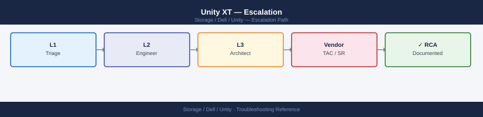
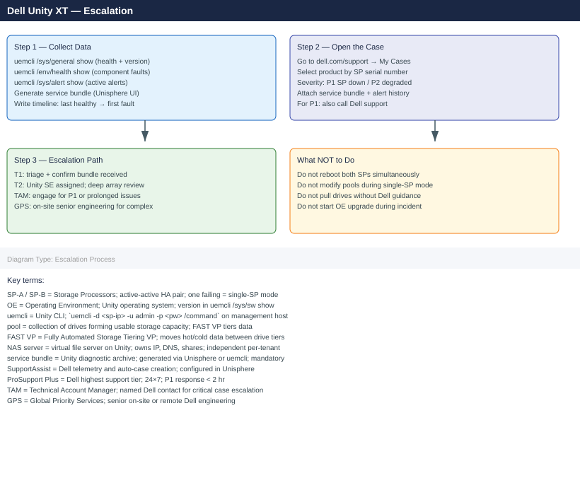
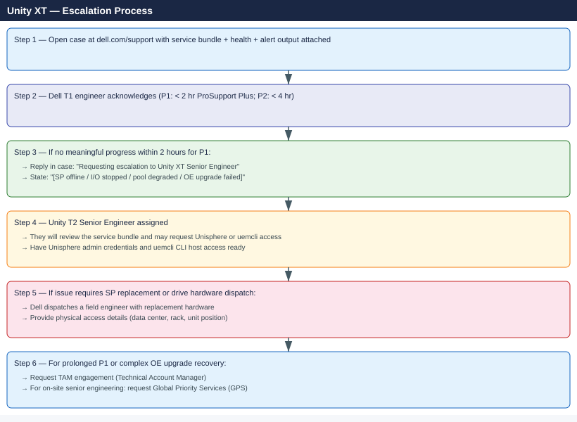

---
tags:
  - dell
  - troubleshooting
search:
  boost: 1.5
---
# Unity XT — Escalation

<div class="kb-summary">
How to escalate Dell Unity XT issues to Dell Technologies support: what data to collect, how to run uemcli diagnostics and generate the service information bundle, step-by-step case creation on dell.com/support, and the escalation path when progress stalls.

*Applies to: Unity XT 380F / 480F / 680F / 880F running OE 5.x*
</div>





---

```d2
direction: down

symptom: Identify Symptom {shape: diamond}
preescalation_selfcheck: "Pre-Escalation Self-Check" {shape: rectangle}
stepbystep_data_collection: "Step-by-Step Data Collection" {shape: rectangle}
how_to_open_the_case_on_dellcomsuppo: "How to Open the Case on dell.com/support" {shape: rectangle}
escalation_path: "Escalation Path" {shape: rectangle}
what_not_to_do: "What NOT to Do" {shape: rectangle}
useful_commands_for_case_updates: "Useful Commands for Case Updates" {shape: rectangle}
resolution: Resolve or Escalate {shape: oval}

symptom -> preescalation_selfcheck: investigate
symptom -> stepbystep_data_collection: investigate
symptom -> how_to_open_the_case_on_dellcomsuppo: investigate
symptom -> escalation_path: investigate
symptom -> what_not_to_do: investigate
symptom -> useful_commands_for_case_updates: investigate
preescalation_selfcheck -> resolution
stepbystep_data_collection -> resolution
how_to_open_the_case_on_dellcomsuppo -> resolution
escalation_path -> resolution
what_not_to_do -> resolution
useful_commands_for_case_updates -> resolution
```

## Before you begin

- **Access required:** uemcli on a management host (or direct Unisphere access at `https://<sp-ip>/`); Unisphere admin credentials; Dell support account at dell.com/support linked to the array SP serial numbers
- **Check SupportAssist first:** Unity XT monitors itself and auto-opens cases for hardware faults (SP failure, drive failure, PSU). Check dell.com/support → My Cases before creating a duplicate
- **Do NOT reboot both SPs simultaneously** — with SP-B down, rebooting SP-A removes all array access; always leave at least one SP running
- **Do NOT modify storage pools** during single-SP mode — pool operations require both SPs; attempting pool changes on a single SP can leave the pool in an inconsistent state

---

## Pre-Escalation Self-Check

Run these before opening the case.

| Check | Command | Expected result |
|---|---|---|
| OE version | `uemcli /sys/sw show` | Note OE version |
| SP serial numbers | Unisphere → Hardware → Storage Processors | Note SP-A and SP-B service tags |
| System health | `uemcli /sys/general show` | `Model`, `Health` fields — note any non-OK health |
| Component health | `uemcli /env/health show -filter "health.value ne OK"` | Empty output (all OK) |
| Active alerts | `uemcli /sys/alert show` | No critical (severity = ERROR or CRITICAL) alerts |
| Pool health | `uemcli /stor/pool show` | All pools in OK health state |
| Drive health | `uemcli /env/disk show -filter "health.value ne OK"` | Empty output (no failed drives) |
| SupportAssist | Unisphere → Settings → Support → SupportAssist | Enabled; test alert last successful |

---

## Step-by-Step Data Collection

### 1. Get the OE version and SP serial numbers

```bash
# Run uemcli from a management host with the CLI installed
# Format: uemcli -d <sp-ip> -u admin -p <password> <command>

# OE version (note full version string including build)
uemcli -d <sp-ip> -u admin -p <password> /sys/sw show

# System info (model, serial, health)
uemcli -d <sp-ip> -u admin -p <password> /sys/general show

# SP serial numbers and health
uemcli -d <sp-ip> -u admin -p <password> /env/sp show
```


```text title="Expected output"
# OE version (note full version string including build)
SP IP: 192.168.1.100
Version: OE 5.1.0.0.5.123
Build: 5.1.0.0.5.123
Release Date: 2023-11-15

# System info (model, serial, health)
System Model: Unity 380
System Serial Number: APM00123456789
Health State: OK
System Status: OK
Capacity: 100 TB
Used Capacity: 67.5 TB

# SP serial numbers and health
SP A:
  Serial Number: APM00123456789A
  Health State: OK
  Status: Present
  IP Address: 192.168.1.100

SP B:
  Serial Number: APM00123456789B
  Health State: OK
  Status: Present
  IP Address: 192.168.1.101
```

!!! warning "Common errors"
    **`Authentication failed`** — Verify the SP IP address is reachable and credentials are correct with `ping <sp-ip>` and confirm the password has no special characters requiring escaping.
    **`Connection timed out`** — Ensure the management host has network connectivity to the SP IP on port 443 and check firewall rules with `telnet <sp-ip> 443`.
    **`uemcli: command not found`** — Install the Dell EMC CLI package on the management host or verify the installation path is in your `$PATH` environment variable.
### 2. Capture component health and active alerts

```bash
# All components that are NOT in OK health state
uemcli -d <sp-ip> -u admin -p <password> /env/health show \
  -filter "health.value ne OK" > /tmp/unity-health-$(date +%Y%m%d%H%M).txt

# All active alerts
uemcli -d <sp-ip> -u admin -p <password> /sys/alert show \
  > /tmp/unity-alerts-$(date +%Y%m%d%H%M).txt

# Alert history (last 72 hours)
uemcli -d <sp-ip> -u admin -p <password> /sys/alert/hist show \
  >> /tmp/unity-alerts-$(date +%Y%m%d%H%M).txt

# Drive health (look for FAILED or DEGRADED)
uemcli -d <sp-ip> -u admin -p <password> /env/disk show >> /tmp/unity-health-$(date +%Y%m%d%H%M).txt
```


```text title="Expected output"
Health Components Not OK:
ID | Name | Health | Description
spa_battery | SPA Battery | DEGRADED | Battery charge below threshold
spb_psu_1 | SPB PSU 1 | FAILED | Power supply unit failure detected
dae_0_disk_12 | DAE 0 Disk 12 | FAILED | Drive offline

Active Alerts (3 total):
ID | Severity | Message | Timestamp
ALERT-0847291 | CRITICAL | SPA battery degraded, charge 45% | 2024-01-15 14:32:18
ALERT-0847290 | MAJOR | SPB PSU 1 failed, redundancy lost | 2024-01-15 14:31:05
ALERT-0847289 | MINOR | DAE 0 disk 12 offline | 2024-01-15 14:28:42

Alert History (72 hours):
ID | Severity | Message | Timestamp
ALERT-0847288 | MAJOR | SPA cache flush initiated | 2024-01-13 09:15:22
ALERT-0847287 | MINOR | Disk predictive failure detected | 2024-01-12 22:41:09
...

Disk Health Summary:
ID | Name | State | Health
dae_0_disk_0 | Disk 0 | READY | OK
dae_0_disk_1 | Disk 1 | READY | OK
dae_0_disk_12 | Disk 12 | OFFLINE | FAILED
dae_1_disk_5 | Disk 5 | DEGRADED | DEGRADED
```

!!! warning "Common errors"
    **`Error: Connection refused (111)`** — Verify the SP IP address is correct and the management interface is reachable with `ping <sp-ip>`.
    **`Error: Authentication failed for user 'admin'`** — Confirm the password is correct and the admin account is not locked; reset credentials via the Unisphere GUI if needed.
    **`uemcli: command not found`** — Install the UEMCLI package on your management host or run commands from a system with UEMCLI already configured.
### 3. Capture pool and storage health

```bash
# Pool health and capacity
uemcli -d <sp-ip> -u admin -p <password> /stor/pool show \
  > /tmp/unity-pools-$(date +%Y%m%d).txt

# LUNs with non-OK health (for block issues)
uemcli -d <sp-ip> -u admin -p <password> /stor/prov/luns show \
  -filter "health.value ne OK" >> /tmp/unity-pools-$(date +%Y%m%d).txt

# NAS servers (for NFS/SMB issues)
uemcli -d <sp-ip> -u admin -p <password> /net/nas/server show \
  >> /tmp/unity-pools-$(date +%Y%m%d).txt
```


```text title="Expected output"
Storage Pool Information
=======================
Pool ID: pool_1
Name: SAN_Pool_01
Health: OK
Total Capacity: 50.0 TB
Used Capacity: 34.2 TB
Available Capacity: 15.8 TB
RAID Type: RAID 6
Pool ID: pool_2
Name: NAS_Pool_02
Health: OK
Total Capacity: 100.0 TB
Used Capacity: 87.5 TB
Available Capacity: 12.5 TB
RAID Type: RAID 10

LUNs with Non-OK Health
=======================
(no LUNs returned)

NAS Servers
=======================
NAS Server ID: nas_1
Name: NAS-Server-01
Health: OK
Operational Status: Running
File Systems: 12
NAS Server ID: nas_2
Name: NAS-Server-02
Health: OK
Operational Status: Running
File Systems: 8
```

!!! warning "Common errors"
    **`Connection refused (Connection refused)`** — Verify the SP IP address is correct and reachable with `ping <sp-ip>`, and confirm the management interface is running with `uemcli -d <sp-ip> -u admin -p <password> /sys show`.
    **`Authentication failed (Authentication failed)`** — Confirm the admin password is correct and the user account has not been locked by attempting login through the Unisphere GUI first.
    **`Command: /stor/pool show not found`** — Ensure you are running uemcli version 4.1 or later by checking `uemcli -version` and update if necessary.
### 4. Generate the service information bundle

**Via Unisphere UI (preferred):**
1. Log in to `https://<sp-ip>/` and navigate to **Settings → Support → Service Information**.
2. Click **Collect** and wait for the bundle to complete (5–15 minutes).
3. Click **Download** and save the bundle to your workstation.

**Via uemcli (if Unisphere UI is inaccessible):**
```bash
# Trigger service bundle collection
uemcli -d <sp-ip> -u admin -p <password> /sys/serviceinfo collect

# Check status
uemcli -d <sp-ip> -u admin -p <password> /sys/serviceinfo show

# Download when complete (follow the download URL from the status output)
```


```text title="Expected output"
Service bundle collection initiated.
Collection ID: SB-20240115-084532
Status: In Progress
Estimated time remaining: 8 minutes

Service Information
Collection ID: SB-20240115-084532
Status: Completed
Size: 2.3 GB
Created: 2024-01-15 08:45:32
Download URL: https://192.168.1.50:443/api/types/serviceinfo/instances/SB-20240115-084532/download
Expiration: 2024-01-22 08:45:32
```

!!! warning "Common errors"
    **`Authentication failed: Invalid credentials`** — Verify the SP IP address is correct and admin credentials are current; reset the password if needed.
    **`Connection timeout: Unable to reach <sp-ip>`** — Confirm the SP management IP is reachable with `ping <sp-ip>` and that the storage array is online.
    **`Collection already in progress`** — Wait for the existing collection to complete or use `uemcli -d <sp-ip> -u admin -p <password> /sys/serviceinfo cancel` to abort it first.
### 5. Write the timeline

```text
Unity model: Unity XT 480F
OE version: 5.4.1.0
SP-A serial: XXXXXXXX; SP-B serial: XXXXXXXX
Array management IP: 10.0.10.10
Hosts connected: 16 (8 via FC, 8 via iSCSI)
Protocols: FC LUNs for VMware, iSCSI LUNs for Oracle RAC, NFS for Linux file servers
Issue first observed: 2026-06-15 09:00 UTC
Last confirmed healthy: 2026-06-15 07:00 UTC
Changes in 24h before the issue:
  - 07:00: Drive expansion: 4 x 7.68 TB SSD drives added to Pool-01 via hot-add
  - 09:00: Unisphere alert: "SP-B: Status = Fault"
  - 09:05: SP-B shows as offline; array in single-SP mode (SP-A active)
  - 09:10: iSCSI LUNs on Oracle RAC: path count halved; I/O continuing on remaining paths
SupportAssist: Auto-case created (Dell case XXXXXXXX) at 09:01
Steps already taken:
  - Did NOT reboot SP-A
  - Did NOT modify pools or add drives
  - uemcli /env/sp show: SP-A OK; SP-B FAULT (hardware fault code XXXX)
Blast radius: SP-B offline; all hosts at half path count; I/O continuing on SP-A; full pool ops blocked
```

---

## How to Open the Case on dell.com/support

1. Go to **dell.com/support** and sign in with your Dell account.

2. Click **My Cases** → **Create New Case**.

3. Under **Product**, enter the SP serial number (from Unisphere → Hardware). Dell associates the case with the array hardware by SP service tag.

4. Under **Severity**, select:
   - **Severity 1 — Production Down**: SP-A is offline (array inaccessible); NFS/iSCSI I/O has stopped to production hosts; a pool is in a DEGRADED state with no remaining redundancy; OE upgrade has failed leaving SPs at different versions; no workaround
   - **Severity 2 — Degraded**: SP-B is offline but SP-A is serving I/O in single-SP mode; a drive has failed and the pool is rebuilding but still accessible; NAS server is unreachable but block LUNs are OK; workaround partial
   - **Severity 3 — Non-Critical**: A specific Unisphere feature is broken; a replication session is suspended but data is consistent; pool is rebalancing; workaround exists
   - **Severity 4 — General**: How-to, upgrade planning, capacity review, NAS configuration question

5. In the **Summary** field: symptom + scope. Example: `Unity XT 480F — SP-B offline since 09:00 UTC, array in single-SP mode, iSCSI hosts at 50% path count`.

6. In the **Description** field, paste:
   - OE version and SP serial numbers from Step 1
   - Component health output from Step 2
   - The timeline from Step 5
   - Any SupportAssist auto-case number if one was created

7. Under **Attachments**, upload:
   - The service information bundle from Step 4
   - The health and alert output files from Steps 2 and 3

8. Click **Submit**. You receive a case number immediately.

9. **Severity 1 only:** call Dell support after submission:
    - North America: +1 800 945 3355 (24×7 for production-down)
    - State "Severity 1 — Unity XT SP offline, single-SP mode, production I/O at risk, case XXXXXXXX" at the start of the call.

---

## Escalation Path



---

## What NOT to Do

| Do NOT do this | Why | What to do instead |
|---|---|---|
| Reboot SP-A while SP-B is already offline | Rebooting the only healthy SP removes all array access; hosts lose I/O completely | Keep SP-A running; let Dell assess SP-B's fault before any SP restart |
| Modify pool configurations (add drives, expand) during single-SP mode | Pool operations on Unity require both SPs; adding or expanding pools with one SP offline can leave the pool in an inconsistent state | Freeze all pool modifications until both SPs are healthy and Dell confirms it is safe |
| Pull a drive that the array shows as faulted without Dell confirmation | A drive the array shows as faulted may still hold valid data if the SP that manages it is offline; pulling prematurely can cause data loss | Let Dell identify the exact faulted drive via the service bundle before any physical removal |
| Start a Unity OE upgrade during an active incident | Upgrading with a faulted SP or degraded pool can leave SPs at different OE versions, making recovery much harder | Wait for Dell to confirm both SPs are healthy and the pool is fully protected before any upgrade |
| Disable SupportAssist during the case | SupportAssist provides Dell with real-time array telemetry; disabling it cuts off the auto-collected data the T2 engineer uses | Keep SupportAssist enabled; the auto-collected call-home data is used to accelerate diagnosis |
| Create a second case for the same incident | Splits diagnostic history across two cases; slows down T2 assignment | Add all updates to the existing case; only create a new case if Dell explicitly instructs |

---

## Useful Commands for Case Updates

```bash
# Run from management host with uemcli installed — paste into every case update

# System health summary
uemcli -d <sp-ip> -u admin -p <password> /sys/general show

# SP health (look for FAULT or DEGRADED on either SP)
uemcli -d <sp-ip> -u admin -p <password> /env/sp show

# All non-OK components
uemcli -d <sp-ip> -u admin -p <password> /env/health show \
  -filter "health.value ne OK"

# Active alerts
uemcli -d <sp-ip> -u admin -p <password> /sys/alert show

# Pool health
uemcli -d <sp-ip> -u admin -p <password> /stor/pool show
```


```text title="Expected output"
System Health Summary:
  System Name: UNITY-SN-APM00123456789
  Model: Unity 380
  Serial Number: APM00123456789
  Health: OK
  Capacity (GB): 10485760
  Used Capacity (GB): 4194304

SP Health:
  SP Name: SPA
    Health: OK
    Temperature: 32°C
    Power Supply 1: OK
    Power Supply 2: OK
  SP Name: SPB
    Health: OK
    Temperature: 31°C
    Power Supply 1: OK
    Power Supply 2: OK

Non-OK Components:
  Component: Disk_15
    Health: DEGRADED
    Type: SAS_Flash
    Slot: 15
  Component: Fan_Module_3
    Health: DEGRADED
    Speed: 45%

Active Alerts:
  Alert ID: 0x7f0000a1
    Severity: WARNING
    Message: Disk 15 predictive failure detected
    Timestamp: 2024-01-15 14:23:45
  Alert ID: 0x7f0000b2
    Severity: INFORMATIONAL
    Message: Fan module 3 operating below optimal speed
    Timestamp: 2024-01-15 14:20:12

Pool Health:
  Pool Name: Pool_SSD_Tier
    Health: DEGRADED
    Total Capacity (GB): 2097152
    Free Capacity (GB): 524288
    RAID Type: RAID10
  Pool Name: Pool_NL_SAS
    Health: OK
    Total Capacity (GB): 8388608
    Free Capacity (GB): 2097152
    RAID Type: RAID6
```

!!! warning "Common errors"
    **`Connection refused — check that <sp-ip> is reachable and uemcli service is running on the SP.`** — Verify network connectivity with `ping <sp-ip>` and confirm the management IP is correct.
    **`Authentication failed for user 'admin'`** — Reset the admin password via the Unisphere web UI or use the correct password in the `-p` parameter.
    **`uemcli: command not found`** — Install the uemcli package on the management host using your distribution's package manager or download from Dell EMC support portal.
---

## Support SLA Reference

| Tier | Severity | Definition | Initial Response SLA |
|---|---|---|---|
| ProSupport Plus | P1 — Production Down | SP offline; I/O stopped; pool degraded below protection threshold | < 2 hours (24×7) |
| ProSupport Plus | P2 — Degraded | Single SP offline; I/O continuing via remaining SP; pool rebuilding | < 4 hours (24×7) |
| ProSupport Plus | P3 — Non-Critical | Specific feature broken; pool rebalancing; replication suspended | Next business day |
| ProSupport Plus | P4 — General | How-to, planning, upgrade review | Next business day |
| ProSupport | P1 | As above | < 4 hours (24×7) |
| ProSupport | P2–P4 | As above | Next business day |

---

## See also

- [Unity — Diagnostics](../diagnostics/)
- [Unity — Common Issues](../common-issues/)

---

## Verify resolution

- Run `uemcli /env/sp show` and confirm both SP-A and SP-B are in OK health state
- Run `uemcli /env/health show -filter "health.value ne OK"` and confirm empty output (all components OK)
- Run `uemcli /sys/alert show` and confirm no active critical or error alerts
- Run `uemcli /stor/pool show` and confirm all pools are in OK health state with full redundancy
- Verify host path counts are restored to expected levels (multipath tool on each affected host)
- Confirm host I/O is healthy: check application logs and Unisphere performance graphs
- If a drive was replaced: confirm the replacement drive is in READY state and the pool rebuild is complete
- Monitor Unisphere alerts for 15 minutes to confirm no new critical alerts appear
