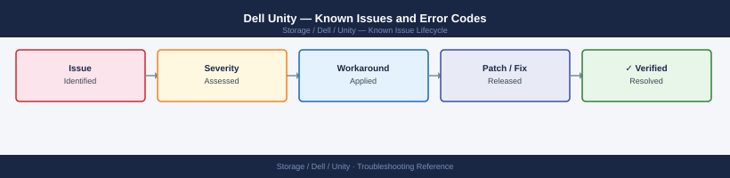

---
tags:
  - troubleshooting
  - unity
  - dell
  - known-issues
---
# Dell Unity — Known Issues and Error Codes

Catalog of known Unity XT bugs, error codes, and workarounds covering Unisphere for Unity, NAS, SAN, and replication.

*Applies to: Unity XT / UnityVSA, OE 5.x*

## Before you begin

- Unity alerts appear in Unisphere for Unity → Alerts.
- Logs: `uemcli /sys/support/uemcli show` for service state; use service login for detailed logs.
- ESRS / SRS must be active for proactive Dell support.

## Host Connectivity

| Error / Symptom | Affected Versions | Cause | Workaround / Fix | Fixed In |
|---|---|---|---|---|
| iSCSI host not seeing LUN after mapping | Unity OE 5.x | Host object not created or initiator not registered | Register iSCSI IQN in Unisphere → Hosts; map storage resource to host | N/A |
| NFS export `Permission denied` on mapped host | Unity OE 5.x | Host access mode not set to `read/write` | Edit NFS share access → set host access to RW | N/A |

## Replication

| Error / Symptom | Affected Versions | Cause | Workaround / Fix | Fixed In |
|---|---|---|---|---|
| Async replication session in `ERROR` state | Unity OE 5.x | Replication port 443 or 8888 blocked between sites | Verify TCP 443 and 8888 between both Unity management IPs | N/A |
| Replication failover leaves source in read-only mode | Unity OE 5.x | Expected behavior — source is read-only post-failover until reprotect | Run reprotect after confirming production is running on destination | N/A |

## Unisphere for Unity

| Error / Symptom | Affected Versions | Cause | Workaround / Fix | Fixed In |
|---|---|---|---|---|
| Unisphere UI blank after OE upgrade | Unity OE 5.x | Browser cache incompatible with new UI | Clear browser cache and cookies; use private/incognito window | N/A |
| `uemcli login failed` after password change | Unity OE 5.x | Cached credential in uemcli config stale | Delete `~/.emc/unisphere/Unisphere.xml` and reconnect | N/A |

## See also

- [Dell Unity — Common Issues](common-issues/)
- [Dell CloudIQ — Known Issues](../../cloudiq/troubleshooting/known-issues.md)
