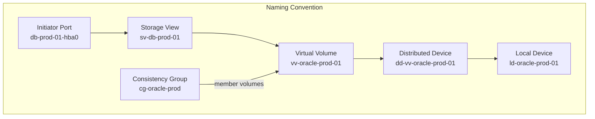
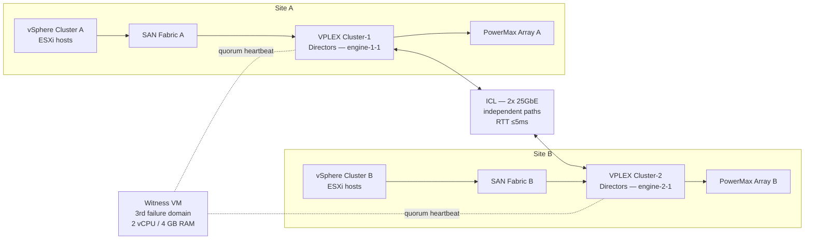

# Dell VPLEX — Standards

Design standards, sizing guidelines, naming conventions, and configuration baselines for VPLEX deployments.



## Sizing Guidelines

| Parameter | Guidance |
|---|---|
| Virtual volume size | Maximum virtual volume size is determined by the GeoSynchrony version; verify in release notes before provisioning large volumes |
| Write cache per director | Cache size is fixed per director model; do not sustain cache utilisation above 70% under write-heavy workloads; monitor via Unisphere performance dashboard |
| Backend IOPS budget | Sum of all virtual volume IOPS must not exceed the backend array's rated IOPS after accounting for RAID overhead and array cache efficiency |
| ICL bandwidth (Metro) | ICL bandwidth must exceed peak write throughput at either site; provision ≥2× expected peak write bandwidth for headroom and burst absorption |
| Director port count | Allocate front-end ports based on host count and per-host bandwidth requirements; maintain port balance across both directors in a pair |
| Consistency groups | One consistency group per multi-volume application; do not exceed documented CG member and CG count limits per GeoSynchrony version |
| Witness VM sizing | Use the Dell-provided Witness OVA; do not resize; the Witness is not in the data path and requires only minimal resources |

### ICL Bandwidth Sizing Example

| Metric | Value |
|---|---|
| Peak write throughput at Site A | 4 GB/s |
| Peak write throughput at Site B | 3 GB/s |
| Worst-case replication load | 4 GB/s (both sites write; worst leg dictates) |
| Recommended ICL provisioning | ≥8 GB/s (2× headroom) |
| Minimum ICL provisioning | ≥5 GB/s (1.25× headroom; not recommended for production) |
| ICL interface | 2× 25GbE ICL ports per director (50 Gbps = 6.25 GB/s raw; plan for ≤70% sustained utilisation) |

## Naming Conventions

All VPLEX objects must follow a consistent naming convention to allow rapid identification during incident response.

| Object | Format | Example |
|---|---|---|
| Virtual Volume | `vv-<app>-<env>-<nn>` | `vv-oracle-prod-01`, `vv-sql-dev-02` |
| Local Device | `ld-<app>-<env>-<nn>` | `ld-oracle-prod-01` |
| Distributed Device (Metro) | `dd-<vv-name>` | `dd-vv-oracle-prod-01` |
| Consistency Group | `cg-<app>-<env>` | `cg-oracle-prod`, `cg-sql-dev` |
| Storage View | `sv-<hostname>` | `sv-db-prod-01`, `sv-esxi-prod-04` |
| Initiator Port | `<hostname>-hba<n>` | `db-prod-01-hba0`, `db-prod-01-hba1` |
| Extent | `ext-<sv-name>-<nn>` | `ext-sv-001-01` (follows storage volume naming) |
| Storage Volume | Descriptive name matching backend array LUN ID | `sv-pmax-00A12B` |
| Port (front-end) | Use VPLEX default naming; document VPLEX port WWN → fabric alias mapping in CMDB | `A0-FC00`, `B0-FC00` |

**Naming rules:**
- Use only lowercase alphanumeric characters and hyphens; no spaces, underscores, or special characters.
- Environment codes: `prod`, `nonprod`, `dev`, `dr`.
- Application codes: short form matching the CMDB application record (e.g., `oracle`, `sql`, `sap`).
- Sequence numbers: zero-padded two digits (`01`, `02`, ... `10`).

## Metro Configuration Standards

Every production VPLEX Metro deployment must meet these requirements before go-live:



| Requirement | Detail |
|---|---|
| Witness VM location | Third failure domain — not co-located at Site A or Site B; must be reachable from both clusters at all times |
| ICL redundancy | Minimum two independent physical ICL paths between clusters using different physical routes or carriers |
| ICL RTT | Must be ≤5ms round-trip under peak load conditions; test with sustained traffic, not just idle ping |
| ICL utilisation alert threshold | Alert at 70% sustained utilisation; investigate at 80% |
| Distributed device coverage | All production application volumes must be distributed devices (Metro) at go-live |
| Consistency group coverage | Every multi-volume application must be in a consistency group; single-volume applications must also be in a CG for Metro deployments |
| Pre-production failover test | Perform a planned site switch in a maintenance window before production go-live; document the test result and recovery time |
| Annual Metro test | Repeat the planned site switch test annually; document results and update the runbook |

### Witness Configuration Verification

Run these checks to confirm Witness is correctly configured before any Metro go-live:

```bash
# Witness must show connected and reachable from both clusters
vplexcli -q -e "ll /clusters/cluster-1/cluster-witness/"
vplexcli -q -e "ll /clusters/cluster-2/cluster-witness/"

# Simulate ICL failure (in lab/pre-prod only) and confirm Witness grants quorum to one cluster
# — do not perform this test in production without a detailed runbook and application owner approval
```

## Build Baseline

Every VPLEX deployment must be configured to this baseline before handover to operations.

### Consistency Group Policy

- All multi-volume applications must be in a dedicated consistency group to ensure write-order fidelity across volumes during failover.
- Single-volume applications in Metro deployments must also be in a consistency group to enable Witness-arbitrated failover.
- Consistency group membership is set at provisioning time; changes require a change record.
- Maximum CG members: check the GeoSynchrony release notes for per-version limits; do not approach the documented maximum.

### Storage View Policy

- One storage view per host; no shared views between different hosts or applications.
- Front-end ports from both directors in a pair must be included in each storage view for path redundancy.
- Only include the virtual volumes the specific host requires; no catch-all views.
- Storage view names must match the naming convention (`sv-<hostname>`).

### Back-End Zoning and Masking

- VPLEX back-end ports must be the only initiators in the back-end array masking view for VPLEX storage volumes.
- Hosts must never be zoned directly to back-end array ports; all host access must pass through VPLEX.
- Use separate SAN fabrics for front-end (host-to-VPLEX) and back-end (VPLEX-to-array) zoning.

### Management and Monitoring

- VMS must be on a dedicated management VLAN with no access from production servers.
- Syslog forwarding from VMS to the SIEM must be configured and verified before go-live.
- SNMP traps must be configured to the NMS before go-live.
- CloudIQ telemetry upload must be configured if licensed.
- A VMS VM backup schedule must be active before go-live.

## Configuration Checklist

Complete this checklist before signing off a new VPLEX deployment or validating after a significant change:

**Physical and director health:**
- [ ] All directors online and healthy: `ll /engines/*/directors/*/hardware/`
- [ ] All director front-end and back-end ports are operational: `ll /engines/*/directors/*/hardware/ports/`

**Metro connectivity:**
- [ ] Inter-cluster link (ICL) healthy and RTT ≤5ms: `ll /clusters/*/communication/inter-cluster-links/`
- [ ] ICL has minimum two independent physical paths
- [ ] Witness reachable from both clusters: `ll /clusters/*/cluster-witness/`
- [ ] Planned site-switch failover test completed and documented

**Storage objects:**
- [ ] All distributed devices in a healthy sync state: `ll /distributed-storage/distributed-devices/*/health-indications/`
- [ ] All consistency groups healthy and containing the correct distributed devices
- [ ] All storage views contain the correct initiators, front-end ports, and virtual volumes
- [ ] Hosts can see virtual volumes and multipath drivers report all expected paths active

**Back-end:**
- [ ] Backend array storage volumes correctly claimed and not directly accessible to hosts outside of VPLEX
- [ ] Backend array masking views contain only VPLEX back-end port WWNs (no host WWNs)

**Operations readiness:**
- [ ] Full health check passing: `health-check --full`
- [ ] CMDB updated with storage view-to-host-to-virtual volume mappings
- [ ] VMS VM is backed up and backup verified
- [ ] Syslog forwarding to SIEM configured and log ingestion verified
- [ ] SNMP traps to NMS configured and tested
- [ ] Naming convention applied to all objects
- [ ] Operations team briefed on daily check procedure and incident response runbook

## Performance Baselines

Record these at go-live and compare during incident investigation:

| Metric | Baseline Value | Alert Threshold |
|---|---|---|
| ICL RTT (Metro) | _measured at go-live_ | >3ms (warning), >5ms (critical) |
| ICL utilisation | _measured at go-live_ | >70% sustained |
| Write cache utilisation per director | _measured at go-live_ | >70% sustained |
| Host path count per volume | _measured at go-live_ | Less than expected (path failure) |
| Distributed device rebuild time | _measured after first test rebuild_ | Reference for estimating future rebuild windows |

Document baseline values in the CMDB operational record for the VPLEX cluster.
