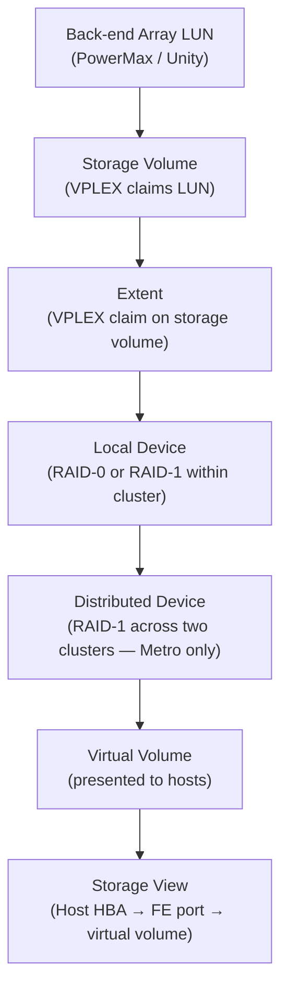
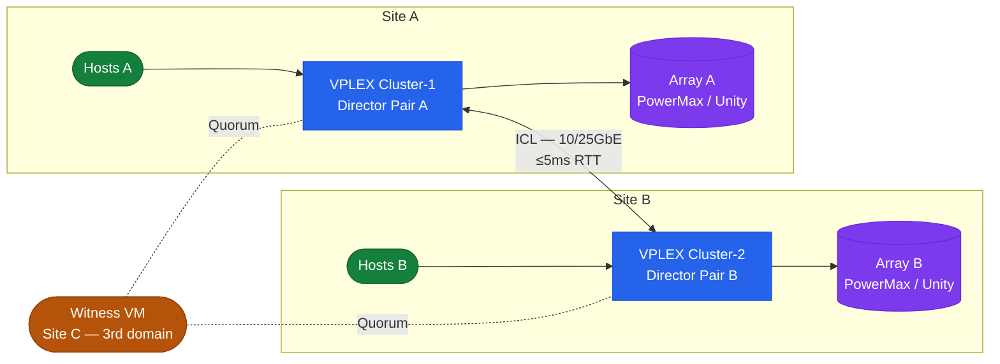

# VPLEX — How It Works


<div class="kb-summary">
How It Works reference covering Overview, Deployment Models, Storage Object Hierarchy, VPLEX Metro Topology, Director Architecture and 5 more sections.
</div>

## Overview

Dell VPLEX is a storage federation and virtualisation platform that decouples physical storage from the host view, presenting virtual volumes to hosts regardless of which back-end array holds the data. VPLEX Local, Metro, and Geo represent progressively wider federation scopes.

## Deployment Models

| Model | Sites | Replication | RTT Limit | Active-Active | Use Case |
|---|---|---|---|---|---|
| VPLEX Local | 1 | Synchronous (within engine) | N/A | Yes (within site) | LUN virtualisation, data mobility |
| VPLEX Metro | 2 | Synchronous (ICL) | ≤5ms | Yes (both sites) | Zero-RPO stretched cluster for VMware HA |
| VPLEX Geo | 2+ | Asynchronous (RecoverPoint) | Any | No | Long-distance DR beyond Metro RTT limits |

## Storage Object Hierarchy

VPLEX builds virtual volumes from back-end storage through a layered hierarchy:



## VPLEX Metro Topology



## Director Architecture

Each VPLEX director contains:

- **Front-end FC ports** — present virtual volumes to hosts via storage views
- **Back-end FC ports** — connect to back-end arrays; discover and claim storage volumes
- **NVRAM write cache** — mirrored between both directors in a pair
- **High-speed interconnect** — connects both directors in a pair for cache mirroring

| Unit | Description |
|---|---|
| Director | Single processing node with FE + BE FC ports and NVRAM write cache |
| Director pair | Two directors in one engine; cache-mirrored; minimum HA unit |
| Engine | Physical chassis housing one or two director pairs |
| Cluster | One or more engines at a single site |

## Metro Write Path

1. Host submits write to VPLEX Cluster-1 FE FC port
2. Director writes to local NVRAM write cache
3. VPLEX synchronously replicates to Cluster-2 over ICL
4. Cluster-2 director acknowledges into its write cache
5. Cluster-1 director acknowledges write completion to host
6. Both clusters destage independently to their local arrays

Host write latency = local VPLEX cache latency + ICL round-trip latency.

## Witness (Quorum Arbitrator)

The Witness VM (deployed at a third site) grants quorum on ICL failure:

- Without Witness: ICL failure suspends I/O on all distributed devices (both clusters go into lock-out to prevent split-brain)
- With Witness: the first cluster to contact the Witness is granted quorum and continues serving I/O; the other is suspended

Requirements: 2 vCPU / 4 GB RAM VM at a third failure domain; reachable from both clusters via management network.

## ICL Requirements

| Parameter | Requirement |
|---|---|
| RTT budget | ≤5ms |
| Minimum paths | 2 independent physical paths |
| Interface | 10GbE or 25GbE |
| Bandwidth | ≥2× peak write throughput at either site |

## Connectivity

| Layer | Protocol | Details |
|---|---|---|
| Host → VPLEX | FC 8/16 Gb | Hosts zone to VPLEX front-end FC ports only |
| VPLEX → Array | FC 8/16 Gb | VPLEX back-end ports zone to array target ports |
| Metro ICL | 10/25 GbE | Synchronous write replication between clusters |
| VPLEX → Witness | IP (management) | Quorum heartbeat |
| Management | SSH / HTTPS | vplexcli over SSH; Unisphere over HTTPS |

## Key CLI Commands

```bash
# Health and device status
ll /clusters/*/health-indications/
ll /engines/*/directors/*/hardware/
ll /distributed-storage/distributed-devices/*/health-indications/
health-check --full

# Storage views and objects
ll /clusters/*/exports/storage-views/
ll /distributed-storage/consistency-groups/

# Witness connectivity
ll /clusters/cluster-1/cluster-witness/
```
