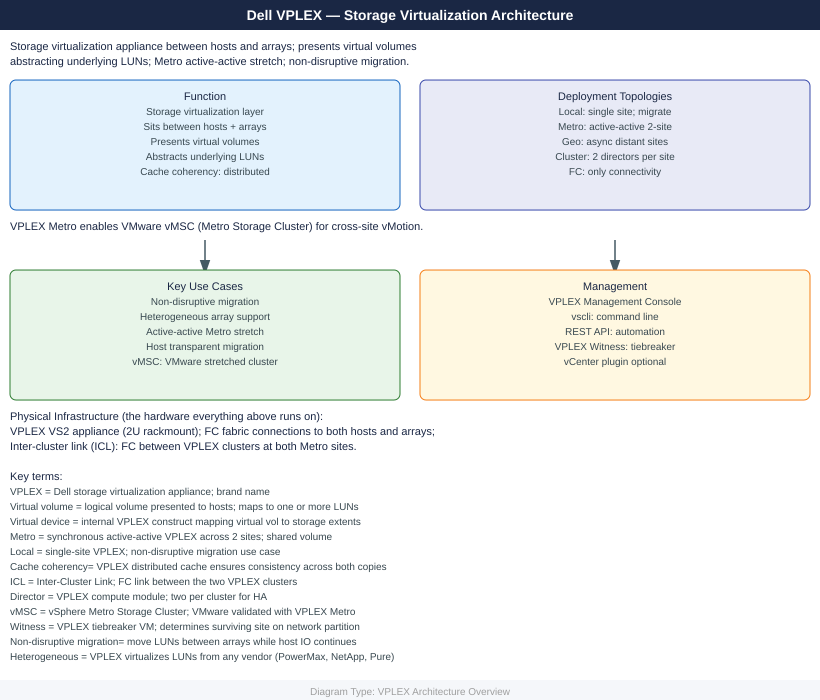
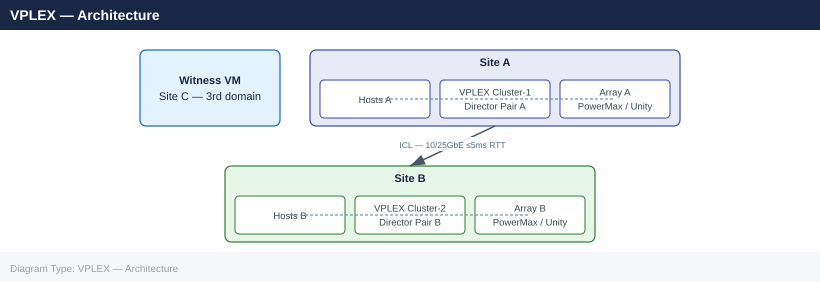
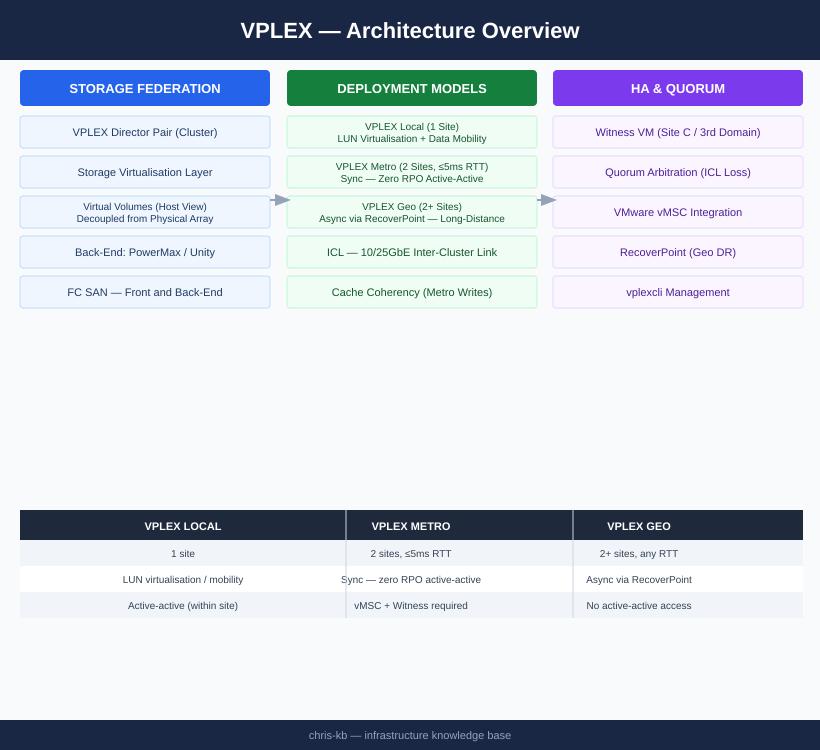

---
tags:
  - architecture
  - dell
---
# VPLEX — Architecture

Dell VPLEX is a storage federation and virtualisation platform that decouples physical storage from the host view, presenting virtual volumes regardless of which back-end array holds the data. VPLEX Metro provides zero-RPO active-active stretched storage across two sites with a ≤5ms RTT ICL.

*Applies to: VPLEX*

  <a class="kb-card" href="how-it-works/">
    
⚙️

    
How It Works

    
Storage object hierarchy, Metro write path, Witness quorum arbitration, ICL requirements, and vplexcli reference.

  </a>
  <a class="kb-card" href="integrations/">
    
🔗

    
Integrations

    
VMware Metro Storage Cluster (vMSC), RecoverPoint (Geo), PowerMax and Unity back-end arrays.

  </a>
  <a class="kb-card" href="design-standards/">
    
📐

    
Design Standards

    
Model selection (Local / Metro / Geo), ICL bandwidth sizing, Witness placement, and storage view zoning standards.

  </a>

## Deployment Models

| Model | Sites | Replication | RTT Limit | Active-Active | Use Case |
|---|---|---|---|---|---|
| VPLEX Local | 1 | Synchronous (within engine) | N/A | Yes (within site) | LUN virtualisation, data mobility |
| VPLEX Metro | 2 | Synchronous (ICL) | ≤5ms | Yes (both sites) | Zero-RPO stretched cluster for VMware HA |
| VPLEX Geo | 2+ | Asynchronous (RecoverPoint) | Any | No | Long-distance DR beyond Metro RTT limits |

## Topology

