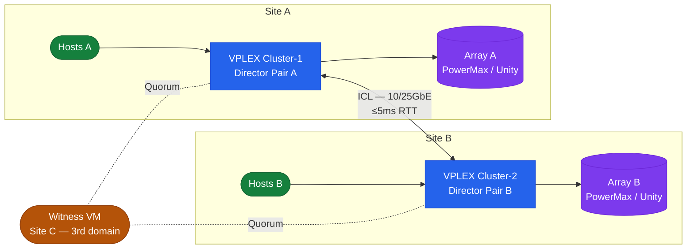

# VPLEX — Architecture

<div class="kb-summary">
Dell VPLEX is a storage federation and virtualisation platform that decouples physical storage from the host view, presenting virtual volumes regardless of which back-end array holds the data. VPLEX Metro provides zero-RPO active-active stretched storage across two sites with a ≤5ms RTT ICL.
</div>
```
┌────────────────────────────────────── Dell VPLEX — Architecture ──────────────────────────────────────┐
│                                                                                                       │
│   ┌───────────────────────────────────────────────────────────────────────────────────────────────┐   │
│   │ VPLEX architecture overview: federated storage virtualisation and active-active cross-site cl │   │
│   │                                     Protocols: FC · iSCSI                                     │   │
│   │              Key components: Management Server, Engines, Virtual volumes, WAN-COM             │   │
│   │          Design principles: HA, scalability, non-disruptive operations, and security          │   │
│   └───────────────────────────────────────────────────────────────────────────────────────────────┘   │
│                                                                                                       │
│    Design → deploy → configure → validate → monitor → optimise                                        │
│                                                                                                       │
│                  ▼                                ▼                                ▼                  │
│                                                                                                       │
│   ┌─────────────────────────────┐  ┌─────────────────────────────┐  ┌─────────────────────────────┐   │
│   │            Layer            │  │          Component          │  │            Notes            │   │
│   │        Virtualisation       │  │         Backend LUNs        │  │      Abstracted to VVs      │   │
│   │            Metro            │  │         Sync stretch        │  │        <5ms RTT sites       │   │
│   │             Geo             │  │      Async replication      │  │         Any distance        │   │
│   │          Clustering         │  │        Active-active        │  │       Shared namespace      │   │
│   │            Quorum           │  │          Witness VM         │  │      Split-brain guard      │   │
│   └─────────────────────────────┘  └─────────────────────────────┘  └─────────────────────────────┘   │
│                                                                                                       │
│                          ▼                                                 ▼                          │
│                                                                                                       │
│   ┌───────────────────────────────────────────────────────────────────────────────────────────────┐   │
│   │    Component     │     Purpose      │      Protocol     │       Auth       │      Notes       │   │
│   │  Virtual volume  │ Virtualised LUN  │      FC/iSCSI     │    FC zoning     │   Multi-vendor   │   │
│   │  Metro cluster   │   Sync stretch   │   Inter-cluster   │   Certificate    │    2-site max    │   │
│   │     Witness      │  Quorum arbiter  │       HTTPS       │   Certificate    │     3rd site     │   │
│   │     WAN-COM      │ Geo replication  │   Encrypted WAN   │   Certificate    │     Geo only     │   │
│   └───────────────────────────────────────────────────────────────────────────────────────────────┘   │
│                                                                                                       │
│    Physical: VPLEX VS2/VS6 appliance · FC fabric · backend arrays · WAN link (Metro/Geo)              │
│                                                                                                       │
│    Key terms:                                                                                         │
│                                                                                                       │
│    VPLEX              = Dell storage federation; aggregates arrays into virtual volumes across vendors│
│    Virtual volume     = VPLEX-abstracted LUN presented to hosts; backend is array LUNs                │
│    VPLEX Metro        = synchronous active-active stretch cluster; same VV served from two sites      │
│    VPLEX Geo          = asynchronous active-active replication; higher RPO, no distance constraint    │
│    Distributed VV     = virtual volume spanning two sites for Metro active-active host access         │
│    Witness            = third-site quorum arbiter for Metro; prevents split-brain island scenarios    │
│    WAN-COM            = WAN communication module in VPLEX Geo; manages inter-site replication traffic │
│    Management Server  = embedded Linux VM in VPLEX engine; serves web UI and vplex CLI                │
│    Consistency group  = set of virtual volumes that failover together maintaining write order         │
│    Backend volume     = LUN from underlying array presented to VPLEX engine for virtualisation        │
│    Local device       = RAID device or extent of backend volumes on a single VPLEX cluster            │
│    Cluster            = single VPLEX installation; Metro topology requires exactly two clusters       │
│                                                                                                       │
└───────────────────────────────────────────────────────────────────────────────────────────────────────┘
```


<div class="kb-grid kb-grid-3">
  <a class="kb-card" href="how-it-works/">
    <div class="kb-card-icon">⚙️</div>
    <div class="kb-card-title">How It Works</div>
    <div class="kb-card-desc">Storage object hierarchy, Metro write path, Witness quorum arbitration, ICL requirements, and vplexcli reference.</div>
  </a>
  <a class="kb-card" href="integrations/">
    <div class="kb-card-icon">🔗</div>
    <div class="kb-card-title">Integrations</div>
    <div class="kb-card-desc">VMware Metro Storage Cluster (vMSC), RecoverPoint (Geo), PowerMax and Unity back-end arrays.</div>
  </a>
  <a class="kb-card" href="design-standards/">
    <div class="kb-card-icon">📐</div>
    <div class="kb-card-title">Design Standards</div>
    <div class="kb-card-desc">Model selection (Local / Metro / Geo), ICL bandwidth sizing, Witness placement, and storage view zoning standards.</div>
  </a>
</div>

## Deployment Models

| Model | Sites | Replication | RTT Limit | Active-Active | Use Case |
|---|---|---|---|---|---|
| VPLEX Local | 1 | Synchronous (within engine) | N/A | Yes (within site) | LUN virtualisation, data mobility |
| VPLEX Metro | 2 | Synchronous (ICL) | ≤5ms | Yes (both sites) | Zero-RPO stretched cluster for VMware HA |
| VPLEX Geo | 2+ | Asynchronous (RecoverPoint) | Any | No | Long-distance DR beyond Metro RTT limits |

## Topology


