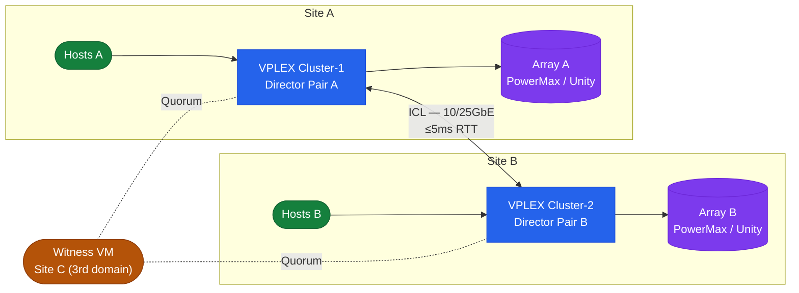

# Dell VPLEX — Architecture Overview

Dell VPLEX is a storage federation and virtualisation platform that decouples physical storage from the host view, presenting virtual volumes to hosts regardless of which back-end array holds the data. VPLEX Local, Metro, and Geo represent progressively wider federation scopes — from a single data centre through to asynchronous long-distance replication.

## Deployment Models

| Model | Sites | Replication | RTT Limit | Active-Active | Use Case |
|---|---|---|---|---|---|
| VPLEX Local (VS2) | 1 | Synchronous (within engine) | N/A | Yes (within site) | LUN virtualisation, data mobility, active-active within DC |
| VPLEX Metro | 2 | Synchronous (ICL) | ≤5ms | Yes (both sites) | Zero-RPO, zero-RTO stretched cluster for VMware HA, vMotion |
| VPLEX Geo | 2+ | Asynchronous (RecoverPoint) | Any | No | Long-distance DR beyond Metro RTT limits |

## Storage Object Hierarchy

VPLEX builds virtual volumes from back-end storage through a layered hierarchy. Understanding this stack is essential for provisioning, expanding, and troubleshooting.

```
Back-end Array LUN (storage volume)
    └── Extent            (a VPLEX claim on a storage volume or portion of one)
        └── Local Device  (one or more extents, RAID-0 or RAID-1 within a cluster)
            └── Distributed Device (RAID-1 across two clusters — Metro only)
                └── Virtual Volume (the object presented to hosts)
```

Each layer maps to a vplexcli path:

| Object | vplexcli Path |
|---|---|
| Storage volumes | `/clusters/<c>/storage-elements/storage-volumes/` |
| Extents | `/clusters/<c>/storage-elements/extents/` |
| Local devices | `/clusters/<c>/devices/` |
| Distributed devices | `/distributed-storage/distributed-devices/` |
| Virtual volumes | `/virtual-volumes/` |
| Storage views | `/clusters/<c>/exports/storage-views/` |

## VPLEX Metro Topology



### Inter-Cluster Link (ICL)

The ICL is the synchronous replication channel between Metro clusters. All write I/O to a distributed device is acknowledged only after both cluster legs confirm the write, making the ICL latency directly visible in host write latency.

| Parameter | Requirement |
|---|---|
| RTT budget | ≤5ms (10ms round-trip for the synchronous ack) |
| Minimum paths | 2 independent physical paths |
| Interface type | 10GbE or 25GbE; dark fibre or carrier WAN with QoS |
| Bandwidth provisioning | Provision ≥2× peak write throughput at either site |
| Monitoring | Alert on ICL path failure; monitor utilisation |

### Witness (WAN-COM Arbitrator)

The Witness is a lightweight VM deployed in a third failure domain that provides quorum arbitration for Metro deployments.

**Without Witness**: if the ICL fails, neither cluster can determine whether the other is alive. Both clusters suspend I/O on distributed devices in consistency groups to prevent split-brain data divergence.

**With Witness**: on ICL failure, each cluster contacts the Witness. The Witness grants quorum to the first cluster that requests it, allowing that cluster to continue serving I/O. The other cluster's distributed device legs are suspended.

Witness requirements:

| Item | Requirement |
|---|---|
| Location | Third failure domain — not co-located at Site A or Site B |
| Network | Reachable from both clusters on management network |
| VM resources | Minimal; typically 2 vCPU, 4GB RAM |
| OS | Provided as a pre-configured Dell appliance OVA |
| Redundancy | A second Witness VM can be configured; recommended for critical environments |

Check Witness status from both clusters:

```bash
vplexcli -q -e "ll /clusters/cluster-1/cluster-witness/"
vplexcli -q -e "ll /clusters/cluster-2/cluster-witness/"
```

Expected output fields: `witness-connectivity: connected`, `witness-reachable: true`.

## Director Architecture

Each VPLEX director is a processing node with:

- **Front-end FC ports** — present virtual volumes to hosts; each port is assigned to one or more storage views
- **Back-end FC ports** — connect to back-end arrays; discover and claim storage volumes
- **Write cache module** — NVRAM-backed write cache; mirrored between both directors in a pair
- **High-speed interconnect** — connects both directors in a pair for cache mirroring and path failover

### Director Pair and Engine

A director pair (two directors) shares a cache mirror and is housed in a single engine (chassis). Cache mirroring within a pair ensures that no write is acknowledged until both directors hold it — if one director in a pair fails, the surviving director has a complete copy of outstanding writes.

| Unit | Description |
|---|---|
| Director | Single processing node with FE + BE FC ports and write cache |
| Director pair | Two directors in one engine; cache-mirrored; minimum HA unit |
| Engine | Physical chassis housing one or two director pairs |
| Cluster | One or more engines at a single site presenting one logical VPLEX cluster |

List directors across all engines:

```bash
vplexcli -q -e "ll /engines/*/directors/"
```

List ports on a specific director:

```bash
vplexcli -q -e "ll /engines/engine-1-1/directors/director-1-1-A/hardware/ports/"
```

### Port Types

| Port Type | Path | Purpose |
|---|---|---|
| Front-end (FE) | `director-1-1-A/hardware/ports/A0-FC00` | Hosts zone to these ports; storage views present volumes through FE ports |
| Back-end (BE) | `director-1-1-A/hardware/ports/B0-FC00` | VPLEX zones to array target ports; storage volumes are discovered and claimed on BE ports |
| Management | Dedicated management NIC on VMS | Used by vplexcli and Unisphere management traffic only; no data path |

## VPLEX Geo Architecture

VPLEX Geo extends federation beyond the ≤5ms RTT constraint using Dell RecoverPoint for asynchronous replication. Unlike Metro, Geo volumes are active on only one site at a time.

```
Site A (Active)                     Site B (Standby/DR)
  VPLEX Cluster-1                     VPLEX Cluster-2
  RecoverPoint splitter               RecoverPoint appliance
    → async replication →               receives async journal
  Hosts read/write vol                Hosts cannot write (site not active)
```

Key differences from Metro:

| Aspect | Metro | Geo |
|---|---|---|
| Replication | Synchronous | Asynchronous (RecoverPoint journal) |
| RPO | Zero | Configurable (minutes to hours) |
| Active-active | Yes | No (active on one site at a time) |
| Failover | Transparent (Witness-arbitrated) | Orchestrated RecoverPoint failover |
| RTT limit | ≤5ms | Any distance |

## Connectivity Overview

| Layer | Protocol | Details |
|---|---|---|
| Host → VPLEX | Fibre Channel 8Gb/16Gb | Hosts zone to VPLEX front-end FC ports only |
| VPLEX → Back-end array | Fibre Channel 8Gb/16Gb | VPLEX back-end ports zone to array target ports |
| VPLEX cluster → cluster (Metro) | 10GbE / 25GbE | ICL carries synchronous write data; ≤5ms RTT required |
| VPLEX → Witness | IP (management network) | Quorum heartbeat; low-bandwidth, high-reliability path |
| VPLEX → RecoverPoint (Geo) | Fibre Channel or IP | Splitter integration for async replication |
| Management | SSH / HTTPS | vplexcli over SSH to VMS; Unisphere HTTPS on VMS |

## Data Path for a Host Write (Metro)

Understanding the write path is critical for latency troubleshooting:

1. Host submits write to front-end FC port on VPLEX Cluster-1 director
2. VPLEX director acknowledges receipt and writes to local NVRAM write cache
3. VPLEX synchronously replicates the write to Cluster-2 over the ICL
4. Cluster-2 director acknowledges receipt into its own write cache
5. Cluster-1 director acknowledges the write completion to the host
6. Both clusters destage the write to their local back-end arrays independently

Host write latency = local VPLEX cache latency + ICL round-trip latency + any back-pressure from cache destage.

## VPLEX Local vs. Metro — Feature Comparison

| Feature | VPLEX Local | VPLEX Metro |
|---|---|---|
| Sites | 1 | 2 |
| Virtual volumes | Local only | Distributed (spans both sites) |
| Active-active host access | Yes (within site) | Yes (both sites simultaneously) |
| Zero RPO | Yes (within site) | Yes (both sites) |
| Transparent failover | N/A | Yes (Witness-arbitrated) |
| Consistency groups | Local | Distributed |
| ICL required | No | Yes (≤5ms RTT) |
| Witness required | No | Yes (strongly recommended) |
| Data mobility | Yes (non-disruptive migration) | Yes |
