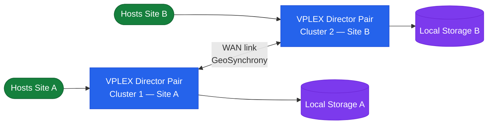

# Dell VPLEX — Overview

Dell VPLEX is a storage virtualisation and federation platform that presents unified virtual volumes to hosts from one or more heterogeneous backend storage arrays. VPLEX abstracts physical storage into virtual volumes, enabling live data mobility between arrays, active-active block storage access across sites, and non-disruptive migration without host changes. VPLEX is deployed as a set of director pairs, each running the GeoSynchrony software stack. Management is via the `vplexcli` command-line interface or Unisphere for VPLEX web GUI.

## Storage Federation Topology

## HA Topology

**Single site (VS2 / Local):**

- Director pairs provide N+1 redundancy within a site — one director can fail without interrupting I/O.
- Cache within a director pair is mirrored; losing one director does not lose write data.
- Backend arrays connect to both directors in a pair for multipath redundancy.

**Metro (active-active, two sites):**

- Distributed devices span both clusters; each site has a complete copy of the data (synchronous mirroring).
- Hosts at both sites access the same distributed device simultaneously with full read/write capability.
- If one cluster becomes unreachable, the Witness determines which cluster continues serving I/O (quorum). Without a Witness, a cluster partition causes both sites to suspend I/O.
- Inter-Cluster Link (ICL) carries write synchronisation traffic between sites; RTT must be ≤5ms for Metro.

**Geo (async, two sites):**

- Uses RecoverPoint for asynchronous replication; VPLEX Geo presents the volume on one site at a time.
- Not active-active; Geo is a DR configuration for sites beyond Metro RTT limits.

## Connectivity

| Layer | Protocol / Interface | Details |
|---|---|---|
| Host to VPLEX | Fibre Channel (8Gb/16Gb) | Hosts zone to VPLEX front-end FC ports; VPLEX presents virtual volumes to hosts |
| VPLEX to Backend Array | Fibre Channel (8Gb/16Gb) | VPLEX back-end FC ports zone to backend array ports; VPLEX discovers and claims storage volumes |
| Inter-Cluster Link (Metro) | 10GbE or 25GbE WAN / dark fibre | Carries synchronous write data between Metro clusters; requires ≤5ms RTT |
| Management | 1GbE management interface | VMS connects to directors for management; vplexcli connects to the VMS |
