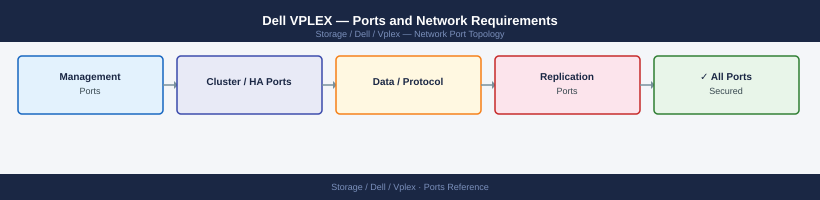

---
tags:
  - vplex
  - dell
  - networking
  - firewall
  - ports
  - storage
  - federation
---
# Dell VPLEX — Ports and Network Requirements

<div class="kb-summary">
Firewall port reference for Dell VPLEX (storage federation / virtualization). Covers management, WAN COM link between VPLEX clusters (for VPLEX Metro), and host connectivity.

*Applies to: VPLEX GeoSynchrony 6.x*
</div>



```d2
direction: right

center: "VPLEX" {shape: hexagon}
inbound_management: "Inbound — Management" {shape: rectangle}
outbound_management_server_to_extern: "Outbound — Management Server to External" {shape: rectangle}
vplex_metro_wan_com_link_between_sit: "VPLEX Metro — WAN COM Link (Between Sites)" {shape: rectangle}
host_connectivity_iscsi: "Host Connectivity (iSCSI)" {shape: rectangle}
firewall_zone_summary: "Firewall Zone Summary" {shape: rectangle}
verify: "Verify" {shape: rectangle}

center -> inbound_management
center -> outbound_management_server_to_extern
center -> vplex_metro_wan_com_link_between_sit
center -> host_connectivity_iscsi
center -> firewall_zone_summary
center -> verify
```

## Inbound — Management

| Port | Protocol | Source | Purpose |
|---|---|---|---|
| 443 | TCP | Admin workstations | Unisphere for VPLEX web UI and REST API |
| 22 | TCP | Jump hosts | SSH — VPLEX management server CLI |
| 443 | TCP | VMware vCenter, vRO | VPLEX vSphere plugin API |

## Outbound — Management Server to External

| Port | Protocol | Destination | Purpose |
|---|---|---|---|
| 162 | UDP | SNMP receiver | SNMP traps |
| 514 | UDP | Syslog server | Syslog forwarding |
| 123 | UDP | NTP | Time sync |
| 443 | TCP | esrs.dell.com | ESRS support phone-home |

## VPLEX Metro — WAN COM Link (Between Sites)

For VPLEX Metro (active-active across sites), the VPLEX management servers communicate across the WAN:

| Port | Protocol | Between | Purpose |
|---|---|---|---|
| 443 | TCP | VPLEX Management Server (Site A) ↔ VPLEX Management Server (Site B) | VPLEX cluster management communication across WAN COM link |

The actual data path between VPLEX clusters uses fibre channel ISL or iSCSI — not IP-routed through a firewall in most deployments.

## Host Connectivity (iSCSI)

| Port | Protocol | Source | Purpose |
|---|---|---|---|
| 3260 | TCP | iSCSI initiator hosts | iSCSI front-end connections to VPLEX (if iSCSI front-end configured) |

## Firewall Zone Summary

| From | To | Ports | Notes |
|---|---|---|---|
| Admin clients | VPLEX mgmt IP | 443, 22 | UI and CLI |
| VPLEX Site A mgmt | VPLEX Site B mgmt | 443 | Metro WAN COM link |
| iSCSI hosts | VPLEX iSCSI front-end | 3260 | Block (if iSCSI front-end) |
| VPLEX | ESRS | 443 | Support phone-home |

## Verify

```bash
# From admin workstation — test Unisphere for VPLEX
curl -sk -o /dev/null -w "%{http_code}" https://<vplex-mgmt-ip>/vplex/v2/version

# From Site A VPLEX mgmt — test Site B WAN COM reachability
nc -zv <site-b-vplex-mgmt-ip> 443
```

## See also

- [Dell VPLEX — Architecture](how-it-works/)
- [Dell VPLEX — Operations](../operations/)
- [Dell RecoverPoint — Ports](../../recoverpoint/architecture/ports.md)
