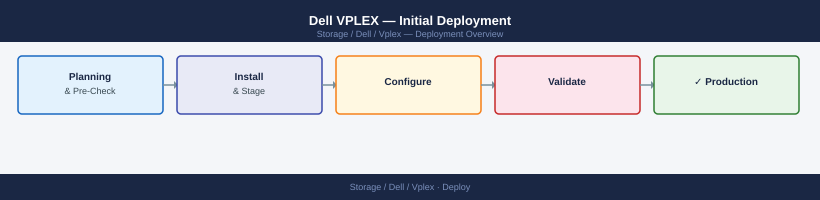
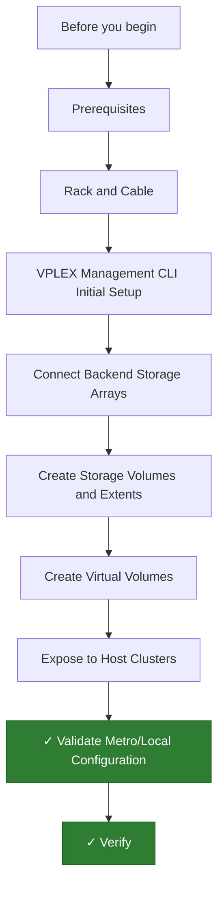

---
tags:
  - dell
  - deployment
search:
  boost: 1.5
---
# Dell VPLEX — Initial Deployment

<div class="kb-summary">
Dell VPLEX initial deployment: physical installation, backend array connection, virtual volume creation, and validated host access — Local and Metro configurations covered.

*Applies to: VPLEX 6.x*
</div>





```d2
direction: right

plan: "Plan" {shape: oval}
prerequisites: "Prerequisites" {shape: rectangle}
rack_and_cable: "Rack and Cable" {shape: rectangle}
vplex_management_cli_initial_setup: "VPLEX Management CLI Initial Setup" {shape: rectangle}
connect_backend_storage_arrays: "Connect Backend Storage Arrays" {shape: rectangle}
create_storage_volumes_and_extents: "Create Storage Volumes and Extents" {shape: rectangle}
create_virtual_volumes: "Create Virtual Volumes" {shape: rectangle}
validate: "Validate" {shape: oval}

plan -> prerequisites
prerequisites -> rack_and_cable
rack_and_cable -> vplex_management_cli_initial_setup
vplex_management_cli_initial_setup -> connect_backend_storage_arrays
connect_backend_storage_arrays -> create_storage_volumes_and_extents
create_storage_volumes_and_extents -> create_virtual_volumes
create_virtual_volumes -> validate
```

## Before you begin

- **Access:** admin credentials for the target system and any upstream dependencies (DNS, NTP, vCenter, directory services)
- **Timing:** safe to run during a scheduled maintenance window; allow 1-2 hours for initial deployment
- **Dependencies:** network connectivity verified; DNS resolvable; NTP configured; any licence keys available
- **Logging:** record every IP address, hostname, and credential set assigned during this deployment

---


This guide covers the initial deployment of a Dell VPLEX (Local or Metro) from physical installation through validated host access to virtual volumes. VPLEX provides storage federation — presenting storage from backend arrays as virtual volumes to hosts, with optional Metro mirroring across two sites.

---

## Prerequisites

**Hardware and infrastructure:**

- VPLEX engine (VS2 or VS6) — each engine contains two clusters (director pairs) for Metro configurations
- Dual-controller chassis per site with redundant power
- 16Gb or 32Gb FC switches at each site — VPLEX requires dedicated FC zoning between:
  - VPLEX back-end ports to backend array ports
  - Host HBA ports to VPLEX front-end ports
- FC SAN zoning plan prepared before racking (VPLEX uses strict zone separation between front-end and back-end)
- For VPLEX Metro: WAN connectivity between sites with latency under 10ms round-trip (synchronous write requirement)

**Backend array requirements:**

- Backend arrays must be supported — Dell PowerMax, Unity, PowerStore, or legacy VNX
- Dedicated LUNs created on the backend array for VPLEX consumption (these become "extents" in VPLEX terminology)
- Backend array FC ports zoned to VPLEX back-end initiator ports (not host ports)

**Management:**

- VPLEX Management Server (VMS) — a dedicated Linux VM that hosts the VPLEX management software and communicates with the VPLEX directors via the management Ethernet
- NTP server accessible from VMS and VPLEX management interfaces
- IP addresses reserved for: VMS, each director's management interface, each cluster management VIP

---

## Rack and Cable

1. Mount the VPLEX engine into the rack. The VS2 engine is a 7U chassis; position it with sufficient airflow clearance front and rear.
2. Connect dual PDU power to each power shelf in the chassis — use separate circuit feeds for each shelf.
3. Connect management Ethernet from each director's management port to the OOB management switch. VPLEX VS2 has two directors; each has its own management IP.
4. Connect FC cabling:
   - **Back-end ports** (labeled BE) to the backend storage array FC ports via the SAN fabric.
   - **Front-end ports** (labeled FE) to the host FC zones via the SAN fabric.
   - Back-end and front-end ports must be in separate SAN zones — never mix front-end initiators into back-end zones.
5. For Metro configurations: connect the WAN inter-cluster link (ICL) — typically dedicated FC or IP links between the two VPLEX engines.
6. Power on the engine. Directors boot in sequence and take 10–15 minutes to reach a ready state.

---

## VPLEX Management CLI Initial Setup

VPLEX management is done via the VMS CLI (`management-server` commands) or the VPLEX Management Console (VPLEXMC) web interface running on the VMS.

**Install the VMS (Management Server):**

1. Deploy the VMS VM on a VMware host using the OVA provided by Dell. Minimum specs: 4 vCPU, 16 GB RAM, 200 GB disk.
2. Power on the VM. During boot it prompts for the initial IP configuration:

```text
VMS IP address: 192.168.1.30
Netmask: 255.255.255.0
Gateway: 192.168.1.1
```

3. SSH to the VMS as `root` once it is reachable.
4. Configure VPLEX director connectivity — VMS must reach each director's management IP:

```bash
vplexcli -h <director1_mgmt_ip> -u admin -p <password> -q "ll /clusters/*"
```

**Connect VMS to VPLEX directors:**

```bash
# From VMS CLI
management-server connect --host <director1_ip> --username admin --password <password>
management-server connect --host <director2_ip> --username admin --password <password>
```

Verify both directors appear:

```bash
vplexcli -h <director1_ip> -u admin -q "ll /engines/*/directors/*"
```

---

## Connect Backend Storage Arrays

VPLEX discovers backend storage through FC. Confirm backend zoning is correct before registration.

1. From the VMS CLI, list discovered backend targets:

```bash
vplexcli -q "ll /clusters/cluster-1/storage-elements/storage-arrays/*"
```

2. If the backend array does not appear, verify FC zoning between VPLEX BE ports and array FA/FC target ports.
3. Register the backend array:

```bash
vplexcli -q "array register --name powermax_prod --type SYMMETRIX --wwn <array_wwn>"
```

4. Refresh storage discovery:

```bash
vplexcli -q "storage-array rediscover-all"
```

5. Verify backend LUNs are visible as storage volumes:

```bash
vplexcli -q "ll /clusters/cluster-1/storage-elements/storage-volumes/*"
```

Each LUN on the backend array appears as a storage volume with its size and backend array identifier.

---

## Create Storage Volumes and Extents

VPLEX uses a layered model: storage volumes (from backend) → extents (claimed slices) → local devices → virtual volumes.

**Claim a storage volume as an extent:**

```bash
vplexcli -q "extent create --name ext_powermax_01 --storage-volume /clusters/cluster-1/storage-elements/storage-volumes/<vol_name>"
```

**Create a local device from the extent:**

```bash
vplexcli -q "local-device create --name ldev_prod_01 --geometry raid-0 --extents /clusters/cluster-1/storage-elements/extents/ext_powermax_01"
```

For RAID-1 (mirrored local device from two extents):

```bash
vplexcli -q "local-device create --name ldev_prod_01 --geometry raid-1 --extents /clusters/cluster-1/storage-elements/extents/ext_a,/clusters/cluster-1/storage-elements/extents/ext_b"
```

---

## Create Virtual Volumes

A virtual volume is the storage object presented to hosts. It is built on top of a local device.

```bash
vplexcli -q "virtual-volume create --name vvol_sql01_data --local-device /clusters/cluster-1/local-devices/ldev_prod_01"
```

For Metro configurations, promote the virtual volume to a distributed device (mirrors the local device to the remote cluster):

```bash
vplexcli -q "distributed-device create --name dd_sql01 --local-device-1 /clusters/cluster-1/local-devices/ldev_prod_01 --local-device-2 /clusters/cluster-2/local-devices/ldev_remote_01 --virtual-volume vvol_sql01_data"
```

Verify virtual volume:

```bash
vplexcli -q "ll /clusters/cluster-1/virtual-volumes/vvol_sql01_data"
```

---

## Expose to Host Clusters

VPLEX uses storage views (analogous to masking views) to present virtual volumes to host initiators.

**Register host initiators:**

```bash
vplexcli -q "initiator-port register --name host_esxi01_a --wwn 10:00:00:90:fa:12:34:56"
vplexcli -q "initiator-port register --name host_esxi01_b --wwn 10:00:00:90:fa:12:34:57"
```

**Create an initiator group:**

```bash
vplexcli -q "initiator-port create-tag --tag IG_ESX01 --initiators /clusters/cluster-1/exports/initiator-ports/host_esxi01_a,/clusters/cluster-1/exports/initiator-ports/host_esxi01_b"
```

**Create a storage view:**

```bash
vplexcli -q "storage-view create --name SV_ESX01 --ports /clusters/cluster-1/exports/ports/<FE_port_name> --virtual-volumes /clusters/cluster-1/virtual-volumes/vvol_sql01_data --initiators /clusters/cluster-1/exports/initiator-ports/host_esxi01_a,/clusters/cluster-1/exports/initiator-ports/host_esxi01_b"
```

The virtual volume is now presented to the host. Rescan from the host:

```bash
rescan-scsi-bus.sh
multipath -ll
# Should show the VPLEX virtual volume (device model: "VPLEX")
```

---

## Validate Metro/Local Configuration

**Local configuration validation:**

```bash
vplexcli -q "virtual-volume health --name vvol_sql01_data"
# Operational state should show "ok"
vplexcli -q "local-device health --name ldev_prod_01"
```

**Metro configuration validation:**

1. Verify the distributed device is synchronized between both clusters:

```bash
vplexcli -q "ll /distributed-storage/distributed-devices/dd_sql01"
# Operational state: "online", Rebuild status: "done"
```

2. Test Metro failover — disconnect the ICL link (simulate a site outage) and confirm the surviving cluster promotes to primary and hosts retain access.
3. Reconnect the ICL and confirm the distributed device resynchronizes automatically.

**Host I/O validation:**

```bash
# From a host with the virtual volume mounted:
dd if=/dev/zero of=/dev/mapper/<vplex_mpath_dev> bs=1M count=2048 oflag=direct
# No errors should occur
```

4. Verify the VPLEX Management Console shows no active alerts under **Health Monitor > System Alerts**.

---

## Verify

- **Cluster health:** all nodes show online in the management UI
- **Volume access:** mount a test LUN/NFS export from a host and confirm read/write
- **Replication:** confirm replication partner shows last-sync within RPO window

---

## See also

- [Vplex — Procedures](../operations/procedures/)
- [Vplex — Common Issues](../troubleshooting/common-issues/)
- [Vplex — How It Works](../architecture/how-it-works/)
