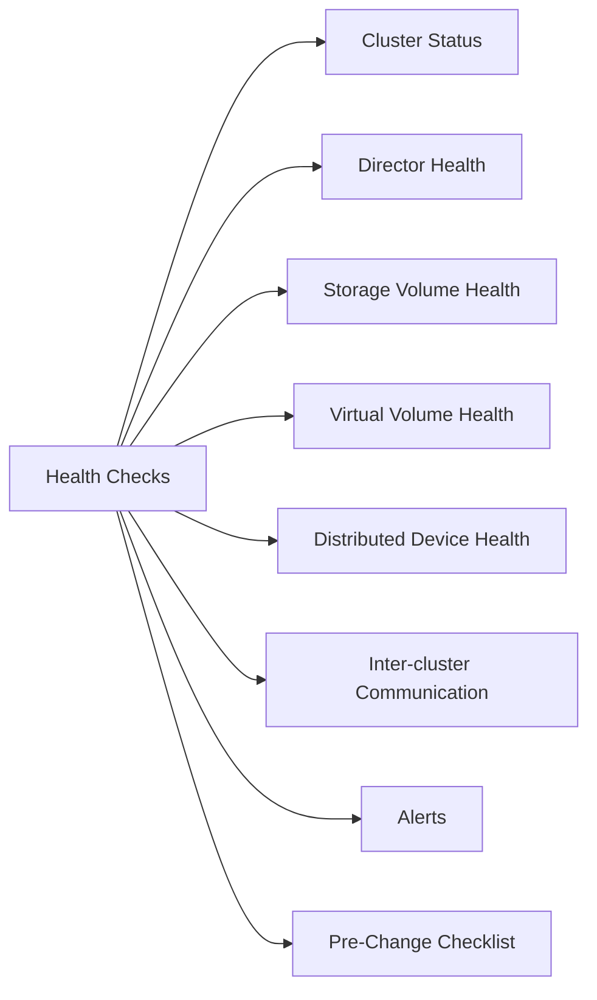

# VPLEX Health Checks



## Cluster Status

```bash
VPlexcli:/> ll /clusters/
VPlexcli:/> ll /clusters/cluster-1/
VPlexcli:/> ll /clusters/cluster-2/
```

All clusters should show `operational-status: ok`.

## Director Health

```bash
VPlexcli:/> ll /engines/*/directors/
VPlexcli:/> ll /engines/engine-1-1/directors/
```

All directors should be `operational-status: ok` and `health-state: ok`.

## Storage Volume Health

```bash
VPlexcli:/> ll /clusters/cluster-1/storage-elements/storage-volumes/
```

Each storage volume should show `operational-status: ok`.

## Virtual Volume Health

```bash
VPlexcli:/> ll /clusters/cluster-1/virtual-volumes/
```

Look for any volume with operational-status other than `ok`.

## Distributed Device Health

```bash
VPlexcli:/> ll /distributed-storage/distributed-devices/
```

Each distributed device should show `operational-status: ok` and `service-status: running`.

## Inter-cluster Communication

```bash
VPlexcli:/> ll /clusters/cluster-1/connectivity/
```

Verify WAN COM links are `operational-status: ok`.

## Alerts

```bash
VPlexcli:/> ll /alerts/
```

Review any active alerts.

## Pre-Change Checklist

- [ ] All directors `operational-status: ok`
- [ ] All storage volumes `operational-status: ok`
- [ ] Distributed devices `service-status: running`
- [ ] No active critical alerts
- [ ] Inter-cluster connectivity healthy

## Health Summary Table

| Component | Check | Expected |
|---|---|---|
| Cluster | `ll /clusters/` | operational-status: ok |
| Directors | `ll /engines/*/directors/` | health-state: ok |
| Storage volumes | `ll .../storage-volumes/` | operational-status: ok |
| Virtual volumes | `ll .../virtual-volumes/` | operational-status: ok |
| WAN COM | `ll .../connectivity/` | operational-status: ok |
| Alerts | `ll /alerts/` | No critical alerts |
