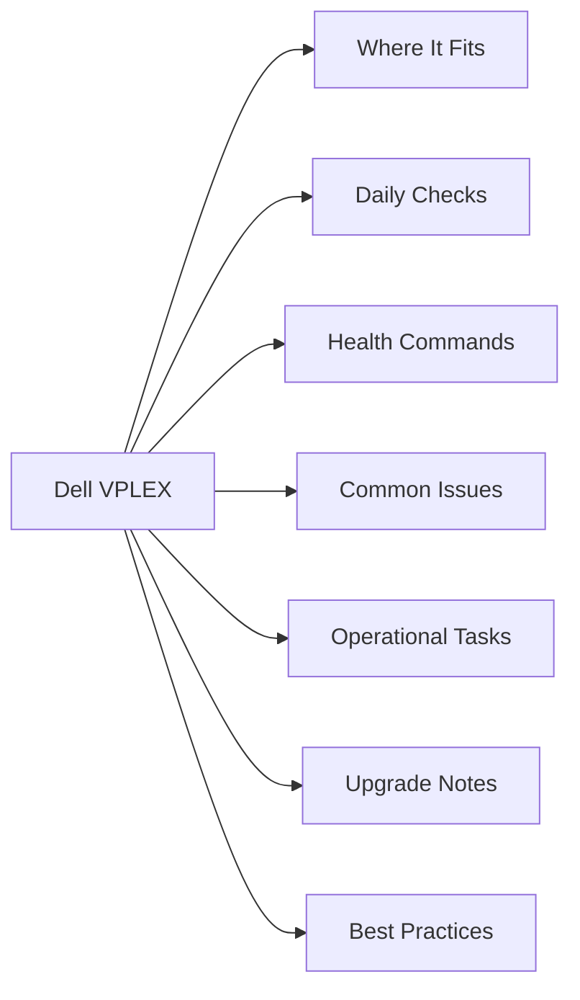

# Dell VPLEX

<a class="kb-card" href="scripts/">
  <strong>Scripts</strong>
  Bash distributed device health check, Perl Metro consistency group monitor, and director status scripts.
</a>

<a class="kb-card" href="operations/">
  <strong>Operations</strong>
  Daily checks, health check, change readiness, incident triage, maintenance window, and post-change validation.
</a>

<a class="kb-card" href="cli-reference/">
  <strong>CLI Reference</strong>
  vplexcli commands: cluster health, virtual volumes, distributed devices, storage views, and migration.
</a>

<a class="kb-card" href="architecture/">
  <strong>Architecture</strong>
  Architecture overview, components, and design patterns.
</a>

<a class="kb-card" href="health-checks/">
  <strong>Health Checks</strong>
  Health check procedures and validation steps.
</a>

<a class="kb-card" href="lifecycle/">
  <strong>Lifecycle</strong>
  Installation, upgrades, patching, and decommission.
</a>

<a class="kb-card" href="metro-operations/">
  <strong>Metro Operations</strong>
  Metro Operations notes, checks, commands, and references.
</a>

<a class="kb-card" href="standards/">
  <strong>Standards</strong>
  Configuration standards, naming conventions, and baselines.
</a>

<a class="kb-card" href="virtual-volumes/">
  <strong>Virtual Volumes</strong>
  Virtual Volumes notes, checks, commands, and references.
</a>

## Overview

Dell VPLEX is a storage virtualization platform that presents a federated storage layer across heterogeneous arrays, abstracting physical storage into virtual volumes accessible to hosts. VPLEX Local provides active-active LUN access within a single data center across two arrays; VPLEX Metro extends this across two data centers up to ~10ms RTT with synchronous mirroring and transparent failover; VPLEX Geo adds asynchronous replication for greater distances using RecoverPoint. Management is via the `vplexcli` command-line interface or Unisphere for VPLEX.

## Where It Fits

| Use Case |
|---|
| Active-active block storage access across two arrays in a single data center (VPLEX Local) |
| Non-disruptive data migration between heterogeneous storage arrays |
| Zero-RPO, zero-RTO Metro cluster for VMware or physical host workloads requiring transparent failover |
| Long-distance asynchronous disaster recovery combined with RecoverPoint (VPLEX Geo) |
| Storage consolidation behind a single virtualization layer without host-side changes |
| Workload mobility between sites during planned maintenance or hardware refresh |

## Daily Checks

| Check | Command | Notes |
|---|---|---|
| Check cluster health indications | `ll /clusters/*/health-indications/` |  |
| Review director hardware and port status | `ll /engines/*/directors/*/hardware/` |  |
| Verify distributed device health and sync state | `ll /distributed-storage/distributed-devices/*/health-indications/` |  |
| Confirm storage view integrity and host connectivity | `ll /clusters/*/exports/storage-views/` |  |
| Validate Witness connectivity status for VPLEX Metro deployments |  |  |
| Review active system alerts via Unisphere for VPLEX or email notificat |  |  |
| Check inter-cluster link (ICL) bandwidth and latency between Metro sit |  |  |

## Health Commands

~~~bash
# List cluster health indications
ll /clusters/*/health-indications/

# Show director hardware status across all engines
ll /engines/*/directors/*/hardware/

# Check all distributed device health states
ll /distributed-storage/distributed-devices/*/health-indications/

# List all storage views and their associated initiator ports
ll /clusters/*/exports/storage-views/

# Run a full system health check
health-check --full

# Show cluster hardware inventory
ll /clusters/*/hardware/

# Check consistency group status
ll /distributed-storage/consistency-groups/
~~~

## Common Issues

| Symptom | Likely Cause | Action |
|---|---|---|
| I/O suspended on Metro volumes | Witness cannot reach one cluster; quorum lost | Verify Witness VM connectivity; check ICL and cluster status; manually resume I/O once cause is identified |
| Director connectivity loss | Management NIC failure or network partition to director | Check `ll /engines/*/directors/*/hardware/`; re-seat or replace director; escalate to Dell Support if hardware fault |
| Distributed device out-of-sync | ICL interruption during a write; dirty bit set | Check health-indications on the distributed device; initiate rebuild from healthy leg once ICL is restored |
| Storage view missing after reconfiguration | View was deleted or incorrectly recreated; initiator re-registration | Recreate storage view with correct initiators, ports, and virtual volumes; rescan from host |
| Volume not visible to host after zoning | Initiator not registered in storage view or LUN mapping gap | Verify initiator WWN in storage view; confirm zone is active; rescan HBA on host |
| RecoverPoint CLI commands hang | RP–VPLEX communication timeout blocking vplexcli | Disconnect RP session; restart management console; check RP appliance connectivity |

## Operational Tasks

| Task | Command |
|---|---|
| Create and present new virtual volumes by claiming storage volumes, building loc |  |
| Add initiators to storage views when onboarding new hosts or HBA replacements |  |
| Migrate data non-disruptively by creating a distributed device and detaching the |  |
| Group related distributed volumes into consistency groups to ensure write-order |  |
| Expand virtual volume capacity by expanding the underlying storage volume on the |  |
| Monitor and manage ICL bandwidth between Metro clusters to prevent replication b |  |
| Decommission storage views and release virtual volumes when retiring hosts or ap |  |
| Document storage view-to-initiator-port mappings after every configuration chang |  |

## Upgrade Notes

| Step | Action |
|---|---|
| 1 | Download the target GeoSynchrony release notes and verify compatibility with back-end array firmware, hypervisor versions, and host OS multipath drivers |
| 2 | Confirm a valid Witness is configured and reachable from both clusters before starting a Metro upgrade |
| 3 | Place consistency groups into suspended I/O mode or confirm the upgrade procedure supports rolling NDU (non-disruptive upgrade) for your topology |
| 4 | Upgrade one director at a time per engine, verifying director health before proceeding to the next |
| 5 | After each director upgrade, confirm distributed device sync state and storage view accessibility from hosts |
| 6 | Upgrade the management server (VMS) after all directors are at the new code level |
| 7 | Post-upgrade, run `health-check --full` and validate all distributed devices show `health-state: ok` before closing the maintenance window |

## Best Practices

| Recommendation | Detail |
|---|---|
| Always deploy a Witness server in a third failure domain for every VPLEX Metro configuration | without it, loss of the ICL will suspend I/O on all consistency group volumes |
| Use consistency groups for every set of related distributed | Use consistency groups for every set of related distributed volumes to maintain write-order fidelity across sites |
| Document storage view names, initiator WWNs, and virtual volume mappings in a CMDB or runbook | changes are difficult to reverse without this reference |
| Test Metro failover (planned site switch) in a maintenance | Test Metro failover (planned site switch) in a maintenance window before production go-live and repeat annually |
| Perform back-end array firmware upgrades and VPLEX | Perform back-end array firmware upgrades and VPLEX GeoSynchrony upgrades in separate maintenance windows to isolate failure domains |
| Maintain port balance across directors | uneven I/O distribution degrades performance and makes single-director failure more impactful |
| Keep VPLEX management server (VMS) VM backups current | losing the VMS does not impact I/O but makes configuration changes impossible until it is restored |
| Review Dell Support advisories for VPLEX before any | Review Dell Support advisories for VPLEX before any firmware or OS upgrade on attached hosts or back-end arrays |
