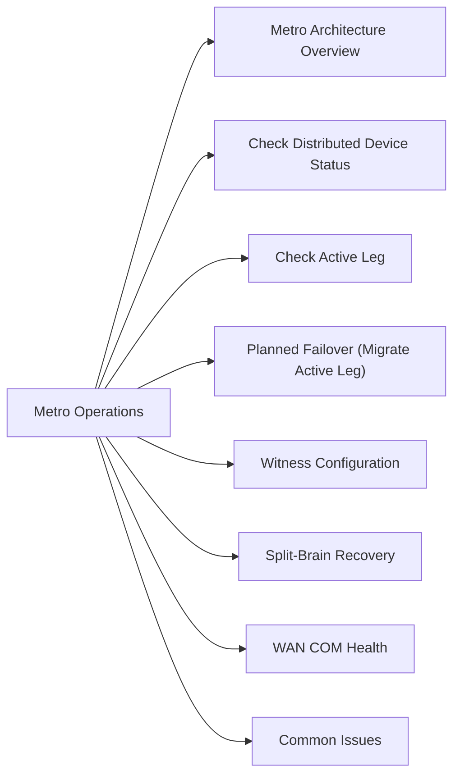

# VPLEX Metro Operations

VPLEX Metro stretches virtual volumes across two sites with synchronous mirroring, enabling transparent failover.



## Metro Architecture Overview

- **Cluster-1** — Site A (local cluster)
- **Cluster-2** — Site B (remote cluster)
- **WAN COM** — inter-cluster communication link (Fibre Channel or Ethernet)
- **Distributed Devices** — virtual volumes that span both clusters
- **Witness** — third-party tiebreaker for split-brain scenarios

## Check Distributed Device Status

```bash
VPlexcli:/> ll /distributed-storage/distributed-devices/
VPlexcli:/> ll /distributed-storage/distributed-devices/<device_name>/
```

Key attributes:
- `service-status: running` — both legs active
- `operational-status: ok`
- `active-leg` — which cluster is currently active

## Check Active Leg

```bash
VPlexcli:/> ll /distributed-storage/distributed-devices/<device_name>/
# active-leg: /clusters/cluster-1  (or cluster-2)
```

## Planned Failover (Migrate Active Leg)

```bash
# Move active leg to cluster-2
VPlexcli:/> device migrate \
    --device /distributed-storage/distributed-devices/<device_name> \
    --target-cluster cluster-2
```

## Witness Configuration

```bash
VPlexcli:/> ll /distributed-storage/witness/
# Check: witness-connectivity = connected
```

## Split-Brain Recovery

If WAN COM link fails and both clusters believe they are active:

1. Witness should automatically resolve by suspending one cluster
2. If witness is unavailable, manual intervention required
3. Identify which cluster has the most recent I/O
4. Suspend the stale cluster leg:

```bash
VPlexcli:/> device suspend \
    --device /distributed-storage/distributed-devices/<device_name> \
    --clusters cluster-2
```

5. After link recovery, resync:

```bash
VPlexcli:/> device rebuild \
    --device /distributed-storage/distributed-devices/<device_name>
```

## WAN COM Health

```bash
VPlexcli:/> ll /clusters/cluster-1/connectivity/
```

Monitor inter-cluster latency — VPLEX Metro requires < 5ms RTT between sites.

## Common Issues

| Issue | Check | Action |
|---|---|---|
| Device degraded | Check WAN COM link | Investigate network |
| Split-brain | Witness connectivity | Manual suspension of stale leg |
| High replication lag | WAN latency | Check inter-cluster network |
| Device suspended | Prior split-brain event | Resync after link recovery |
