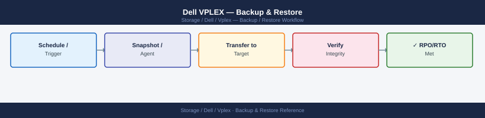
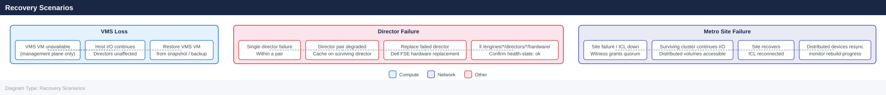

---
tags:
  - dell
  - operations
---
# Dell VPLEX — Backup & Restore

<div class="kb-summary">
Backup configuration, restore procedures, and validation for Dell VPLEX.

*Applies to: VPLEX*
</div>


## Before you begin

- **Access:** Storage admin credentials (cluster admin or equivalent)
- **Timing:** safe to run during business hours unless a step is marked ⚠ (causes interruption)
- **Dependencies:** no active upgrades or migrations on the same infrastructure
- **Logging:** capture command output — paste into the change record on completion

---

## Overview

VPLEX is a storage virtualisation layer; it does not store data itself — data resides on the backend arrays. VPLEX configuration backup covers the management and virtualisation layer. Data protection is the responsibility of the backend arrays and the applications using VPLEX volumes.

## Configuration Backup

Back up the following VPLEX configuration artefacts regularly:

| Artefact | Method | Frequency |
|---|---|---|
| VMS VM snapshot | Hypervisor snapshot or backup | Before every change and weekly |
| VPLEX configuration export | `vplexcli` configuration export commands | Weekly and before major changes |
| Storage view inventory | `ll /clusters/*/exports/storage-views/` export | Weekly |
| Consistency group membership | `ll /distributed-storage/consistency-groups/` export | Weekly |
| Distributed device mapping | `ll /distributed-storage/distributed-devices/` export | Weekly |

**VMS VM backup is critical**: VMS is a management plane VM. Its loss does not affect I/O (hosts continue to access volumes), but without a VMS backup, configuration recovery requires manual re-creation or Dell support assistance.

## Collecting a Support Bundle

A VPLEX support bundle captures configuration, logs, and health state for troubleshooting and support case submission:

```bash
# From within vplexcli
collect-support-log -f /var/log/support_bundle.tar.gz

# Copy to a jump host from VMS OS shell
scp service@<VMS_IP>:/var/log/support_bundle.tar.gz admin@<jump_host>:/tmp/
```


```text title="Expected output"
Collecting support logs from VPLEX cluster...
Gathering system diagnostics...
Compressing log files...
Support bundle created successfully: /var/log/support_bundle.tar.gz
Bundle size: 487.3 MB
Timestamp: 2024-01-15T14:32:18Z

service@192.168.1.45's password:
support_bundle.tar.gz                                    100%  487MB   12.4MB/s   00:39
```

!!! warning "Common errors"
    **`Permission denied (publickey,password).`** — Verify the service account credentials and ensure SSH key-based authentication is configured, or use `scp -o PubkeyAuthentication=no` to force password prompt.
    **`No such file or directory`** — Confirm the support bundle was successfully created by running `ls -lh /var/log/support_bundle.tar.gz` on the VPLEX management station before attempting the SCP transfer.
    **`Connection refused`** — Ensure the jump host SSH daemon is running and accessible on port 22, or specify an alternate port with `scp -P <port_number>`.
## Recovery Scenarios

**VMS loss (management plane only):**
- Host I/O continues uninterrupted — VPLEX directors do not depend on VMS for data path
- Restore the VMS VM from the most recent backup or snapshot
- If no backup exists, VMS must be re-deployed and the VPLEX configuration re-imported; engage Dell support

**Director failure:**
- A single director failure within a director pair reduces redundancy but does not interrupt I/O (cache mirroring continues on the surviving director)
- Replace the failed director hardware using the Dell VPLEX Director Replacement guide
- Verify director health post-replacement: `ll /engines/*/directors/*/hardware/`

**Metro site failure:**
- The Witness automatically grants quorum to the surviving cluster
- Hosts at the surviving site continue I/O on distributed volumes
- After the failed site recovers: reconnect the ICL, verify Witness connectivity, allow distributed devices to resync
- Monitor resync progress: `ll /distributed-storage/distributed-devices/*/health-indications/`



## Validation

After any recovery:

- [ ] `health-check --full` returns no errors
- [ ] `ll /distributed-storage/distributed-devices/*/health-indications/` — all devices `health-state: ok`
- [ ] `ll /distributed-storage/consistency-groups/` — all CGs `operational-status: ok`
- [ ] Host path validation: `powermt display dev=all` or `multipath -ll` shows all expected paths active
- [ ] Application owners confirm I/O has resumed normally

---

## Verify

- `health-check --full` returns no errors across all VPLEX components
- `ll /distributed-storage/distributed-devices/*/health-indications/` — all devices show `health-state: ok`
- `ll /distributed-storage/consistency-groups/` — all CGs show `operational-status: ok`
- Host multipath check (`multipath -ll` or `powermt display dev=all`) shows all expected paths active

---

## See also

- [Vplex — Procedures](../procedures/)
- [Vplex — Health Checks](../health-checks/)
- [Vplex — Common Issues](../../troubleshooting/common-issues/)
