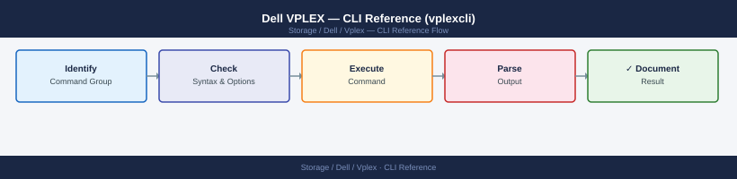
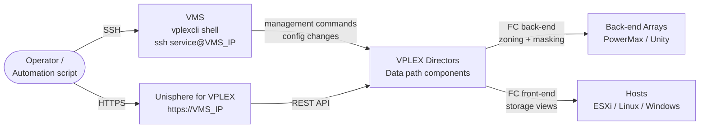
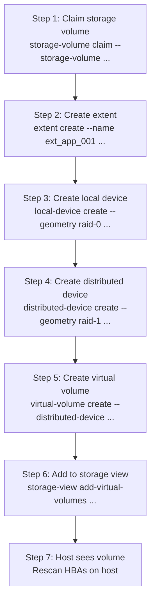

---
tags:
  - dell
  - operations
---
# Dell VPLEX — CLI Reference (vplexcli)


<div class="kb-summary">
`vplexcli` is the primary management interface for Dell VPLEX. Connect to the VPLEX Management Server (VMS) via SSH, then launch the shell with `vplexcli`. Commands follow a filesystem-like navigation model: objects are addressed as paths (e.g.

*Applies to: VPLEX*
</div>



 `/clusters/cluster-1/`) and `ll` (list-long) is the standard inspection command.

> **Access**: `ssh service@<VMS_IP>` → `vplexcli` — or run one-shot commands with `vplexcli -q -e "<command>"`.



---

```d2
direction: right

hub: "VPLEX\nOperations" {shape: hexagon}
quickreference_command_table: "Quick-Reference Command Table" {shape: rectangle}
cluster_and_director_status: "Cluster and Director Status" {shape: rectangle}
virtual_volume_management: "Virtual Volume Management" {shape: rectangle}
distributed_device_operations_vplex_: "Distributed Device Operations (VPLEX Metro)" {shape: rectangle}
storage_views_host_masking: "Storage Views (Host Masking)" {shape: rectangle}
data_migration: "Data Migration" {shape: rectangle}

hub -> quickreference_command_table
hub -> cluster_and_director_status
hub -> virtual_volume_management
hub -> distributed_device_operations_vplex_
hub -> storage_views_host_masking
hub -> data_migration
```

## Before you begin

- **Access:** Storage admin credentials (cluster admin or equivalent)
- **Timing:** safe to run during business hours unless a step is marked ⚠ (causes interruption)
- **Dependencies:** no active upgrades or migrations on the same infrastructure
- **Logging:** capture command output — paste into the change record on completion

---

## Quick-Reference Command Table

| Command | Purpose |
|---|---|
| `vplexcli -q -e "health-check"` | Overall cluster health summary |
| `vplexcli -q -e "ll /clusters/"` | List all clusters |
| `vplexcli -q -e "ll /engines/"` | List all engines (chassis) |
| `vplexcli -q -e "ll /clusters/*/health-indications/"` | Health indications across all clusters |
| `vplexcli -q -e "ll /virtual-volumes/"` | List all virtual volumes |
| `vplexcli -q -e "ll /distributed-storage/distributed-devices/"` | List Metro distributed devices |
| `vplexcli -q -e "ll /distributed-storage/consistency-groups/"` | List consistency groups |
| `vplexcli -q -e "ll /clusters/*/exports/storage-views/"` | List all storage views (masking) |
| `vplexcli -q -e "collect-support-log -f /var/log/support.tar.gz"` | Collect support bundle |

---

## Cluster and Director Status

```bash
# Launch vplexcli interactively
ssh service@<VMS_IP>
vplexcli

# --- One-shot equivalents (use in scripts) ---

# List all clusters
vplexcli -q -e "ls /clusters"

# Show cluster-1 health indications
vplexcli -q -e "ll /clusters/cluster-1/health-indications/"

# Full system health check
vplexcli -q -e "health-check"

# List all engines (physical chassis)
vplexcli -q -e "ls /engines"

# Show all directors across all engines
vplexcli -q -e "ll /engines/*/directors/"

# Show a specific director's hardware status
vplexcli -q -e "ll /engines/engine-1-1/directors/director-1-1-A/hardware/"

# List director front-end (FE) ports
vplexcli -q -e "ll /engines/engine-1-1/directors/director-1-1-A/hardware/ports/"

# Check inter-cluster link (ICL) status (Metro)
vplexcli -q -e "ll /clusters/cluster-1/communication/inter-cluster-links/"
```

**Key health-indication values:**

| Value | Meaning |
|---|---|
| `ok` | Component is healthy |
| `major-failure` | Fault requiring immediate action |
| `minor-failure` | Degraded but operational |
| `unknown` | Communication loss to component |

---

## Virtual Volume Management

Virtual volumes are the objects presented to hosts. They are built on top of extents → local devices → virtual volumes.



```bash
# --- List all virtual volumes (one-shot) ---
vplexcli -q -e "ls /virtual-volumes"

# Show detailed attributes of a specific virtual volume
vplexcli -q -e "ll /virtual-volumes/my_app_vol_1/"

# List virtual volumes with health state
vplexcli -q -e "ll /virtual-volumes/*/health-indications/"

# --- Create a new virtual volume ---
# Step 1: Claim a back-end storage volume as a VPLEX storage volume
vplexcli -q -e "storage-volume claim --storage-volume /storage-elements/storage-arrays/array-A/storage-volumes/sv_001"

# Step 2: Create an extent from the storage volume
vplexcli -q -e "extent create --name ext_app_001 --storage-volume /storage-elements/storage-arrays/array-A/storage-volumes/sv_001"

# Step 3: Create a local device from the extent
vplexcli -q -e "local-device create --name dev_app_001 --geometry raid-0 --extents /clusters/cluster-1/storage-elements/extents/ext_app_001"

# Step 4: Create a virtual volume from the local device
vplexcli -q -e "virtual-volume create --name my_app_vol_1 --local-device /clusters/cluster-1/devices/dev_app_001"

# --- Expand a virtual volume ---
# First expand the back-end LUN on the array, then:
vplexcli -q -e "storage-volume rediscover --storage-volume /storage-elements/storage-arrays/array-A/storage-volumes/sv_001"
vplexcli -q -e "extent expand --extent /clusters/cluster-1/storage-elements/extents/ext_app_001"
vplexcli -q -e "virtual-volume expand --virtual-volume /virtual-volumes/my_app_vol_1"

# --- Delete a virtual volume ---
# Remove from storage view first, then:
vplexcli -q -e "virtual-volume destroy --virtual-volume /virtual-volumes/my_app_vol_1 --force"
vplexcli -q -e "local-device destroy --local-device /clusters/cluster-1/devices/dev_app_001"
vplexcli -q -e "extent destroy --extent /clusters/cluster-1/storage-elements/extents/ext_app_001"
vplexcli -q -e "storage-volume unclaim --storage-volume /storage-elements/storage-arrays/array-A/storage-volumes/sv_001"
```

---

## Distributed Device Operations (VPLEX Metro)

Distributed devices span two clusters and provide Metro active-active access. Consistency groups ensure write-order fidelity.

```bash
# List all distributed devices
vplexcli -q -e "ls /distributed-storage/distributed-devices"

# Show health of all distributed devices
vplexcli -q -e "ll /distributed-storage/distributed-devices/*/health-indications/"

# Show sync state of a specific distributed device
vplexcli -q -e "ll /distributed-storage/distributed-devices/dist_app_vol_1/"

# --- Create a distributed device (Metro) ---
# Prerequisite: local devices exist on both cluster-1 and cluster-2
vplexcli -q -e "distributed-device create \
  --name dist_app_vol_1 \
  --geometry raid-1 \
  --components /clusters/cluster-1/devices/dev_app_001,/clusters/cluster-2/devices/dev_app_002"

# Create a virtual volume on top of the distributed device
vplexcli -q -e "virtual-volume create --name app_vol_metro_1 \
  --distributed-device /distributed-storage/distributed-devices/dist_app_vol_1"

# --- Consistency groups ---
# List all consistency groups
vplexcli -q -e "ls /distributed-storage/consistency-groups"

# Show consistency group details
vplexcli -q -e "ll /distributed-storage/consistency-groups/cg_app_tier/"

# Create a consistency group
vplexcli -q -e "consistency-group create --name cg_app_tier"

# Add a virtual volume to a consistency group
vplexcli -q -e "consistency-group add-virtual-volumes \
  --consistency-group /distributed-storage/consistency-groups/cg_app_tier \
  --virtual-volumes /virtual-volumes/app_vol_metro_1"

# Remove a volume from a consistency group
vplexcli -q -e "consistency-group remove-virtual-volumes \
  --consistency-group /distributed-storage/consistency-groups/cg_app_tier \
  --virtual-volumes /virtual-volumes/app_vol_metro_1"

# --- Metro node / Witness status ---
# Check Witness connectivity
vplexcli -q -e "ll /clusters/cluster-1/cluster-witness/"
vplexcli -q -e "ll /clusters/cluster-2/cluster-witness/"
```

**Distributed device health states:**

| State | Meaning |
|---|---|
| `in-sync` | Both legs healthy; Metro active-active |
| `rebuilding` | Resync in progress after ICL interruption |
| `degraded` | One leg is unreachable; single-site I/O only |
| `detached` | Both legs disconnected; I/O suspended |

---

## Storage Views (Host Masking)

Storage views map virtual volumes to host initiator ports via VPLEX front-end ports.

```bash
# List all storage views on cluster-1
vplexcli -q -e "ls /clusters/cluster-1/exports/storage-views"

# Show full details of a storage view
vplexcli -q -e "ll /clusters/cluster-1/exports/storage-views/sv_esxi_host_01/"

# List registered initiator ports on cluster-1
vplexcli -q -e "ls /clusters/cluster-1/exports/ports"

# List all initiator ports (host HBAs)
vplexcli -q -e "ls /clusters/cluster-1/exports/initiator-ports"

# --- Create a new storage view ---
# Step 1: Register host initiator port (WWN)
vplexcli -q -e "initiator-port register \
  --cluster /clusters/cluster-1 \
  --port-wwn 10:00:00:00:c9:ab:cd:ef \
  --name esxi_host_01_hba0"

# Step 2: Create the storage view
vplexcli -q -e "storage-view create \
  --name sv_esxi_host_01 \
  --cluster /clusters/cluster-1"

# Step 3: Add VPLEX front-end ports to the storage view
vplexcli -q -e "storage-view add-ports \
  --storage-view /clusters/cluster-1/exports/storage-views/sv_esxi_host_01 \
  --ports /clusters/cluster-1/exports/ports/A0-FC00,/clusters/cluster-1/exports/ports/B0-FC00"

# Step 4: Add initiator ports (host HBAs) to the storage view
vplexcli -q -e "storage-view add-initiator-ports \
  --storage-view /clusters/cluster-1/exports/storage-views/sv_esxi_host_01 \
  --initiator-ports /clusters/cluster-1/exports/initiator-ports/esxi_host_01_hba0"

# Step 5: Add virtual volumes to the storage view
vplexcli -q -e "storage-view add-virtual-volumes \
  --storage-view /clusters/cluster-1/exports/storage-views/sv_esxi_host_01 \
  --virtual-volumes /virtual-volumes/app_vol_metro_1"

# --- Modify an existing storage view ---
# Add a second initiator (e.g. after HBA replacement)
vplexcli -q -e "storage-view add-initiator-ports \
  --storage-view /clusters/cluster-1/exports/storage-views/sv_esxi_host_01 \
  --initiator-ports /clusters/cluster-1/exports/initiator-ports/esxi_host_01_hba1"

# Remove a virtual volume from a storage view (before deleting the volume)
vplexcli -q -e "storage-view remove-virtual-volumes \
  --storage-view /clusters/cluster-1/exports/storage-views/sv_esxi_host_01 \
  --virtual-volumes /virtual-volumes/app_vol_metro_1"

# Delete a storage view
vplexcli -q -e "storage-view destroy \
  --storage-view /clusters/cluster-1/exports/storage-views/sv_esxi_host_01 --force"
```

---

## Data Migration

VPLEX can migrate data non-disruptively between back-end arrays using the data-migration feature.

```bash
# List active migrations
vplexcli -q -e "ls /data-migrations"

# Show status of all migrations
vplexcli -q -e "ll /data-migrations/*/status/"

# --- Start a non-disruptive migration ---
# Step 1: Claim the target (destination) storage volume
vplexcli -q -e "storage-volume claim \
  --storage-volume /storage-elements/storage-arrays/array-B/storage-volumes/sv_target_001"

# Step 2: Create the migration job (source → target)
vplexcli -q -e "data-migration create \
  --name mig_app_vol_1 \
  --virtual-volume /virtual-volumes/my_app_vol_1 \
  --target-storage-volume /storage-elements/storage-arrays/array-B/storage-volumes/sv_target_001"

# Step 3: Start the migration
vplexcli -q -e "data-migration start \
  --migration /data-migrations/mig_app_vol_1"

# --- Monitor migration progress ---
vplexcli -q -e "ll /data-migrations/mig_app_vol_1/"

# Step 4: Commit migration (cut over to target; source released)
vplexcli -q -e "data-migration commit \
  --migration /data-migrations/mig_app_vol_1"

# Step 5: Clean up the migration object
vplexcli -q -e "data-migration destroy \
  --migration /data-migrations/mig_app_vol_1"
```

---

## Logs and Diagnostics

```bash
# Show all system alerts
vplexcli -q -e "ll /clusters/*/system-volumes/alerts/"

# View VPLEX management server logs (from VMS OS shell)
ssh service@<VMS_IP>
tail -f /var/log/VPlex/cli/vplexcli.log
tail -f /var/log/VPlex/vplexmanagement.log

# --- Collect support log bundle ---
# From within vplexcli:
collect-support-log -f /var/log/support_bundle.tar.gz

# From VMS OS shell (copy to a remote host):
scp service@<VMS_IP>:/var/log/support_bundle.tar.gz admin@<jump_host>:/tmp/

# --- Show GeoSynchrony (firmware) version ---
vplexcli -q -e "ll /clusters/cluster-1/system-volumes/version/"

# Show back-end storage array inventory
vplexcli -q -e "ls /storage-elements/storage-arrays"
vplexcli -q -e "ll /storage-elements/storage-arrays/array-A/"

# Check unclaimed storage volumes on a back-end array
vplexcli -q -e "ls /storage-elements/storage-arrays/array-A/storage-volumes"
```

---

## Verify

- Confirm the operation completed without errors in the log or management UI
- Verify the expected state change is visible (service running, object created, config applied)
- Document the outcome in the change record

---

## See also

- [Vplex — Procedures](procedures/)
- [Vplex — Scripts](scripts/)
- [Vplex — Health Checks](health-checks/)
