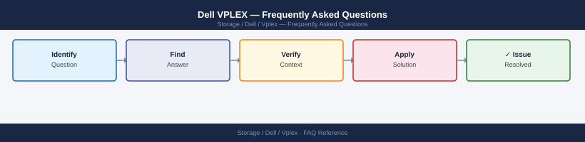

---
tags:
  - dell-vplex
  - faq
  - operations
---
# Dell VPLEX — Frequently Asked Questions

Common questions about Dell VPLEX operations, configuration, and troubleshooting. For step-by-step procedures, see the <a href="index.md">Operations</a> section.

## General

**Q: What VPLEX OS version is recommended?**
A: VPLEX GeoSynchrony 6.2.x is the current recommendation. Check via Management Console: System → About VPLEX.

**Q: How do I check the current Dell VPLEX version?**
A: `Management Console → System → About VPLEX`

## Configuration

**Q: What is the default cache mode for VPLEX volumes?**
A: Write-back cache is the default for optimal performance. Write-through mode is available for compliance environments where data must be committed to back-end storage before acknowledgement. Configure per virtual volume.

**Q: How do I enable VPLEX Metro for active-active stretched clustering?**
A: Configure a VPLEX Metro cluster with two VPLEX clusters connected via synchronous WAN link (<10ms RTT). Create distributed devices and distributed virtual volumes. Requires VPLEX Metro licence. Zoning is required on both fabrics.

## Operations

**Q: How do I upgrade VPLEX OS without disrupting host I/O?**
A: VPLEX NDU upgrades directors one at a time. I/O fails over to remaining directors during each director's upgrade. Use Management Console → System → Software → Upgrade. Schedule during low-activity window.

**Q: What is the correct procedure to add a new back-end storage volume to VPLEX?**
A: Zone the new back-end LUN to the VPLEX initiators. Run discovery: `management-server/devices> ll` to see new storage views. Create a storage volume in VPLEX and build an extent, device, and virtual volume on top of it.

## Troubleshooting

**Q: VPLEX shows 'Director communication loss'. What does it mean?**
A: Two VPLEX directors cannot communicate — potential split-brain risk in Metro configurations. Check inter-director network. If one director is truly offline, ensure the surviving director has quorum before allowing host writes. Contact Dell Support immediately.

**Q: VPLEX cache hit rate is low — where do I start?**
A: Check Management Console Performance tab for cache statistics. Low hit rate indicates working set exceeds VPLEX cache. Review which virtual volumes have the most misses. Consider adding VPLEX cache expansion if available for your model.

## Backup and Recovery

**Q: How often should I back up VPLEX configuration?**
A: Weekly: `management-server> configuration backup create`. Store off-VPLEX. Back up before any upgrade or major configuration change. VPLEX configuration backup includes all virtual volume definitions and cluster settings.

**Q: Can I recover a corrupted VPLEX distributed device without data loss?**
A: Contact Dell Support immediately for distributed device issues — recovery requires expert guidance. For Metro configurations, ensure the surviving site has consistent data before any recovery attempt. Do not force-rebuild without Dell guidance.

## See Also

- [Dell VPLEX Operations](index.md)
- [Dell VPLEX Troubleshooting](../../../troubleshooting/index.md)
