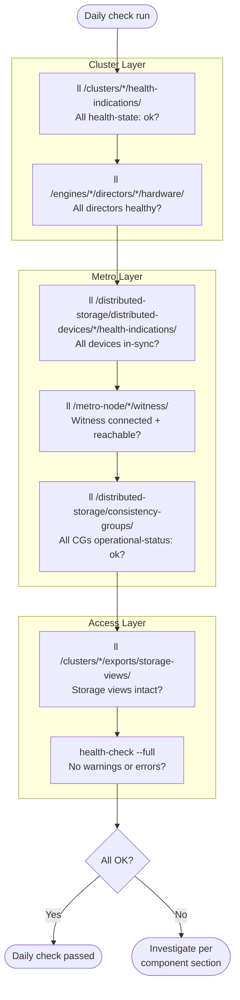

# Dell VPLEX — Health Checks


<div class="kb-summary">
Health Checks reference covering Daily Checks, Health Check, Cluster Status, Director Health, Pre-Change Checklist and 1 more sections.
</div>
```
┌───────────────────────────────────── Dell VPLEX — Health Checks ──────────────────────────────────────┐
│                                                                                                       │
│   ┌───────────────────────────────────────────────────────────────────────────────────────────────┐   │
│   │        VPLEX health checks: routine verification of operational status and performance        │   │
│   │         Checks include: controller status, drive health, replication lag, and capacity        │   │
│   │         Frequency: daily quick checks; weekly detailed review; monthly capacity report        │   │
│   │        Configure threshold-based alerts for proactive incident prevention and awareness       │   │
│   └───────────────────────────────────────────────────────────────────────────────────────────────┘   │
│                                                                                                       │
│    Check status → review alerts → verify replication → capacity → log                                 │
│                                                                                                       │
│                  ▼                                ▼                                ▼                  │
│                                                                                                       │
│   ┌─────────────────────────────┐  ┌─────────────────────────────┐  ┌─────────────────────────────┐   │
│   │            Layer            │  │          Component          │  │            Notes            │   │
│   │        Virtualisation       │  │         Backend LUNs        │  │      Abstracted to VVs      │   │
│   │            Metro            │  │         Sync stretch        │  │        <5ms RTT sites       │   │
│   │             Geo             │  │      Async replication      │  │         Any distance        │   │
│   │          Clustering         │  │        Active-active        │  │       Shared namespace      │   │
│   │            Quorum           │  │          Witness VM         │  │      Split-brain guard      │   │
│   └─────────────────────────────┘  └─────────────────────────────┘  └─────────────────────────────┘   │
│                                                                                                       │
│                          ▼                                                 ▼                          │
│                                                                                                       │
│   ┌───────────────────────────────────────────────────────────────────────────────────────────────┐   │
│   │    Check area    │  How to verify   │   Pass criteria   │    Frequency     │       Tool       │   │
│   │   Controllers    │   show status    │    All healthy    │      Daily       │     CLI/GUI      │   │
│   │      Drives      │   show drives    │  No failed/pred.  │      Daily       │     CLI/GUI      │   │
│   │   Replication    │ show replication │  Lag < threshold  │      Daily       │     CLI/GUI      │   │
│   │     Capacity     │  show capacity   │     < 80% used    │      Daily       │     CLI/GUI      │   │
│   └───────────────────────────────────────────────────────────────────────────────────────────────┘   │
│                                                                                                       │
│    Physical: VPLEX VS2/VS6 appliance · FC fabric · backend arrays · WAN link (Metro/Geo)              │
│                                                                                                       │
│    Key terms:                                                                                         │
│                                                                                                       │
│    VPLEX              = Dell storage federation; aggregates arrays into virtual volumes across vendors│
│    Virtual volume     = VPLEX-abstracted LUN presented to hosts; backend is array LUNs                │
│    VPLEX Metro        = synchronous active-active stretch cluster; same VV served from two sites      │
│    VPLEX Geo          = asynchronous active-active replication; higher RPO, no distance constraint    │
│    Distributed VV     = virtual volume spanning two sites for Metro active-active host access         │
│    Witness            = third-site quorum arbiter for Metro; prevents split-brain island scenarios    │
│    WAN-COM            = WAN communication module in VPLEX Geo; manages inter-site replication traffic │
│    Management Server  = embedded Linux VM in VPLEX engine; serves web UI and vplex CLI                │
│    Consistency group  = set of virtual volumes that failover together maintaining write order         │
│    Backend volume     = LUN from underlying array presented to VPLEX engine for virtualisation        │
│    Local device       = RAID device or extent of backend volumes on a single VPLEX cluster            │
│    Cluster            = single VPLEX installation; Metro topology requires exactly two clusters       │
│                                                                                                       │
└───────────────────────────────────────────────────────────────────────────────────────────────────────┘
```


## Daily Checks



| Check | Command | Notes |
|---|---|---|
| Check cluster health indications | `ll /clusters/*/health-indications/` | All health-indications should show `health-state: ok`; investigate any cluster showing a non-ok state |
| Check distributed device health | `ll /distributed-storage/distributed-devices/*/health-indications/` | All distributed devices should show `health-state: ok` and `rebuild-allowed: true`; an `out-of-sync` device requires immediate attention |
| Check director hardware health | `ll /engines/*/directors/*/hardware/` | All directors should show healthy component states; a faulted director reduces redundancy and must be escalated |
| Verify Witness connectivity for Metro deployments | `ll /metro-node/*/witness/` | Witness should show `connected: true` and `reachable: true`; loss of Witness connectivity risks I/O suspension on a subsequent site failure |
| Check consistency group state | `ll /distributed-storage/consistency-groups/` | All groups should show `operational-status: ok` |
| Verify storage views are intact for all hosts | `ll /clusters/*/exports/storage-views/` | Confirm the expected number of storage views and initiator-to-port mappings |
| Review any active alerts in Unisphere for VPLEX or from email/SNMP | | |

## Health Check

Run these checks before any VPLEX maintenance or as first-response steps when a host reports I/O issues.

- [ ] `ll /clusters/*/health-indications/` — all clusters show `health-state: ok`
- [ ] `ll /distributed-storage/distributed-devices/*/health-indications/` — all distributed devices show `health-state: ok`; no devices in `out-of-sync` or `rebuilding` state
- [ ] `ll /engines/*/directors/*/hardware/` — all directors across all engines are healthy; no director components in a faulted state
- [ ] `ll /metro-node/*/witness/` — Witness is `connected` and `reachable` from both clusters (Metro deployments)
- [ ] `ll /distributed-storage/consistency-groups/` — all consistency groups show `operational-status: ok`
- [ ] `ll /clusters/*/exports/storage-views/` — storage views are present with the expected initiator and port bindings
- [ ] `health-check --full` — system-level health check returns no warnings or errors
- [ ] ICL (inter-cluster link) latency between Metro sites is within the expected sub-10ms threshold

```bash
# Check cluster-level health indications
ll /clusters/*/health-indications/

# Check all distributed device health states
ll /distributed-storage/distributed-devices/*/health-indications/

# Check director hardware health across all engines
ll /engines/*/directors/*/hardware/

# Check Witness connectivity (Metro deployments)
ll /metro-node/*/witness/

# Check consistency group operational status
ll /distributed-storage/consistency-groups/

# List all storage views and their initiator-to-port bindings
ll /clusters/*/exports/storage-views/

# Run a full system health check
health-check --full

# Show cluster hardware inventory
ll /clusters/*/hardware/
```

## Cluster Status

```bash
VPlexcli:/> ll /clusters/
VPlexcli:/> ll /clusters/cluster-1/
VPlexcli:/> ll /clusters/cluster-2/
```

All clusters should show `operational-status: ok`.

## Director Health

```bash
VPlexcli:/> ll /engines/*/directors/
VPlexcli:/> ll /engines/engine-1-1/directors/
```

All directors should be `operational-status: ok` and `health-state: ok`.

## Pre-Change Checklist

- [ ] All directors `operational-status: ok`
- [ ] All storage volumes `operational-status: ok`
- [ ] Distributed devices `service-status: running`
- [ ] No active critical alerts
- [ ] Inter-cluster connectivity healthy

## Health Summary Table

| Component | Check | Expected |
|---|---|---|
| Cluster | `ll /clusters/` | operational-status: ok |
| Directors | `ll /engines/*/directors/` | health-state: ok |
| Storage volumes | `ll .../storage-volumes/` | operational-status: ok |
| Virtual volumes | `ll .../virtual-volumes/` | operational-status: ok |
| WAN COM | `ll .../connectivity/` | operational-status: ok |
| Alerts | `ll /alerts/` | No critical alerts |
