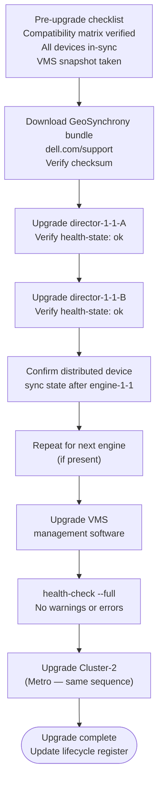

# Dell VPLEX — Install & Upgrade


<div class="kb-summary">
Install & Upgrade reference covering GeoSynchrony Version Matrix, Upgrade Paths, Hardware Lifecycle, EOL Tracking.
</div>
```text
┌────────────────────────────────── Dell VPLEX — Install and Upgrade ───────────────────────────────────┐
│                                                                                                       │
│   ┌───────────────────────────────────────────────────────────────────────────────────────────────┐   │
│   │          VPLEX installation and upgrade: deployment and version management procedures         │   │
│   │         Pre-upgrade: back up configuration, check compatibility, review release notes         │   │
│   │      Upgrade: rolling upgrade preserves service; non-disruptive on dual-controller arrays     │   │
│   │           Post-upgrade: verify all services running; run health check; notify users           │   │
│   └───────────────────────────────────────────────────────────────────────────────────────────────┘   │
│                                                                                                       │
│    Plan → backup config → upgrade staging → upgrade production → validate                             │
│                                                                                                       │
│                  ▼                                ▼                                ▼                  │
│                                                                                                       │
│   ┌─────────────────────────────┐  ┌─────────────────────────────┐  ┌─────────────────────────────┐   │
│   │            Layer            │  │          Component          │  │            Notes            │   │
│   │        Virtualisation       │  │         Backend LUNs        │  │      Abstracted to VVs      │   │
│   │            Metro            │  │         Sync stretch        │  │        <5ms RTT sites       │   │
│   │             Geo             │  │      Async replication      │  │         Any distance        │   │
│   │          Clustering         │  │        Active-active        │  │       Shared namespace      │   │
│   │            Quorum           │  │          Witness VM         │  │      Split-brain guard      │   │
│   └─────────────────────────────┘  └─────────────────────────────┘  └─────────────────────────────┘   │
│                                                                                                       │
│                          ▼                                                 ▼                          │
│                                                                                                       │
│   ┌───────────────────────────────────────────────────────────────────────────────────────────────┐   │
│   │    Component     │     Purpose      │      Protocol     │       Auth       │      Notes       │   │
│   │  Virtual volume  │ Virtualised LUN  │      FC/iSCSI     │    FC zoning     │   Multi-vendor   │   │
│   │  Metro cluster   │   Sync stretch   │   Inter-cluster   │   Certificate    │    2-site max    │   │
│   │     Witness      │  Quorum arbiter  │       HTTPS       │   Certificate    │     3rd site     │   │
│   │     WAN-COM      │ Geo replication  │   Encrypted WAN   │   Certificate    │     Geo only     │   │
│   └───────────────────────────────────────────────────────────────────────────────────────────────┘   │
│                                                                                                       │
│    Physical: VPLEX VS2/VS6 appliance · FC fabric · backend arrays · WAN link (Metro/Geo)              │
│                                                                                                       │
│    Key terms:                                                                                         │
│                                                                                                       │
│    VPLEX              = Dell storage federation; aggregates arrays into virtual volumes across vendors│
│    Virtual volume     = VPLEX-abstracted LUN presented to hosts; backend is array LUNs                │
│    VPLEX Metro        = synchronous active-active stretch cluster; same VV served from two sites      │
│    VPLEX Geo          = asynchronous active-active replication; higher RPO, no distance constraint    │
│    Distributed VV     = virtual volume spanning two sites for Metro active-active host access         │
│    Witness            = third-site quorum arbiter for Metro; prevents split-brain island scenarios    │
│    WAN-COM            = WAN communication module in VPLEX Geo; manages inter-site replication traffic │
│    Management Server  = embedded Linux VM in VPLEX engine; serves web UI and vplex CLI                │
│    Consistency group  = set of virtual volumes that failover together maintaining write order         │
│    Backend volume     = LUN from underlying array presented to VPLEX engine for virtualisation        │
│    Local device       = RAID device or extent of backend volumes on a single VPLEX cluster            │
│    Cluster            = single VPLEX installation; Metro topology requires exactly two clusters       │
│                                                                                                       │
└───────────────────────────────────────────────────────────────────────────────────────────────────────┘
```


## GeoSynchrony Version Matrix

VPLEX runs the GeoSynchrony software stack. Dell publishes end-of-support dates for each GeoSynchrony release. Running an unsupported version means no security patches, no bug fixes, and no Dell support for software issues.

| GeoSynchrony Version | Release | End of Primary Support | Notes |
|---|---|---|---|
| 6.2.x | 2023–2024 | TBA | Current recommended release |
| 6.1.x | 2022–2023 | TBA | Supported; upgrade to 6.2.x recommended |
| 6.0.x | 2021–2022 | 2024 | Near end-of-support; plan upgrade |
| 5.5.x | 2019–2021 | 2023 | End of primary support; no further patches |
| 5.4.x and below | Pre-2019 | Expired | Must upgrade immediately |

Check the current GeoSynchrony version: `ll /version/` in `vplexcli`.

## Upgrade Paths

GeoSynchrony upgrades follow a one-version-at-a-time path for major version jumps. Patch releases (6.1.x to 6.1.y) can typically be applied directly. Consult the Dell VPLEX Upgrade Guide for your specific version pair before beginning.

**Pre-upgrade checklist:**

1. Confirm the target GeoSynchrony release notes and verify compatibility with backend array firmware versions, VMware vSphere versions, and host OS multipath driver versions.
2. Verify that a valid Witness is configured and reachable from both Metro clusters.
3. Confirm all distributed devices are in a healthy sync state: `ll /distributed-storage/distributed-devices/*/health-indications/`
4. Confirm all consistency groups are healthy.
5. Take a VMS VM snapshot before beginning.

**Upgrade procedure (per cluster):**

1. Download the GeoSynchrony upgrade bundle from [https://www.dell.com/support](https://www.dell.com/support) and verify the checksum.
2. Upload the bundle to the VMS.
3. Upgrade one director at a time per engine using the rolling upgrade procedure in the VPLEX Upgrade Guide. Verify director health before proceeding to the next.
4. After all directors in a cluster are upgraded, confirm distributed device sync state and host connectivity.
5. Upgrade the VMS management software after all directors reach the new code level.
6. For Metro deployments, upgrade one cluster at a time; verify cross-cluster operation before upgrading the second cluster.
7. Post-upgrade: run `health-check --full` and validate all distributed devices show healthy status.



## Hardware Lifecycle

VPLEX hardware generations have fixed EOL dates. Key hardware end-of-sale and end-of-support milestones:

| Platform | Status | Notes |
|---|---|---|
| VPLEX VS2 (current director hardware) | Active | Supported under current ProSupport contracts |
| VPLEX GS400/GS200 (earlier directors) | End-of-sale | Support continuation per contract; check Dell EOL notices |

For hardware EOL, replacement options are:

- **VPLEX hardware refresh**: replace directors with current-generation hardware; software configuration is preserved.
- **Migration to alternative platform**: for environments where VPLEX functionality is replaced by storage-array-native replication (e.g., PowerStore Metro Node), contact the Dell account team for a migration assessment.

## EOL Tracking

- Subscribe to Dell product notifications for VPLEX at [https://www.dell.com/support](https://www.dell.com/support) to receive EOL announcements.
- Review the Dell Support Product EOL page quarterly.
- Maintain a lifecycle register for each VPLEX cluster recording: GeoSynchrony version, director hardware model, ProSupport contract expiry, and planned upgrade/refresh date.
- Coordinate VPLEX lifecycle events with backend array and host OS refresh cycles to avoid compatibility gaps.
