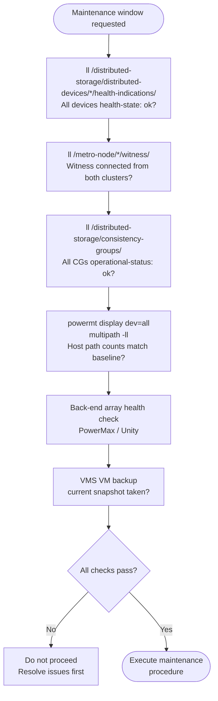
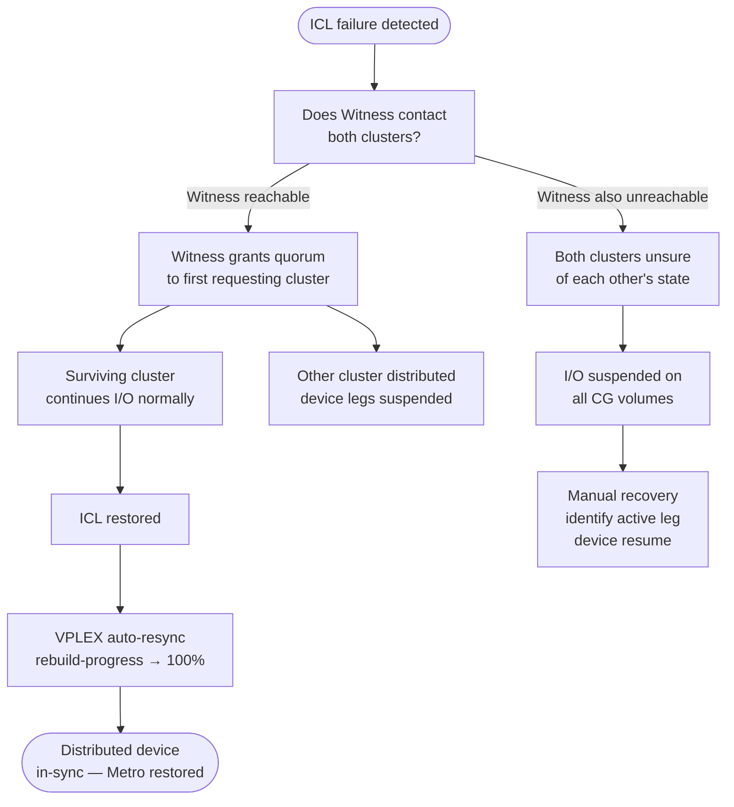

# Dell VPLEX — Procedures


<div class="kb-summary">
Procedures reference covering Change Readiness, Maintenance Window, Post-Change Validation, Consistency Groups, Metro Operations.
</div>
```
┌───────────────────────────────── Dell VPLEX — Operational Procedures ─────────────────────────────────┐
│                                                                                                       │
│   ┌───────────────────────────────────────────────────────────────────────────────────────────────┐   │
│   │             VPLEX operational procedures: standard tasks for day-2 administration             │   │
│   │           Covers: provisioning, expansion, maintenance, DR testing, and decommission          │   │
│   │           Pre/post checks required for all maintenance activities affecting storage           │   │
│   │            All procedures require approved change management tickets in production            │   │
│   └───────────────────────────────────────────────────────────────────────────────────────────────┘   │
│                                                                                                       │
│    Open change → pre-check → execute → verify → post-check → close                                    │
│                                                                                                       │
│                  ▼                                ▼                                ▼                  │
│                                                                                                       │
│   ┌─────────────────────────────┐  ┌─────────────────────────────┐  ┌─────────────────────────────┐   │
│   │            Layer            │  │          Component          │  │            Notes            │   │
│   │        Virtualisation       │  │         Backend LUNs        │  │      Abstracted to VVs      │   │
│   │            Metro            │  │         Sync stretch        │  │        <5ms RTT sites       │   │
│   │             Geo             │  │      Async replication      │  │         Any distance        │   │
│   │          Clustering         │  │        Active-active        │  │       Shared namespace      │   │
│   │            Quorum           │  │          Witness VM         │  │      Split-brain guard      │   │
│   └─────────────────────────────┘  └─────────────────────────────┘  └─────────────────────────────┘   │
│                                                                                                       │
│                          ▼                                                 ▼                          │
│                                                                                                       │
│   ┌───────────────────────────────────────────────────────────────────────────────────────────────┐   │
│   │    Procedure     │    Pre-check     │       Steps       │      Verify      │    Post-check    │   │
│   │    Provision     │  Capacity free?  │   Create volume   │   Host access    │   Monitor I/O    │   │
│   │      Expand      │   Pool space?    │    Grow volume    │    FS resize     │   Verify size    │   │
│   │     Snapshot     │   Policy set?    │   Take snapshot   │   Snap listed    │   Consistency    │   │
│   │     Failover     │  Repl. in sync?  │    Break repl.    │    App online    │    Verify RTO    │   │
│   └───────────────────────────────────────────────────────────────────────────────────────────────┘   │
│                                                                                                       │
│    Physical: VPLEX VS2/VS6 appliance · FC fabric · backend arrays · WAN link (Metro/Geo)              │
│                                                                                                       │
│    Key terms:                                                                                         │
│                                                                                                       │
│    VPLEX              = Dell storage federation; aggregates arrays into virtual volumes across vendors│
│    Virtual volume     = VPLEX-abstracted LUN presented to hosts; backend is array LUNs                │
│    VPLEX Metro        = synchronous active-active stretch cluster; same VV served from two sites      │
│    VPLEX Geo          = asynchronous active-active replication; higher RPO, no distance constraint    │
│    Distributed VV     = virtual volume spanning two sites for Metro active-active host access         │
│    Witness            = third-site quorum arbiter for Metro; prevents split-brain island scenarios    │
│    WAN-COM            = WAN communication module in VPLEX Geo; manages inter-site replication traffic │
│    Management Server  = embedded Linux VM in VPLEX engine; serves web UI and vplex CLI                │
│    Consistency group  = set of virtual volumes that failover together maintaining write order         │
│    Backend volume     = LUN from underlying array presented to VPLEX engine for virtualisation        │
│    Local device       = RAID device or extent of backend volumes on a single VPLEX cluster            │
│    Cluster            = single VPLEX installation; Metro topology requires exactly two clusters       │
│                                                                                                       │
└───────────────────────────────────────────────────────────────────────────────────────────────────────┘
```


## Change Readiness

Verify these items before performing any VPLEX change — GeoSynchrony upgrades, director replacements, back-end storage changes, or storage view modifications.



- [ ] `ll /distributed-storage/distributed-devices/*/health-indications/` — all distributed devices show `health-state: ok`; do not start a change with any device out-of-sync
- [ ] Witness is reachable from both Metro clusters: `ll /metro-node/*/witness/` — loss of Witness during a change that takes a cluster offline will suspend I/O on consistency group volumes
- [ ] All consistency groups show `operational-status: ok`: `ll /distributed-storage/consistency-groups/`
- [ ] Host I/O validated: confirm path counts and multipath state on all hosts using VPLEX storage views (`powermt display dev=all` or `multipath -ll` on connected hosts)
- [ ] Back-end array health confirmed — run health checks on the back-end PowerMax, Unity, or other array before any VPLEX change that touches back-end storage volumes
- [ ] For GeoSynchrony upgrades: confirm target version compatibility with back-end array firmware, hypervisor versions, and host OS multipath drivers from the Dell VPLEX compatibility matrix
- [ ] Confirm VMS (VPLEX Management Server) VM is running and backed up — losing VMS during a change does not impact I/O but makes configuration recovery impossible without a backup
- [ ] Notify application and host owners of the maintenance window; confirm consistency groups can be suspended briefly if needed for the specific change type

| Item | Status | Notes |
|---|---|---|
| All distributed devices health-state: ok | | |
| Witness connected and reachable | | |
| All consistency groups ok | | |
| Host path counts match baseline | | |
| Back-end array health confirmed | | |
| VMS VM backed up | | |

## Maintenance Window

Steps for planned VPLEX maintenance — director replacement, GeoSynchrony NDU, or site-level switch for Metro workloads.

1. Notify host and application owners of the maintenance window; confirm consistency group volumes can tolerate temporary director redundancy reduction during director-level NDU
2. Confirm `ll /distributed-storage/distributed-devices/*/health-indications/` shows all devices `health-state: ok` before starting; do not start a director upgrade with any device out-of-sync
3. Confirm Witness is reachable from both clusters: `ll /metro-node/*/witness/`; for planned site switch tests, confirm the Witness is in the third failure domain
4. For GeoSynchrony NDU: upgrade one director at a time per engine; after each director upgrade, wait for `ll /engines/*/directors/*/hardware/` to confirm the director returned to healthy state before proceeding to the next
5. After all directors on an engine are upgraded, confirm distributed device health with `ll /distributed-storage/distributed-devices/*/health-indications/` before moving to the next engine
6. For a planned Metro site switch: suspend consistency group I/O cleanly, perform the site switch, verify host I/O resumes on the surviving cluster, then restore Witness and ICL before resuming the original cluster
7. Upgrade the VMS after all directors are at the new GeoSynchrony code level
8. Run `health-check --full` and confirm all clusters, directors, distributed devices, and consistency groups are healthy before closing the maintenance window

## Post-Change Validation

Run these checks after any VPLEX change to confirm the system is healthy and hosts have full path redundancy restored.

- [ ] `ll /clusters/*/health-indications/` — all clusters show `health-state: ok`
- [ ] `ll /distributed-storage/distributed-devices/*/health-indications/` — all distributed devices show `health-state: ok`; no devices in out-of-sync or rebuilding state
- [ ] `ll /engines/*/directors/*/hardware/` — all directors are healthy; no components in a faulted state post-change
- [ ] `ll /metro-node/*/witness/` — Witness is `connected: true` and `reachable: true` from both clusters
- [ ] `ll /distributed-storage/consistency-groups/` — all consistency groups show `operational-status: ok`
- [ ] Host path validation: `powermt display dev=all` or `multipath -ll` on representative hosts shows all paths alive and path count matches the pre-change baseline
- [ ] `health-check --full` returns no warnings or errors
- [ ] Application owners confirm I/O has resumed normally and no elevated latency is observed post-change

## Consistency Groups

Consistency groups (CGs) in VPLEX ensure that a set of virtual volumes is treated as a crash-consistent unit during failover and recovery operations.

### List Consistency Groups

```bash
VPlexcli:/> ll /clusters/cluster-1/consistency-groups/
VPlexcli:/> ll /clusters/cluster-2/consistency-groups/
```

### View CG Details

```bash
VPlexcli:/> ll /clusters/cluster-1/consistency-groups/<cg_name>/
```

Key attributes:
- `operational-status` — should be `ok`
- `type` — `local` or `distributed`
- `virtual-volumes` — list of member volumes

### Create a Consistency Group

```bash
VPlexcli:/> consistency-group create --name <cg_name> --cluster-name cluster-1
```

### Add Volumes to a CG

```bash
VPlexcli:/> consistency-group add-virtual-volume \
    --consistency-group /clusters/cluster-1/consistency-groups/<cg_name> \
    --virtual-volume /clusters/cluster-1/virtual-volumes/<vol_name>
```

### Remove a Volume from a CG

```bash
VPlexcli:/> consistency-group remove-virtual-volume \
    --consistency-group /clusters/cluster-1/consistency-groups/<cg_name> \
    --virtual-volume /clusters/cluster-1/virtual-volumes/<vol_name>
```

### Distributed Consistency Groups

For Metro configurations, CGs span both clusters:

```bash
VPlexcli:/> ll /clusters/cluster-1/consistency-groups/<cg_name>/
# Check: type = distributed
# Check: operational-status = ok on both clusters
```

### Detach / Re-attach CG (Metro Failover)

```bash
# Detach from cluster-2 (planned maintenance or failover)
VPlexcli:/> consistency-group detach \
    --consistency-group /clusters/cluster-1/consistency-groups/<cg_name>

# Re-attach after recovery
VPlexcli:/> consistency-group attach \
    --consistency-group /clusters/cluster-1/consistency-groups/<cg_name>
```

## Metro Operations

VPLEX Metro stretches virtual volumes across two sites with synchronous mirroring, enabling transparent failover.

### Metro Architecture Overview

- **Cluster-1** — Site A (local cluster)
- **Cluster-2** — Site B (remote cluster)
- **WAN COM** — inter-cluster communication link (Fibre Channel or Ethernet)
- **Distributed Devices** — virtual volumes that span both clusters
- **Witness** — third-party tiebreaker for split-brain scenarios



### Check Distributed Device Status

```bash
VPlexcli:/> ll /distributed-storage/distributed-devices/
VPlexcli:/> ll /distributed-storage/distributed-devices/<device_name>/
```

Key attributes:
- `service-status: running` — both legs active
- `operational-status: ok`
- `active-leg` — which cluster is currently active

### Planned Failover (Migrate Active Leg)

```bash
# Move active leg to cluster-2
VPlexcli:/> device migrate \
    --device /distributed-storage/distributed-devices/<device_name> \
    --target-cluster cluster-2
```

### Witness Configuration

```bash
VPlexcli:/> ll /distributed-storage/witness/
# Check: witness-connectivity = connected
```

### Split-Brain Recovery

If WAN COM link fails and both clusters believe they are active:

1. Witness should automatically resolve by suspending one cluster
2. If witness is unavailable, manual intervention required
3. Identify which cluster has the most recent I/O
4. Suspend the stale cluster leg:

```bash
VPlexcli:/> device suspend \
    --device /distributed-storage/distributed-devices/<device_name> \
    --clusters cluster-2
```

5. After link recovery, resync:

```bash
VPlexcli:/> device rebuild \
    --device /distributed-storage/distributed-devices/<device_name>
```

### WAN COM Health

```bash
VPlexcli:/> ll /clusters/cluster-1/connectivity/
```

Monitor inter-cluster latency — VPLEX Metro requires < 5ms RTT between sites.

### Common Metro Issues

| Issue | Check | Action |
|---|---|---|
| Device degraded | Check WAN COM link | Investigate network |
| Split-brain | Witness connectivity | Manual suspension of stale leg |
| High replication lag | WAN latency | Check inter-cluster network |
| Device suspended | Prior split-brain event | Resync after link recovery |
